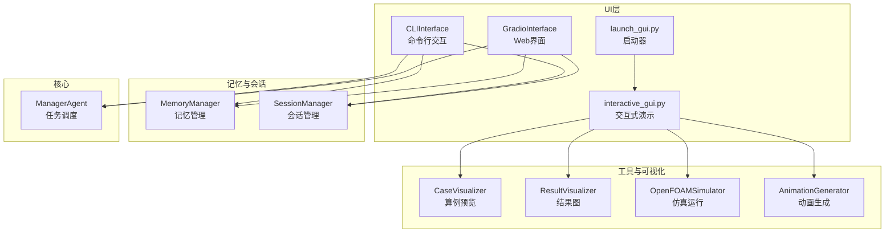
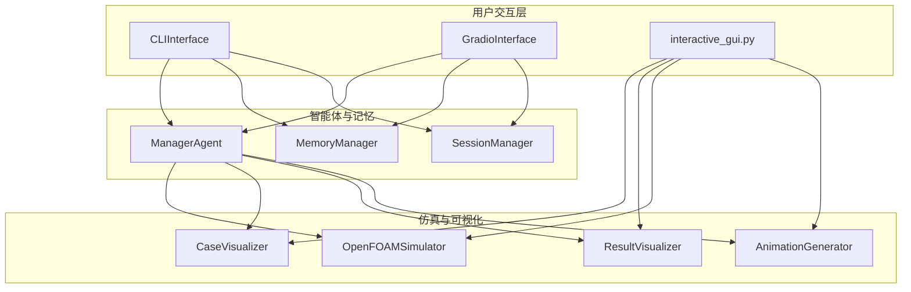
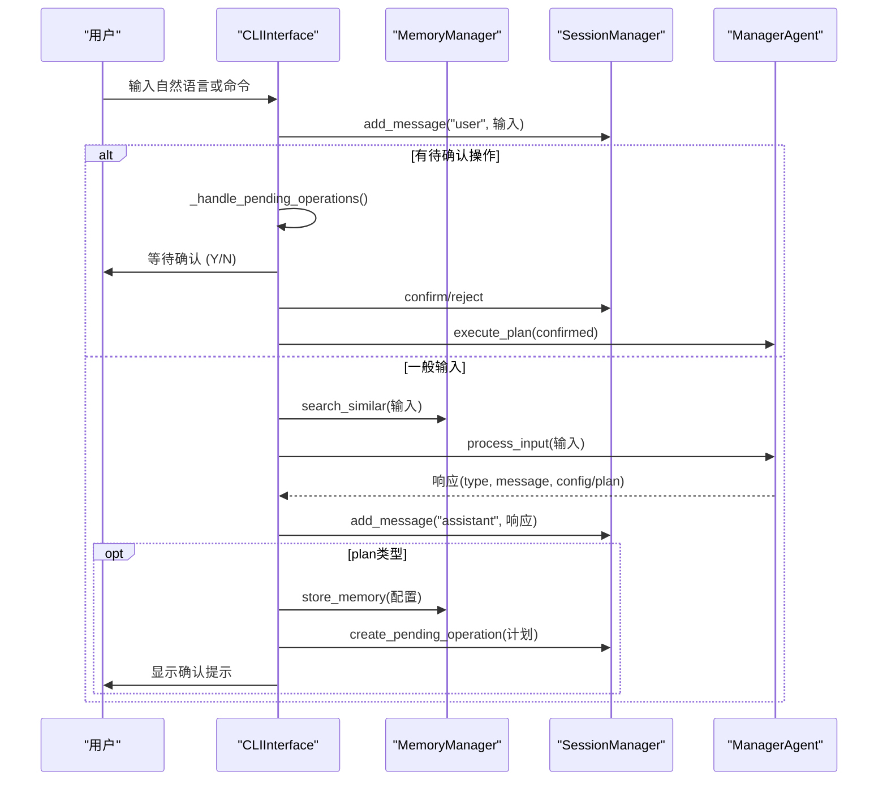
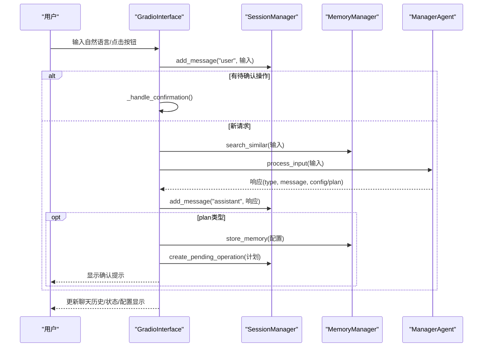
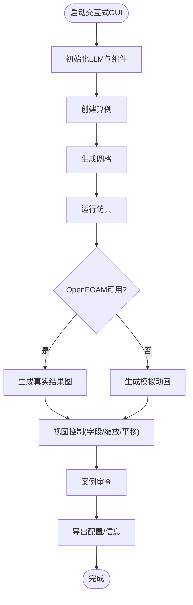
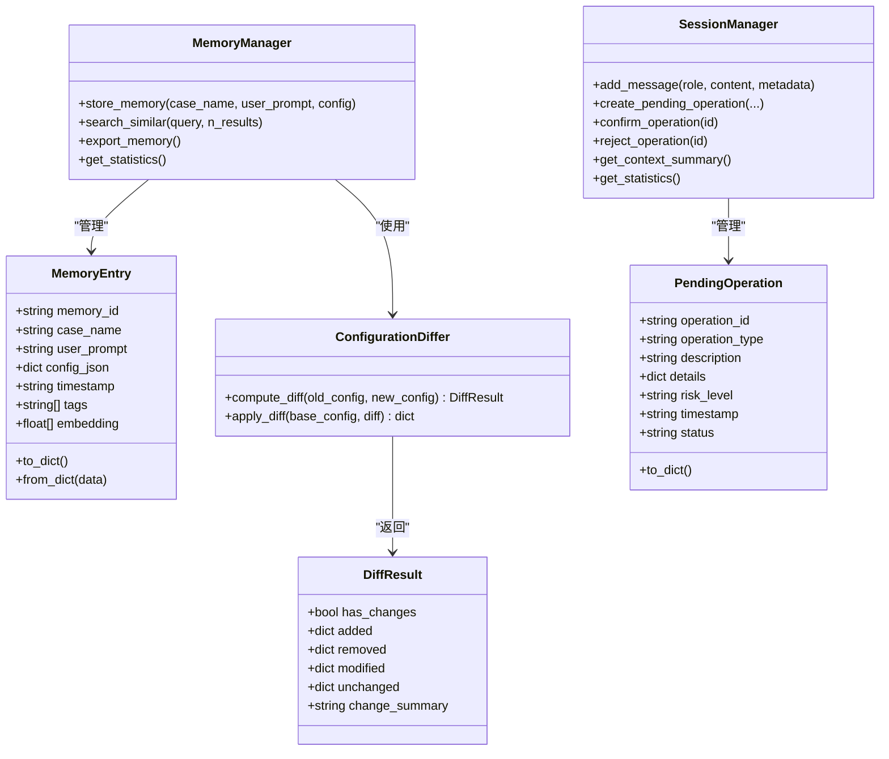
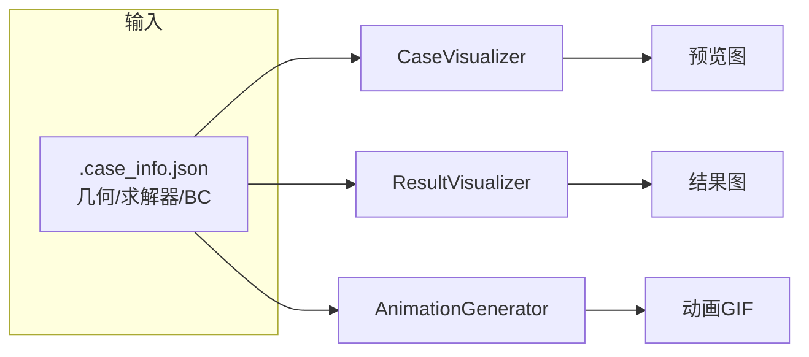
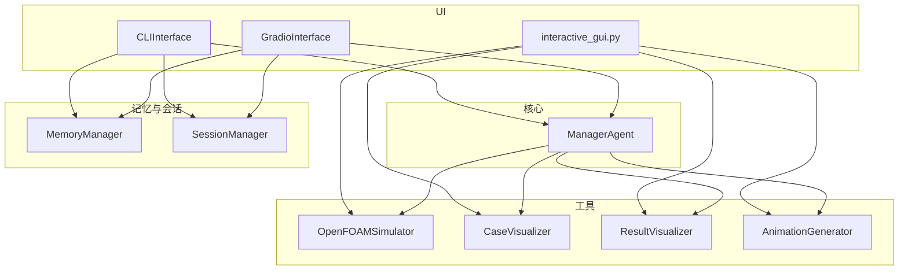

# 用户界面系统

<cite>
**本文档引用的文件**
- [openfoam_ai/ui/cli_interface.py](file://openfoam_ai/ui/cli_interface.py)
- [openfoam_ai/ui/gradio_interface.py](file://openfoam_ai/ui/gradio_interface.py)
- [openfoam_ai/ui/__init__.py](file://openfoam_ai/ui/__init__.py)
- [openfoam_ai/main.py](file://openfoam_ai/main.py)
- [openfoam_ai/memory/memory_manager.py](file://openfoam_ai/memory/memory_manager.py)
- [openfoam_ai/memory/session_manager.py](file://openfoam_ai/memory/session_manager.py)
- [openfoam_ai/utils/case_visualizer.py](file://openfoam_ai/utils/case_visualizer.py)
- [openfoam_ai/utils/result_visualizer.py](file://openfoam_ai/utils/result_visualizer.py)
- [openfoam_ai/utils/of_simulator.py](file://openfoam_ai/utils/of_simulator.py)
- [openfoam_ai/utils/animation_generator.py](file://openfoam_ai/utils/animation_generator.py)
- [openfoam_ai/interactive_gui.py](file://openfoam_ai/interactive_gui.py)
- [openfoam_ai/launch_gui.py](file://openfoam_ai/launch_gui.py)
- [openfoam_ai/requirements.txt](file://openfoam_ai/requirements.txt)
- [openfoam_ai/GUI使用指南.md](file://openfoam_ai/GUI使用指南.md)
- [openfoam_ai/README.md](file://openfoam_ai/README.md)
</cite>

## 目录
1. [简介](#简介)
2. [项目结构](#项目结构)
3. [核心组件](#核心组件)
4. [架构总览](#架构总览)
5. [详细组件分析](#详细组件分析)
6. [依赖关系分析](#依赖关系分析)
7. [性能考虑](#性能考虑)
8. [故障排除指南](#故障排除指南)
9. [结论](#结论)
10. [附录](#附录)

## 简介
本文件面向OpenFOAM AI的用户界面系统，涵盖命令行界面（CLI）与Web界面（Gradio）两大交互形态。CLI强调多轮对话、记忆检索与操作确认；Web界面提供实时仿真监控、结果可视化与用户体验优化。文档同时记录界面组件的视觉外观、行为模式、用户交互流程、属性/事件/插槽与自定义选项，并给出使用示例、实时演示与跨平台兼容性建议。

## 项目结构
UI相关模块位于openfoam_ai/ui目录，包含CLI与Gradio两种界面实现，以及与之配套的记忆与会话管理模块。此外，还包含交互式GUI演示脚本与启动器，以及结果可视化、仿真运行与动画生成等工具模块。

**图表来源**
- [openfoam_ai/ui/cli_interface.py:17-401](file://openfoam_ai/ui/cli_interface.py#L17-L401)
- [openfoam_ai/ui/gradio_interface.py:31-484](file://openfoam_ai/ui/gradio_interface.py#L31-L484)
- [openfoam_ai/memory/memory_manager.py:198-804](file://openfoam_ai/memory/memory_manager.py#L198-L804)
- [openfoam_ai/memory/session_manager.py:171-565](file://openfoam_ai/memory/session_manager.py#L171-L565)
- [openfoam_ai/utils/case_visualizer.py:16-314](file://openfoam_ai/utils/case_visualizer.py#L16-L314)
- [openfoam_ai/utils/result_visualizer.py:14-353](file://openfoam_ai/utils/result_visualizer.py#L14-L353)
- [openfoam_ai/utils/of_simulator.py:13-180](file://openfoam_ai/utils/of_simulator.py#L13-L180)
- [openfoam_ai/utils/animation_generator.py:16-272](file://openfoam_ai/utils/animation_generator.py#L16-L272)
- [openfoam_ai/interactive_gui.py:34-508](file://openfoam_ai/interactive_gui.py#L34-L508)
- [openfoam_ai/launch_gui.py:56-97](file://openfoam_ai/launch_gui.py#L56-L97)

**章节来源**
- [openfoam_ai/ui/__init__.py:1-15](file://openfoam_ai/ui/__init__.py#L1-L15)
- [openfoam_ai/README.md:104-128](file://openfoam_ai/README.md#L104-L128)

## 核心组件
- CLIInterface：提供彩色终端输出、多轮对话、记忆检索、待确认操作与帮助系统。
- GradioInterface：提供聊天机器人界面、配置可视化、记忆检索、统计信息展示与操作确认。
- MemoryManager：基于ChromaDB的向量存储与相似检索，支持配置差异分析与增量更新。
- SessionManager：管理会话上下文、消息历史、待确认操作与状态持久化。
- 工具模块：CaseVisualizer、ResultVisualizer、OpenFOAMSimulator、AnimationGenerator，支撑预览、结果图、仿真运行与动画生成。

**章节来源**
- [openfoam_ai/ui/cli_interface.py:17-401](file://openfoam_ai/ui/cli_interface.py#L17-L401)
- [openfoam_ai/ui/gradio_interface.py:31-484](file://openfoam_ai/ui/gradio_interface.py#L31-L484)
- [openfoam_ai/memory/memory_manager.py:198-804](file://openfoam_ai/memory/memory_manager.py#L198-L804)
- [openfoam_ai/memory/session_manager.py:171-565](file://openfoam_ai/memory/session_manager.py#L171-L565)
- [openfoam_ai/utils/case_visualizer.py:16-314](file://openfoam_ai/utils/case_visualizer.py#L16-L314)
- [openfoam_ai/utils/result_visualizer.py:14-353](file://openfoam_ai/utils/result_visualizer.py#L14-L353)
- [openfoam_ai/utils/of_simulator.py:13-180](file://openfoam_ai/utils/of_simulator.py#L13-L180)
- [openfoam_ai/utils/animation_generator.py:16-272](file://openfoam_ai/utils/animation_generator.py#L16-L272)

## 架构总览
UI层通过ManagerAgent与核心仿真流程解耦，记忆与会话模块提供上下文与历史复用能力。Gradio界面在前端提供更丰富的可视化与交互体验，CLI界面适合批处理与自动化场景。

**图表来源**
- [openfoam_ai/ui/cli_interface.py:17-401](file://openfoam_ai/ui/cli_interface.py#L17-L401)
- [openfoam_ai/ui/gradio_interface.py:31-484](file://openfoam_ai/ui/gradio_interface.py#L31-L484)
- [openfoam_ai/interactive_gui.py:34-508](file://openfoam_ai/interactive_gui.py#L34-L508)
- [openfoam_ai/utils/of_simulator.py:13-180](file://openfoam_ai/utils/of_simulator.py#L13-L180)
- [openfoam_ai/utils/case_visualizer.py:16-314](file://openfoam_ai/utils/case_visualizer.py#L16-L314)
- [openfoam_ai/utils/result_visualizer.py:14-353](file://openfoam_ai/utils/result_visualizer.py#L14-L353)
- [openfoam_ai/utils/animation_generator.py:16-272](file://openfoam_ai/utils/animation_generator.py#L16-L272)

## 详细组件分析

### CLI界面（命令行交互）
- 交互循环：持续读取用户输入，支持help/status/history/stats/search等内置命令。
- 颜色输出：在支持的平台上对用户/助手/系统/错误/成功消息进行着色区分。
- 记忆检索：对相似历史进行关键词重叠度判断，提示用户历史配置。
- 待确认操作：针对高风险步骤（如创建算例）生成确认提示，支持Y/N确认。
- 帮助系统：提供命令列表与自然语言示例。

**图表来源**
- [openfoam_ai/ui/cli_interface.py:90-252](file://openfoam_ai/ui/cli_interface.py#L90-L252)
- [openfoam_ai/memory/memory_manager.py:198-804](file://openfoam_ai/memory/memory_manager.py#L198-L804)
- [openfoam_ai/memory/session_manager.py:171-565](file://openfoam_ai/memory/session_manager.py#L171-L565)

**章节来源**
- [openfoam_ai/ui/cli_interface.py:17-401](file://openfoam_ai/ui/cli_interface.py#L17-L401)
- [openfoam_ai/memory/session_manager.py:171-565](file://openfoam_ai/memory/session_manager.py#L171-L565)

### Gradio界面（Web交互）
- 界面布局：左侧控制区（输入、按钮、滑块）、右侧结果显示区（聊天气泡、JSON配置、统计信息）。
- 事件绑定：提交按钮与回车触发消息处理；记忆检索、统计展示、导出记忆等独立按钮。
- 配置可视化：将当前配置格式化为易读摘要，便于用户确认。
- 操作确认：对高风险计划自动弹出确认对话，支持Y/N明确回复。
- 主题与响应式：使用Soft主题，整体布局随窗口缩放适配。

**图表来源**
- [openfoam_ai/ui/gradio_interface.py:99-244](file://openfoam_ai/ui/gradio_interface.py#L99-L244)
- [openfoam_ai/memory/session_manager.py:171-565](file://openfoam_ai/memory/session_manager.py#L171-L565)
- [openfoam_ai/memory/memory_manager.py:198-804](file://openfoam_ai/memory/memory_manager.py#L198-L804)

**章节来源**
- [openfoam_ai/ui/gradio_interface.py:299-484](file://openfoam_ai/ui/gradio_interface.py#L299-L484)

### 交互式GUI演示（实时仿真监控与可视化）
- 功能矩阵：创建/修改算例、生成网格、运行仿真、结果视图控制（字段、缩放、平移）、动画生成、案例审查与信息刷新。
- 实时监控：当OpenFOAM可用时，调用OpenFOAMSimulator运行求解器并生成结果图；否则生成模拟动画作为演示。
- 结果可视化：ResultVisualizer生成速度场/压力场云图、流线图、涡量图与收敛监控图。
- 动画生成：AnimationGenerator基于理论模型生成卡门涡街演化动画。

**图表来源**
- [openfoam_ai/interactive_gui.py:34-508](file://openfoam_ai/interactive_gui.py#L34-L508)
- [openfoam_ai/utils/of_simulator.py:13-180](file://openfoam_ai/utils/of_simulator.py#L13-L180)
- [openfoam_ai/utils/result_visualizer.py:14-353](file://openfoam_ai/utils/result_visualizer.py#L14-L353)
- [openfoam_ai/utils/animation_generator.py:16-272](file://openfoam_ai/utils/animation_generator.py#L16-L272)

**章节来源**
- [openfoam_ai/interactive_gui.py:34-508](file://openfoam_ai/interactive_gui.py#L34-L508)
- [openfoam_ai/launch_gui.py:56-97](file://openfoam_ai/launch_gui.py#L56-L97)

### 记忆与会话管理
- MemoryManager：提供MemoryEntry数据结构、相似检索、配置差异分析（DiffResult）与增量更新能力。
- SessionManager：维护ConversationContext、PendingOperation与消息历史，支持高风险操作确认与状态持久化。

**图表来源**
- [openfoam_ai/memory/memory_manager.py:32-197](file://openfoam_ai/memory/memory_manager.py#L32-L197)
- [openfoam_ai/memory/session_manager.py:54-105](file://openfoam_ai/memory/session_manager.py#L54-L105)

**章节来源**
- [openfoam_ai/memory/memory_manager.py:198-804](file://openfoam_ai/memory/memory_manager.py#L198-L804)
- [openfoam_ai/memory/session_manager.py:171-565](file://openfoam_ai/memory/session_manager.py#L171-L565)

### 可视化与结果展示
- CaseVisualizer：在无OpenFOAM情况下生成几何/网格/边界条件/初始流场/参数摘要/预期结果的综合预览图。
- ResultVisualizer：生成速度/压力云图、流线图、涡量图与收敛监控图，支持局部放大区域裁剪。
- AnimationGenerator：基于理论模型生成卡门涡街演化动画，支持速度场与涡量场对比。

**图表来源**
- [openfoam_ai/utils/case_visualizer.py:16-314](file://openfoam_ai/utils/case_visualizer.py#L16-L314)
- [openfoam_ai/utils/result_visualizer.py:14-353](file://openfoam_ai/utils/result_visualizer.py#L14-L353)
- [openfoam_ai/utils/animation_generator.py:16-272](file://openfoam_ai/utils/animation_generator.py#L16-L272)

**章节来源**
- [openfoam_ai/utils/case_visualizer.py:16-314](file://openfoam_ai/utils/case_visualizer.py#L16-L314)
- [openfoam_ai/utils/result_visualizer.py:14-353](file://openfoam_ai/utils/result_visualizer.py#L14-L353)
- [openfoam_ai/utils/animation_generator.py:16-272](file://openfoam_ai/utils/animation_generator.py#L16-L272)

## 依赖关系分析
- UI层依赖ManagerAgent进行意图识别与计划生成，依赖MemoryManager与SessionManager提供记忆与上下文。
- 工具层依赖Matplotlib、NumPy等科学计算库，部分功能依赖OpenFOAM命令可用性。
- 交互式GUI演示整合了LLM、仿真运行器与可视化模块，形成端到端的演示闭环。

**图表来源**
- [openfoam_ai/ui/cli_interface.py:12-50](file://openfoam_ai/ui/cli_interface.py#L12-L50)
- [openfoam_ai/ui/gradio_interface.py:26-55](file://openfoam_ai/ui/gradio_interface.py#L26-L55)
- [openfoam_ai/interactive_gui.py:21-29](file://openfoam_ai/interactive_gui.py#L21-L29)

**章节来源**
- [openfoam_ai/requirements.txt:1-40](file://openfoam_ai/requirements.txt#L1-L40)
- [openfoam_ai/README.md:104-128](file://openfoam_ai/README.md#L104-L128)

## 性能考虑
- Gradio界面：合理设置组件数量与刷新频率，避免频繁大对象传输；对JSON配置显示采用分页或折叠展示。
- 仿真运行：在交互式GUI中，优先使用模拟动画演示以降低等待时间；真实仿真建议限制最大运行时间并提供进度反馈。
- 可视化渲染：使用Agg后端避免GUI阻塞；对大网格数据采用降采样或分块渲染策略。
- 记忆检索：相似度阈值与返回条数需平衡准确性与性能；向量检索可在可用时启用ChromaDB，否则使用内存级相似度计算。

[本节为通用指导，无需特定文件引用]

## 故障排除指南
- Gradio未安装：根据提示安装gradio>=4.0.0；启动器会自动检测并安装。
- OpenFOAM未安装：GUI将以模拟模式运行，生成动画演示；安装OpenFOAM后重启即可切换真实仿真。
- 端口占用：启动器会随机寻找可用端口；若冲突可手动指定server_port。
- 依赖缺失：确保matplotlib、numpy等依赖已安装；启动器会检测并提示安装。

**章节来源**
- [openfoam_ai/launch_gui.py:17-97](file://openfoam_ai/launch_gui.py#L17-L97)
- [openfoam_ai/GUI使用指南.md:147-176](file://openfoam_ai/GUI使用指南.md#L147-L176)

## 结论
OpenFOAM AI的用户界面系统通过CLI与Gradio实现了从命令行到Web的全栈交互体验，结合记忆与会话管理，提供了自然语言到仿真配置的无缝转化。工具链完备，支持预览、结果可视化与动画演示，满足教学、研究与工程辅助场景的需求。后续可在主题定制、无障碍访问与跨浏览器兼容性方面进一步优化。

[本节为总结性内容，无需特定文件引用]

## 附录

### 使用示例与实时演示
- CLI示例：输入自然语言描述创建算例，系统生成执行计划并提示确认；支持history/stats/search等管理命令。
- Gradio示例：在聊天区输入需求，界面自动格式化配置摘要并提示确认；支持记忆检索与统计展示。
- 交互式GUI示例：从自然语言描述到网格生成、仿真运行、结果查看与动画生成的完整流程。

**章节来源**
- [openfoam_ai/ui/cli_interface.py:253-362](file://openfoam_ai/ui/cli_interface.py#L253-L362)
- [openfoam_ai/ui/gradio_interface.py:299-484](file://openfoam_ai/ui/gradio_interface.py#L299-L484)
- [openfoam_ai/GUI使用指南.md:98-128](file://openfoam_ai/GUI使用指南.md#L98-L128)

### 响应式设计与无障碍访问建议
- 响应式：使用Gradio的Blocks布局与列比例（scale）实现自适应；在移动端保持关键控件可见与可点触。
- 无障碍：为按钮与下拉菜单提供清晰的标签与提示；确保键盘导航可达；为图像结果提供替代文本或描述。

[本节为通用指导，无需特定文件引用]

### 样式自定义与主题支持
- Gradio主题：使用gr.themes.Soft作为基础主题；可通过自定义CSS或主题参数微调配色与字体。
- 组件样式：聊天气泡、按钮、JSON显示等均可通过Gradio组件参数进行样式控制。

**章节来源**
- [openfoam_ai/ui/gradio_interface.py:299-398](file://openfoam_ai/ui/gradio_interface.py#L299-L398)

### 跨浏览器兼容性与性能优化
- 浏览器：推荐Chrome/Edge；确保允许弹窗以便自动打开界面。
- 性能：减少不必要的组件重渲染；对大图与动画采用懒加载；在Windows环境下注意控制台编码问题。

**章节来源**
- [openfoam_ai/GUI使用指南.md:141-144](file://openfoam_ai/GUI使用指南.md#L141-L144)