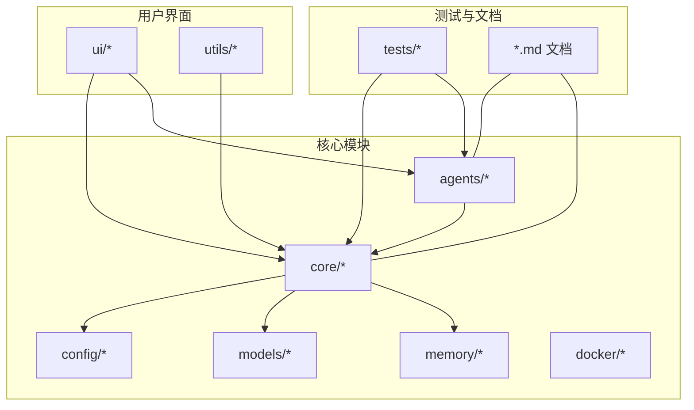
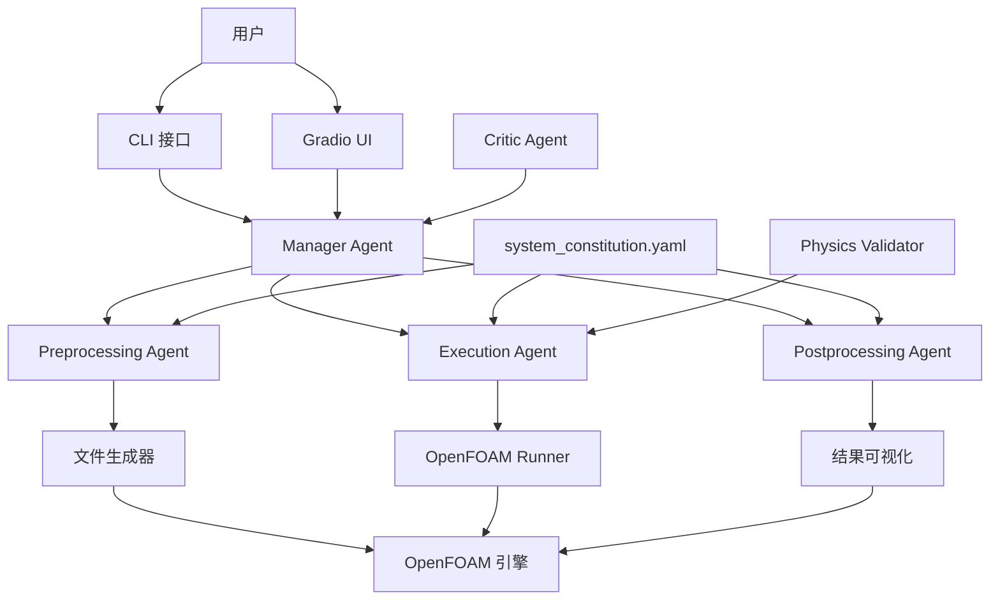
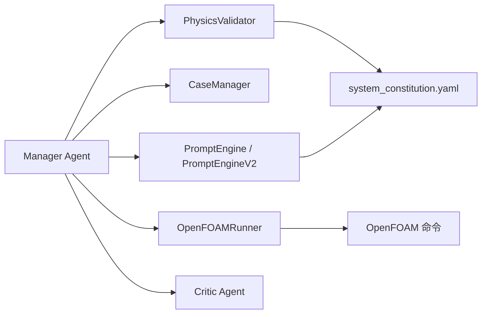

# 社区与贡献

<cite>
**本文引用的文件**
- [openfoam_ai/README.md](file://openfoam_ai/README.md)
- [README_LLM配置.md](file://README_LLM配置.md)
- [GUI使用指南.md](file://GUI使用指南.md)
- [AI约束宪法.litcoffee](file://AI约束宪法.litcoffee)
- [plans/architecture_review.md](file://plans/architecture_review.md)
- [openfoam_ai/config/system_constitution.yaml](file://openfoam_ai/config/system_constitution.yaml)
- [openfoam_ai/agents/critic_agent.py](file://openfoam_ai/agents/critic_agent.py)
- [openfoam_ai/__init__.py](file://openfoam_ai/__init__.py)
- [openfoam_ai/core/__init__.py](file://openfoam_ai/core/__init__.py)
- [openfoam_ai/tests/test_case_manager.py](file://openfoam_ai/tests/test_case_manager.py)
</cite>

## 目录
1. [引言](#引言)
2. [项目结构](#项目结构)
3. [核心组件](#核心组件)
4. [架构总览](#架构总览)
5. [详细组件分析](#详细组件分析)
6. [依赖关系分析](#依赖关系分析)
7. [性能考虑](#性能考虑)
8. [故障排查指南](#故障排查指南)
9. [结论](#结论)
10. [附录](#附录)

## 引言
本指南面向希望参与 OpenFOAM AI 项目的社区成员，提供从贡献流程、问题报告与功能请求提交，到版本发布、治理与协作机制的完整说明。项目采用“宪法驱动 + 多智能体对抗”的设计，强调物理与数值约束、可复现性与可审计性，确保 AI 生成的 CFD 方案具备工程可用性与科研严谨性。

## 项目结构
项目采用按功能域划分的模块化组织方式，核心模块围绕“智能体（Agents）—核心（Core）—配置（Config）—UI（UI）—工具（Utils）—测试（Tests）”展开，便于贡献者快速定位职责边界与协作点。

图表来源
- [openfoam_ai/README.md:130-150](file://openfoam_ai/README.md#L130-L150)
- [plans/architecture_review.md:25-48](file://plans/architecture_review.md#L25-L48)

章节来源
- [openfoam_ai/README.md:130-150](file://openfoam_ai/README.md#L130-L150)
- [plans/architecture_review.md:25-48](file://plans/architecture_review.md#L25-L48)

## 核心组件
- 智能体体系：负责意图识别、方案生成、质量审查、网格与物理验证、后处理与可视化等。
- 核心引擎：封装 OpenFOAM 命令执行、字典生成、算例生命周期管理与验证器。
- 宪法与约束：通过 YAML 宪法与 Pydantic 验证器，确保生成方案满足物理与数值底线。
- UI 层：CLI 与 Gradio 可视化界面，支持交互式建模、运行与结果查看。
- 测试与文档：覆盖核心模块的单元测试与使用文档，保障质量与可复用性。

章节来源
- [openfoam_ai/README.md:161-207](file://openfoam_ai/README.md#L161-L207)
- [openfoam_ai/README.md:104-128](file://openfoam_ai/README.md#L104-L128)
- [AI约束宪法.litcoffee:1-61](file://AI约束宪法.litcoffee#L1-L61)
- [openfoam_ai/config/system_constitution.yaml:1-103](file://openfoam_ai/config/system_constitution.yaml#L1-L103)

## 架构总览
系统采用“多智能体 + 宪法约束 + 防御式验证”的架构，确保从自然语言到仿真结果的每一步都受控、可审计、可复现。

图表来源
- [openfoam_ai/README.md:104-128](file://openfoam_ai/README.md#L104-L128)
- [openfoam_ai/config/system_constitution.yaml:1-103](file://openfoam_ai/config/system_constitution.yaml#L1-L103)
- [openfoam_ai/agents/critic_agent.py:449-587](file://openfoam_ai/agents/critic_agent.py#L449-L587)

## 详细组件分析

### 贡献流程与协作机制
- 分支与合并
  - 建议采用功能分支策略，完成 PR 后由维护者合并。
  - 提交信息应清晰描述改动目的与影响范围。
- 代码风格与审查
  - 遵循现有模块化与职责分离原则，避免模块间紧耦合。
  - 新增功能需配套单元测试与使用示例。
- 讨论与反馈
  - 重大变更建议先开议题讨论，收集反馈后再实施。
  - 使用 GitHub Issues 追踪问题与进度。

章节来源
- [openfoam_ai/README.md:262-271](file://openfoam_ai/README.md#L262-L271)

### 问题报告与功能请求
- 问题报告模板建议包含：
  - 环境信息（操作系统、Python/OpenFOAM 版本、依赖版本）
  - 复现步骤（最小可复现示例）
  - 期望结果与实际结果
  - 日志与截图（必要时）
- 功能请求建议包含：
  - 使用场景与目标
  - 可选的实现思路
  - 与现有模块的集成点

章节来源
- [openfoam_ai/README.md:282-287](file://openfoam_ai/README.md#L282-L287)

### 版本发布与更新日志
- 版本号
  - 包版本：见 [openfoam_ai/__init__.py](file://openfoam_ai/__init__.py#L5)
  - 核心模块版本：见 [openfoam_ai/core/__init__.py](file://openfoam_ai/core/__init__.py#L6)
- 发布流程建议
  - 在 release 分支进行最终校验与文档更新
  - 更新版本号与变更日志，打标签并发布
- 更新日志维护
  - 记录新增功能、修复缺陷、破坏性变更与迁移指引
  - 与里程碑与阶段报告保持一致

章节来源
- [openfoam_ai/__init__.py:5](file://openfoam_ai/__init__.py#L5)
- [openfoam_ai/core/__init__.py:6](file://openfoam_ai/core/__init__.py#L6)

### 行为准则与沟通礼仪
- 尊重与包容：鼓励不同背景的贡献者参与，营造开放友好的氛围。
- 基于事实：反馈与讨论应聚焦问题本身，提供可验证的事实与证据。
- 进步导向：建设性批评与积极建议并重，共同提升项目质量。
- 透明与可追溯：所有重要决策与变更应在公开渠道记录与讨论。

（本节为通用规范说明，不直接分析具体文件）

### 治理结构与决策流程
- 决策主体
  - 核心维护者负责技术方向与代码质量把控。
  - 社区通过议题与 PR 参与讨论与贡献。
- 决策流程
  - 重大变更先在议题中征集意见，再在 PR 中进行代码审查。
  - 通过共识与必要的多数同意推进。

（本节为概念性说明，不直接分析具体文件）

### 社区参与路径与价值创造
- 新手友好
  - 从 Demo 与 GUI 使用入手，逐步熟悉工作流。
  - 参考使用指南与 LLM 配置文档，快速上手。
- 能力提升
  - 从修复小问题、完善测试与文档开始，逐步承担核心模块改进。
  - 参与架构评审与路线图讨论，贡献长期规划。
- 价值创造
  - 通过质量约束与多智能体审查，提升仿真方案的工程可用性。
  - 通过标准化验证与基准案例，推动可复现研究与知识沉淀。

章节来源
- [GUI使用指南.md:1-176](file://GUI使用指南.md#L1-L176)
- [README_LLM配置.md:1-186](file://README_LLM配置.md#L1-L186)

## 依赖关系分析

图表来源
- [openfoam_ai/README.md:104-128](file://openfoam_ai/README.md#L104-L128)
- [openfoam_ai/config/system_constitution.yaml:1-103](file://openfoam_ai/config/system_constitution.yaml#L1-L103)
- [openfoam_ai/agents/critic_agent.py:449-587](file://openfoam_ai/agents/critic_agent.py#L449-L587)

章节来源
- [openfoam_ai/README.md:104-128](file://openfoam_ai/README.md#L104-L128)
- [openfoam_ai/config/system_constitution.yaml:1-103](file://openfoam_ai/config/system_constitution.yaml#L1-L103)
- [openfoam_ai/agents/critic_agent.py:449-587](file://openfoam_ai/agents/critic_agent.py#L449-L587)

## 性能考虑
- 并发与阻塞
  - 求解器执行可能阻塞 UI 线程，建议在后续版本引入异步执行以提升响应性。
- 配置与验证
  - 将魔法数字与默认值集中到宪法配置，减少硬编码带来的维护成本与风险。
- 测试与覆盖率
  - 增加集成测试与覆盖率工具，确保关键路径稳定与可回归。

章节来源
- [plans/architecture_review.md:76-79](file://plans/architecture_review.md#L76-L79)
- [plans/architecture_review.md:102-131](file://plans/architecture_review.md#L102-L131)
- [plans/architecture_review.md:167-172](file://plans/architecture_review.md#L167-L172)

## 故障排查指南
- 常见问题与建议
  - 编码与依赖问题：参考主文档中的故障排除章节，按提示运行清理脚本、安装缺失依赖或切换到 Docker 环境。
  - LLM 连接问题：检查 API Key、网络与代理设置，使用连接测试工具验证。
  - GUI 启动问题：确认虚拟环境、Gradio 版本与浏览器兼容性。
- 审查与验证
  - 使用宪法与验证器双重把关，确保配置满足物理与数值底线。
  - 通过 Critic Agent 生成评分与建议，必要时进行交互式审查与修改。

章节来源
- [openfoam_ai/README.md:208-238](file://openfoam_ai/README.md#L208-L238)
- [README_LLM配置.md:145-153](file://README_LLM配置.md#L145-L153)
- [GUI使用指南.md:147-168](file://GUI使用指南.md#L147-L168)
- [openfoam_ai/config/system_constitution.yaml:1-103](file://openfoam_ai/config/system_constitution.yaml#L1-L103)
- [openfoam_ai/agents/critic_agent.py:449-587](file://openfoam_ai/agents/critic_agent.py#L449-L587)

## 结论
OpenFOAM AI 以“宪法 + 多智能体对抗”为核心，构建了可约束、可审计、可复现的 CFD 自动化工作流。社区贡献应围绕模块化、可测试性与可维护性展开，配合严格的验证与文档规范，持续提升工程可用性与科研价值。通过明确的协作机制与治理流程，项目将不断演进，吸引更多贡献者共同推动 CFD 与 AI 的深度融合。

## 附录

### 贡献者行为准则（示例要点）
- 尊重与包容：欢迎不同背景的参与者。
- 基于事实：以数据与证据支撑观点。
- 建设性反馈：提出可操作的改进建议。
- 透明与可追溯：重要决策与变更公开记录。

（本节为通用规范说明，不直接分析具体文件）

### 许可证与法律声明
- 许可证类型：MIT 许可证，详见项目文档中的相关说明。
- 法律声明：项目免责声明与使用限制参见文档。

章节来源
- [openfoam_ai/README.md:272-275](file://openfoam_ai/README.md#L272-L275)
- [openfoam_ai/README.md:288-291](file://openfoam_ai/README.md#L288-L291)

### 测试与质量保障
- 单元测试：覆盖核心模块的关键功能，确保算例管理与生命周期管理的正确性。
- 测试建议：增加集成测试与覆盖率工具，完善错误路径测试。

章节来源
- [openfoam_ai/tests/test_case_manager.py:1-180](file://openfoam_ai/tests/test_case_manager.py#L1-L180)
- [plans/architecture_review.md:147-172](file://plans/architecture_review.md#L147-L172)