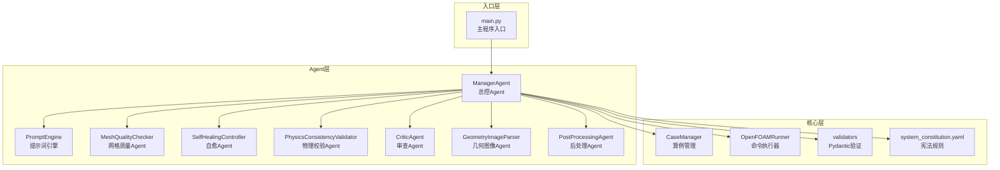
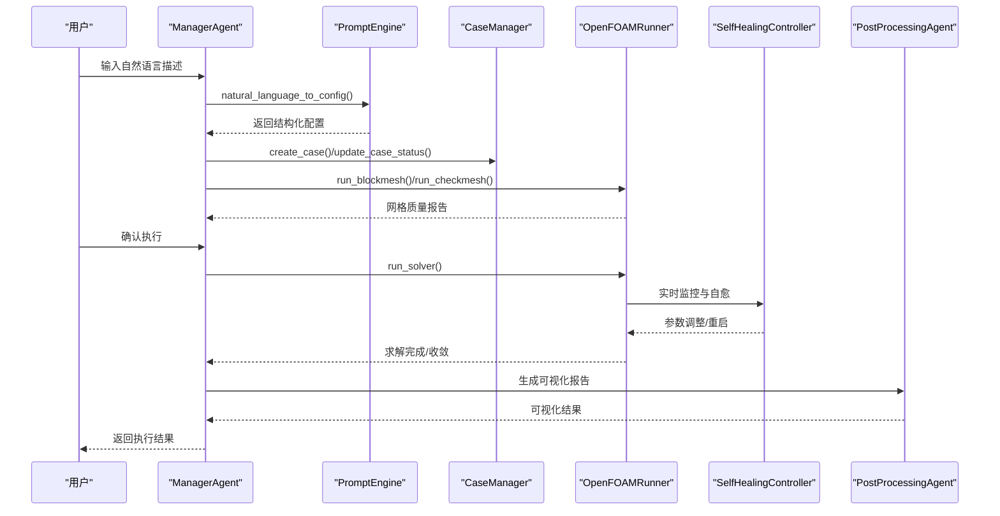
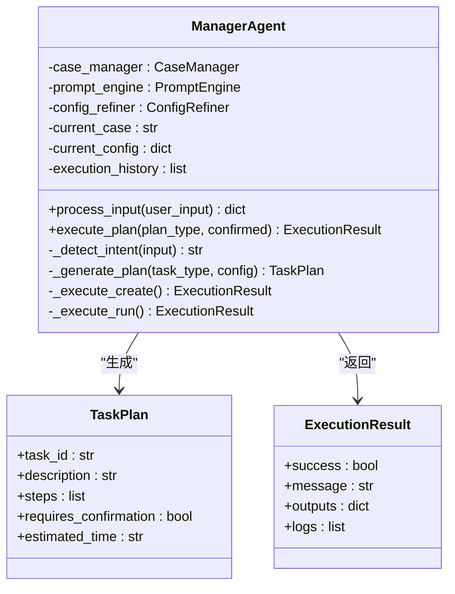
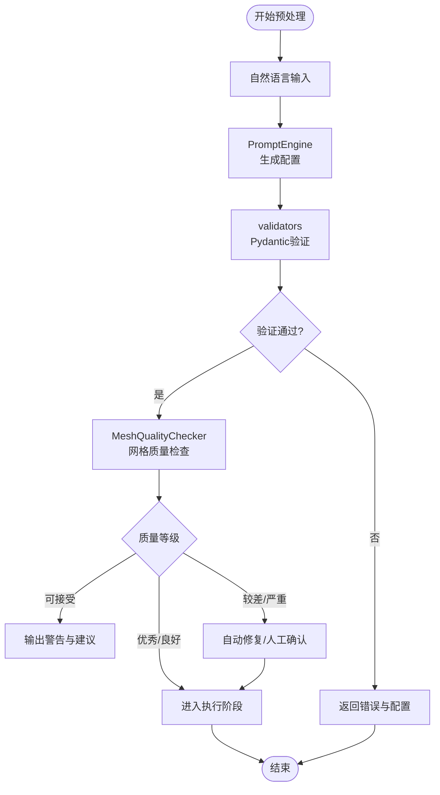
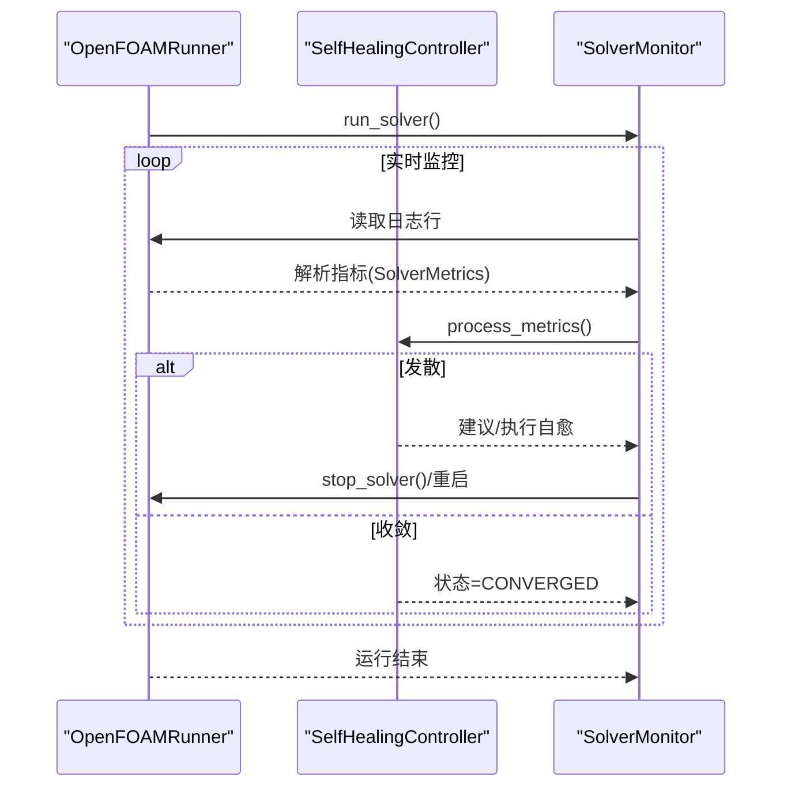
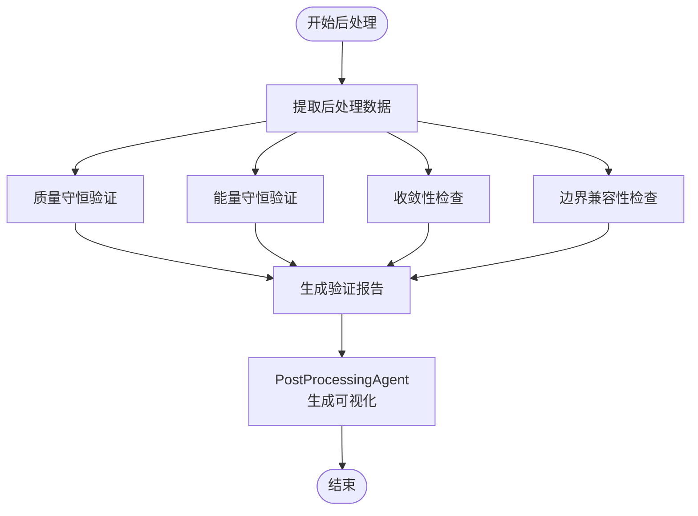
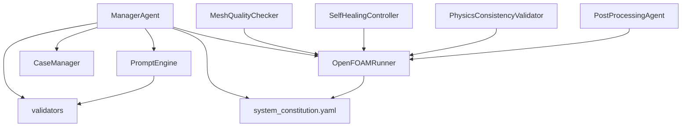

# Agent架构模式

<cite>
**本文档引用的文件**
- [manager_agent.py](file://openfoam_ai/agents/manager_agent.py)
- [postprocessing_agent.py](file://openfoam_ai/agents/postprocessing_agent.py)
- [prompt_engine.py](file://openfoam_ai/agents/prompt_engine.py)
- [mesh_quality_agent.py](file://openfoam_ai/agents/mesh_quality_agent.py)
- [self_healing_agent.py](file://openfoam_ai/agents/self_healing_agent.py)
- [physics_validation_agent.py](file://openfoam_ai/agents/physics_validation_agent.py)
- [critic_agent.py](file://openfoam_ai/agents/critic_agent.py)
- [geometry_image_agent.py](file://openfoam_ai/agents/geometry_image_agent.py)
- [main.py](file://openfoam_ai/main.py)
- [system_constitution.yaml](file://openfoam_ai/config/system_constitution.yaml)
- [case_manager.py](file://openfoam_ai/core/case_manager.py)
- [openfoam_runner.py](file://openfoam_ai/core/openfoam_runner.py)
- [validators.py](file://openfoam_ai/core/validators.py)
</cite>

## 目录
1. [引言](#引言)
2. [项目结构](#项目结构)
3. [核心组件](#核心组件)
4. [架构总览](#架构总览)
5. [详细组件分析](#详细组件分析)
6. [依赖关系分析](#依赖关系分析)
7. [性能考虑](#性能考虑)
8. [故障排除指南](#故障排除指南)
9. [结论](#结论)
10. [附录](#附录)

## 引言
本文件系统化阐述OpenFOAM AI系统的Agent架构模式，重点围绕ManagerAgent作为总控Agent的设计理念与职责分工，详细说明Preprocessing、Execution、Postprocessing三大Agent的功能定位与协作机制；文档化Agent之间的通信协议、消息传递模式与状态同步策略；涵盖Agent生命周期管理、异常处理与容错机制；提供代码示例路径展示Agent的初始化、配置与调用方式；并说明该架构如何支持扩展性与模块化设计。

## 项目结构
OpenFOAM AI系统采用模块化Agent架构，核心Agent位于openfoam_ai/agents目录，核心运行与验证逻辑位于openfoam_ai/core目录，配置与宪法规则位于openfoam_ai/config目录，入口程序位于openfoam_ai/main.py。

**图表来源**
- [main.py:1-251](file://openfoam_ai/main.py#L1-L251)
- [manager_agent.py:1-458](file://openfoam_ai/agents/manager_agent.py#L1-L458)
- [case_manager.py:1-639](file://openfoam_ai/core/case_manager.py#L1-L639)
- [openfoam_runner.py:1-548](file://openfoam_ai/core/openfoam_runner.py#L1-L548)
- [validators.py:1-441](file://openfoam_ai/core/validators.py#L1-L441)
- [system_constitution.yaml:1-103](file://openfoam_ai/config/system_constitution.yaml#L1-L103)

**章节来源**
- [main.py:1-251](file://openfoam_ai/main.py#L1-L251)
- [manager_agent.py:1-458](file://openfoam_ai/agents/manager_agent.py#L1-L458)

## 核心组件
- ManagerAgent：总控Agent，负责任务调度、用户交互与状态管理，协调各子Agent完成端到端工作流。
- PromptEngine：将自然语言转换为结构化OpenFOAM配置，支持多种模型适配。
- MeshQualityChecker：基于checkMesh结果进行网格质量评估与自动修复建议。
- SelfHealingController：求解稳定性监控与自愈，检测发散并自动调整求解参数。
- PhysicsConsistencyValidator：后处理阶段的物理一致性验证（质量守恒、能量守恒等）。
- CriticAgent：基于AI宪法规则的审查者Agent，提供硬约束检查与评分。
- GeometryImageParser：从几何图像解析关键特征并转换为OpenFOAM配置。
- PostProcessingAgent：基于PyVista的后处理与自动化绘图。

**章节来源**
- [manager_agent.py:38-75](file://openfoam_ai/agents/manager_agent.py#L38-L75)
- [prompt_engine.py:20-91](file://openfoam_ai/agents/prompt_engine.py#L20-L91)
- [mesh_quality_agent.py:61-96](file://openfoam_ai/agents/mesh_quality_agent.py#L61-L96)
- [self_healing_agent.py:58-85](file://openfoam_ai/agents/self_healing_agent.py#L58-L85)
- [physics_validation_agent.py:174-196](file://openfoam_ai/agents/physics_validation_agent.py#L174-L196)
- [critic_agent.py:286-350](file://openfoam_ai/agents/critic_agent.py#L286-L350)
- [geometry_image_agent.py:78-100](file://openfoam_ai/agents/geometry_image_agent.py#L78-L100)
- [postprocessing_agent.py:108-118](file://openfoam_ai/agents/postprocessing_agent.py#L108-L118)

## 架构总览
ManagerAgent作为总控Agent，统一接收用户输入，解析意图，生成执行计划，并协调各子Agent完成任务。Preprocessing阶段由PromptEngine与MeshQualityChecker负责配置生成与网格质量检查；Execution阶段由OpenFOAMRunner与SelfHealingController负责求解器运行与自愈；Postprocessing阶段由PhysicsConsistencyValidator与PostProcessingAgent负责物理验证与可视化输出。

**图表来源**
- [manager_agent.py:75-105](file://openfoam_ai/agents/manager_agent.py#L75-L105)
- [prompt_engine.py:92-126](file://openfoam_ai/agents/prompt_engine.py#L92-L126)
- [case_manager.py:51-86](file://openfoam_ai/core/case_manager.py#L51-L86)
- [openfoam_runner.py:99-198](file://openfoam_ai/core/openfoam_runner.py#L99-L198)
- [self_healing_agent.py:479-568](file://openfoam_ai/agents/self_healing_agent.py#L479-L568)
- [postprocessing_agent.py:345-380](file://openfoam_ai/agents/postprocessing_agent.py#L345-L380)

## 详细组件分析

### ManagerAgent（总控Agent）
- 设计理念：以用户为中心的任务编排Agent，负责意图识别、计划生成、状态管理与人机交互。
- 核心职责：
  - 意图识别：创建、修改、运行、状态查询、帮助等。
  - 计划生成：为不同任务生成步骤清单与预估时间。
  - 执行协调：调用PromptEngine生成配置、调用CaseManager创建算例、调用OpenFOAMRunner执行网格与求解。
  - 状态管理：维护current_case、current_config、execution_history等会话状态。
  - 确认机制：支持用户确认与自动修复策略。
- 通信协议：
  - 输入：自然语言字符串。
  - 输出：包含type、message、plan/config_summary/require_confirmation等字段的字典。
  - 执行：execute_plan(plan_type, confirmed)返回ExecutionResult。
- 生命周期管理：
  - 初始化：可注入CaseManager、PromptEngine、ConfigRefiner。
  - 运行期：process_input()解析用户输入，_generate_plan()生成计划，_execute_*()执行具体任务。
  - 结束：更新算例状态，记录执行日志。
- 异常处理与容错：
  - 配置验证失败时返回错误信息与配置。
  - 执行过程中捕获异常并返回ExecutionResult，包含logs便于诊断。
  - 自动修复开关auto_fix用于触发网格质量自愈逻辑。

**图表来源**
- [manager_agent.py:19-36](file://openfoam_ai/agents/manager_agent.py#L19-L36)
- [manager_agent.py:38-75](file://openfoam_ai/agents/manager_agent.py#L38-L75)
- [manager_agent.py:176-205](file://openfoam_ai/agents/manager_agent.py#L176-L205)

**章节来源**
- [manager_agent.py:38-105](file://openfoam_ai/agents/manager_agent.py#L38-L105)
- [manager_agent.py:176-205](file://openfoam_ai/agents/manager_agent.py#L176-L205)
- [manager_agent.py:207-338](file://openfoam_ai/agents/manager_agent.py#L207-L338)

### Preprocessing Agent（预处理）
- PromptEngine：将自然语言转换为结构化OpenFOAM配置，支持OpenAI/KIMI/DeepSeek等多模型适配；提供配置解释与改进建议。
- MeshQualityChecker：执行checkMesh并解析日志，评估网格质量等级，提供自动修复建议与交互式提示。
- GeometryImageParser：从用户上传的几何图像中提取关键特征，转换为OpenFOAM配置参数，遵循AI宪法规则。

**图表来源**
- [prompt_engine.py:92-126](file://openfoam_ai/agents/prompt_engine.py#L92-L126)
- [validators.py:389-411](file://openfoam_ai/core/validators.py#L389-L411)
- [mesh_quality_agent.py:111-177](file://openfoam_ai/agents/mesh_quality_agent.py#L111-L177)

**章节来源**
- [prompt_engine.py:20-126](file://openfoam_ai/agents/prompt_engine.py#L20-L126)
- [validators.py:18-275](file://openfoam_ai/core/validators.py#L18-L275)
- [mesh_quality_agent.py:61-177](file://openfoam_ai/agents/mesh_quality_agent.py#L61-L177)
- [geometry_image_agent.py:78-170](file://openfoam_ai/agents/geometry_image_agent.py#L78-L170)

### Execution Agent（执行）
- OpenFOAMRunner：封装OpenFOAM命令执行、日志捕获与结果解析，支持blockMesh、checkMesh、求解器运行与实时监控。
- SelfHealingController：实时监控求解过程，检测发散与停滞，自动调整时间步长、松弛因子与非正交修正器，并支持从最新时间步重启。

**图表来源**
- [openfoam_runner.py:99-198](file://openfoam_ai/core/openfoam_runner.py#L99-L198)
- [openfoam_runner.py:429-517](file://openfoam_ai/core/openfoam_runner.py#L429-L517)
- [self_healing_agent.py:570-609](file://openfoam_ai/agents/self_healing_agent.py#L570-L609)

**章节来源**
- [openfoam_runner.py:44-198](file://openfoam_ai/core/openfoam_runner.py#L44-L198)
- [self_healing_agent.py:232-477](file://openfoam_ai/agents/self_healing_agent.py#L232-L477)

### Postprocessing Agent（后处理）
- PhysicsConsistencyValidator：验证质量守恒、能量守恒、收敛性、边界兼容性等，生成验证报告。
- PostProcessingAgent：解析自然语言绘图需求，生成PyVista脚本，读取OpenFOAM结果数据，生成高分辨率矢量图与报告。

**图表来源**
- [physics_validation_agent.py:197-224](file://openfoam_ai/agents/physics_validation_agent.py#L197-L224)
- [physics_validation_agent.py:451-478](file://openfoam_ai/agents/physics_validation_agent.py#L451-L478)
- [postprocessing_agent.py:345-380](file://openfoam_ai/agents/postprocessing_agent.py#L345-L380)

**章节来源**
- [physics_validation_agent.py:174-224](file://openfoam_ai/agents/physics_validation_agent.py#L174-L224)
- [postprocessing_agent.py:108-171](file://openfoam_ai/agents/postprocessing_agent.py#L108-L171)

### 其他Agent
- CriticAgent：基于system_constitution.yaml进行硬约束检查，提供评分与改进建议，与Builder Agent形成对抗。
- GeometryImageParser：支持Mock模式与真实LLM模式，解析几何图像并转换为OpenFOAM配置。

**章节来源**
- [critic_agent.py:47-131](file://openfoam_ai/agents/critic_agent.py#L47-L131)
- [geometry_image_agent.py:150-203](file://openfoam_ai/agents/geometry_image_agent.py#L150-L203)

## 依赖关系分析
- ManagerAgent依赖PromptEngine、CaseManager、OpenFOAMRunner、validators等核心模块，形成完整的端到端工作流。
- 各Agent之间通过数据类（如TaskPlan、ExecutionResult、SolverMetrics）进行松耦合通信。
- 宪法规则system_constitution.yaml贯穿Preprocessing、Execution、Postprocessing各阶段，作为硬约束与阈值来源。

**图表来源**
- [manager_agent.py:12-16](file://openfoam_ai/agents/manager_agent.py#L12-L16)
- [system_constitution.yaml:1-103](file://openfoam_ai/config/system_constitution.yaml#L1-L103)

**章节来源**
- [manager_agent.py:12-16](file://openfoam_ai/agents/manager_agent.py#L12-L16)
- [system_constitution.yaml:1-103](file://openfoam_ai/config/system_constitution.yaml#L1-L103)

## 性能考虑
- 网格质量阈值与收敛目标：通过system_constitution.yaml设定的阈值（如max_aspect_ratio、max_non_orthogonality、min_convergence_residual）确保计算稳定性与精度。
- 自愈策略：根据发散类型自动调整时间步长、松弛因子与非正交修正器，减少人工干预。
- 可视化效率：PostProcessingAgent支持高分辨率矢量图输出，便于快速洞察结果。
- 模型适配：PromptEngine支持多种LLM提供商，可根据网络环境与API Key灵活切换。

## 故障排除指南
- OpenFOAM环境未安装：主程序会检测blockMesh命令，若不可用则提示警告。请确保OpenFOAM已正确安装并加入PATH。
- 配置验证失败：validators模块会抛出异常并返回错误信息，检查几何网格、求解器与边界条件设置。
- 网格质量不佳：MeshQualityChecker提供自动修复建议与交互式提示，必要时进行人工调整。
- 求解发散：SelfHealingController自动减小时间步长、调整松弛因子或增加非正交修正器，若无效则停止求解器并提示。
- 可视化失败：PostProcessingAgent在Mock模式下生成占位图，真实模式下需安装PyVista与NumPy。

**章节来源**
- [main.py:230-239](file://openfoam_ai/main.py#L230-L239)
- [validators.py:389-411](file://openfoam_ai/core/validators.py#L389-L411)
- [mesh_quality_agent.py:164-177](file://openfoam_ai/agents/mesh_quality_agent.py#L164-L177)
- [self_healing_agent.py:277-301](file://openfoam_ai/agents/self_healing_agent.py#L277-L301)
- [postprocessing_agent.py:365-380](file://openfoam_ai/agents/postprocessing_agent.py#L365-L380)

## 结论
OpenFOAM AI系统的Agent架构以ManagerAgent为核心，结合PromptEngine、MeshQualityChecker、SelfHealingController、PhysicsConsistencyValidator、CriticAgent、GeometryImageParser与PostProcessingAgent，形成了从自然语言到可视化结果的完整自动化工作流。该架构通过宪法规则与Pydantic验证确保配置的物理合理性与数值稳定性，通过自愈机制与交互式提示提升鲁棒性与用户体验，具备良好的扩展性与模块化设计。

## 附录

### Agent初始化与调用示例（代码路径）
- ManagerAgent初始化与交互：
  - [main.py:42-99](file://openfoam_ai/main.py#L42-L99)
- PromptEngine配置生成：
  - [prompt_engine.py:92-126](file://openfoam_ai/agents/prompt_engine.py#L92-L126)
- 网格质量检查：
  - [mesh_quality_agent.py:111-177](file://openfoam_ai/agents/mesh_quality_agent.py#L111-L177)
- 求解器运行与自愈：
  - [openfoam_runner.py:99-198](file://openfoam_ai/core/openfoam_runner.py#L99-L198)
  - [self_healing_agent.py:479-568](file://openfoam_ai/agents/self_healing_agent.py#L479-L568)
- 物理验证与可视化：
  - [physics_validation_agent.py:451-478](file://openfoam_ai/agents/physics_validation_agent.py#L451-L478)
  - [postprocessing_agent.py:345-380](file://openfoam_ai/agents/postprocessing_agent.py#L345-L380)