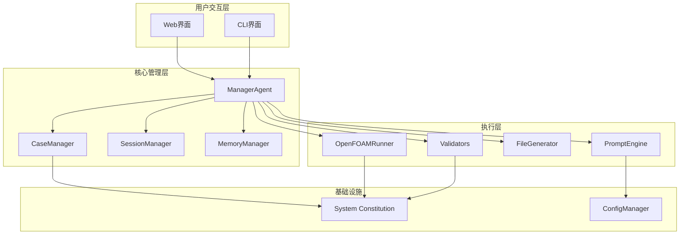
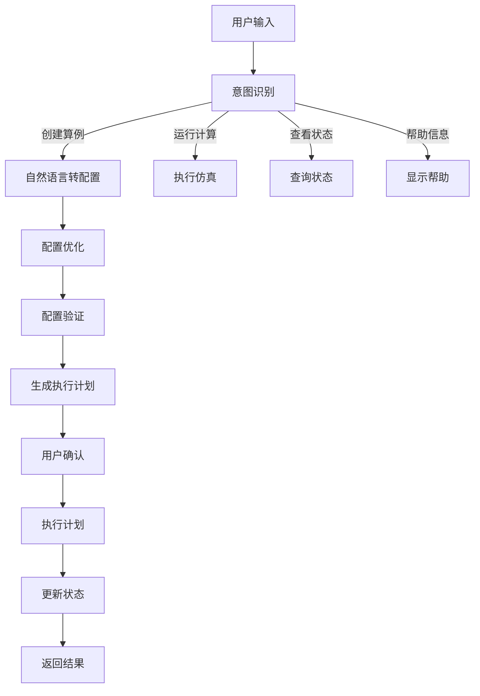
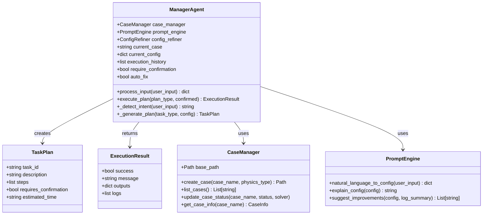
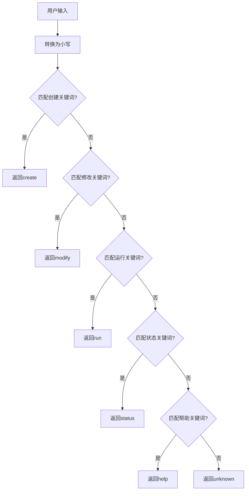
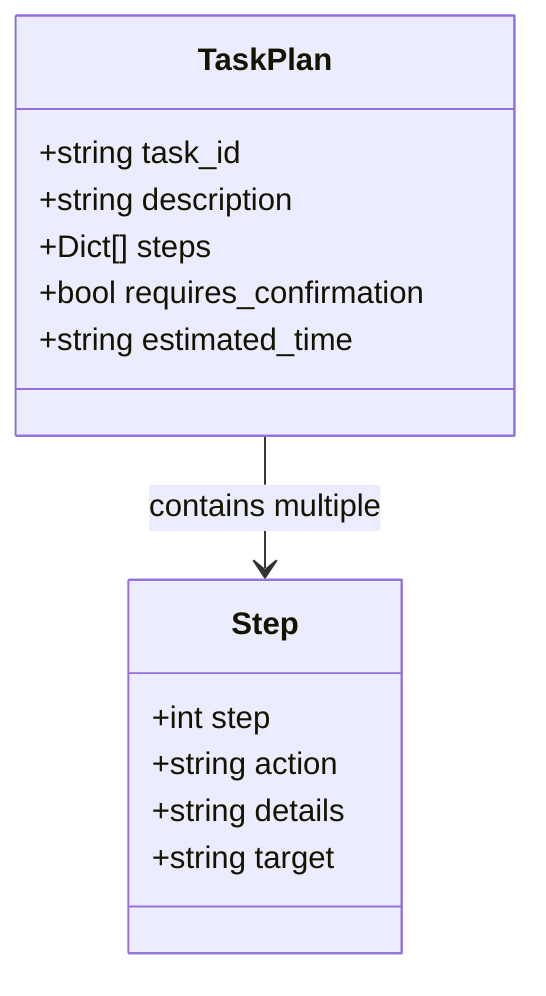
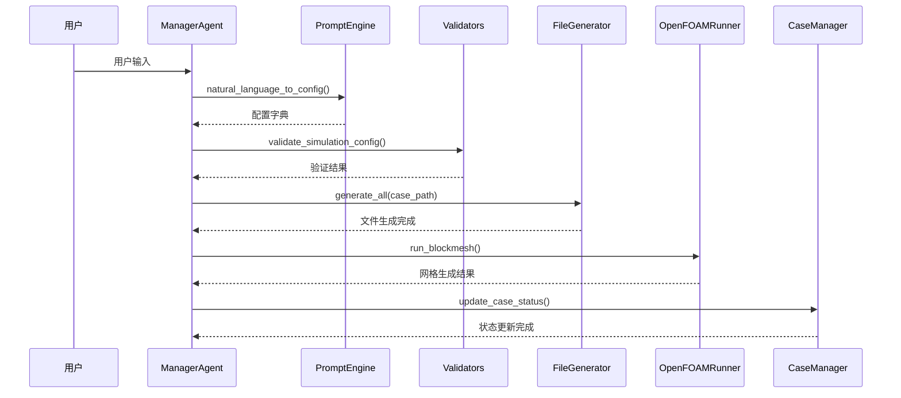
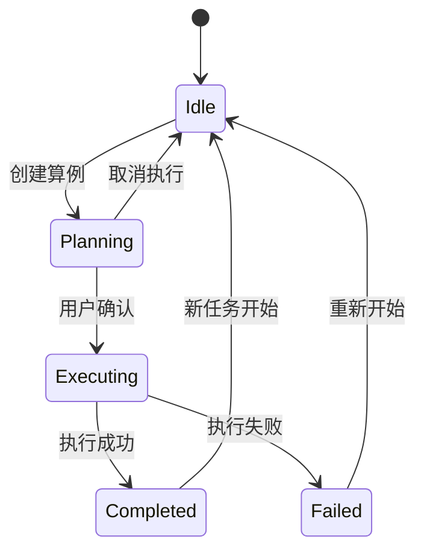
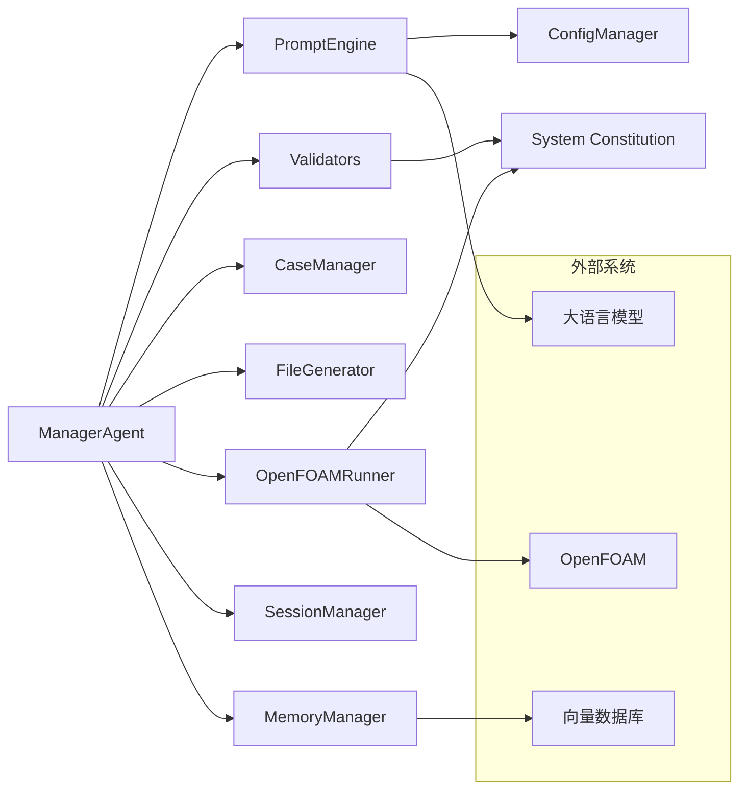

# ManagerAgent核心管理器

<cite>
**本文档引用的文件**
- [manager_agent.py](file://openfoam_ai/agents/manager_agent.py)
- [prompt_engine.py](file://openfoam_ai/agents/prompt_engine.py)
- [case_manager.py](file://openfoam_ai/core/case_manager.py)
- [openfoam_runner.py](file://openfoam_ai/core/openfoam_runner.py)
- [validators.py](file://openfoam_ai/core/validators.py)
- [file_generator.py](file://openfoam_ai/core/file_generator.py)
- [session_manager.py](file://openfoam_ai/memory/session_manager.py)
- [memory_manager.py](file://openfoam_ai/memory/memory_manager.py)
- [system_constitution.yaml](file://openfoam_ai/config/system_constitution.yaml)
- [config_manager.py](file://openfoam_ai/core/config_manager.py)
- [main.py](file://openfoam_ai/main.py)
</cite>

## 目录
1. [简介](#简介)
2. [项目结构](#项目结构)
3. [核心组件](#核心组件)
4. [架构总览](#架构总览)
5. [详细组件分析](#详细组件分析)
6. [依赖关系分析](#依赖关系分析)
7. [性能考虑](#性能考虑)
8. [故障排除指南](#故障排除指南)
9. [结论](#结论)

## 简介
ManagerAgent是OpenFOAM AI Agent系统的核心总控Agent，承担着系统级的协调与管理职责。它通过五大核心职责实现端到端的CFD仿真自动化：用户输入处理、任务计划生成、子Agent协调、会话状态管理以及用户确认机制。该Agent采用"意图识别-配置生成-计划执行-状态反馈"的闭环工作流，结合项目宪法（System Constitution）确保生成的仿真配置符合物理规律和工程实践。

## 项目结构
OpenFOAM AI Agent采用模块化架构，主要分为以下几个层次：

**图表来源**
- [manager_agent.py:1-458](file://openfoam_ai/agents/manager_agent.py#L1-L458)
- [main.py:1-251](file://openfoam_ai/main.py#L1-L251)

**章节来源**
- [manager_agent.py:38-74](file://openfoam_ai/agents/manager_agent.py#L38-L74)
- [main.py:104-128](file://openfoam_ai/main.py#L104-L128)

## 核心组件
ManagerAgent的核心组件包括数据结构、处理流程和集成接口：

### 数据结构设计
ManagerAgent定义了两个关键数据结构：

1. **TaskPlan任务计划**：描述完整的执行步骤和确认需求
2. **ExecutionResult执行结果**：标准化的返回格式，包含成功状态、消息、输出和日志

### 处理流程
系统采用"意图识别-配置生成-计划执行"的三层处理架构：

**图表来源**
- [manager_agent.py:75-141](file://openfoam_ai/agents/manager_agent.py#L75-L141)
- [manager_agent.py:142-206](file://openfoam_ai/agents/manager_agent.py#L142-L206)

**章节来源**
- [manager_agent.py:19-36](file://openfoam_ai/agents/manager_agent.py#L19-L36)
- [manager_agent.py:38-74](file://openfoam_ai/agents/manager_agent.py#L38-L74)

## 架构总览
ManagerAgent作为系统的总控制器，通过以下架构模式实现高效协作：

**图表来源**
- [manager_agent.py:38-458](file://openfoam_ai/agents/manager_agent.py#L38-L458)
- [case_manager.py:27-262](file://openfoam_ai/core/case_manager.py#L27-L262)
- [prompt_engine.py:20-616](file://openfoam_ai/agents/prompt_engine.py#L20-L616)

## 详细组件分析

### 意图检测算法实现
ManagerAgent采用基于关键词匹配的简化自然语言理解机制：

**图表来源**
- [manager_agent.py:106-140](file://openfoam_ai/agents/manager_agent.py#L106-L140)

关键词匹配策略包含以下类别：
- **创建算例**：建立、创建、新建、setup、create、build、make
- **修改算例**：修改、改变、调整、update、modify、change  
- **运行计算**：运行、计算、开始、run、start、execute、solve
- **查看状态**：状态、进度、情况、status、progress、check
- **帮助信息**：帮助、help、怎么用、说明

**章节来源**
- [manager_agent.py:106-140](file://openfoam_ai/agents/manager_agent.py#L106-L140)

### 任务计划生成器
TaskPlan数据结构设计体现了清晰的执行步骤组织：

**图表来源**
- [manager_agent.py:19-27](file://openfoam_ai/agents/manager_agent.py#L19-L27)

创建算例的任务计划包含六个标准步骤：
1. 创建算例目录
2. 生成blockMeshDict
3. 生成controlDict  
4. 生成初始场
5. 运行blockMesh
6. 运行checkMesh

**章节来源**
- [manager_agent.py:340-361](file://openfoam_ai/agents/manager_agent.py#L340-L361)

### 执行结果统一格式
ExecutionResult提供了标准化的返回格式，确保所有操作都有统一的响应结构：

| 字段 | 类型 | 描述 |
|------|------|------|
| success | bool | 操作是否成功 |
| message | string | 用户可读的消息 |
| outputs | dict | 执行产生的输出数据 |
| logs | list | 执行过程日志 |

这种设计便于前端界面统一处理和错误恢复。

**章节来源**
- [manager_agent.py:29-36](file://openfoam_ai/agents/manager_agent.py#L29-L36)

### 与其他Agent的协作模式
ManagerAgent通过明确的接口与子Agent协作：

**图表来源**
- [manager_agent.py:176-266](file://openfoam_ai/agents/manager_agent.py#L176-L266)

**章节来源**
- [manager_agent.py:176-338](file://openfoam_ai/agents/manager_agent.py#L176-L338)

### 状态同步机制
ManagerAgent维护会话状态并通过CaseManager实现持久化：

状态包括：
- current_case：当前活动算例名称
- current_config：当前配置
- execution_history：执行历史记录
- require_confirmation：是否需要确认
- auto_fix：是否自动修复

**章节来源**
- [manager_agent.py:66-74](file://openfoam_ai/agents/manager_agent.py#L66-L74)
- [manager_agent.py:389-409](file://openfoam_ai/agents/manager_agent.py#L389-L409)

## 依赖关系分析

### 核心依赖关系
ManagerAgent依赖于多个核心模块，形成完整的CFD仿真链路：

**图表来源**
- [manager_agent.py:12-16](file://openfoam_ai/agents/manager_agent.py#L12-L16)
- [config_manager.py:16-227](file://openfoam_ai/core/config_manager.py#L16-L227)

### 错误处理策略
系统采用多层次的错误处理机制：

1. **输入验证**：意图识别失败时返回明确的错误消息
2. **配置验证**：使用Pydantic模型确保配置合法性
3. **执行监控**：OpenFOAMRunner捕获命令执行异常
4. **状态回滚**：失败时保持系统状态一致

**章节来源**
- [manager_agent.py:152-158](file://openfoam_ai/agents/manager_agent.py#L152-L158)
- [openfoam_runner.py:117-142](file://openfoam_ai/core/openfoam_runner.py#L117-L142)

## 性能考虑
ManagerAgent在设计时充分考虑了性能优化：

### 并发处理
- 使用生成器模式处理求解器监控，避免内存占用过高
- 异步日志写入，减少I/O阻塞
- 缓存配置验证结果，避免重复计算

### 资源管理
- 有限的状态历史记录，控制内存使用
- 及时清理临时文件和日志
- 合理的时间步长限制，避免过长计算

### 可扩展性
- 插件化架构，易于添加新的Agent
- 配置驱动的验证规则，支持动态调整
- 模块化设计，便于单元测试和维护

## 故障排除指南

### 常见问题诊断
1. **意图识别失败**
   - 检查输入是否包含支持的关键词
   - 确认语言环境（中文/英文）
   - 查看日志输出的详细信息

2. **配置验证错误**
   - 检查system_constitution.yaml中的规则
   - 验证网格分辨率和物理参数范围
   - 确认求解器与物理类型的匹配

3. **执行失败**
   - 检查OpenFOAM环境是否正确安装
   - 验证算例目录权限
   - 查看详细日志信息

### 调试建议
- 启用详细日志模式：`LOG_LEVEL=DEBUG`
- 使用Mock模式测试配置生成：`PromptEngine(api_key=None)`
- 运行单元测试验证核心功能
- 检查算例目录结构完整性

**章节来源**
- [manager_agent.py:85-104](file://openfoam_ai/agents/manager_agent.py#L85-L104)
- [openfoam_ai/README.md:208-237](file://openfoam_ai/README.md#L208-L237)

## 结论
ManagerAgent作为OpenFOAM AI Agent系统的核心，通过精心设计的架构实现了从自然语言到CFD仿真的完整自动化流程。其五大核心职责相互配合，形成了稳定可靠的执行链路。系统采用的项目宪法机制、多层次验证体系和状态管理模式，确保了生成配置的物理合理性和执行的可靠性。

未来发展方向包括增强意图识别的自然语言理解能力、扩展记忆管理功能、优化性能监控机制，以及支持更多类型的CFD仿真场景。这些改进将进一步提升系统的智能化水平和用户体验。