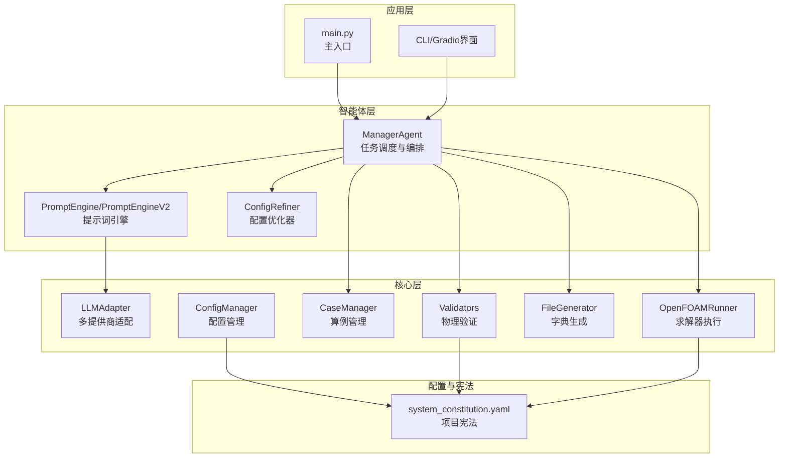
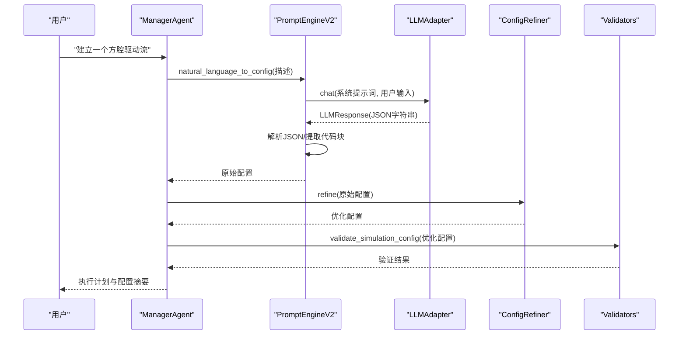
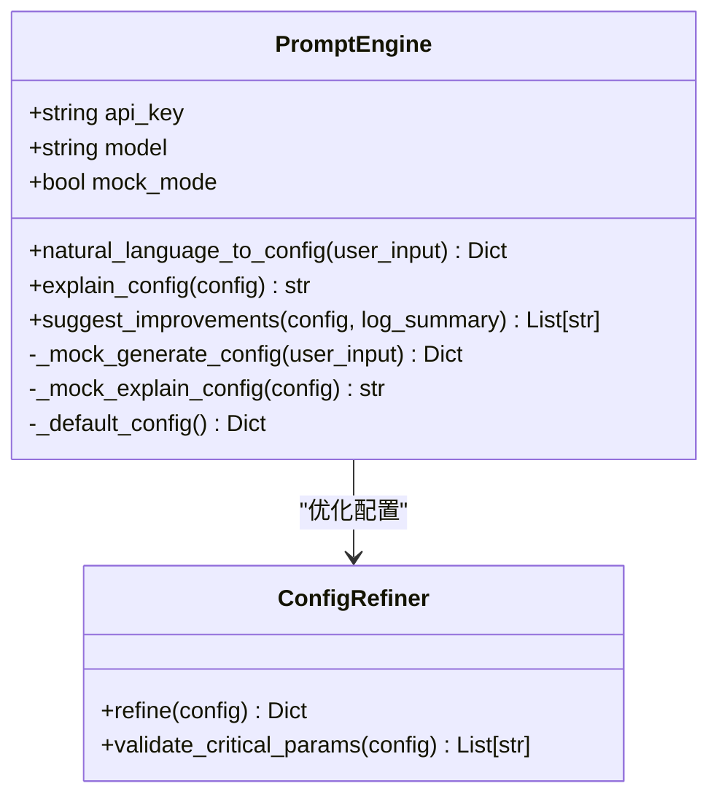
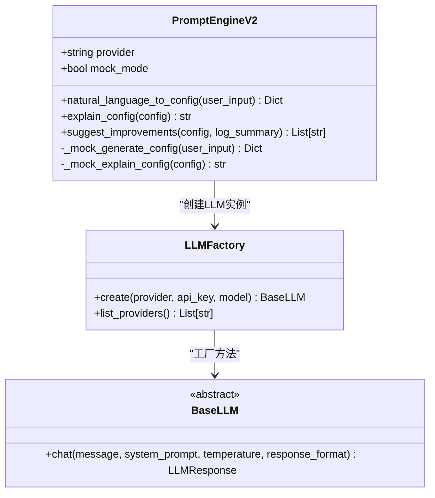
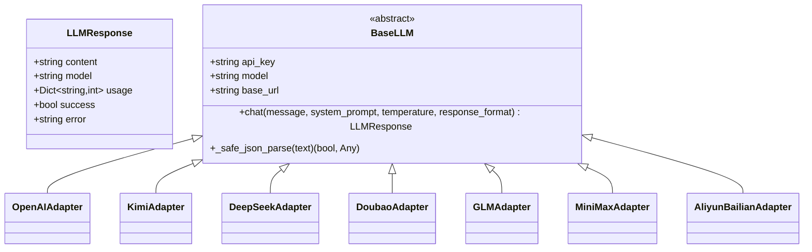
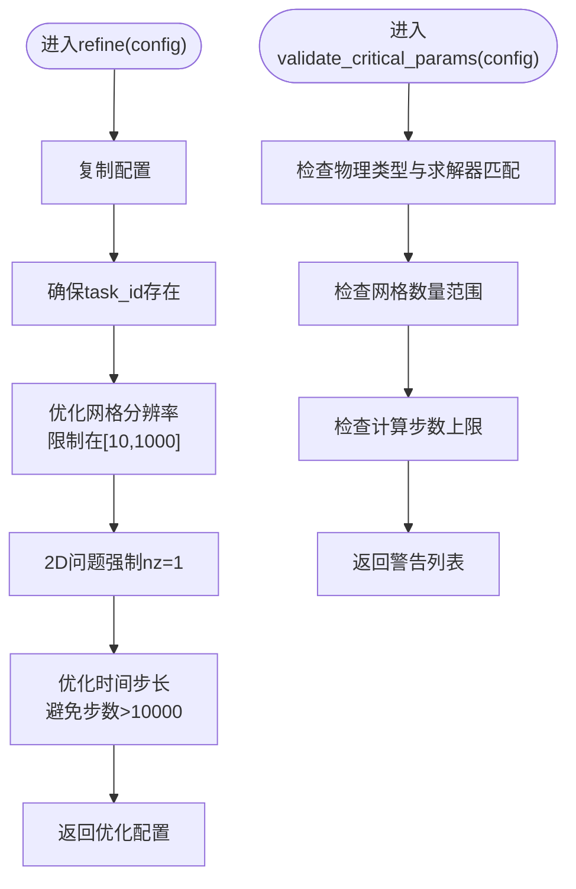
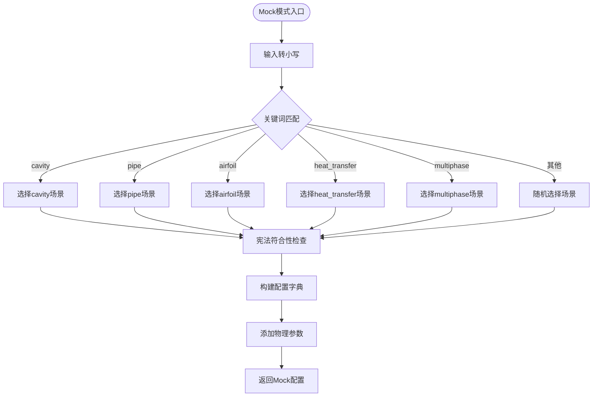
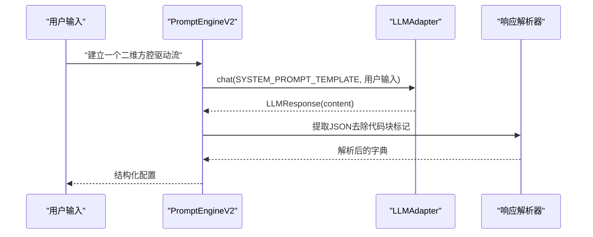
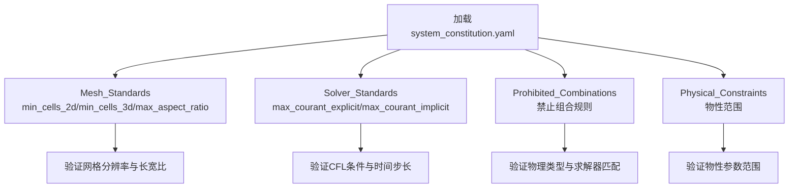
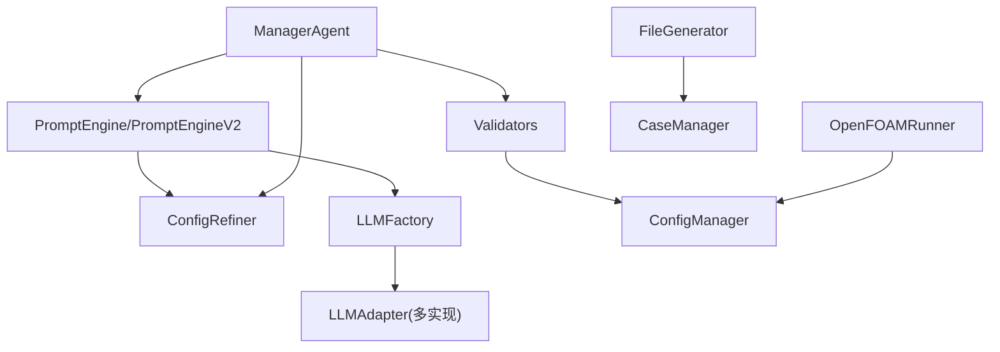

# PromptEngine提示词引擎

<cite>
**本文档引用的文件**
- [prompt_engine.py](file://openfoam_ai/agents/prompt_engine.py)
- [prompt_engine_v2.py](file://openfoam_ai/agents/prompt_engine_v2.py)
- [llm_adapter.py](file://openfoam_ai/core/llm_adapter.py)
- [config_manager.py](file://openfoam_ai/core/config_manager.py)
- [system_constitution.yaml](file://openfoam_ai/config/system_constitution.yaml)
- [manager_agent.py](file://openfoam_ai/agents/manager_agent.py)
- [openfoam_runner.py](file://openfoam_ai/core/openfoam_runner.py)
- [validators.py](file://openfoam_ai/core/validators.py)
- [file_generator.py](file://openfoam_ai/core/file_generator.py)
- [main.py](file://openfoam_ai/main.py)
- [README.md](file://openfoam_ai/README.md)
</cite>

## 目录
1. [简介](#简介)
2. [项目结构](#项目结构)
3. [核心组件](#核心组件)
4. [架构总览](#架构总览)
5. [详细组件分析](#详细组件分析)
6. [依赖关系分析](#依赖关系分析)
7. [性能考虑](#性能考虑)
8. [故障排除指南](#故障排除指南)
9. [结论](#结论)
10. [附录](#附录)

## 简介
本技术文档围绕PromptEngine提示词引擎展开，系统阐述其在OpenFOAM AI Agent中的作用与实现。文档重点覆盖：
- LLM集成架构：支持多种大语言模型提供商（OpenAI、KIMI、DeepSeek、豆包、GLM、MiniMax、阿里云百炼）的适配机制与回退策略
- 自然语言到CFD配置的转换算法：系统提示词设计、模板匹配、参数提取与结构化生成流程
- ConfigRefiner配置优化器：本地优化策略与关键参数验证
- Mock模式：离线测试与开发环境的实现机制
- 错误处理、重试与性能优化策略
- 完整的代码示例路径，展示提示词构建、LLM调用与响应解析的端到端流程

## 项目结构
项目采用模块化分层组织，PromptEngine位于agents层，核心LLM适配位于core层，配置与验证位于core层，主入口位于根目录。

**图表来源**
- [main.py:1-251](file://openfoam_ai/main.py#L1-L251)
- [manager_agent.py:1-458](file://openfoam_ai/agents/manager_agent.py#L1-L458)
- [prompt_engine.py:1-616](file://openfoam_ai/agents/prompt_engine.py#L1-L616)
- [prompt_engine_v2.py:1-541](file://openfoam_ai/agents/prompt_engine_v2.py#L1-L541)
- [llm_adapter.py:1-688](file://openfoam_ai/core/llm_adapter.py#L1-L688)
- [validators.py:1-441](file://openfoam_ai/core/validators.py#L1-L441)
- [config_manager.py:1-227](file://openfoam_ai/core/config_manager.py#L1-L227)
- [system_constitution.yaml:1-103](file://openfoam_ai/config/system_constitution.yaml#L1-L103)

**章节来源**
- [README.md:104-150](file://openfoam_ai/README.md#L104-L150)

## 核心组件
- PromptEngine：基础版本，支持OpenAI与Mock模式，负责将自然语言转换为结构化CFD配置，并提供解释与改进建议功能
- PromptEngineV2：增强版本，引入LLMFactory与LLMAdapter，统一多提供商接入，具备更强的容错与回退能力
- LLMAdapter：抽象基类与具体适配器（OpenAI、KIMI、DeepSeek、豆包、GLM、MiniMax、阿里云百炼），统一调用接口与响应结构
- ConfigRefiner：本地配置优化器，负责网格分辨率、时间步长等关键参数的规范化与安全边界检查
- ConfigManager：统一配置管理，加载system_constitution.yaml并提供默认值与环境变量合并机制
- Validators：基于Pydantic的硬约束验证，结合宪法规则进行物理合理性检查
- OpenFOAMRunner：封装OpenFOAM命令执行、日志解析与状态监控
- CaseManager/FileGenerator：算例目录管理与OpenFOAM字典文件生成

**章节来源**
- [prompt_engine.py:20-126](file://openfoam_ai/agents/prompt_engine.py#L20-L126)
- [prompt_engine_v2.py:24-161](file://openfoam_ai/agents/prompt_engine_v2.py#L24-L161)
- [llm_adapter.py:29-671](file://openfoam_ai/core/llm_adapter.py#L29-L671)
- [config_manager.py:16-227](file://openfoam_ai/core/config_manager.py#L16-L227)
- [validators.py:18-275](file://openfoam_ai/core/validators.py#L18-L275)
- [openfoam_runner.py:44-427](file://openfoam_ai/core/openfoam_runner.py#L44-L427)
- [file_generator.py:11-603](file://openfoam_ai/core/file_generator.py#L11-L603)

## 架构总览
PromptEngine作为智能体层的关键节点，向上承接ManagerAgent的任务编排，向下连接LLM适配器与本地优化器。系统通过宪法规则与验证器形成双重保障，确保生成配置的物理合理性与工程可用性。

**图表来源**
- [manager_agent.py:142-174](file://openfoam_ai/agents/manager_agent.py#L142-L174)
- [prompt_engine_v2.py:112-161](file://openfoam_ai/agents/prompt_engine_v2.py#L112-L161)
- [llm_adapter.py:29-671](file://openfoam_ai/core/llm_adapter.py#L29-L671)
- [validators.py:389-411](file://openfoam_ai/core/validators.py#L389-L411)

## 详细组件分析

### PromptEngine（基础版本）
- 角色与职责：管理系统提示词、将自然语言转换为JSON配置、处理多轮对话上下文
- Mock模式：基于关键词匹配的场景库，自动满足宪法最小网格数要求，生成符合物理类型的配置
- 错误处理：API调用异常时回退到默认配置；解释与改进建议功能提供降级路径
- 配置优化：与ConfigRefiner配合，确保网格分辨率与时间步长在安全范围内

**图表来源**
- [prompt_engine.py:20-126](file://openfoam_ai/agents/prompt_engine.py#L20-L126)
- [prompt_engine.py:476-571](file://openfoam_ai/agents/prompt_engine.py#L476-L571)

**章节来源**
- [prompt_engine.py:92-126](file://openfoam_ai/agents/prompt_engine.py#L92-L126)
- [prompt_engine.py:217-373](file://openfoam_ai/agents/prompt_engine.py#L217-L373)
- [prompt_engine.py:476-571](file://openfoam_ai/agents/prompt_engine.py#L476-L571)

### PromptEngineV2（增强版本）
- 多提供商支持：通过LLMFactory与LLMAdapter统一接入OpenAI、KIMI、DeepSeek、豆包、GLM、MiniMax、阿里云百炼
- 容错与回退：初始化失败自动进入Mock模式；JSON解析失败自动回退；提供统一的LLMResponse结构
- 系统提示词：与基础版本一致，强调CFD配置的JSON结构与宪法约束
- Mock模式：与基础版本相同，便于离线测试

**图表来源**
- [prompt_engine_v2.py:24-161](file://openfoam_ai/agents/prompt_engine_v2.py#L24-L161)
- [llm_adapter.py:577-671](file://openfoam_ai/core/llm_adapter.py#L577-L671)

**章节来源**
- [prompt_engine_v2.py:84-161](file://openfoam_ai/agents/prompt_engine_v2.py#L84-L161)
- [llm_adapter.py:577-671](file://openfoam_ai/core/llm_adapter.py#L577-L671)

### LLM适配器与多提供商策略
- 抽象接口：BaseLLM定义统一的chat方法与LLMResponse数据结构
- 具体适配器：OpenAI、KIMI、DeepSeek、豆包、GLM、MiniMax、阿里云百炼分别实现HTTP调用与响应解析
- 错误处理：捕获网络异常、解析异常与服务端错误，返回LLMResponse.success=false
- 环境变量：create_llm函数自动从环境变量读取API Key，减少显式参数传递

**图表来源**
- [llm_adapter.py:29-671](file://openfoam_ai/core/llm_adapter.py#L29-L671)

**章节来源**
- [llm_adapter.py:29-168](file://openfoam_ai/core/llm_adapter.py#L29-L168)
- [llm_adapter.py:170-368](file://openfoam_ai/core/llm_adapter.py#L170-L368)
- [llm_adapter.py:370-575](file://openfoam_ai/core/llm_adapter.py#L370-L575)

### ConfigRefiner配置优化器
- 任务：对LLM生成的配置进行本地优化与修正，确保关键参数在安全范围内
- 优化策略：
  - 确保task_id存在并规范化
  - 网格分辨率限制在[10, 1000]区间，2D问题强制nz=1
  - 时间步长调整，避免计算步数超过10000
- 关键参数验证：检查物理类型与求解器匹配、网格数量范围、计算步数上限

**图表来源**
- [prompt_engine.py:485-532](file://openfoam_ai/agents/prompt_engine.py#L485-L532)
- [prompt_engine.py:534-570](file://openfoam_ai/agents/prompt_engine.py#L534-L570)

**章节来源**
- [prompt_engine.py:485-570](file://openfoam_ai/agents/prompt_engine.py#L485-L570)

### Mock模式实现机制
- 触发条件：未安装openai包、未提供API Key、初始化失败
- 场景库：支持cavity、pipe、airfoil、heat_transfer、multiphase五类典型场景
- 关键词匹配：中文/英文关键词触发场景选择，未匹配时随机选择
- 宪法符合性：自动提升分辨率以满足最小网格数要求（2D≥400，3D≥8000）
- 附加参数：根据物理类型自动添加ρ、γ、β、T_ref、ρ1、ρ2、ν1、ν2等

**图表来源**
- [prompt_engine.py:217-373](file://openfoam_ai/agents/prompt_engine.py#L217-L373)
- [prompt_engine_v2.py:239-387](file://openfoam_ai/agents/prompt_engine_v2.py#L239-L387)

**章节来源**
- [prompt_engine.py:217-373](file://openfoam_ai/agents/prompt_engine.py#L217-L373)
- [prompt_engine_v2.py:239-387](file://openfoam_ai/agents/prompt_engine_v2.py#L239-L387)

### 自然语言到CFD配置的转换算法
- 系统提示词：明确物理类型、求解器、JSON结构与宪法约束
- 模板匹配：PromptEngineV2支持从Markdown代码块中提取JSON
- 参数提取：解析LLM响应，处理JSON解析异常与格式不规范
- 结构化生成：生成geometry、solver、boundary_conditions、物理参数等字段

**图表来源**
- [prompt_engine_v2.py:112-161](file://openfoam_ai/agents/prompt_engine_v2.py#L112-L161)
- [llm_adapter.py:29-117](file://openfoam_ai/core/llm_adapter.py#L29-L117)

**章节来源**
- [prompt_engine_v2.py:112-161](file://openfoam_ai/agents/prompt_engine_v2.py#L112-L161)

### 配置验证与宪法约束
- Pydantic验证：MeshConfig、SolverConfig、BoundaryCondition、SimulationConfig四类模型
- 宪法规则：Mesh_Standards、Solver_Standards、Prohibited_Combinations、Physical_Constraints
- 运行时监控：OpenFOAMRunner解析日志，检测库朗数、残差与发散趋势

**图表来源**
- [system_constitution.yaml:13-64](file://openfoam_ai/config/system_constitution.yaml#L13-L64)
- [validators.py:18-275](file://openfoam_ai/core/validators.py#L18-L275)
- [openfoam_runner.py:70-76](file://openfoam_ai/core/openfoam_runner.py#L70-L76)

**章节来源**
- [system_constitution.yaml:1-103](file://openfoam_ai/config/system_constitution.yaml#L1-L103)
- [validators.py:18-275](file://openfoam_ai/core/validators.py#L18-L275)
- [openfoam_runner.py:347-409](file://openfoam_ai/core/openfoam_runner.py#L347-L409)

## 依赖关系分析
- PromptEngine依赖ConfigRefiner进行本地优化
- PromptEngineV2依赖LLMFactory与LLMAdapter进行多提供商接入
- ManagerAgent协调PromptEngine、ConfigRefiner与验证器
- Validators与ConfigManager共同保障配置的物理合理性
- OpenFOAMRunner依赖宪法配置进行阈值判断

**图表来源**
- [manager_agent.py:12-16](file://openfoam_ai/agents/manager_agent.py#L12-L16)
- [prompt_engine.py:12-16](file://openfoam_ai/agents/prompt_engine.py#L12-L16)
- [prompt_engine_v2.py:13-22](file://openfoam_ai/agents/prompt_engine_v2.py#L13-L22)
- [validators.py:11-11](file://openfoam_ai/core/validators.py#L11-L11)
- [config_manager.py:16-49](file://openfoam_ai/core/config_manager.py#L16-L49)
- [openfoam_runner.py:55-76](file://openfoam_ai/core/openfoam_runner.py#L55-L76)
- [file_generator.py:11-12](file://openfoam_ai/core/file_generator.py#L11-L12)

**章节来源**
- [manager_agent.py:12-16](file://openfoam_ai/agents/manager_agent.py#L12-L16)
- [prompt_engine.py:12-16](file://openfoam_ai/agents/prompt_engine.py#L12-L16)
- [prompt_engine_v2.py:13-22](file://openfoam_ai/agents/prompt_engine_v2.py#L13-L22)

## 性能考虑
- Mock模式：适合离线测试与开发，避免网络延迟与API成本
- LLM调用：设置较低temperature（0.3）提高输出确定性；对JSON响应进行严格解析与回退
- 配置优化：限制网格分辨率与时间步长，避免过大的计算负载
- 日志解析：OpenFOAMRunner采用增量解析与异常捕获，避免阻塞求解器进程
- 并发与资源：ConfigManager提供CPU核心数与内存限制的默认配置，便于在不同环境中运行

[本节为通用指导，无需特定文件分析]

## 故障排除指南
- ModuleNotFoundError: No module named 'openai'
  - 现象：导入失败，自动进入Mock模式
  - 处理：安装openai或使用Mock模式
  - 参考：[prompt_engine.py:12-17](file://openfoam_ai/agents/prompt_engine.py#L12-L17)
- FileNotFoundError: [Errno 2] No such file or directory: 'blockMesh'
  - 现象：OpenFOAM未安装或PATH未设置
  - 处理：安装OpenFOAM或在Docker容器内运行
  - 参考：[openfoam_runner.py:118-142](file://openfoam_ai/core/openfoam_runner.py#L118-L142)
- PydanticValidationError
  - 现象：配置不符合验证规则
  - 处理：检查system_constitution.yaml与配置参数
  - 参考：[validators.py:389-411](file://openfoam_ai/core/validators.py#L389-L411)
- Mock模式配置不合理
  - 现象：网格数不足或物理参数不匹配
  - 处理：使用ConfigRefiner优化或切换到真实LLM
  - 参考：[prompt_engine.py:485-570](file://openfoam_ai/agents/prompt_engine.py#L485-L570)

**章节来源**
- [prompt_engine.py:12-17](file://openfoam_ai/agents/prompt_engine.py#L12-L17)
- [openfoam_runner.py:118-142](file://openfoam_ai/core/openfoam_runner.py#L118-L142)
- [validators.py:389-411](file://openfoam_ai/core/validators.py#L389-L411)

## 结论
PromptEngine提示词引擎通过PromptEngine与PromptEngineV2两个版本，实现了从自然语言到OpenFOAM CFD配置的可靠转换。其多提供商适配与Mock模式确保了在不同环境下的可用性；ConfigRefiner与Validators共同构建了从语法到物理的双重保障体系；OpenFOAMRunner与FileGenerator进一步完善了从配置到执行的全链路闭环。该架构既满足了工程实践的需求，也为后续的多模态与后处理扩展奠定了坚实基础。

[本节为总结性内容，无需特定文件分析]

## 附录

### 代码示例路径（提示词构建、LLM调用与响应解析）
- 基础提示词构建与调用
  - [prompt_engine.py:75-126](file://openfoam_ai/agents/prompt_engine.py#L75-L126)
- 增强提示词构建与多提供商调用
  - [prompt_engine_v2.py:84-161](file://openfoam_ai/agents/prompt_engine_v2.py#L84-L161)
- LLM适配器统一接口
  - [llm_adapter.py:29-117](file://openfoam_ai/core/llm_adapter.py#L29-L117)
- 配置优化与验证
  - [prompt_engine.py:485-570](file://openfoam_ai/agents/prompt_engine.py#L485-L570)
  - [validators.py:389-411](file://openfoam_ai/core/validators.py#L389-L411)
- 算例生成与执行
  - [file_generator.py:506-532](file://openfoam_ai/core/file_generator.py#L506-L532)
  - [openfoam_runner.py:77-198](file://openfoam_ai/core/openfoam_runner.py#L77-L198)

**章节来源**
- [prompt_engine.py:75-126](file://openfoam_ai/agents/prompt_engine.py#L75-L126)
- [prompt_engine_v2.py:84-161](file://openfoam_ai/agents/prompt_engine_v2.py#L84-L161)
- [llm_adapter.py:29-117](file://openfoam_ai/core/llm_adapter.py#L29-L117)
- [validators.py:389-411](file://openfoam_ai/core/validators.py#L389-L411)
- [file_generator.py:506-532](file://openfoam_ai/core/file_generator.py#L506-L532)
- [openfoam_runner.py:77-198](file://openfoam_ai/core/openfoam_runner.py#L77-L198)