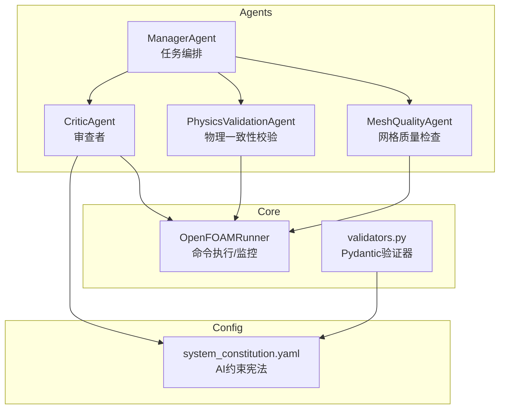
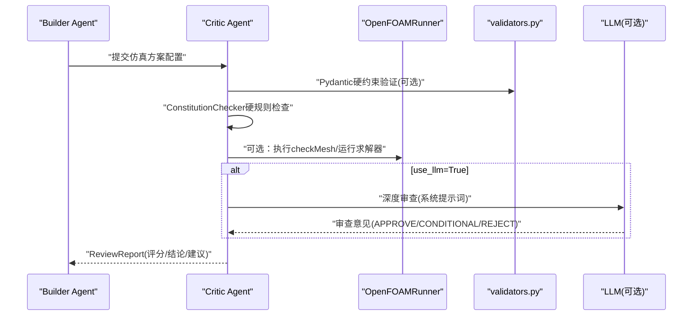
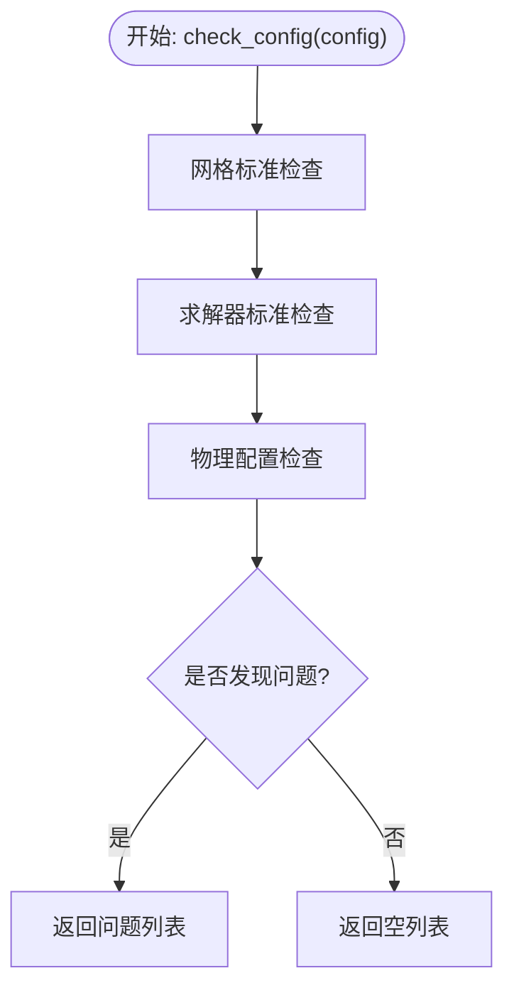
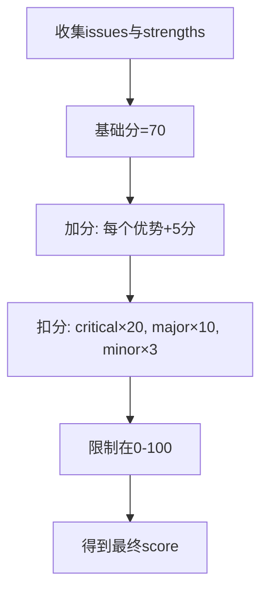
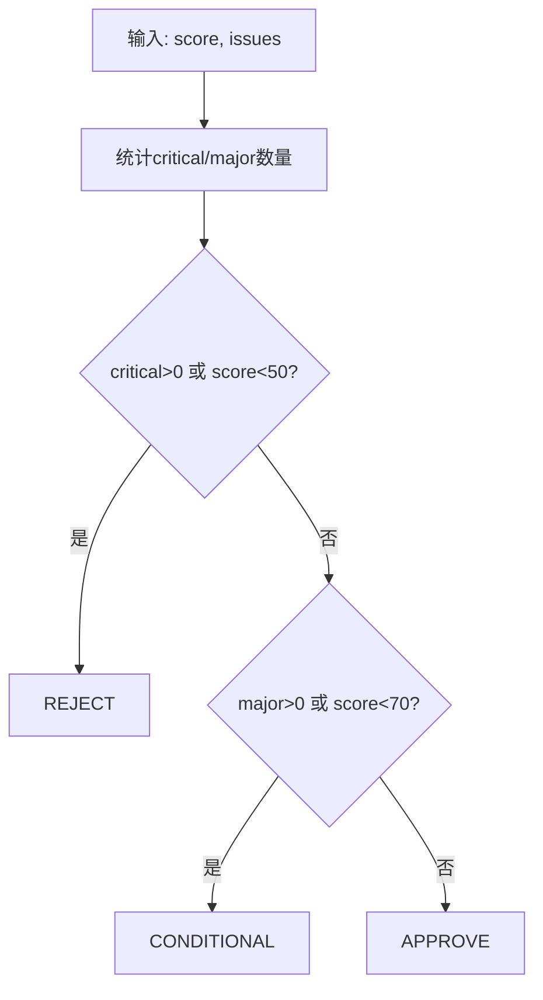
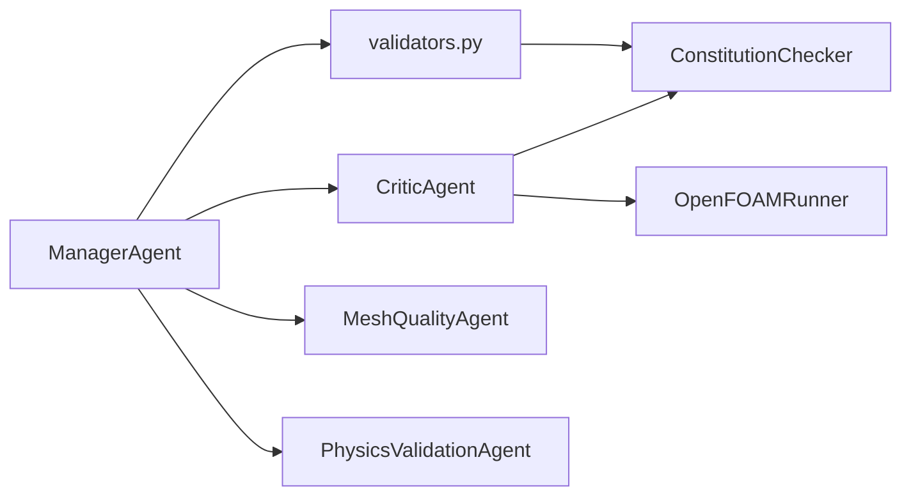

# CriticAgent审查者Agent

<cite>
**本文引用的文件**
- [openfoam_ai/agents/critic_agent.py](file://openfoam_ai/agents/critic_agent.py)
- [openfoam_ai/config/system_constitution.yaml](file://openfoam_ai/config/system_constitution.yaml)
- [openfoam_ai/core/validators.py](file://openfoam_ai/core/validators.py)
- [openfoam_ai/agents/physics_validation_agent.py](file://openfoam_ai/agents/physics_validation_agent.py)
- [openfoam_ai/agents/mesh_quality_agent.py](file://openfoam_ai/agents/mesh_quality_agent.py)
- [openfoam_ai/core/openfoam_runner.py](file://openfoam_ai/core/openfoam_runner.py)
- [openfoam_ai/agents/manager_agent.py](file://openfoam_ai/agents/manager_agent.py)
- [openfoam_ai/tests/test_phase2.py](file://openfoam_ai/tests/test_phase2.py)
- [openfoam_ai/demo_features.py](file://openfoam_ai/demo_features.py)
- [openfoam_ai/main_phase2.py](file://openfoam_ai/main_phase2.py)
- [openfoam_ai/auto_demo.py](file://openfoam_ai/auto_demo.py)
</cite>

## 目录
1. [简介](#简介)
2. [项目结构](#项目结构)
3. [核心组件](#核心组件)
4. [架构总览](#架构总览)
5. [详细组件分析](#详细组件分析)
6. [依赖关系分析](#依赖关系分析)
7. [性能考量](#性能考量)
8. [故障排查指南](#故障排查指南)
9. [结论](#结论)
10. [附录](#附录)

## 简介
CriticAgent审查者Agent是多智能体对抗框架中的“审查者”角色，负责对Builder Agent生成的CFD仿真方案进行严格审查，确保方案满足宪法约束与工程规范。其核心职责包括：
- 基于system_constitution.yaml的硬规则校验（网格标准、求解器标准、物理配置等）
- 评分与结论判定（approve、conditional、reject）
- 生成审查报告ReviewReport，包含问题、优势、建议
- 可选的LLM深度审查与交互式审查模式

CriticAgent与Builder Agent形成“对抗式”协作：Builder生成方案，Critic严格把关；只有Critic给出“Approve”或“Conditional”，方案才可进入后续执行阶段。

## 项目结构
本项目采用模块化组织，CriticAgent位于agents目录，宪法规则位于config目录，核心验证逻辑与运行器位于core目录，配套的物理一致性校验、网格质量检查、管理器等分布在相应模块中。

图表来源
- [openfoam_ai/agents/critic_agent.py:286-593](file://openfoam_ai/agents/critic_agent.py#L286-L593)
- [openfoam_ai/config/system_constitution.yaml:1-103](file://openfoam_ai/config/system_constitution.yaml#L1-L103)
- [openfoam_ai/core/openfoam_runner.py:44-198](file://openfoam_ai/core/openfoam_runner.py#L44-L198)
- [openfoam_ai/core/validators.py:17-275](file://openfoam_ai/core/validators.py#L17-L275)
- [openfoam_ai/agents/physics_validation_agent.py:174-478](file://openfoam_ai/agents/physics_validation_agent.py#L174-L478)
- [openfoam_ai/agents/mesh_quality_agent.py:61-177](file://openfoam_ai/agents/mesh_quality_agent.py#L61-L177)
- [openfoam_ai/agents/manager_agent.py:38-338](file://openfoam_ai/agents/manager_agent.py#L38-L338)

章节来源
- [openfoam_ai/agents/critic_agent.py:1-629](file://openfoam_ai/agents/critic_agent.py#L1-L629)
- [openfoam_ai/config/system_constitution.yaml:1-103](file://openfoam_ai/config/system_constitution.yaml#L1-L103)

## 核心组件
- 审查结论枚举ReviewVerdict：APPROVE、CONDITIONAL、REJECT
- 审查问题ReviewIssue：严重性、类别、描述、建议、宪法条款引用
- 审查报告ReviewReport：结论、分数、问题列表、优势、建议、时间戳
- 宪法检查器ConstitutionChecker：基于system_constitution.yaml的硬规则校验
- CriticAgent：审查者主体，负责评分、结论、报告生成、可选LLM深度审查与交互式审查

章节来源
- [openfoam_ai/agents/critic_agent.py:15-45](file://openfoam_ai/agents/critic_agent.py#L15-L45)
- [openfoam_ai/agents/critic_agent.py:22-41](file://openfoam_ai/agents/critic_agent.py#L22-L41)
- [openfoam_ai/agents/critic_agent.py:47-130](file://openfoam_ai/agents/critic_agent.py#L47-L130)
- [openfoam_ai/agents/critic_agent.py:286-593](file://openfoam_ai/agents/critic_agent.py#L286-L593)

## 架构总览
CriticAgent在多智能体框架中的位置与交互如下：

图表来源
- [openfoam_ai/agents/critic_agent.py:339-530](file://openfoam_ai/agents/critic_agent.py#L339-L530)
- [openfoam_ai/core/validators.py:389-411](file://openfoam_ai/core/validators.py#L389-L411)
- [openfoam_ai/core/openfoam_runner.py:87-198](file://openfoam_ai/core/openfoam_runner.py#L87-L198)

## 详细组件分析

### 宪法检查器ConstitutionChecker
- 加载system_constitution.yaml，解析核心指令、网格标准、求解器标准、验证要求、物理约束、禁止组合等
- 提供check_config方法，统一调用网格、求解器、物理配置检查
- 网格标准检查：最小网格数（2D/3D）、长宽比、每方向最小网格数、边界层增长率等
- 求解器标准检查：收敛残差、库朗数（显式/隐式）、松弛因子、写入间隔等
- 物理配置检查：物理类型与求解器匹配、边界条件完整性、y+要求等

图表来源
- [openfoam_ai/agents/critic_agent.py:114-130](file://openfoam_ai/agents/critic_agent.py#L114-L130)
- [openfoam_ai/agents/critic_agent.py:132-193](file://openfoam_ai/agents/critic_agent.py#L132-L193)
- [openfoam_ai/agents/critic_agent.py:195-228](file://openfoam_ai/agents/critic_agent.py#L195-L228)
- [openfoam_ai/agents/critic_agent.py:230-283](file://openfoam_ai/agents/critic_agent.py#L230-L283)

章节来源
- [openfoam_ai/agents/critic_agent.py:47-130](file://openfoam_ai/agents/critic_agent.py#L47-L130)
- [openfoam_ai/config/system_constitution.yaml:13-31](file://openfoam_ai/config/system_constitution.yaml#L13-L31)

### 审查报告ReviewReport与评分体系
- 数据结构：verdict、score、issues、strengths、recommendations、reviewed_at
- 评分计算：基础分+优势加分-问题扣分，限制在0-100区间
- 严重性权重：critical扣20分、major扣10分、minor扣3分
- 优势识别：网格分辨率、物理类型与求解器匹配、边界条件完整性等

图表来源
- [openfoam_ai/agents/critic_agent.py:444-463](file://openfoam_ai/agents/critic_agent.py#L444-L463)
- [openfoam_ai/agents/critic_agent.py:409-442](file://openfoam_ai/agents/critic_agent.py#L409-L442)

章节来源
- [openfoam_ai/agents/critic_agent.py:32-45](file://openfoam_ai/agents/critic_agent.py#L32-L45)
- [openfoam_ai/agents/critic_agent.py:444-463](file://openfoam_ai/agents/critic_agent.py#L444-L463)

### 审查结论ReviewVerdict判定逻辑
- 关键问题（critical）或分数<50：REJECT
- 重要问题（major）或分数<70：CONDITIONAL
- 其他：APPROVE

图表来源
- [openfoam_ai/agents/critic_agent.py:465-479](file://openfoam_ai/agents/critic_agent.py#L465-L479)

章节来源
- [openfoam_ai/agents/critic_agent.py:15-19](file://openfoam_ai/agents/critic_agent.py#L15-L19)
- [openfoam_ai/agents/critic_agent.py:465-479](file://openfoam_ai/agents/critic_agent.py#L465-L479)

### 网格标准检查
- 2D最小网格数≥400（20×20），3D最小网格数≥8000（20×20×20）
- 长宽比最大值≤100
- 每方向最小网格数≥20
- 边界层增长率、y+目标范围等

章节来源
- [openfoam_ai/agents/critic_agent.py:132-193](file://openfoam_ai/agents/critic_agent.py#L132-L193)
- [openfoam_ai/config/system_constitution.yaml:13-21](file://openfoam_ai/config/system_constitution.yaml#L13-L21)

### 求解器标准检查
- 收敛残差目标≤1e-6
- 显式格式库朗数≤0.5，隐式格式≤5.0
- 松弛因子范围[0.1, 0.9]
- 写入间隔默认100

章节来源
- [openfoam_ai/agents/critic_agent.py:195-228](file://openfoam_ai/agents/critic_agent.py#L195-L228)
- [openfoam_ai/config/system_constitution.yaml:23-31](file://openfoam_ai/config/system_constitution.yaml#L23-L31)

### 物理配置检查
- 物理类型与求解器匹配（如incompressible对应icoFoam/simpleFoam/pimpleFoam等）
- 传热问题使用buoyant系列求解器
- 边界条件完整性：入口/出口检查
- y+与湍流模型匹配

章节来源
- [openfoam_ai/agents/critic_agent.py:230-283](file://openfoam_ai/agents/critic_agent.py#L230-L283)
- [openfoam_ai/config/system_constitution.yaml:38-42](file://openfoam_ai/config/system_constitution.yaml#L38-L42)
- [openfoam_ai/config/system_constitution.yaml:53-64](file://openfoam_ai/config/system_constitution.yaml#L53-L64)

### LLM深度审查与交互式审查
- LLM深度审查：可选启用，使用系统提示词（严苛教授风格），对方案进行综合评价
- 交互式审查：根据审查结果生成交互提示，支持用户确认或修改

章节来源
- [openfoam_ai/agents/critic_agent.py:302-337](file://openfoam_ai/agents/critic_agent.py#L302-L337)
- [openfoam_ai/agents/critic_agent.py:505-530](file://openfoam_ai/agents/critic_agent.py#L505-L530)
- [openfoam_ai/agents/critic_agent.py:560-593](file://openfoam_ai/agents/critic_agent.py#L560-L593)

### 与物理一致性校验、网格质量检查的关系
- 物理一致性校验（质量守恒、能量守恒、收敛性等）通常在算例执行后进行
- 网格质量检查（checkMesh）在执行前进行，CriticAgent也可结合OpenFOAMRunner进行检查
- 两者共同构成“执行前审查+执行后验证”的闭环

章节来源
- [openfoam_ai/agents/physics_validation_agent.py:174-478](file://openfoam_ai/agents/physics_validation_agent.py#L174-L478)
- [openfoam_ai/agents/mesh_quality_agent.py:61-177](file://openfoam_ai/agents/mesh_quality_agent.py#L61-L177)
- [openfoam_ai/core/openfoam_runner.py:87-198](file://openfoam_ai/core/openfoam_runner.py#L87-L198)

## 依赖关系分析
- CriticAgent依赖ConstitutionChecker与OpenFOAMRunner
- Pydantic验证器validators.py提供额外硬约束（与宪法规则互补）
- ManagerAgent协调Builder/Critic/Validator/MQA流程

图表来源
- [openfoam_ai/agents/critic_agent.py:339-350](file://openfoam_ai/agents/critic_agent.py#L339-L350)
- [openfoam_ai/core/validators.py:13-15](file://openfoam_ai/core/validators.py#L13-L15)
- [openfoam_ai/agents/manager_agent.py:142-205](file://openfoam_ai/agents/manager_agent.py#L142-L205)

章节来源
- [openfoam_ai/agents/critic_agent.py:339-350](file://openfoam_ai/agents/critic_agent.py#L339-L350)
- [openfoam_ai/core/validators.py:13-15](file://openfoam_ai/core/validators.py#L13-L15)
- [openfoam_ai/agents/manager_agent.py:142-205](file://openfoam_ai/agents/manager_agent.py#L142-L205)

## 性能考量
- 审查流程以配置解析与规则匹配为主，计算开销较低
- LLM深度审查可选，默认关闭以避免额外延迟
- 网格质量检查与物理一致性校验在执行前后进行，避免重复计算

[本节为通用指导，无需特定文件引用]

## 故障排查指南
- 审查结论为REJECT
  - 检查是否存在critical问题或分数低于50
  - 重点关注网格数量不足、长宽比过大、求解器与物理类型不匹配等问题
- 审查结论为CONDITIONAL
  - 优先修复major问题，提升分数
- LLM审查失败
  - 检查API密钥与网络连接
  - 确认use_llm参数与初始化
- 网格质量检查失败
  - 使用MeshQualityAgent提供的建议进行修复
  - 必要时重新划分网格或调整边界层增长

章节来源
- [openfoam_ai/agents/critic_agent.py:465-479](file://openfoam_ai/agents/critic_agent.py#L465-L479)
- [openfoam_ai/agents/critic_agent.py:505-530](file://openfoam_ai/agents/critic_agent.py#L505-L530)
- [openfoam_ai/agents/mesh_quality_agent.py:111-177](file://openfoam_ai/agents/mesh_quality_agent.py#L111-L177)

## 结论
CriticAgent通过“宪法规则+评分体系+LLM深度审查”的组合，为多智能体对抗框架提供了严格的方案把关机制。其设计强调：
- 硬约束优先：基于system_constitution.yaml的硬规则不可逾越
- 可解释性：问题分类、严重性、建议明确
- 可扩展性：支持LLM深度审查与交互式审查
- 与执行链路衔接：与网格质量检查、物理一致性校验形成前后端协同

[本节为总结性内容，无需特定文件引用]

## 附录

### 使用示例与最佳实践
- 基本审查
  - 初始化CriticAgent，调用review(config)获取ReviewReport
  - 参考测试用例与演示脚本了解典型用法
- LLM深度审查
  - 初始化时传入use_llm=True与有效API密钥
  - 审查完成后可获取LLM的补充建议
- 交互式审查
  - 使用interactive_review获得交互提示，便于人工确认
- 最佳实践
  - 在Builder生成配置后立即进行Critic审查
  - 优先解决critical问题，再处理major问题
  - 使用MeshQualityAgent与PhysicsValidationAgent进行前后验证
  - 将宪法规则作为硬性门槛，避免“灰色地带”

章节来源
- [openfoam_ai/tests/test_phase2.py:286-346](file://openfoam_ai/tests/test_phase2.py#L286-L346)
- [openfoam_ai/demo_features.py:115-131](file://openfoam_ai/demo_features.py#L115-L131)
- [openfoam_ai/main_phase2.py:176-214](file://openfoam_ai/main_phase2.py#L176-L214)
- [openfoam_ai/auto_demo.py:44-61](file://openfoam_ai/auto_demo.py#L44-L61)