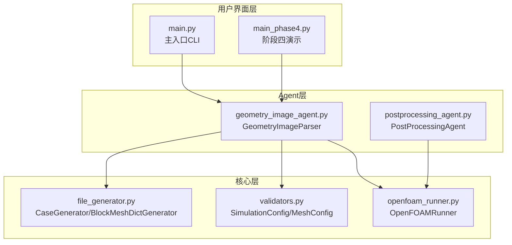
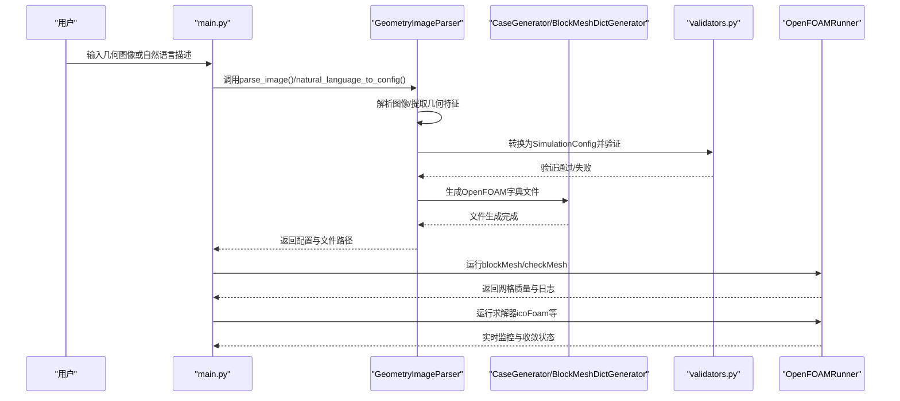
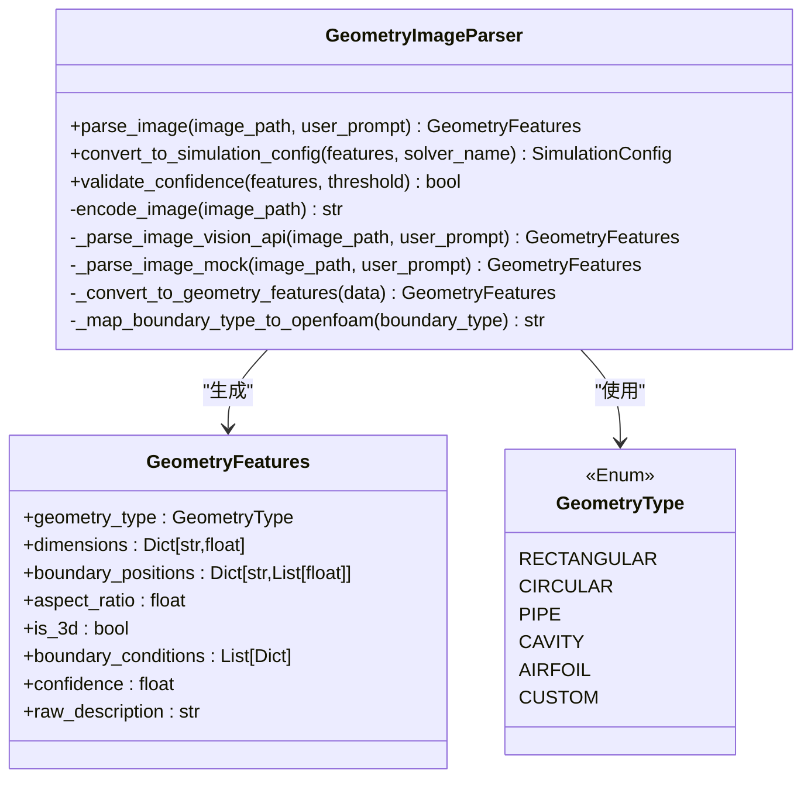
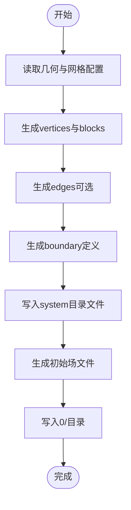
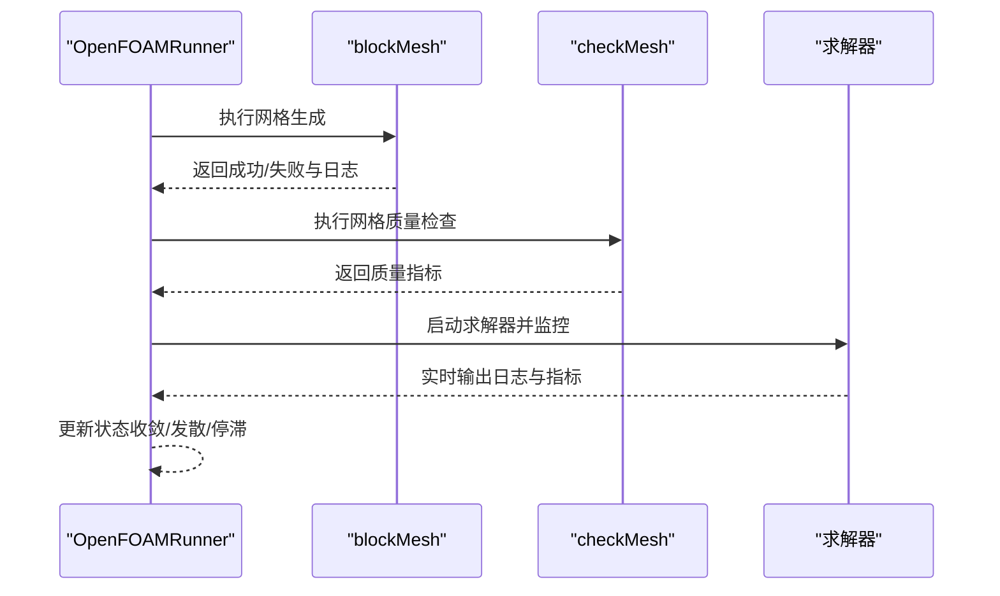
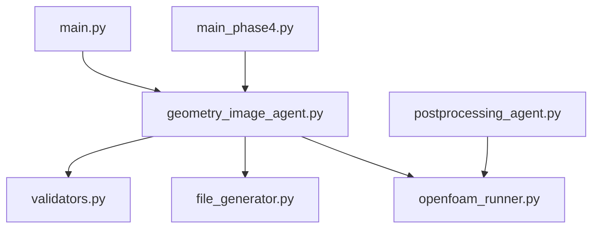

# GeometryImageAgent几何图像Agent

<cite>
**本文档引用的文件**
- [geometry_image_agent.py](file://openfoam_ai/agents/geometry_image_agent.py)
- [__init__.py](file://openfoam_ai/agents/__init__.py)
- [file_generator.py](file://openfoam_ai/core/file_generator.py)
- [validators.py](file://openfoam_ai/core/validators.py)
- [openfoam_runner.py](file://openfoam_ai/core/openfoam_runner.py)
- [main.py](file://openfoam_ai/main.py)
- [README.md](file://openfoam_ai/README.md)
- [main_phase4.py](file://openfoam_ai/main_phase4.py)
- [postprocessing_agent.py](file://openfoam_ai/agents/postprocessing_agent.py)
</cite>

## 目录
1. [简介](#简介)
2. [项目结构](#项目结构)
3. [核心组件](#核心组件)
4. [架构总览](#架构总览)
5. [详细组件分析](#详细组件分析)
6. [依赖关系分析](#依赖关系分析)
7. [性能考虑](#性能考虑)
8. [故障排除指南](#故障排除指南)
9. [结论](#结论)
10. [附录](#附录)

## 简介
GeometryImageAgent是一个多模态几何图像解析Agent，旨在从CAD图纸、照片或其他图像源中提取几何信息，并将其转换为OpenFOAM可识别的几何格式与仿真配置。该Agent结合了视觉模型（如OpenAI GPT-4 Vision）与严格的Pydantic物理约束，确保生成的几何参数与边界条件满足CFD仿真要求。其核心能力包括：
- 几何类型识别（矩形、圆形、管道、方腔、翼型、自定义）
- 尺寸与边界位置提取
- 置信度评估与质量控制
- 与OpenFOAM几何生成器（blockMesh）和求解器（icoFoam等）的无缝集成
- 输出OpenFOAM字典文件与初始场

## 项目结构
该项目采用模块化分层设计，GeometryImageAgent位于agents层，与core层的文件生成器、验证器、OpenFOAM运行器协同工作；UI层提供交互入口；阶段四演示展示了图像解析与后处理Agent的集成效果。

图表来源
- [geometry_image_agent.py:1-533](file://openfoam_ai/agents/geometry_image_agent.py#L1-L533)
- [file_generator.py:1-635](file://openfoam_ai/core/file_generator.py#L1-L635)
- [validators.py:1-441](file://openfoam_ai/core/validators.py#L1-L441)
- [openfoam_runner.py:1-548](file://openfoam_ai/core/openfoam_runner.py#L1-L548)
- [main.py:1-251](file://openfoam_ai/main.py#L1-L251)
- [main_phase4.py:1-266](file://openfoam_ai/main_phase4.py#L1-L266)
- [postprocessing_agent.py:1-200](file://openfoam_ai/agents/postprocessing_agent.py#L1-L200)

章节来源
- [README.md:104-150](file://openfoam_ai/README.md#L104-L150)

## 核心组件
- GeometryImageParser：图像解析器，负责将CAD/照片等图像转换为几何特征与OpenFOAM配置。
- GeometryFeatures：几何特征数据结构，包含几何类型、尺寸、边界位置、长宽比、是否三维、边界条件、置信度与原始描述。
- CaseGenerator/BlockMeshDictGenerator：将几何与网格配置转换为OpenFOAM字典文件。
- SimulationConfig/MeshConfig：基于Pydantic的硬约束验证，确保网格分辨率、长宽比、求解器选择等符合宪法要求。
- OpenFOAMRunner：封装OpenFOAM命令执行、日志解析与状态监控。

章节来源
- [geometry_image_agent.py:46-76](file://openfoam_ai/agents/geometry_image_agent.py#L46-L76)
- [file_generator.py:35-137](file://openfoam_ai/core/file_generator.py#L35-L137)
- [validators.py:18-87](file://openfoam_ai/core/validators.py#L18-L87)

## 架构总览
下图展示GeometryImageAgent从图像输入到OpenFOAM字典生成与求解器执行的端到端流程。

图表来源
- [geometry_image_agent.py:184-268](file://openfoam_ai/agents/geometry_image_agent.py#L184-L268)
- [file_generator.py:506-532](file://openfoam_ai/core/file_generator.py#L506-L532)
- [validators.py:179-274](file://openfoam_ai/core/validators.py#L179-L274)
- [openfoam_runner.py:77-198](file://openfoam_ai/core/openfoam_runner.py#L77-L198)

## 详细组件分析

### 几何图像解析器（GeometryImageParser）
- 角色与职责
  - 接收图像输入，调用视觉模型提取几何特征（类型、尺寸、边界位置、长宽比、是否三维、边界条件、置信度）。
  - 将解析结果转换为OpenFOAM可用的几何与网格配置，并通过Pydantic验证。
  - 支持Mock模式，便于离线测试与演示。
- 关键流程
  - 图像编码与请求构建（Mock或OpenAI API）。
  - JSON响应提取与结构化解析。
  - 几何特征到SimulationConfig的映射与边界条件类型转换。
  - 置信度阈值验证与质量提示。
- 系统提示词与约束
  - 严格遵循“AI约束宪法”，包括网格分辨率、长宽比、边界条件推断与输出格式要求。
  - 对模糊或信息缺失的图像降低置信度并给出改进建议。

图表来源
- [geometry_image_agent.py:46-76](file://openfoam_ai/agents/geometry_image_agent.py#L46-L76)
- [geometry_image_agent.py:78-533](file://openfoam_ai/agents/geometry_image_agent.py#L78-L533)

章节来源
- [geometry_image_agent.py:78-533](file://openfoam_ai/agents/geometry_image_agent.py#L78-L533)

### 几何特征数据结构（GeometryFeatures）
- 字段说明
  - geometry_type：几何类型枚举（矩形、圆形、管道、方腔、翼型、自定义）。
  - dimensions：尺寸字典（长度、宽度、高度、直径）。
  - boundary_positions：边界位置坐标（入口、出口、壁面等）。
  - aspect_ratio：长宽比。
  - is_3d：是否三维。
  - boundary_conditions：边界条件列表（名称、类型、位置、建议条件）。
  - confidence：解析置信度（0-1）。
  - raw_description：原始图像描述文本。
- 设计要点
  - 与OpenFOAM边界条件类型映射，确保生成的配置可直接使用。
  - 通过Pydantic验证，保证后续文件生成与求解器执行的稳定性。

章节来源
- [geometry_image_agent.py:65-76](file://openfoam_ai/agents/geometry_image_agent.py#L65-L76)

### OpenFOAM字典文件生成（CaseGenerator/BlockMeshDictGenerator）
- 功能概述
  - 将几何与网格配置转换为OpenFOAM字典文件（blockMeshDict、controlDict、fvSchemes、fvSolution、transportProperties）。
  - 生成初始场（U、p等）与边界条件。
- 关键流程
  - 读取几何维度与网格分辨率。
  - 生成vertices、blocks、edges与boundary定义。
  - 写入system与constant目录。
  - 生成初始场文件（0/U、0/p等）。

图表来源
- [file_generator.py:35-137](file://openfoam_ai/core/file_generator.py#L35-L137)
- [file_generator.py:506-603](file://openfoam_ai/core/file_generator.py#L506-L603)

章节来源
- [file_generator.py:35-137](file://openfoam_ai/core/file_generator.py#L35-L137)
- [file_generator.py:506-603](file://openfoam_ai/core/file_generator.py#L506-L603)

### Pydantic物理约束验证（validators.py）
- 功能概述
  - MeshConfig：网格分辨率与长宽比验证，确保满足宪法要求（二维≥400单元，三维≥8000单元）。
  - SolverConfig：求解器名称、时间范围与时间步长验证，估计库朗数并给出安全建议。
  - BoundaryCondition：边界类型与值的验证。
  - SimulationConfig：完整仿真配置的根级验证，检查物理类型与求解器匹配、禁止组合、物性参数范围等。
- 集成方式
  - GeometryImageParser在生成SimulationConfig后调用Pydantic模型进行验证，失败时抛出异常并提示改进。

章节来源
- [validators.py:18-87](file://openfoam_ai/core/validators.py#L18-L87)
- [validators.py:90-155](file://openfoam_ai/core/validators.py#L90-L155)
- [validators.py:179-274](file://openfoam_ai/core/validators.py#L179-L274)

### OpenFOAM命令执行与监控（openfoam_runner.py）
- 功能概述
  - 封装blockMesh、checkMesh与求解器执行，捕获日志并解析库朗数、残差等指标。
  - 实时监控求解状态（收敛、发散、停滞），支持停止与清理。
- 关键流程
  - 运行blockMesh生成网格。
  - 运行checkMesh检查网格质量（非正交性、偏斜度、长宽比）。
  - 运行求解器并逐行解析日志，输出状态与指标。
  - 提供清理算例（保留网格）功能。

图表来源
- [openfoam_runner.py:77-198](file://openfoam_ai/core/openfoam_runner.py#L77-L198)
- [openfoam_runner.py:303-345](file://openfoam_ai/core/openfoam_runner.py#L303-L345)
- [openfoam_runner.py:347-387](file://openfoam_ai/core/openfoam_runner.py#L347-L387)

章节来源
- [openfoam_runner.py:44-198](file://openfoam_ai/core/openfoam_runner.py#L44-L198)

### 阶段四演示与后处理Agent集成
- 阶段四演示（main_phase4.py）
  - 展示GeometryImageParser的Mock模式使用，解析几何图像并输出特征。
  - 展示PostProcessingAgent的自然语言绘图解析、PyVista脚本生成与执行（Mock模式）。
- 后处理Agent（postprocessing_agent.py）
  - 解析自然语言绘图需求（等值线、流线、矢量、截面等）。
  - 生成PyVista脚本并输出高分辨率矢量图（PDF/SVG/PNG/VTK）。
  - 支持Mock模式，便于在无PyVista环境下测试。

章节来源
- [main_phase4.py:37-71](file://openfoam_ai/main_phase4.py#L37-L71)
- [postprocessing_agent.py:108-200](file://openfoam_ai/agents/postprocessing_agent.py#L108-L200)

## 依赖关系分析
- 模块耦合
  - GeometryImageParser依赖validators.py进行配置验证，依赖file_generator.py生成OpenFOAM字典文件。
  - main.py与main_phase4.py分别作为CLI入口与阶段四演示入口，统一调度Agent与Runner。
  - postprocessing_agent.py与openfoam_runner.py配合，实现后处理与可视化闭环。
- 外部依赖
  - OpenAI API（可选，Mock模式下无需）。
  - PIL与numpy（图像处理与数组操作）。
  - PyVista（后处理Agent，Mock模式下可禁用）。
  - Jinja2（字典模板渲染，file_generator.py内部使用）。

图表来源
- [geometry_image_agent.py:34-43](file://openfoam_ai/agents/geometry_image_agent.py#L34-L43)
- [file_generator.py:6-8](file://openfoam_ai/core/file_generator.py#L6-L8)
- [openfoam_runner.py:6-13](file://openfoam_ai/core/openfoam_runner.py#L6-L13)
- [main.py:19-21](file://openfoam_ai/main.py#L19-L21)
- [main_phase4.py:20-34](file://openfoam_ai/main_phase4.py#L20-L34)
- [postprocessing_agent.py:23-33](file://openfoam_ai/agents/postprocessing_agent.py#L23-L33)

## 性能考虑
- 置信度阈值：默认置信度阈值为0.7，低于阈值时建议用户提供更清晰图像或补充尺寸标注。
- 网格分辨率：根据几何类型自动推断网格分辨率（三维最小20x20x20，二维最小20x20），确保满足宪法要求（二维≥400，三维≥8000）。
- 库朗数控制：求解器时间步长与网格尺寸共同决定库朗数，建议通过减小时间步长满足安全限制。
- 并发与I/O：文件生成与命令执行采用顺序流程，避免并发冲突；日志写入采用异步流式处理，提升稳定性。

[本节为一般性指导，无需特定文件引用]

## 故障排除指南
- OpenAI API不可用
  - 现象：初始化失败，自动切换到Mock模式。
  - 处理：设置api_key=None或安装openai包；Mock模式下仍可进行配置生成与文件输出。
- OpenFOAM环境未安装
  - 现象：命令未找到或权限不足。
  - 处理：确保OpenFOAM已安装并加入PATH；在Docker容器内运行项目。
- 配置验证失败（Pydantic）
  - 现象：网格数过少、长宽比过大、求解器与物理类型不匹配等。
  - 处理：调整几何尺寸与网格分辨率，选择合适的求解器；参考宪法规则进行修正。
- 图像质量不佳
  - 现象：置信度低、边界位置不准确。
  - 处理：提供清晰图像、标注尺寸、包含比例尺；必要时使用更高分辨率图像。

章节来源
- [geometry_image_agent.py:162-169](file://openfoam_ai/agents/geometry_image_agent.py#L162-L169)
- [openfoam_runner.py:127-142](file://openfoam_ai/core/openfoam_runner.py#L127-L142)
- [README.md:208-237](file://openfoam_ai/README.md#L208-L237)

## 结论
GeometryImageAgent通过多模态图像解析与严格的物理约束验证，实现了从CAD/照片到OpenFOAM可执行算例的自动化流程。其Mock模式与阶段四演示确保了在无外部API或无PyVista环境下的可用性。结合Pydantic硬约束与OpenFOAM命令封装，该Agent为CFD仿真提供了可靠、可追溯且可扩展的基础设施。

[本节为总结性内容，无需特定文件引用]

## 附录

### 图像质量要求
- 清晰度：图像应足够清晰，以便识别几何边界与标注。
- 比例尺：建议包含比例尺或已知尺寸标注，便于尺寸估算。
- 边界标识：入口、出口、壁面等边界应明确区分。
- 背景对比：背景与几何图形对比度应良好，避免重叠或遮挡。

[本节为一般性指导，无需特定文件引用]

### 处理流程与输出格式规范
- 处理流程
  - 图像上传或自然语言描述输入。
  - 几何特征提取与置信度评估。
  - OpenFOAM配置生成与验证。
  - OpenFOAM字典文件生成与初始场创建。
  - 网格生成、质量检查与求解器执行。
- 输出格式
  - OpenFOAM字典文件：system/blockMeshDict、system/controlDict、system/fvSchemes、system/fvSolution、constant/transportProperties。
  - 初始场：0/U、0/p（以及温度场T，如适用）。
  - 后处理输出：PDF/SVG/PNG/VTK（由PostProcessingAgent生成，Mock模式下可模拟）。

章节来源
- [file_generator.py:506-603](file://openfoam_ai/core/file_generator.py#L506-L603)
- [postprocessing_agent.py:48-54](file://openfoam_ai/agents/postprocessing_agent.py#L48-L54)

### 实际使用示例
- CLI交互模式：通过main.py启动，输入自然语言描述或图像路径，系统自动创建算例并执行网格生成与求解器运行。
- 阶段四演示：通过main_phase4.py运行几何图像解析与后处理演示，展示Mock模式下的完整流程。

章节来源
- [main.py:37-173](file://openfoam_ai/main.py#L37-L173)
- [main_phase4.py:198-246](file://openfoam_ai/main_phase4.py#L198-L246)