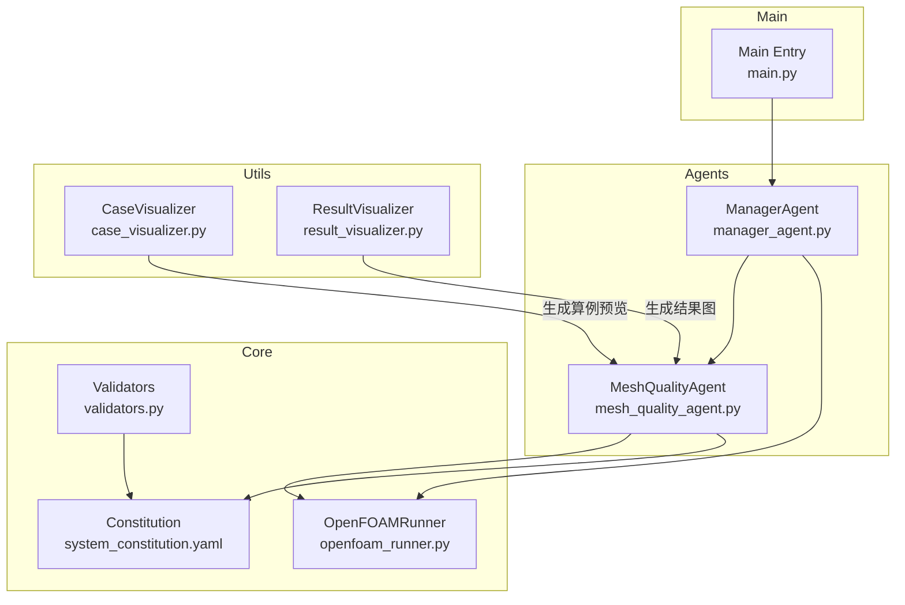
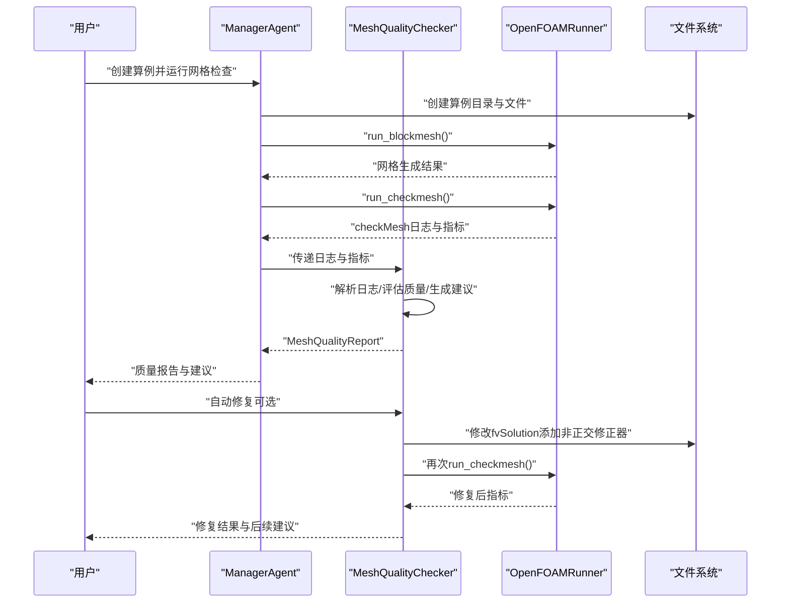
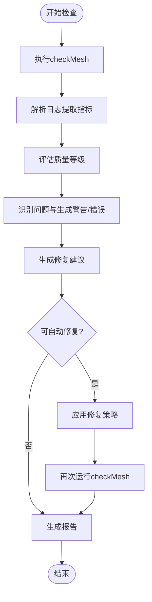
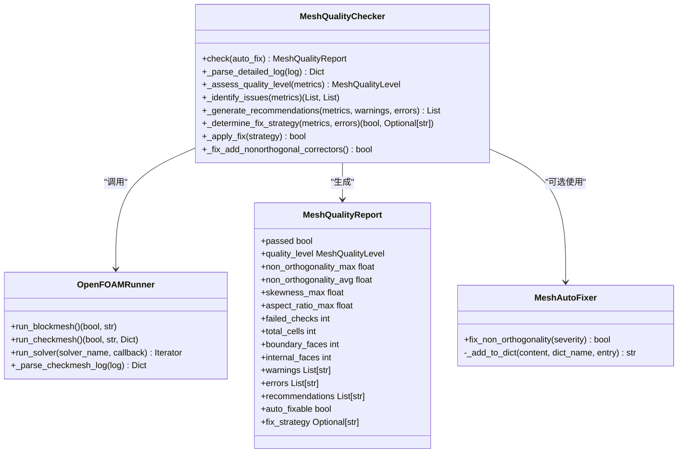

# MeshQualityAgent网格质量Agent

<cite>
**本文引用的文件**
- [mesh_quality_agent.py](file://openfoam_ai/agents/mesh_quality_agent.py)
- [openfoam_runner.py](file://openfoam_ai/core/openfoam_runner.py)
- [system_constitution.yaml](file://openfoam_ai/config/system_constitution.yaml)
- [validators.py](file://openfoam_ai/core/validators.py)
- [case_visualizer.py](file://openfoam_ai/utils/case_visualizer.py)
- [result_visualizer.py](file://openfoam_ai/utils/result_visualizer.py)
- [manager_agent.py](file://openfoam_ai/agents/manager_agent.py)
- [main.py](file://openfoam_ai/main.py)
</cite>

## 目录
1. [简介](#简介)
2. [项目结构](#项目结构)
3. [核心组件](#核心组件)
4. [架构总览](#架构总览)
5. [详细组件分析](#详细组件分析)
6. [依赖关系分析](#依赖关系分析)
7. [性能考量](#性能考量)
8. [故障排查指南](#故障排查指南)
9. [结论](#结论)
10. [附录](#附录)

## 简介
MeshQualityAgent是OpenFOAM AI Agent体系中的网格质量评估与自动修复Agent，负责：
- 基于OpenFOAM的checkMesh结果进行网格质量评估
- 识别非正交性、偏斜度、长宽比等关键指标的异常
- 生成质量等级与问题清单，并给出修复建议
- 支持自动修复策略（如添加非正交修正器）
- 与OpenFOAM网格生成器集成，形成“检查-评估-修复-再检查”的质量反馈闭环
- 提供可视化与报告能力，辅助用户理解与改进网格质量

## 项目结构
MeshQualityAgent位于agents子模块，与核心执行器、配置与验证模块协同工作，形成完整的网格质量保障链路。

图表来源
- [mesh_quality_agent.py](file://openfoam_ai/agents/mesh_quality_agent.py)
- [openfoam_runner.py](file://openfoam_ai/core/openfoam_runner.py)
- [system_constitution.yaml](file://openfoam_ai/config/system_constitution.yaml)
- [validators.py](file://openfoam_ai/core/validators.py)
- [case_visualizer.py](file://openfoam_ai/utils/case_visualizer.py)
- [result_visualizer.py](file://openfoam_ai/utils/result_visualizer.py)
- [manager_agent.py](file://openfoam_ai/agents/manager_agent.py)
- [main.py](file://openfoam_ai/main.py)

章节来源
- [mesh_quality_agent.py](file://openfoam_ai/agents/mesh_quality_agent.py)
- [openfoam_runner.py](file://openfoam_ai/core/openfoam_runner.py)
- [system_constitution.yaml](file://openfoam_ai/config/system_constitution.yaml)
- [validators.py](file://openfoam_ai/core/validators.py)
- [case_visualizer.py](file://openfoam_ai/utils/case_visualizer.py)
- [result_visualizer.py](file://openfoam_ai/utils/result_visualizer.py)
- [manager_agent.py](file://openfoam_ai/agents/manager_agent.py)
- [main.py](file://openfoam_ai/main.py)

## 核心组件
- MeshQualityChecker：网格质量检查器，负责执行checkMesh、解析日志、评估质量等级、生成问题与建议、判定自动修复可行性并实施修复。
- MeshQualityReport：网格质量报告数据结构，承载评估结果、统计信息、问题与建议、自动修复策略等。
- MeshAutoFixer：网格自动修复器，提供针对非正交性问题的修复策略（增强非正交修正器）。
- OpenFOAMRunner：OpenFOAM命令执行器，封装blockMesh、checkMesh、求解器运行与日志解析，为MeshQualityChecker提供基础能力。
- 架构约束（system_constitution.yaml）：提供网格质量阈值、求解器标准、物理约束等硬性规则，作为评估与修复的依据。
- 可视化工具：CaseVisualizer与ResultVisualizer，用于生成算例预览与仿真结果图，辅助理解网格质量与流动特性。

章节来源
- [mesh_quality_agent.py](file://openfoam_ai/agents/mesh_quality_agent.py)
- [openfoam_runner.py](file://openfoam_ai/core/openfoam_runner.py)
- [system_constitution.yaml](file://openfoam_ai/config/system_constitution.yaml)
- [validators.py](file://openfoam_ai/core/validators.py)
- [case_visualizer.py](file://openfoam_ai/utils/case_visualizer.py)
- [result_visualizer.py](file://openfoam_ai/utils/result_visualizer.py)

## 架构总览
MeshQualityAgent在系统中的位置与交互如下：

图表来源
- [manager_agent.py](file://openfoam_ai/agents/manager_agent.py)
- [mesh_quality_agent.py](file://openfoam_ai/agents/mesh_quality_agent.py)
- [openfoam_runner.py](file://openfoam_ai/core/openfoam_runner.py)

## 详细组件分析

### MeshQualityChecker：网格质量检查与修复
- 职责
  - 执行checkMesh并解析日志，提取非正交性、偏斜度、长宽比、失败检查数等指标
  - 基于阈值与宪法规则评估质量等级（优秀/良好/可接受/较差/严重）
  - 识别问题并生成警告/错误列表
  - 生成修复建议与自动修复策略
  - 支持自动修复（如添加非正交修正器），并进行修复后的二次检查
- 关键阈值与规则
  - 非正交性：警告阈值70°，严重阈值85°
  - 偏斜度：警告阈值4.0，严重阈值10.0
  - 长宽比：警告阈值100，严重阈值1000
  - 网格数量：宪法要求2D≥400单元，3D≥8000单元
- 评估流程
  - 优先级：失败检查数>0 或 非正交性>严重阈值 或 偏斜度/长宽比>严重阈值 → 严重
  - 其次：非正交性>警告阈值 或 偏斜度>警告阈值 → 较差
  - 再次：长宽比>警告阈值 → 可接受
  - 否则：根据非正交性与偏斜度进一步细分等级
- 自动修复策略
  - 仅当非正交性>警告阈值且无严重错误时，可自动添加非正交修正器
  - 修复后自动重新运行checkMesh进行验证

图表来源
- [mesh_quality_agent.py](file://openfoam_ai/agents/mesh_quality_agent.py)

章节来源
- [mesh_quality_agent.py](file://openfoam_ai/agents/mesh_quality_agent.py)

### OpenFOAMRunner：网格与求解器执行器
- 职责
  - 封装OpenFOAM命令执行（blockMesh、checkMesh、求解器）
  - 捕获与解析日志，提取checkMesh质量指标
  - 实时解析求解器日志，提取库朗数、残差等指标
  - 提供求解器监控与状态判断（收敛/发散/停滞/完成）
- 与MeshQualityChecker的关系
  - MeshQualityChecker通过OpenFOAMRunner获取checkMesh日志与指标
  - 修复后可再次调用run_checkmesh进行验证

章节来源
- [openfoam_runner.py](file://openfoam_ai/core/openfoam_runner.py)

### 架构约束与验证：system_constitution.yaml
- 提供网格质量阈值、求解器标准、物理约束等硬性规则
- MeshQualityChecker与Validators均依赖此文件进行评估与验证
- 例如：网格长宽比上限、最小网格数、非正交性上限等

章节来源
- [system_constitution.yaml](file://openfoam_ai/config/system_constitution.yaml)
- [validators.py](file://openfoam_ai/core/validators.py)

### 可视化与报告：CaseVisualizer与ResultVisualizer
- CaseVisualizer：生成算例预览图，包含几何/网格示意、边界条件、初始流场、参数摘要与预期结果示意
- ResultVisualizer：生成仿真结果图，包含速度/压力云图、流线图、涡量图与收敛监控图
- 与MeshQualityAgent的协作
  - MeshQualityChecker可结合可视化工具输出网格质量相关的可视化报告（如局部放大、问题区域标注）

章节来源
- [case_visualizer.py](file://openfoam_ai/utils/case_visualizer.py)
- [result_visualizer.py](file://openfoam_ai/utils/result_visualizer.py)

### 与ManagerAgent与主入口的集成
- ManagerAgent协调创建、运行与状态管理，MeshQualityAgent作为其子流程参与网格质量检查与修复
- main.py提供交互与演示入口，便于快速体验网格质量检查与修复流程

章节来源
- [manager_agent.py](file://openfoam_ai/agents/manager_agent.py)
- [main.py](file://openfoam_ai/main.py)

## 依赖关系分析

图表来源
- [mesh_quality_agent.py](file://openfoam_ai/agents/mesh_quality_agent.py)
- [openfoam_runner.py](file://openfoam_ai/core/openfoam_runner.py)

章节来源
- [mesh_quality_agent.py](file://openfoam_ai/agents/mesh_quality_agent.py)
- [openfoam_runner.py](file://openfoam_ai/core/openfoam_runner.py)

## 性能考量
- 日志解析复杂度
  - 正则匹配与字符串解析的时间复杂度与日志长度线性相关；checkMesh日志通常较小，影响有限
- 自动修复成本
  - 修改fvSolution文件为I/O操作，开销极低
- 修复后二次检查
  - 重复运行checkMesh带来额外时间成本，但能显著提升可靠性
- 建议
  - 对大规模算例，可在修复后仅输出关键指标摘要，减少冗余日志输出
  - 对频繁修复场景，可考虑缓存上次检查结果，避免重复解析

## 故障排查指南
- 常见问题与定位
  - OpenFOAM命令未找到：检查PATH与OpenFOAM安装
  - fvSolution缺失：自动修复失败，需手动检查system目录
  - 严重网格质量问题：自动修复不可用，需人工调整网格参数
- 建议流程
  - 优先查看MeshQualityReport中的错误与建议
  - 若自动修复失败，参考建议进行手动调整
  - 使用CaseVisualizer生成预览图，辅助定位几何与网格问题
  - 使用ResultVisualizer生成结果图，验证修复效果

章节来源
- [mesh_quality_agent.py](file://openfoam_ai/agents/mesh_quality_agent.py)
- [openfoam_runner.py](file://openfoam_ai/core/openfoam_runner.py)
- [case_visualizer.py](file://openfoam_ai/utils/case_visualizer.py)
- [result_visualizer.py](file://openfoam_ai/utils/result_visualizer.py)

## 结论
MeshQualityAgent通过标准化的网格质量评估与自动修复流程，有效降低了网格质量问题对仿真稳定性的影响。结合OpenFOAMRunner的高质量日志解析与架构约束规则，实现了可解释、可验证、可自动化的网格质量保障体系。配合可视化工具，能够直观呈现网格质量状况与修复效果，为用户提供清晰的决策依据。

## 附录

### 网格质量指标与阈值说明
- 非正交性（°）
  - 警告阈值：70
  - 严重阈值：85
- 偏斜度
  - 警告阈值：4.0
  - 严重阈值：10.0
- 长宽比
  - 警告阈值：100
  - 严重阈值：1000
- 网格数量（宪法要求）
  - 2D：≥400单元
  - 3D：≥8000单元

章节来源
- [mesh_quality_agent.py](file://openfoam_ai/agents/mesh_quality_agent.py)
- [system_constitution.yaml](file://openfoam_ai/config/system_constitution.yaml)

### 实际案例与优化建议示例
- 案例：方腔驱动流
  - 使用CaseVisualizer生成几何与网格预览，确认网格密度与边界条件
  - 运行MeshQualityChecker，若出现非正交性偏高，建议添加非正交修正器
  - 修复后二次检查，确保质量等级达到良好以上
- 案例：圆柱绕流
  - 使用ResultVisualizer生成涡量图与流线图，验证卡门涡街形态
  - 若长宽比偏高，建议在边界层区域渐进式加密
  - 结合CaseVisualizer的预期结果示意，对比仿真结果与理论期望

章节来源
- [case_visualizer.py](file://openfoam_ai/utils/case_visualizer.py)
- [result_visualizer.py](file://openfoam_ai/utils/result_visualizer.py)
- [mesh_quality_agent.py](file://openfoam_ai/agents/mesh_quality_agent.py)