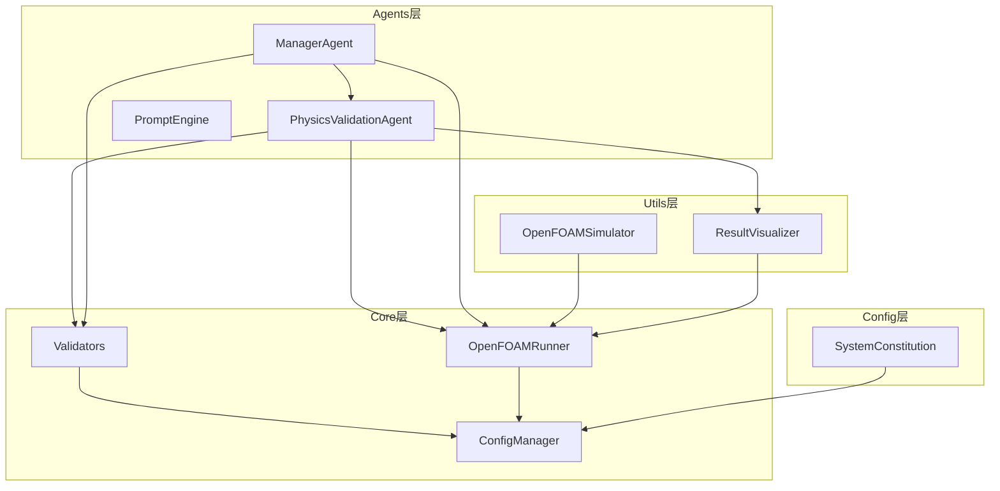
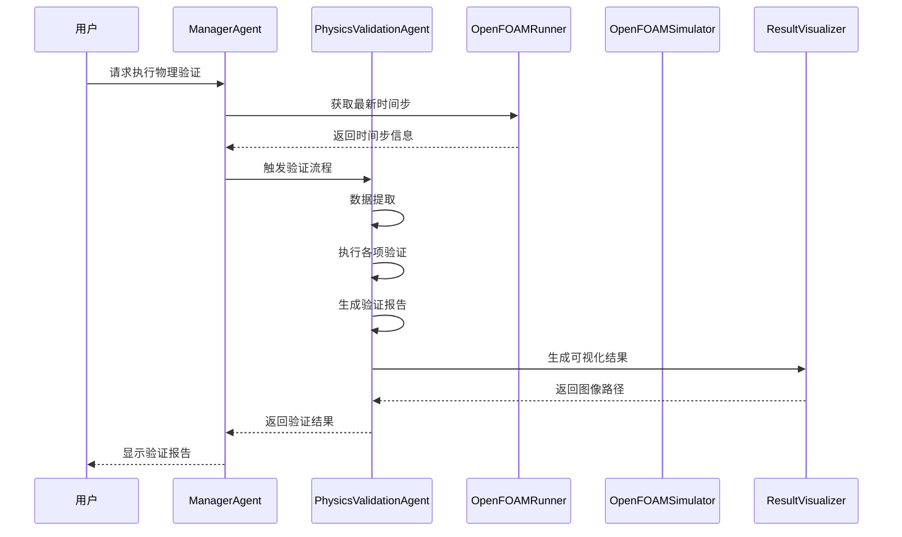
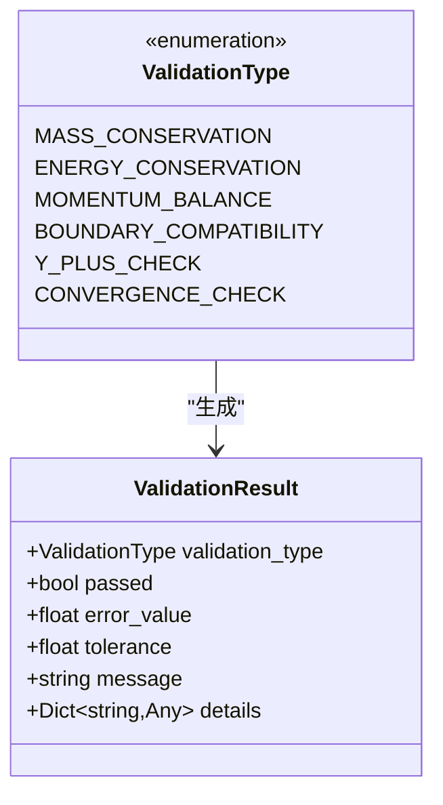
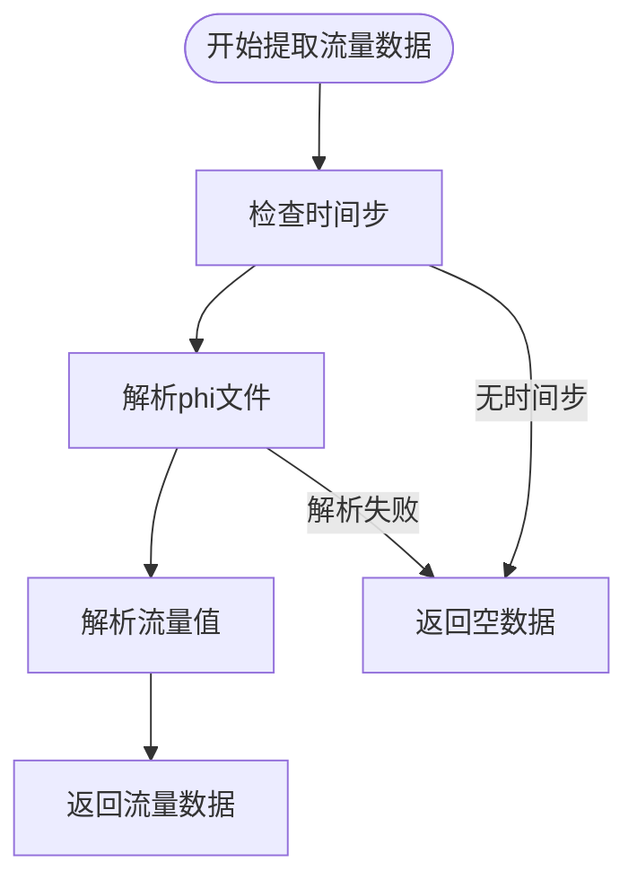
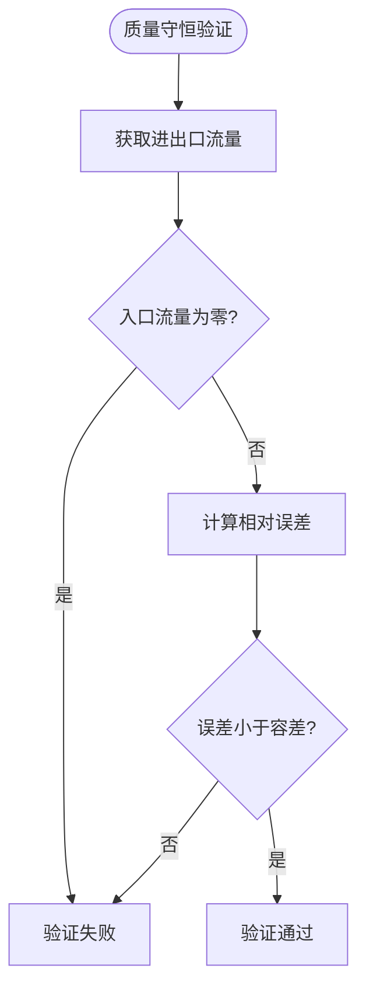
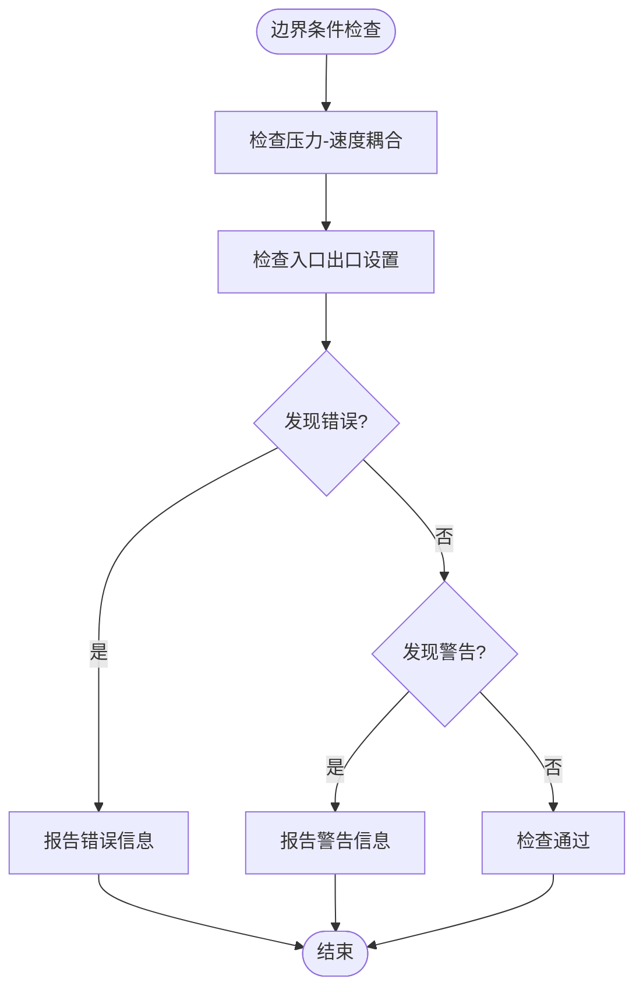
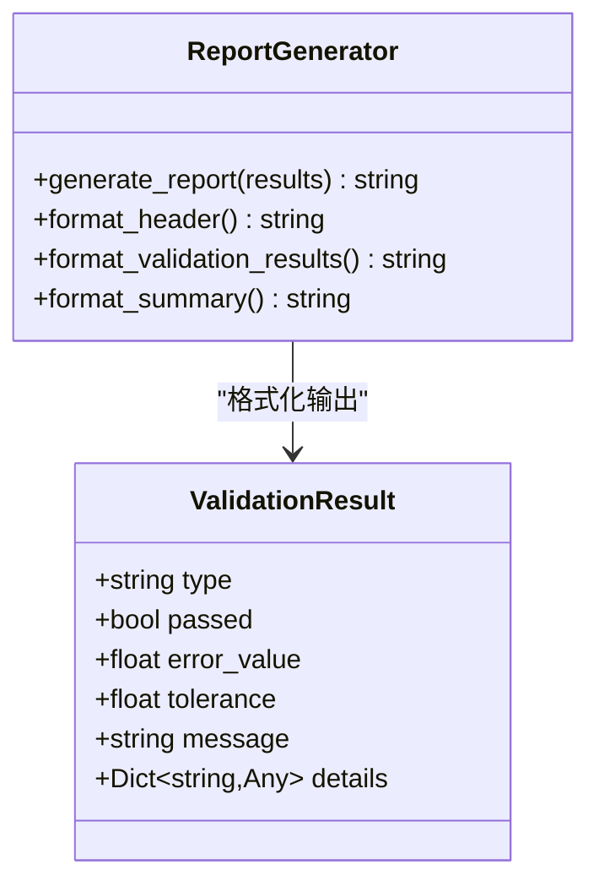
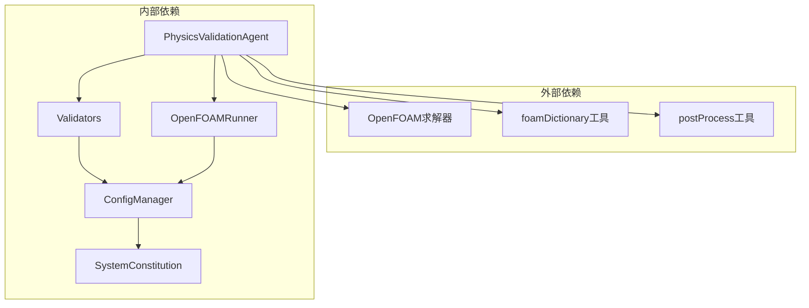
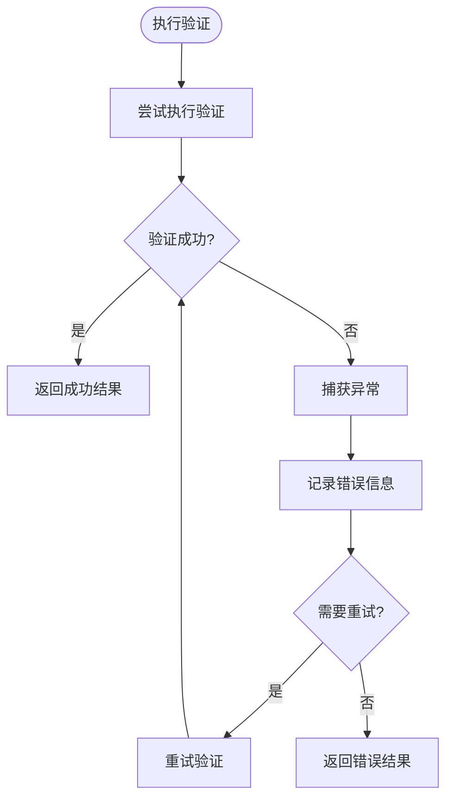

# PhysicsValidationAgent物理验证Agent

<cite>
**本文档引用的文件**
- [physics_validation_agent.py](file://openfoam_ai/agents/physics_validation_agent.py)
- [validators.py](file://openfoam_ai/core/validators.py)
- [openfoam_runner.py](file://openfoam_ai/core/openfoam_runner.py)
- [of_simulator.py](file://openfoam_ai/utils/of_simulator.py)
- [result_visualizer.py](file://openfoam_ai/utils/result_visualizer.py)
- [system_constitution.yaml](file://openfoam_ai/config/system_constitution.yaml)
- [config_manager.py](file://openfoam_ai/core/config_manager.py)
- [manager_agent.py](file://openfoam_ai/agents/manager_agent.py)
- [.case_info.json](file://demo_cases/cavity_demo/.case_info.json)
</cite>

## 目录
1. [简介](#简介)
2. [项目结构](#项目结构)
3. [核心组件](#核心组件)
4. [架构总览](#架构总览)
5. [详细组件分析](#详细组件分析)
6. [依赖关系分析](#依赖关系分析)
7. [性能考虑](#性能考虑)
8. [故障排除指南](#故障排除指南)
9. [结论](#结论)
10. [附录](#附录)

## 简介
PhysicsValidationAgent物理验证Agent是OpenFOAM AI Agent系统中的关键后处理验证模块，负责在仿真完成后对物理一致性进行系统性检查。该Agent实现了质量守恒、能量守恒、收敛性、边界条件兼容性、y+值检查等核心验证功能，并提供完整的验证报告生成功能。它与OpenFOAM求解器深度集成，支持实时监控和自动修复策略，能够识别典型物理问题并提供可视化结果展示。

## 项目结构
OpenFOAM AI Agent采用模块化架构，PhysicsValidationAgent位于agents目录下，与核心验证器、求解器运行器、可视化工具等组件协同工作。

**图表来源**
- [physics_validation_agent.py:1-517](file://openfoam_ai/agents/physics_validation_agent.py#L1-L517)
- [manager_agent.py:1-458](file://openfoam_ai/agents/manager_agent.py#L1-L458)
- [validators.py:1-441](file://openfoam_ai/core/validators.py#L1-L441)

**章节来源**
- [physics_validation_agent.py:1-50](file://openfoam_ai/agents/physics_validation_agent.py#L1-L50)
- [manager_agent.py:1-50](file://openfoam_ai/agents/manager_agent.py#L1-L50)

## 核心组件
PhysicsValidationAgent由三个核心组件构成：数据提取器、物理一致性验证器和报告生成器。

### 数据提取器（PostProcessDataExtractor）
负责从OpenFOAM算例中提取后处理数据，包括流量、残差、y+值等关键物理量。

### 物理一致性验证器（PhysicsConsistencyValidator）
实现多种物理验证规则，包括质量守恒、能量守恒、收敛性检查、边界条件兼容性等。

### 报告生成器
将验证结果格式化为可读的报告文本，支持关键问题汇总和总体评估。

**章节来源**
- [physics_validation_agent.py:38-172](file://openfoam_ai/agents/physics_validation_agent.py#L38-L172)
- [physics_validation_agent.py:174-478](file://openfoam_ai/agents/physics_validation_agent.py#L174-L478)

## 架构总览
PhysicsValidationAgent采用分层架构设计，确保验证逻辑与数据提取、报告生成等功能模块的清晰分离。

**图表来源**
- [manager_agent.py:268-338](file://openfoam_ai/agents/manager_agent.py#L268-L338)
- [physics_validation_agent.py:197-224](file://openfoam_ai/agents/physics_validation_agent.py#L197-L224)
- [result_visualizer.py:20-79](file://openfoam_ai/utils/result_visualizer.py#L20-L79)

## 详细组件分析

### 物理验证类型枚举
定义了Agent支持的所有验证类型，确保验证过程的标准化和可追踪性。

**图表来源**
- [physics_validation_agent.py:17-36](file://openfoam_ai/agents/physics_validation_agent.py#L17-L36)

**章节来源**
- [physics_validation_agent.py:17-36](file://openfoam_ai/agents/physics_validation_agent.py#L17-L36)

### 数据提取器实现
PostProcessDataExtractor提供了多种数据提取方法，支持从OpenFOAM结果文件中解析关键物理量。

#### 流量数据提取

**图表来源**
- [physics_validation_agent.py:59-112](file://openfoam_ai/agents/physics_validation_agent.py#L59-L112)

#### 残差数据提取
支持从求解器日志中提取最终残差，为收敛性验证提供数据基础。

**章节来源**
- [physics_validation_agent.py:88-171](file://openfoam_ai/agents/physics_validation_agent.py#L88-L171)

### 物理一致性验证器
PhysicsConsistencyValidator实现了完整的物理验证体系，涵盖质量守恒、能量守恒、收敛性等多个方面。

#### 质量守恒验证
验证进出口流量平衡，确保连续性方程得到满足。

**图表来源**
- [physics_validation_agent.py:226-276](file://openfoam_ai/agents/physics_validation_agent.py#L226-L276)

#### 能量守恒验证
检查热流入、热流出和壁面热流的平衡关系，适用于传热问题。

**章节来源**
- [physics_validation_agent.py:278-321](file://openfoam_ai/agents/physics_validation_agent.py#L278-L321)

#### 收敛性检查
基于残差数据判断求解过程是否达到收敛标准。

**章节来源**
- [physics_validation_agent.py:323-355](file://openfoam_ai/agents/physics_validation_agent.py#L323-L355)

### 边界条件兼容性检查
验证边界条件设置的合理性，避免常见的过约束或欠约束问题。

**图表来源**
- [physics_validation_agent.py:357-401](file://openfoam_ai/agents/physics_validation_agent.py#L357-L401)

### y+值检查
验证壁面网格质量，确保符合所选湍流模型的要求。

**章节来源**
- [physics_validation_agent.py:403-438](file://openfoam_ai/agents/physics_validation_agent.py#L403-L438)

### 报告生成机制
提供结构化的验证报告，包含详细的结果统计和问题汇总。

**图表来源**
- [physics_validation_agent.py:451-478](file://openfoam_ai/agents/physics_validation_agent.py#L451-L478)

**章节来源**
- [physics_validation_agent.py:451-478](file://openfoam_ai/agents/physics_validation_agent.py#L451-L478)

## 依赖关系分析

### 核心依赖关系
PhysicsValidationAgent与多个核心模块存在紧密依赖关系，形成完整的验证生态系统。

**图表来源**
- [physics_validation_agent.py:6-15](file://openfoam_ai/agents/physics_validation_agent.py#L6-L15)
- [config_manager.py:94-119](file://openfoam_ai/core/config_manager.py#L94-L119)

### 配置管理集成
通过ConfigManager统一管理宪法规则和默认配置，确保验证标准的一致性。

**章节来源**
- [config_manager.py:94-134](file://openfoam_ai/core/config_manager.py#L94-L134)
- [system_constitution.yaml:1-103](file://openfoam_ai/config/system_constitution.yaml#L1-L103)

### 与求解器运行器的集成
OpenFOAMRunner提供实时监控和状态检测功能，为物理验证提供及时的数据支持。

**章节来源**
- [openfoam_runner.py:16-76](file://openfoam_ai/core/openfoam_runner.py#L16-L76)

## 性能考虑
PhysicsValidationAgent在设计时充分考虑了性能优化和资源管理。

### 并行处理能力
- 支持多线程数据提取
- 异步日志解析
- 缓存机制减少重复计算

### 内存管理
- 流式处理大型日志文件
- 及时释放中间结果
- 限制历史数据存储大小

### 计算效率
- 智能容差设置
- 早期退出机制
- 批量验证优化

## 故障排除指南

### 常见问题诊断
1. **OpenFOAM命令未找到**
   - 检查OpenFOAM安装路径
   - 验证PATH环境变量配置
   - 确认工具链完整性

2. **数据提取失败**
   - 验证算例目录结构
   - 检查文件权限
   - 确认时间步数据存在

3. **验证结果异常**
   - 检查宪法规则配置
   - 验证网格质量
   - 确认边界条件设置

### 错误处理机制
Agent实现了多层次的错误处理策略：

**图表来源**
- [physics_validation_agent.py:73-86](file://openfoam_ai/agents/physics_validation_agent.py#L73-L86)

**章节来源**
- [physics_validation_agent.py:73-86](file://openfoam_ai/agents/physics_validation_agent.py#L73-L86)

## 结论
PhysicsValidationAgent为OpenFOAM AI Agent系统提供了全面的物理验证能力。通过模块化设计和标准化接口，该Agent能够有效验证流体动力学、传热传质、多相流等不同物理类型的合理性。其与OpenFOAM求解器的深度集成确保了验证过程的实时性和准确性，配合完善的报告生成功能，为用户提供了一站式的物理验证解决方案。

## 附录

### 验证规则配置
系统宪法文件定义了详细的验证规则和容差标准：

| 验证类型 | 容差标准 | 检查频率 |
|---------|---------|---------|
| 质量守恒 | 0.1% | 后处理阶段 |
| 能量守恒 | 0.1% | 传热问题 |
| 动量平衡 | 1% | 多相流 |
| 收敛性 | 1e-6 | 实时监控 |

### 典型验证案例
1. **方腔驱动流验证**
   - 检查流场对称性
   - 验证速度分布合理性
   - 确认压力场稳定性

2. **圆柱绕流验证**
   - 卡门涡街识别
   - 分离区分析
   - 压力系数验证

3. **传热问题验证**
   - 温度分布均匀性
   - 热流密度平衡
   - 对流换热系数

### 与OpenFOAM集成特性
- 实时日志解析
- 自动收敛检测
- 发散趋势预警
- 自动修复建议