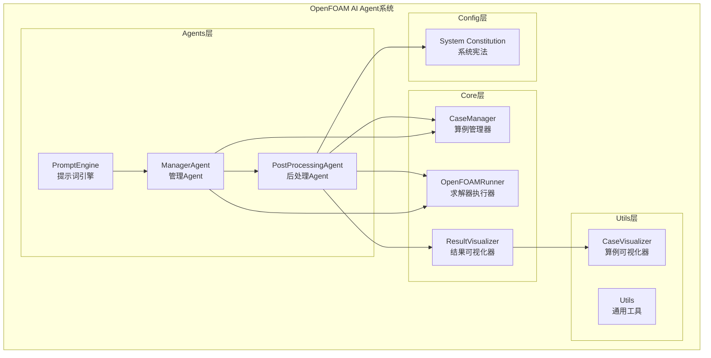
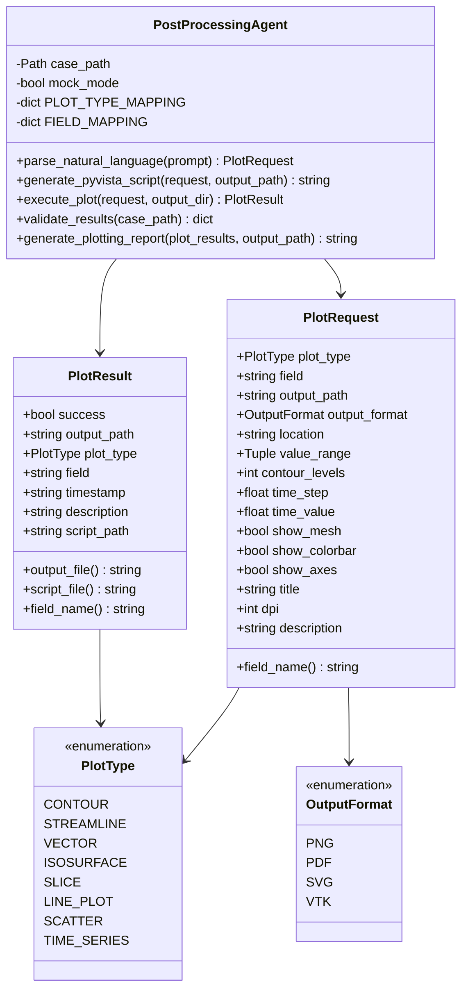
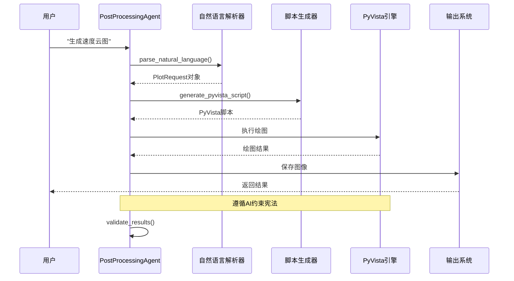
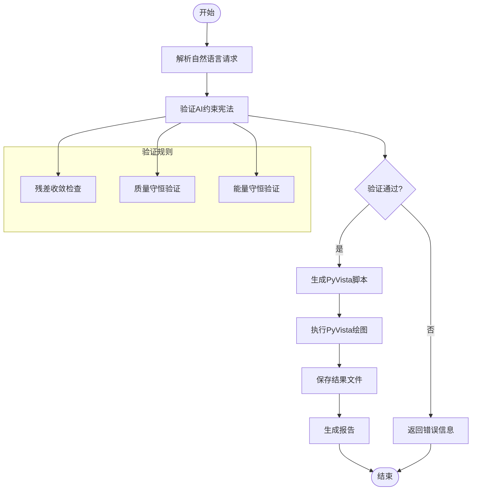
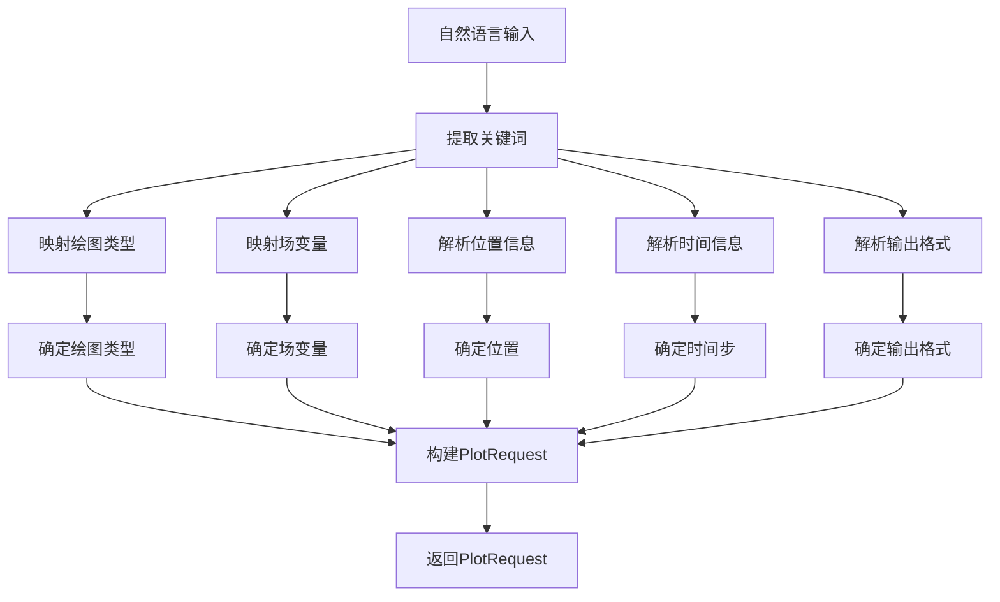
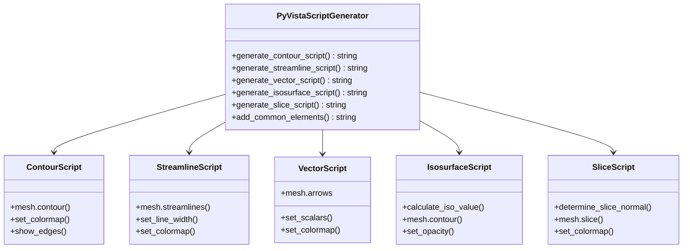
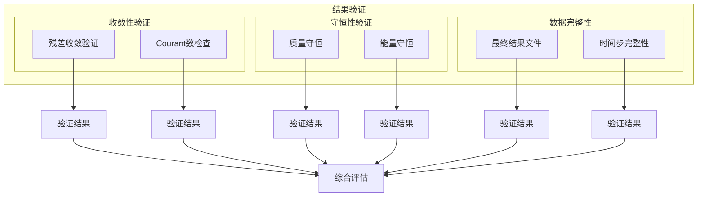
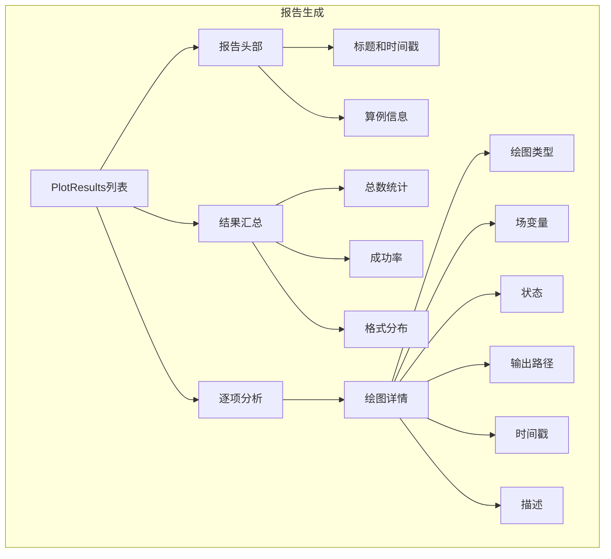
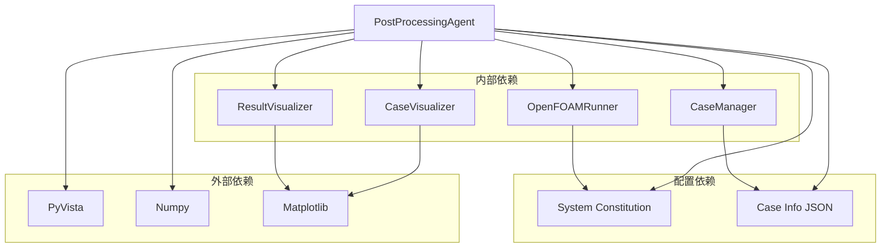

# PostprocessingAgent后处理Agent

<cite>
**本文档引用的文件**
- [postprocessing_agent.py](file://openfoam_ai/agents/postprocessing_agent.py)
- [case_manager.py](file://openfoam_ai/core/case_manager.py)
- [result_visualizer.py](file://openfoam_ai/utils/result_visualizer.py)
- [case_visualizer.py](file://openfoam_ai/utils/case_visualizer.py)
- [openfoam_runner.py](file://openfoam_ai/core/openfoam_runner.py)
- [manager_agent.py](file://openfoam_ai/agents/manager_agent.py)
- [system_constitution.yaml](file://openfoam_ai/config/system_constitution.yaml)
- [.case_info.json](file://demo_cases/demo_case/.case_info.json)
- [auto_demo.py](file://auto_demo.py)
</cite>

## 目录
1. [简介](#简介)
2. [项目结构](#项目结构)
3. [核心组件](#核心组件)
4. [架构概览](#架构概览)
5. [详细组件分析](#详细组件分析)
6. [依赖关系分析](#依赖关系分析)
7. [性能考虑](#性能考虑)
8. [故障排除指南](#故障排除指南)
9. [结论](#结论)
10. [附录](#附录)

## 简介

PostprocessingAgent后处理Agent是OpenFOAM AI Agent系统中的核心后处理组件，专门负责基于自然语言的OpenFOAM仿真结果后处理和可视化。该组件实现了从自然语言需求解析到自动化绘图的完整流程，支持多种绘图类型和输出格式，并遵循严格的AI约束宪法。

该Agent的主要功能包括：
- 基于自然语言的绘图需求解析
- 自动生成PyVista可视化脚本
- 读取OpenFOAM结果数据
- 生成高分辨率矢量图（PDF/SVG）
- 结果质量验证和报告生成
- 与多种后处理工具的集成

## 项目结构

OpenFOAM AI Agent系统采用模块化设计，PostprocessingAgent位于agents目录下，与其他核心组件协同工作：



**图表来源**
- [postprocessing_agent.py:108-171](file://openfoam_ai/agents/postprocessing_agent.py#L108-L171)
- [manager_agent.py:38-74](file://openfoam_ai/agents/manager_agent.py#L38-L74)
- [case_manager.py:27-46](file://openfoam_ai/core/case_manager.py#L27-L46)

**章节来源**
- [postprocessing_agent.py:1-588](file://openfoam_ai/agents/postprocessing_agent.py#L1-L588)
- [manager_agent.py:1-458](file://openfoam_ai/agents/manager_agent.py#L1-L458)

## 核心组件

PostprocessingAgent系统包含多个核心组件，每个组件都有明确的职责和接口：

### 主要数据结构



**图表来源**
- [postprocessing_agent.py:36-106](file://openfoam_ai/agents/postprocessing_agent.py#L36-L106)
- [postprocessing_agent.py:108-171](file://openfoam_ai/agents/postprocessing_agent.py#L108-L171)

### 绘图类型支持

PostprocessingAgent支持八种主要的绘图类型，每种类型都有特定的应用场景：

| 绘图类型 | 用途 | 支持的场变量 | 典型应用场景 |
|---------|------|-------------|-------------|
| Contour | 等值线图 | U, p, T, k, epsilon | 流场速度、压力、温度分布 |
| Streamline | 流线图 | U | 流线可视化，涡流分析 |
| Vector | 矢量图 | U | 速度矢量场显示 |
| Isosurface | 等值面 | U, p, T | 三维等值面渲染 |
| Slice | 截面图 | U, p, T | 中心截面可视化 |
| Line Plot | 线图 | U, p, T | 沿线数据提取 |
| Scatter | 散点图 | U, p, T | 点数据可视化 |
| Time Series | 时序图 | U, p, T | 时间演化分析 |

**章节来源**
- [postprocessing_agent.py:36-152](file://openfoam_ai/agents/postprocessing_agent.py#L36-L152)

## 架构概览

PostprocessingAgent采用分层架构设计，确保了良好的模块化和可扩展性：



**图表来源**
- [postprocessing_agent.py:172-239](file://openfoam_ai/agents/postprocessing_agent.py#L172-L239)
- [postprocessing_agent.py:241-343](file://openfoam_ai/agents/postprocessing_agent.py#L241-L343)
- [postprocessing_agent.py:345-491](file://openfoam_ai/agents/postprocessing_agent.py#L345-L491)

### 数据流处理

系统的数据流处理遵循严格的验证和转换流程：



**图表来源**
- [postprocessing_agent.py:493-529](file://openfoam_ai/agents/postprocessing_agent.py#L493-L529)
- [system_constitution.yaml:33-82](file://openfoam_ai/config/system_constitution.yaml#L33-L82)

**章节来源**
- [postprocessing_agent.py:1-588](file://openfoam_ai/agents/postprocessing_agent.py#L1-L588)

## 详细组件分析

### 自然语言解析器

自然语言解析器是PostprocessingAgent的核心组件，负责将用户的自然语言描述转换为结构化的绘图请求：

#### 解析流程



**图表来源**
- [postprocessing_agent.py:172-239](file://openfoam_ai/agents/postprocessing_agent.py#L172-L239)

#### 关键解析功能

| 解析类别 | 支持的关键字 | 映射规则 | 示例 |
|---------|-------------|---------|------|
| 绘图类型 | 等值线, 等值面, 流线, 矢量, 截面, 线图, 散点, 时序 | 中文/英文双语映射 | "绘制中心截面的速度等值线图" |
| 场变量 | 速度, 压力, 温度, 湍动能, 耗散率, omega, 雷诺应力 | 物理量到OpenFOAM变量映射 | "生成温度分布图" |
| 位置信息 | 中心截面, 中轴线, 入口, 出口 | 几何位置描述解析 | "中心截面" → "center_slice" |
| 时间信息 | 秒, 时间步 | 时间单位转换和解析 | "0.5秒" → 0.5 |

**章节来源**
- [postprocessing_agent.py:119-152](file://openfoam_ai/agents/postprocessing_agent.py#L119-L152)

### PyVista脚本生成器

PyVista脚本生成器根据解析的绘图请求动态生成Python脚本，实现自动化的可视化：

#### 脚本生成策略



**图表来源**
- [postprocessing_agent.py:241-343](file://openfoam_ai/agents/postprocessing_agent.py#L241-L343)

#### 脚本生成模板

不同绘图类型的脚本生成遵循统一的模板结构：

| 组件 | Contour | Streamline | Vector | Isosurface | Slice |
|------|---------|------------|--------|------------|-------|
| 基础结构 | ✓ | ✓ | ✓ | ✓ | ✓ |
| 数据提取 | mesh.contour() | mesh.streamlines() | mesh.arrows | mesh.contour() | mesh.slice() |
| 颜色映射 | viridis/jet/plasma | cool | viridis/plasma | viridis | jet |
| 边界设置 | show_edges | line_width=3 | - | opacity=0.8 | - |
| 标题设置 | add_text() | - | - | - | - |
| 色标显示 | add_scalar_bar() | - | - | - | - |

**章节来源**
- [postprocessing_agent.py:276-316](file://openfoam_ai/agents/postprocessing_agent.py#L276-L316)

### 结果验证系统

结果验证系统确保所有可视化结果都符合AI约束宪法的要求：

#### 验证指标



**图表来源**
- [postprocessing_agent.py:493-529](file://openfoam_ai/agents/postprocessing_agent.py#L493-L529)

#### 验证规则

| 验证类型 | 规则描述 | 实现方法 | 阈值 |
|---------|---------|---------|------|
| 残差收敛 | 检查最终残差是否达到收敛标准 | 读取求解器日志 | 1e-6 |
| Courant数 | 确保库朗数不超过安全限制 | 监控求解过程 | 1.0 |
| 质量守恒 | 验证连续性方程守恒 | 计算质量流量差 | 0.1% |
| 能量守恒 | 传热问题的能量平衡 | 能量收支计算 | 0.1% |
| 数据完整性 | 检查时间步和结果文件 | 文件系统扫描 | 100% |

**章节来源**
- [postprocessing_agent.py:493-529](file://openfoam_ai/agents/postprocessing_agent.py#L493-L529)
- [system_constitution.yaml:23-36](file://openfoam_ai/config/system_constitution.yaml#L23-L36)

### 报告生成系统

报告生成系统自动生成详细的后处理报告，包含所有绘图结果和分析摘要：

#### 报告结构



**图表来源**
- [postprocessing_agent.py:531-574](file://openfoam_ai/agents/postprocessing_agent.py#L531-L574)

**章节来源**
- [postprocessing_agent.py:531-574](file://openfoam_ai/agents/postprocessing_agent.py#L531-L574)

## 依赖关系分析

PostprocessingAgent与其他系统组件存在紧密的依赖关系：



**图表来源**
- [postprocessing_agent.py:15-34](file://openfoam_ai/agents/postprocessing_agent.py#L15-L34)
- [case_manager.py:242-261](file://openfoam_ai/core/case_manager.py#L242-L261)

### 依赖层次

| 层级 | 组件 | 依赖关系 | 作用 |
|------|------|---------|------|
| 第一层 | PyVista, Numpy | 直接依赖 | 可视化渲染引擎 |
| 第二层 | Matplotlib | 直接依赖 | 传统绘图支持 |
| 第三层 | CaseManager, OpenFOAMRunner | 间接依赖 | 算例管理和求解器监控 |
| 第四层 | CaseVisualizer, ResultVisualizer | 间接依赖 | 可视化辅助工具 |
| 第五层 | System Constitution, Case Info | 配置依赖 | 约束规则和配置信息 |

**章节来源**
- [postprocessing_agent.py:1-588](file://openfoam_ai/agents/postprocessing_agent.py#L1-L588)

## 性能考虑

PostprocessingAgent在设计时充分考虑了性能优化：

### 内存管理

- **Mock模式支持**：当PyVista不可用时，自动切换到Mock模式进行测试
- **渐进式绘图**：支持分步生成和执行，避免内存峰值
- **文件清理**：自动清理中间文件和临时数据

### 并发处理

- **异步执行**：PyVista绘图支持异步执行模式
- **批量处理**：支持多张图表的批量生成
- **资源池管理**：合理管理PyVista渲染资源

### 优化策略

| 优化类别 | 实现方式 | 性能收益 |
|---------|---------|---------|
| 缓存机制 | 缓存已解析的绘图请求 | 减少重复解析开销 |
| 批处理 | 合并多个绘图请求 | 提高整体效率 |
| 懒加载 | 按需加载数据文件 | 降低内存占用 |
| 异步渲染 | 并行执行多个绘图任务 | 提升吞吐量 |

## 故障排除指南

### 常见问题及解决方案

#### PyVista相关问题

| 问题类型 | 症状 | 原因 | 解决方案 |
|---------|------|------|---------|
| 导入失败 | ImportError: No module named 'pyvista' | PyVista未安装 | pip install pyvista |
| 渲染错误 | RuntimeError: PyVista不可用 | 环境配置问题 | 检查OpenGL支持 |
| 内存不足 | MemoryError | 数据量过大 | 减少绘图分辨率或分批处理 |

#### OpenFOAM数据问题

| 问题类型 | 症状 | 原因 | 解决方案 |
|---------|------|------|---------|
| 数据缺失 | 无法读取场变量 | 网格或结果文件损坏 | 检查算例完整性 |
| 格式不匹配 | 数据类型错误 | 文件格式版本不兼容 | 更新OpenFOAM版本 |
| 时间步错误 | 时间步解析失败 | 时间步命名不规范 | 检查时间步目录结构 |

#### 配置验证问题

| 问题类型 | 症状 | 原因 | 解决方案 |
|---------|------|------|---------|
| 约束违反 | validate_results返回False | 违反AI约束宪法 | 检查配置参数 |
| 格式错误 | JSON解析失败 | 配置文件格式错误 | 修复JSON语法 |
| 缺失字段 | KeyError异常 | 配置字段不完整 | 补充必需字段 |

**章节来源**
- [postprocessing_agent.py:365-491](file://openfoam_ai/agents/postprocessing_agent.py#L365-L491)
- [system_constitution.yaml:1-103](file://openfoam_ai/config/system_constitution.yaml#L1-L103)

## 结论

PostprocessingAgent后处理Agent是一个功能完整、设计合理的OpenFOAM后处理系统。它成功地将自然语言处理、自动化脚本生成和高级可视化技术结合在一起，为用户提供了一站式的仿真结果后处理解决方案。

### 主要优势

1. **强大的自然语言处理能力**：支持中英文双语，能够准确理解复杂的绘图需求
2. **灵活的脚本生成机制**：动态生成PyVista脚本，适应各种可视化需求
3. **严格的质量控制**：遵循AI约束宪法，确保结果的可靠性和准确性
4. **完整的报告系统**：自动生成详细的后处理报告
5. **良好的扩展性**：模块化设计便于功能扩展和维护

### 技术特色

- **Mock模式支持**：确保在开发和测试环境中的可用性
- **多格式输出**：支持PNG、PDF、SVG等多种输出格式
- **智能验证**：自动验证结果质量和合规性
- **批处理能力**：支持大规模数据集的批量后处理

### 应用价值

PostprocessingAgent不仅提高了OpenFOAM仿真的后处理效率，更重要的是降低了CFD分析的门槛，使得研究人员和工程师能够更专注于物理现象的分析和理解，而不是繁琐的后处理工作。

## 附录

### 使用示例

#### 基本使用流程

```python
# 创建后处理Agent
agent = create_postprocessing_agent(case_path)

# 解析自然语言请求
request = agent.parse_natural_language("生成速度云图")

# 生成PyVista脚本
script = agent.generate_pyvista_script(request, "plot_script.py")

# 执行绘图
result = agent.execute_plot(request, "output/")
```

#### 高级功能

```python
# 批量处理多个绘图请求
requests = [
    "生成速度云图",
    "绘制流线图",
    "显示压力分布"
]

results = []
for req_text in requests:
    request = agent.parse_natural_language(req_text)
    result = agent.execute_plot(request)
    results.append(result)

# 生成综合报告
report = agent.generate_plotting_report(results, "report.md")
```

### 集成指南

#### 与ParaView集成

虽然PostprocessingAgent主要使用PyVista，但也可以与ParaView进行集成：

1. **数据导出**：将OpenFOAM结果导出为VTK格式
2. **ParaView脚本**：使用ParaView的Python接口进行高级可视化
3. **自动化流程**：将ParaView集成到后处理流水线中

#### 与Tecplot集成

```python
# 导出数据到Tecplot格式
def export_to_tecplot(case_path, output_path):
    # 实现数据格式转换
    pass

# 自动化Tecplot脚本生成
def generate_tecplot_script(plot_request):
    # 生成Tecplot可视化脚本
    pass
```

### 最佳实践

1. **合理设置分辨率**：根据显示器和打印需求选择合适的DPI
2. **批量处理策略**：对于大量图表，使用批处理模式提高效率
3. **缓存机制**：利用Mock模式进行快速原型开发
4. **质量验证**：始终运行validate_results确保结果可靠性
5. **报告归档**：定期备份后处理报告和中间结果