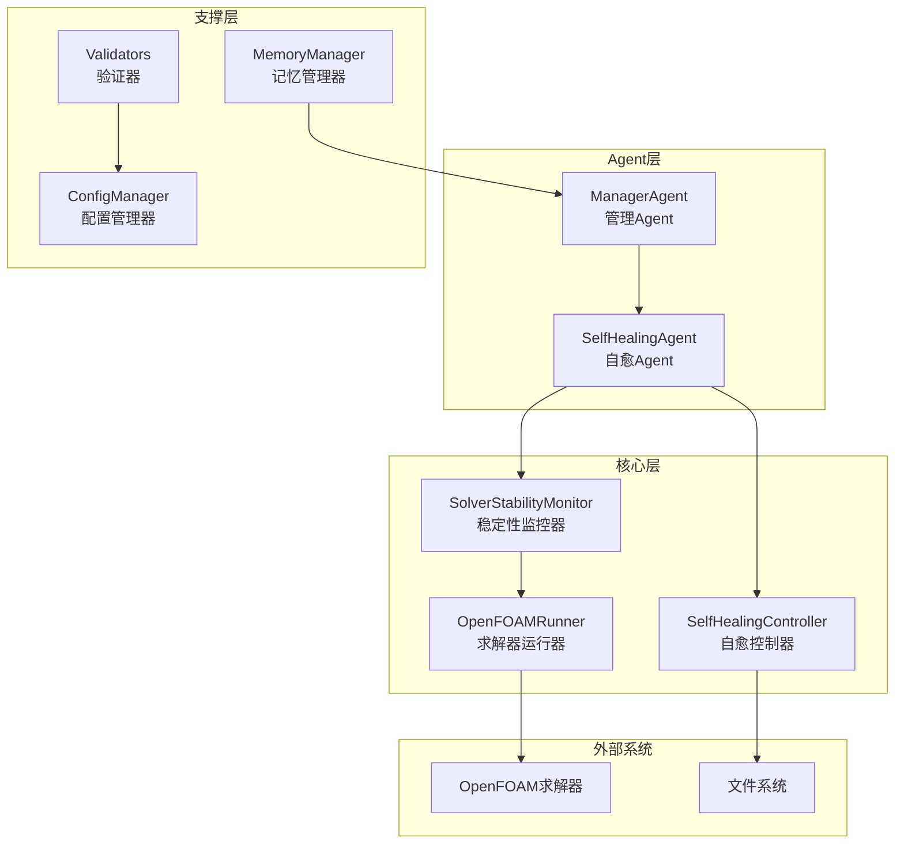
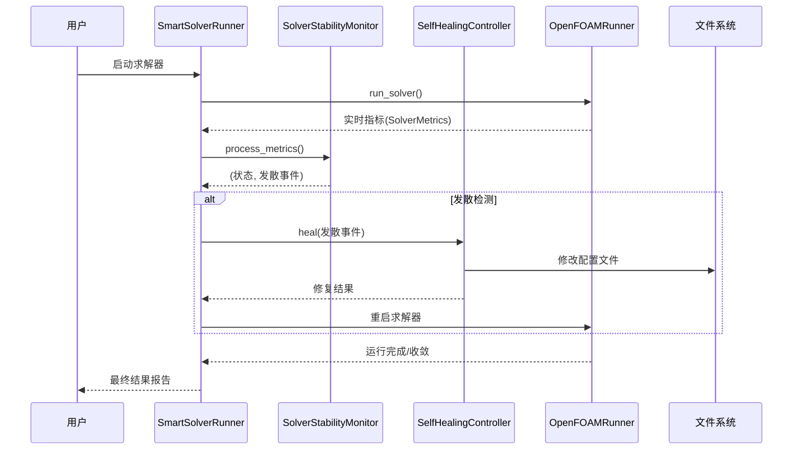
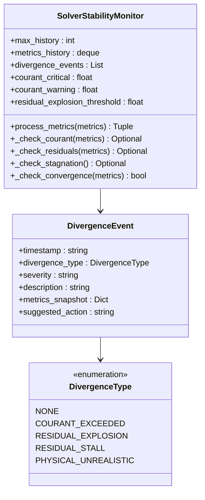
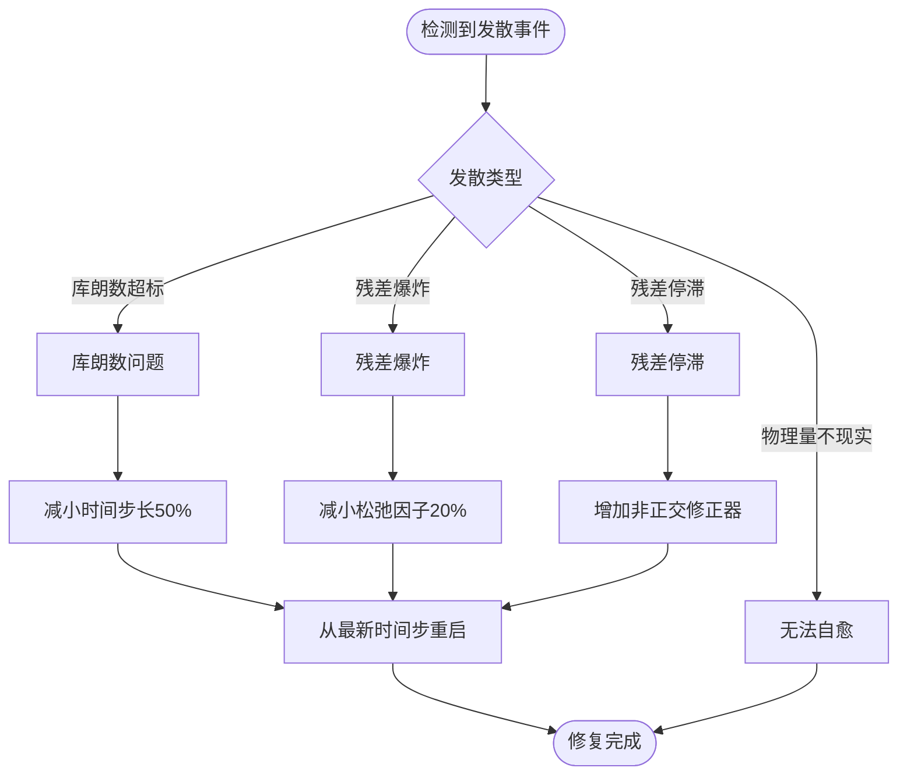
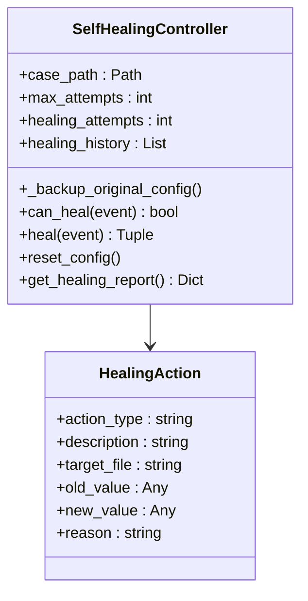
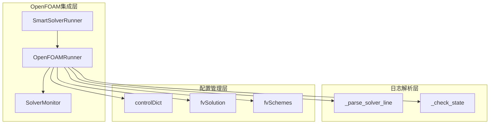
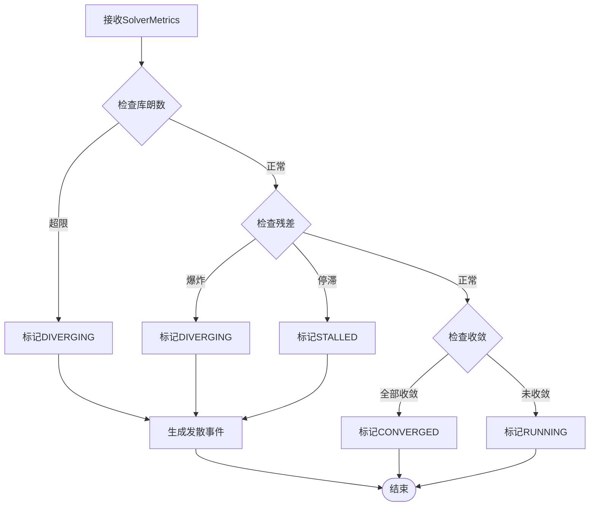
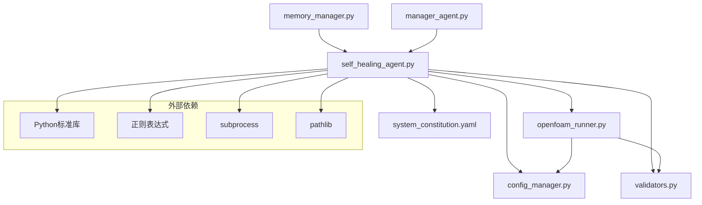

# SelfHealingAgent自愈Agent

<cite>
**本文档引用的文件**
- [self_healing_agent.py](file://openfoam_ai/agents/self_healing_agent.py)
- [openfoam_runner.py](file://openfoam_ai/core/openfoam_runner.py)
- [validators.py](file://openfoam_ai/core/validators.py)
- [config_manager.py](file://openfoam_ai/core/config_manager.py)
- [system_constitution.yaml](file://openfoam_ai/config/system_constitution.yaml)
- [memory_manager.py](file://openfoam_ai/memory/memory_manager.py)
- [manager_agent.py](file://openfoam_ai/agents/manager_agent.py)
- [main_phase2.py](file://openfoam_ai/main_phase2.py)
- [main.py](file://openfoam_ai/main.py)
</cite>

## 目录
1. [简介](#简介)
2. [项目结构](#项目结构)
3. [核心组件](#核心组件)
4. [架构总览](#架构总览)
5. [详细组件分析](#详细组件分析)
6. [依赖关系分析](#依赖关系分析)
7. [性能考虑](#性能考虑)
8. [故障排查指南](#故障排查指南)
9. [结论](#结论)
10. [附录](#附录)

## 简介
SelfHealingAgent自愈Agent是OpenFOAM AI Agent系统中的关键模块，负责在仿真过程中自动检测求解稳定性问题并执行相应的自愈修复策略。该Agent集成了实时监控、异常识别、自动修复和恢复机制，能够应对收敛失败、数值不稳定、计算中断等常见故障，并通过智能决策机制选择最优的修复方案。

该Agent的核心能力包括：
- 实时监控求解器运行状态
- 自动识别发散、停滞、爆炸等异常模式
- 基于规则的自愈修复策略
- 配置备份与恢复机制
- 修复历史记录与报告生成
- 与OpenFOAM求解器的深度集成

## 项目结构
OpenFOAM AI Agent采用模块化设计，SelfHealingAgent位于agents目录下，与核心运行器、验证器、配置管理器等组件协同工作。



**图表来源**
- [self_healing_agent.py:1-642](file://openfoam_ai/agents/self_healing_agent.py#L1-L642)
- [openfoam_runner.py:1-548](file://openfoam_ai/core/openfoam_runner.py#L1-L548)
- [manager_agent.py:1-458](file://openfoam_ai/agents/manager_agent.py#L1-L458)

**章节来源**
- [self_healing_agent.py:1-642](file://openfoam_ai/agents/self_healing_agent.py#L1-L642)
- [openfoam_runner.py:1-548](file://openfoam_ai/core/openfoam_runner.py#L1-L548)

## 核心组件
SelfHealingAgent由三个核心组件构成：稳定性监控器、自愈控制器和智能求解器运行器。

### 稳定性监控器（SolverStabilityMonitor）
负责实时解析求解器日志，检测各种发散模式并记录指标历史。

### 自愈控制器（SelfHealingController）
根据发散类型选择修复策略，自动调整求解器参数并从上次保存点重启。

### 智能求解器运行器（SmartSolverRunner）
集成监控和自愈功能，协调整个求解过程的执行。

**章节来源**
- [self_healing_agent.py:58-615](file://openfoam_ai/agents/self_healing_agent.py#L58-L615)

## 架构总览
SelfHealingAgent采用分层架构设计，实现了监控、决策和执行的分离。



**图表来源**
- [self_healing_agent.py:479-615](file://openfoam_ai/agents/self_healing_agent.py#L479-L615)
- [openfoam_runner.py:99-198](file://openfoam_ai/core/openfoam_runner.py#L99-L198)

## 详细组件分析

### 发散类型与检测机制
SelfHealingAgent定义了四种主要的发散类型：



**图表来源**
- [self_healing_agent.py:27-197](file://openfoam_ai/agents/self_healing_agent.py#L27-L197)

#### 库朗数检测
- **临界阈值**：超过5.0时立即判定为发散
- **警告阈值**：超过1.0且连续3次超标触发警告
- **趋势分析**：最近50步的库朗数变化趋势

#### 残差检测
- **残差爆炸**：任意变量残差超过1.0触发
- **残差停滞**：连续100步内残差无明显下降
- **收敛判断**：所有变量残差均低于1e-6

**章节来源**
- [self_healing_agent.py:114-196](file://openfoam_ai/agents/self_healing_agent.py#L114-L196)

### 自愈修复策略
自愈控制器针对不同类型的发散提供专门的修复策略：



**图表来源**
- [self_healing_agent.py:277-442](file://openfoam_ai/agents/self_healing_agent.py#L277-L442)

#### 库朗数问题修复
- **策略**：将deltaT减小至原来的50%
- **重启方式**：设置startFrom为latestTime
- **配置修改**：自动修改system/controlDict

#### 残差爆炸修复
- **策略**：将松弛因子减小20%，上限0.7
- **影响范围**：U、p、k、epsilon、omega等字段
- **配置修改**：自动修改system/fvSolution

#### 残差停滞修复
- **策略**：增加nNonOrthogonalCorrectors的数量
- **默认值**：从0增加到1
- **配置修改**：自动修改system/fvSolution

**章节来源**
- [self_healing_agent.py:302-441](file://openfoam_ai/agents/self_healing_agent.py#L302-L441)

### 配置备份与恢复机制
自愈控制器实现了完整的配置备份与恢复机制：



**图表来源**
- [self_healing_agent.py:243-476](file://openfoam_ai/agents/self_healing_agent.py#L243-L476)

#### 备份策略
- **备份文件**：controlDict、fvSolution、fvSchemes
- **备份位置**：case_path/system/.backup/
- **恢复机制**：reset_config()方法恢复到原始状态

#### 修复历史记录
- **记录内容**：修复类型、目标文件、前后值、原因
- **报告生成**：get_healing_report()提供完整修复历史
- **统计信息**：总尝试次数、最大尝试次数、动作列表

**章节来源**
- [self_healing_agent.py:252-476](file://openfoam_ai/agents/self_healing_agent.py#L252-L476)

### 与OpenFOAM求解器的集成
SelfHealingAgent与OpenFOAM求解器的集成体现在多个层面：



**图表来源**
- [openfoam_runner.py:99-427](file://openfoam_ai/core/openfoam_runner.py#L99-L427)

#### 日志解析机制
- **时间步解析**：提取Time = 数值
- **库朗数解析**：Courant Number mean/max
- **残差解析**：Solving for X, Initial residual = 数值
- **状态判断**：基于阈值判断发散/收敛

#### 实时监控接口
- **迭代器模式**：run_solver()返回实时指标
- **回调机制**：支持进度回调函数
- **异常处理**：完善的错误捕获和处理

**章节来源**
- [openfoam_runner.py:347-409](file://openfoam_ai/core/openfoam_runner.py#L347-L409)

### 智能决策机制
SelfHealingAgent实现了基于规则的智能决策机制：



**图表来源**
- [self_healing_agent.py:86-112](file://openfoam_ai/agents/self_healing_agent.py#L86-L112)

#### 决策规则
- **优先级**：库朗数 > 残差爆炸 > 残差停滞 > 收敛
- **阈值配置**：可配置的临界值和容忍度
- **趋势分析**：基于历史数据的趋势判断

#### 自愈策略选择
- **条件判断**：基于发散类型和严重程度
- **尝试限制**：最多3次自愈尝试
- **策略映射**：一对一的修复策略映射

**章节来源**
- [self_healing_agent.py:264-300](file://openfoam_ai/agents/self_healing_agent.py#L264-L300)

## 依赖关系分析



**图表来源**
- [self_healing_agent.py:17-25](file://openfoam_ai/agents/self_healing_agent.py#L17-L25)
- [openfoam_runner.py:6-14](file://openfoam_ai/core/openfoam_runner.py#L6-L14)

### 核心依赖关系
- **OpenFOAMRunner**：提供求解器执行和日志解析能力
- **ConfigManager**：提供配置加载和阈值管理
- **validators**：提供物理约束验证
- **system_constitution.yaml**：提供宪法规则和阈值配置

### 循环依赖检查
SelfHealingAgent采用单向依赖关系，避免了循环依赖问题：
- SelfHealingAgent → OpenFOAMRunner（直接依赖）
- OpenFOAMRunner → validators（间接依赖）
- SelfHealingAgent → ConfigManager（通过validators）

**章节来源**
- [self_healing_agent.py:17-25](file://openfoam_ai/agents/self_healing_agent.py#L17-L25)
- [openfoam_runner.py:6-14](file://openfoam_ai/core/openfoam_runner.py#L6-L14)

## 性能考虑
SelfHealingAgent在设计时充分考虑了性能因素：

### 内存管理
- **队列限制**：metrics_history使用deque并设置maxlen
- **历史窗口**：默认200步的历史记录
- **趋势分析窗口**：最近50步的数据分析

### 计算效率
- **增量解析**：只解析必要的日志行
- **早期退出**：检测到发散立即停止求解器
- **阈值缓存**：阈值从ConfigManager加载并缓存

### I/O优化
- **文件操作**：仅在必要时修改配置文件
- **日志写入**：异步写入求解器日志
- **备份策略**：只在初始化时创建备份

## 故障排查指南

### 常见问题诊断
1. **自愈失败**
   - 检查max_attempts配置
   - 验证配置文件权限
   - 确认OpenFOAM安装状态

2. **阈值不生效**
   - 检查system_constitution.yaml配置
   - 验证ConfigManager缓存
   - 确认环境变量设置

3. **日志解析失败**
   - 检查OpenFOAM版本兼容性
   - 验证日志格式
   - 确认字符编码

### 调试工具
- **详细日志**：启用DEBUG_MODE环境变量
- **配置导出**：使用dump_config()查看当前配置
- **状态检查**：通过get_healing_report()查看修复历史

**章节来源**
- [config_manager.py:205-218](file://openfoam_ai/core/config_manager.py#L205-L218)

## 结论
SelfHealingAgent自愈Agent为OpenFOAM AI Agent系统提供了强大的稳定性保障机制。通过实时监控、智能决策和自动修复，该Agent能够有效应对仿真过程中的各种异常情况，显著提高计算成功率和效率。

### 主要优势
- **全面的异常检测**：覆盖库朗数、残差爆炸、残差停滞等多种发散模式
- **智能修复策略**：针对不同问题提供专门的修复方案
- **完整的生命周期管理**：从检测到修复再到恢复的全流程管理
- **可配置的阈值系统**：基于宪法规则的灵活配置机制

### 技术特点
- **模块化设计**：清晰的职责分离和接口定义
- **可扩展性**：易于添加新的发散类型和修复策略
- **可靠性**：完善的错误处理和恢复机制
- **可观测性**：完整的日志记录和报告生成功能

## 附录

### 配置选项参考
- **max_attempts**：最大自愈尝试次数（默认3次）
- **courant_critical**：库朗数临界阈值（默认5.0）
- **courant_warning**：库朗数警告阈值（默认1.0）
- **residual_explosion_threshold**：残差爆炸阈值（默认1.0）
- **residual_stall_threshold**：残差停滞检测步数（默认100步）

### 使用示例
```python
# 基本使用
from agents.self_healing_agent import SmartSolverRunner

runner = SmartSolverRunner(case_path, enable_healing=True)
results = runner.run("icoFoam")

# 自定义阈值
monitor = SolverStabilityMonitor(max_history=300)
```

### 开发指南
- **添加新发散类型**：扩展DivergenceType枚举
- **实现新修复策略**：在SelfHealingController中添加新方法
- **自定义阈值**：修改system_constitution.yaml配置
- **集成新求解器**：扩展OpenFOAMRunner支持

**章节来源**
- [self_healing_agent.py:69-84](file://openfoam_ai/agents/self_healing_agent.py#L69-L84)
- [system_constitution.yaml:23-31](file://openfoam_ai/config/system_constitution.yaml#L23-L31)