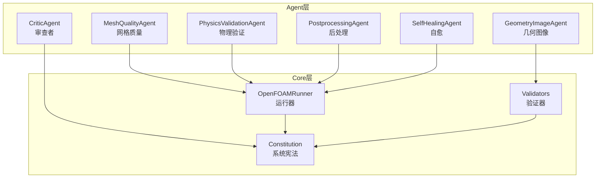
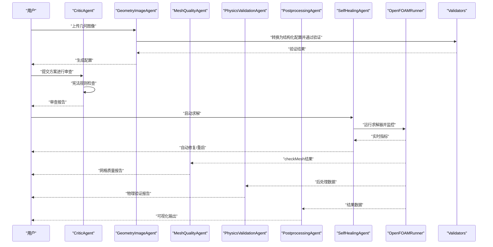
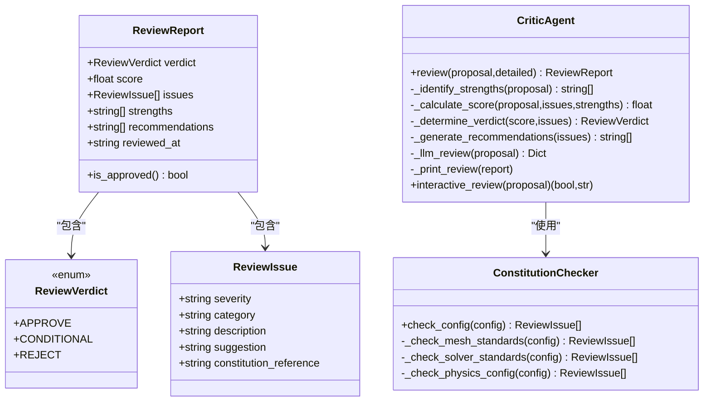
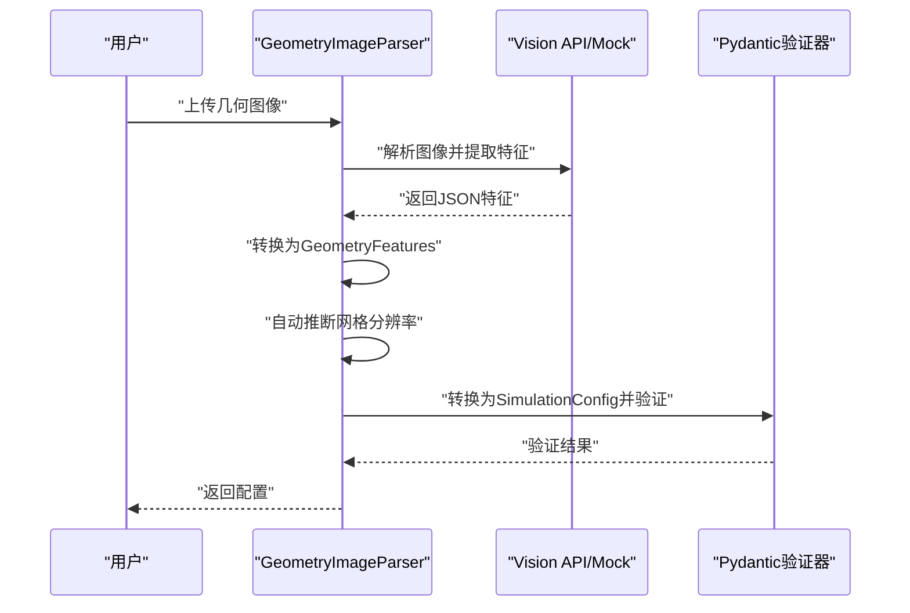
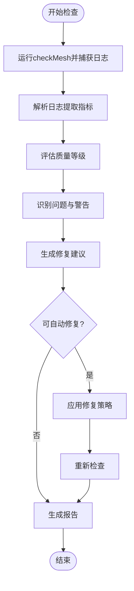
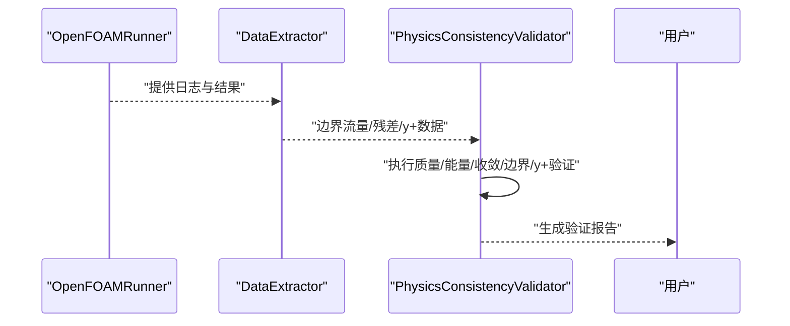
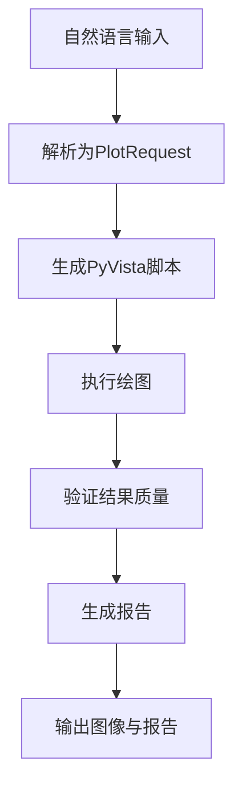
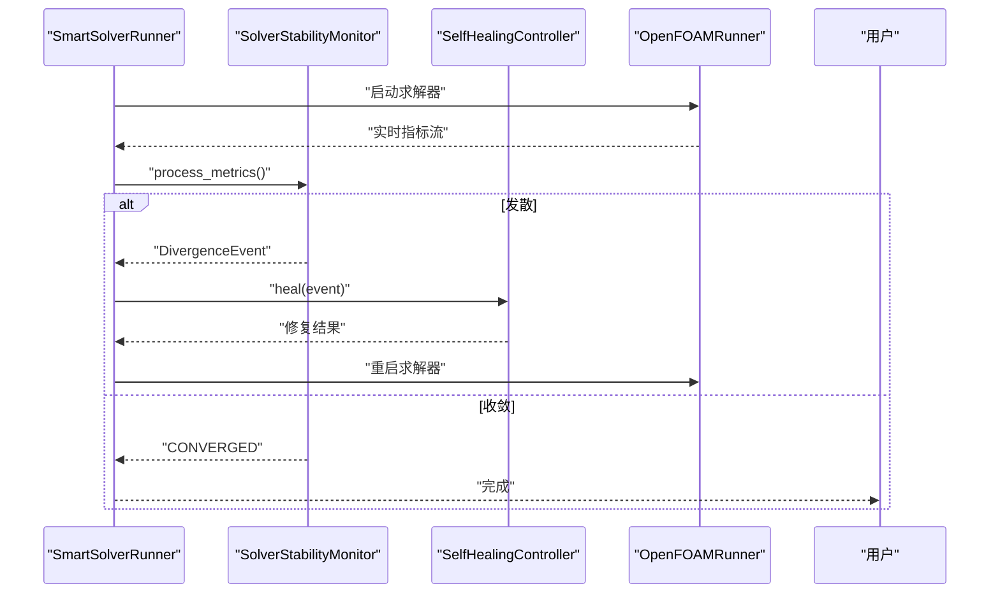
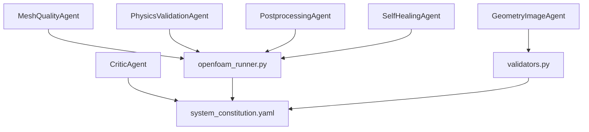

# 专用Agent组件

<cite>
**本文档引用的文件**
- [critic_agent.py](file://openfoam_ai/agents/critic_agent.py)
- [geometry_image_agent.py](file://openfoam_ai/agents/geometry_image_agent.py)
- [mesh_quality_agent.py](file://openfoam_ai/agents/mesh_quality_agent.py)
- [physics_validation_agent.py](file://openfoam_ai/agents/physics_validation_agent.py)
- [postprocessing_agent.py](file://openfoam_ai/agents/postprocessing_agent.py)
- [self_healing_agent.py](file://openfoam_ai/agents/self_healing_agent.py)
- [system_constitution.yaml](file://openfoam_ai/config/system_constitution.yaml)
- [openfoam_runner.py](file://openfoam_ai/core/openfoam_runner.py)
- [validators.py](file://openfoam_ai/core/validators.py)
</cite>

## 目录
1. [简介](#简介)
2. [项目结构](#项目结构)
3. [核心组件](#核心组件)
4. [架构总览](#架构总览)
5. [详细组件分析](#详细组件分析)
6. [依赖关系分析](#依赖关系分析)
7. [性能考虑](#性能考虑)
8. [故障排查指南](#故障排查指南)
9. [结论](#结论)
10. [附录](#附录)

## 简介
本文件面向OpenFOAM AI项目中的专用Agent组件群，系统化阐述以下Agent的功能定位、工作机制与使用方法：
- CriticAgent：批判性分析Agent，负责基于宪法规则的配置质量检查与逻辑一致性验证，形成审查报告并给出批准/有条件/拒绝结论。
- GeometryImageAgent：几何图像Agent，负责从用户上传的几何示意图中提取关键特征，转换为结构化OpenFOAM配置，并通过Pydantic硬约束验证。
- MeshQualityAgent：网格质量Agent，基于checkMesh结果进行网格质量评估与自动修复建议，支持交互式确认与自动修复流程。
- PhysicsValidationAgent：物理验证Agent，负责后处理阶段的物理一致性验证，包括质量守恒、能量守恒、收敛性等。
- PostprocessingAgent：后处理Agent，负责基于自然语言的可视化需求自动生成PyVista脚本，读取OpenFOAM结果并生成高分辨率矢量图。
- SelfHealingAgent：自愈Agent，负责求解过程中的稳定性监控、发散检测与自动修复，支持多次尝试与回滚。

## 项目结构
专用Agent组件位于openfoam_ai/agents目录下，配合core层的运行器、验证器与配置管理模块协同工作。系统宪法规则由config/system_constitution.yaml统一约束，确保所有Agent的行为符合CFD工程规范。

**图表来源**
- [critic_agent.py:286-593](file://openfoam_ai/agents/critic_agent.py#L286-L593)
- [geometry_image_agent.py:78-533](file://openfoam_ai/agents/geometry_image_agent.py#L78-L533)
- [mesh_quality_agent.py:61-547](file://openfoam_ai/agents/mesh_quality_agent.py#L61-L547)
- [physics_validation_agent.py:174-517](file://openfoam_ai/agents/physics_validation_agent.py#L174-L517)
- [postprocessing_agent.py:108-588](file://openfoam_ai/agents/postprocessing_agent.py#L108-L588)
- [self_healing_agent.py:58-642](file://openfoam_ai/agents/self_healing_agent.py#L58-L642)
- [openfoam_runner.py:44-200](file://openfoam_ai/core/openfoam_runner.py#L44-L200)
- [validators.py:179-441](file://openfoam_ai/core/validators.py#L179-L441)
- [system_constitution.yaml:1-103](file://openfoam_ai/config/system_constitution.yaml#L1-L103)

**章节来源**
- [system_constitution.yaml:1-103](file://openfoam_ai/config/system_constitution.yaml#L1-L103)
- [openfoam_runner.py:44-200](file://openfoam_ai/core/openfoam_runner.py#L44-L200)
- [validators.py:179-441](file://openfoam_ai/core/validators.py#L179-L441)

## 核心组件
本节概述六大专用Agent的核心职责与关键能力：
- CriticAgent：基于宪法规则的硬约束检查，结合评分与建议生成审查报告，支持LLM深度审查。
- GeometryImageAgent：图像解析与几何特征提取，自动推断网格分辨率与边界条件，通过Pydantic验证。
- MeshQualityAgent：checkMesh日志解析与质量等级评估，提供自动修复策略与交互式确认。
- PhysicsValidationAgent：后处理阶段的物理一致性验证，涵盖质量/能量守恒、收敛性、边界兼容性等。
- PostprocessingAgent：自然语言到可视化脚本的转换，生成高分辨率矢量图并输出报告。
- SelfHealingAgent：求解过程监控与自动修复，针对库朗数、残差爆炸与停滞等发散模式采取相应措施。

**章节来源**
- [critic_agent.py:286-593](file://openfoam_ai/agents/critic_agent.py#L286-L593)
- [geometry_image_agent.py:78-533](file://openfoam_ai/agents/geometry_image_agent.py#L78-L533)
- [mesh_quality_agent.py:61-547](file://openfoam_ai/agents/mesh_quality_agent.py#L61-L547)
- [physics_validation_agent.py:174-517](file://openfoam_ai/agents/physics_validation_agent.py#L174-L517)
- [postprocessing_agent.py:108-588](file://openfoam_ai/agents/postprocessing_agent.py#L108-L588)
- [self_healing_agent.py:58-642](file://openfoam_ai/agents/self_healing_agent.py#L58-L642)

## 架构总览
六大Agent围绕“宪法约束”与“核心运行器/验证器”协作，形成从配置生成、网格检查、求解监控到结果验证与可视化的完整闭环。

**图表来源**
- [geometry_image_agent.py:371-482](file://openfoam_ai/agents/geometry_image_agent.py#L371-L482)
- [critic_agent.py:360-407](file://openfoam_ai/agents/critic_agent.py#L360-L407)
- [self_healing_agent.py:479-610](file://openfoam_ai/agents/self_healing_agent.py#L479-L610)
- [mesh_quality_agent.py:111-177](file://openfoam_ai/agents/mesh_quality_agent.py#L111-L177)
- [physics_validation_agent.py:197-224](file://openfoam_ai/agents/physics_validation_agent.py#L197-L224)
- [postprocessing_agent.py:345-379](file://openfoam_ai/agents/postprocessing_agent.py#L345-L379)
- [openfoam_runner.py:99-198](file://openfoam_ai/core/openfoam_runner.py#L99-L198)
- [validators.py:389-411](file://openfoam_ai/core/validators.py#L389-L411)

## 详细组件分析

### CriticAgent 批判性分析Agent
- 功能要点
  - 基于system_constitution.yaml的硬约束检查，覆盖网格数量、长宽比、求解器稳定性、物理类型匹配与边界条件完整性。
  - 评分与建议生成：根据发现的问题数量与严重性计算分数，给出批准/有条件/拒绝结论。
  - LLM深度审查（可选）：在启用时调用外部LLM进行更严格的审查。
- 数据结构与流程
  - ReviewVerdict：审查结论枚举（批准/有条件/拒绝）。
  - ReviewIssue：问题条目（严重性、类别、描述、建议、宪法引用）。
  - ReviewReport：审查报告（结论、分数、问题列表、优势、建议、时间戳）。
  - 宪法检查器ConstitutionChecker：解析规则并执行硬约束检查。
- 关键算法
  - 网格标准检查：计算总单元数与长宽比，对比宪法阈值。
  - 求解器标准检查：基于网格与速度估计库朗数，判断是否超过安全上限。
  - 物理配置检查：验证求解器与物理类型匹配，检查入口/出口边界是否存在。
  - 评分与结论：按严重性扣分，结合关键问题数量决定最终结论。
- 使用方式
  - 独立使用：直接review(proposal)获取报告。
  - 交互式审查：interactive_review(proposal)返回是否通过与交互提示。
- 与宪法的关系
  - 严格遵循宪法中的网格最小单元数、长宽比、库朗数限制、收敛残差、边界层y+等要求。

**图表来源**
- [critic_agent.py:15-41](file://openfoam_ai/agents/critic_agent.py#L15-L41)
- [critic_agent.py:47-283](file://openfoam_ai/agents/critic_agent.py#L47-L283)
- [critic_agent.py:286-593](file://openfoam_ai/agents/critic_agent.py#L286-L593)

**章节来源**
- [critic_agent.py:15-593](file://openfoam_ai/agents/critic_agent.py#L15-L593)
- [system_constitution.yaml:13-37](file://openfoam_ai/config/system_constitution.yaml#L13-L37)

### GeometryImageAgent 几何图像Agent
- 功能要点
  - 从用户上传的几何示意图中提取几何类型、尺寸、边界位置与边界条件类型。
  - 自动推断网格分辨率（满足宪法最小网格数要求），并映射到OpenFOAM边界条件类型。
  - 通过Pydantic SimulationConfig进行硬约束验证，确保生成配置符合宪法与工程规范。
- 数据结构与流程
  - GeometryType/BoundaryType：几何与边界类型枚举。
  - GeometryFeatures：几何特征数据类（类型、尺寸、边界位置、长宽比、是否三维、边界条件、置信度、原始描述）。
  - 几何解析器GeometryImageParser：图像解析、Mock模式、配置转换、置信度验证。
- 关键算法
  - 图像解析：支持Vision API与Mock模式；从响应中提取JSON并转换为GeometryFeatures。
  - 配置转换：根据几何类型构建几何字典，推断网格分辨率，构造求解器与边界条件配置。
  - 置信度验证：比较置信度阈值，低于阈值给出建议。
- 使用方式
  - 独立使用：create_geometry_parser(api_key).parse_image(image_path)获取特征，再convert_to_simulation_config(features)生成配置。
  - 集成调用：与PromptEngine结合，将自然语言描述转为几何图像，再解析为配置。
- 与宪法的关系
  - 自动网格分辨率满足宪法最小网格数要求；边界条件映射遵循OpenFOAM规范。

**图表来源**
- [geometry_image_agent.py:184-370](file://openfoam_ai/agents/geometry_image_agent.py#L184-L370)
- [geometry_image_agent.py:371-482](file://openfoam_ai/agents/geometry_image_agent.py#L371-L482)
- [validators.py:179-275](file://openfoam_ai/core/validators.py#L179-L275)

**章节来源**
- [geometry_image_agent.py:46-533](file://openfoam_ai/agents/geometry_image_agent.py#L46-L533)
- [validators.py:179-275](file://openfoam_ai/core/validators.py#L179-L275)
- [system_constitution.yaml:13-21](file://openfoam_ai/config/system_constitution.yaml#L13-L21)

### MeshQualityAgent 网格质量Agent
- 功能要点
  - 执行checkMesh并解析日志，提取网格统计、非正交性、偏斜度、长宽比等指标。
  - 评估质量等级（优秀/良好/可接受/较差/严重），识别问题并生成修复建议。
  - 支持自动修复（如添加非正交修正器）与交互式确认。
- 数据结构与流程
  - MeshQualityLevel：质量等级枚举。
  - MeshQualityReport：质量报告（通过状态、等级、指标、统计、问题详情、建议、可自动修复标志、修复策略）。
  - MeshQualityChecker：日志解析、质量评估、问题识别、建议生成、修复策略判定与应用。
- 关键算法
  - 日志解析：正则表达式提取总单元数、faces数、非正交性、偏斜度、长宽比、失败检查数与警告。
  - 质量评估：基于阈值判断等级，考虑失败项、非正交性、偏斜度、长宽比与网格数量。
  - 修复策略：仅对非正交性问题自动修复，添加或增加nNonOrthogonalCorrectors。
- 使用方式
  - 独立使用：MeshQualityChecker(case_path).check(auto_fix=True/False)获取报告。
  - 交互式：generate_interactive_prompt(report)生成用户确认提示。
- 与宪法的关系
  - 遵循宪法中的网格最小单元数、长宽比、非正交性限制等要求。

**图表来源**
- [mesh_quality_agent.py:111-177](file://openfoam_ai/agents/mesh_quality_agent.py#L111-L177)
- [mesh_quality_agent.py:179-231](file://openfoam_ai/agents/mesh_quality_agent.py#L179-L231)
- [mesh_quality_agent.py:233-365](file://openfoam_ai/agents/mesh_quality_agent.py#L233-L365)

**章节来源**
- [mesh_quality_agent.py:24-454](file://openfoam_ai/agents/mesh_quality_agent.py#L24-L454)
- [system_constitution.yaml:13-21](file://openfoam_ai/config/system_constitution.yaml#L13-L21)

### PhysicsValidationAgent 物理验证Agent
- 功能要点
  - 后处理阶段的物理一致性验证，包括质量守恒、能量守恒、收敛性、边界兼容性、y+检查等。
  - 从OpenFOAM日志与结果中提取数据，计算误差并判断是否通过。
- 数据结构与流程
  - ValidationType：验证类型枚举（质量/能量/动量/边界兼容/y+/收敛）。
  - ValidationResult：验证结果（类型、通过状态、误差、容差、消息、详情）。
  - PostProcessDataExtractor：数据提取器（边界流量、残差、y+等）。
  - PhysicsConsistencyValidator：物理一致性校验器（执行所有验证并生成报告）。
- 关键算法
  - 质量守恒：计算入口/出口流量差，误差小于容差视为通过。
  - 能量守恒：计算热流入/流出与壁面热流之和，误差小于容差视为通过。
  - 收敛性：从日志提取最终残差，判断是否达到目标。
  - 边界兼容性：检查压力-速度耦合与边界完整性。
  - y+检查：解析y+数据并判断是否满足目标范围。
- 使用方式
  - 独立使用：PhysicsConsistencyValidator(case_path).validate_all()获取综合报告。
  - 交互式：generate_report(results)生成可读报告。
- 与宪法的关系
  - 能量守恒误差不超过0.1%，收敛残差不低于1e-6等要求。

**图表来源**
- [physics_validation_agent.py:197-224](file://openfoam_ai/agents/physics_validation_agent.py#L197-L224)
- [physics_validation_agent.py:226-355](file://openfoam_ai/agents/physics_validation_agent.py#L226-L355)
- [physics_validation_agent.py:451-478](file://openfoam_ai/agents/physics_validation_agent.py#L451-L478)

**章节来源**
- [physics_validation_agent.py:17-517](file://openfoam_ai/agents/physics_validation_agent.py#L17-L517)
- [system_constitution.yaml:33-36](file://openfoam_ai/config/system_constitution.yaml#L33-L36)

### PostprocessingAgent 后处理Agent
- 功能要点
  - 将自然语言绘图需求解析为PlotRequest，自动生成PyVista脚本并执行绘图。
  - 生成高分辨率矢量图（PDF/SVG/PNG/VTK），并输出报告。
  - 遵循宪法：基于实际计算结果、验证数据质量、标注物理参数与单位。
- 数据结构与流程
  - PlotType/OutputFormat：绘图与输出格式枚举。
  - PlotRequest/PlotResult：绘图请求与结果数据类。
  - PostProcessingAgent：自然语言解析、脚本生成、执行绘图、结果验证与报告生成。
- 关键算法
  - 自然语言解析：匹配中文/英文关键词，识别绘图类型、场变量、位置、时间步、输出格式。
  - 脚本生成：根据请求类型生成对应PyVista绘图代码，设置颜色条、坐标轴、标题等。
  - 结果验证：检查残差收敛、质量守恒、能量守恒与最终结果文件存在性。
- 使用方式
  - 独立使用：parse_natural_language(prompt)生成请求，execute_plot(request, output_dir)执行绘图。
  - 批量：generate_plotting_report(plot_results, output_path)生成汇总报告。
- 与宪法的关系
  - 可视化必须基于实际计算结果，验证数据质量并标注单位。

**图表来源**
- [postprocessing_agent.py:172-240](file://openfoam_ai/agents/postprocessing_agent.py#L172-L240)
- [postprocessing_agent.py:241-343](file://openfoam_ai/agents/postprocessing_agent.py#L241-L343)
- [postprocessing_agent.py:345-491](file://openfoam_ai/agents/postprocessing_agent.py#L345-L491)
- [postprocessing_agent.py:493-574](file://openfoam_ai/agents/postprocessing_agent.py#L493-L574)

**章节来源**
- [postprocessing_agent.py:36-588](file://openfoam_ai/agents/postprocessing_agent.py#L36-L588)

### SelfHealingAgent 自愈Agent
- 功能要点
  - 实时监控求解器日志，检测库朗数超标、残差爆炸、残差停滞等发散模式。
  - 根据发散类型自动调整求解器参数（如减小时间步长、松弛因子、增加非正交修正器）。
  - 支持多次尝试与配置回滚，提供自愈报告。
- 数据结构与流程
  - DivergenceType：发散类型枚举（库朗数/残差爆炸/停滞/不现实）。
  - DivergenceEvent/HealingAction：发散事件与自愈动作数据类。
  - SolverStabilityMonitor：稳定性监控器（处理指标、检测异常、趋势分析）。
  - SelfHealingController：自愈控制器（策略选择、参数调整、配置回滚、历史记录）。
  - SmartSolverRunner：智能求解器运行器（集成监控与自愈，支持多次重启）。
- 关键算法
  - 指标处理：维护指标历史队列，检测库朗数与残差异常。
  - 发散检测：库朗数超过临界值、残差爆炸、停滞趋势等。
  - 自愈策略：针对不同发散类型采取不同修复措施，限制最大尝试次数。
- 使用方式
  - 独立使用：SmartSolverRunner(case_path).run(solver_name)启动带自愈的求解流程。
  - 交互式：监控器与控制器分别提供趋势分析与自愈报告。
- 与宪法的关系
  - 遵循宪法中的收敛残差阈值、库朗数限制与发散处理策略。

**图表来源**
- [self_healing_agent.py:479-610](file://openfoam_ai/agents/self_healing_agent.py#L479-L610)
- [self_healing_agent.py:58-197](file://openfoam_ai/agents/self_healing_agent.py#L58-L197)
- [self_healing_agent.py:232-477](file://openfoam_ai/agents/self_healing_agent.py#L232-L477)

**章节来源**
- [self_healing_agent.py:27-642](file://openfoam_ai/agents/self_healing_agent.py#L27-L642)
- [openfoam_runner.py:16-76](file://openfoam_ai/core/openfoam_runner.py#L16-L76)
- [system_constitution.yaml:23-31](file://openfoam_ai/config/system_constitution.yaml#L23-L31)

## 依赖关系分析
六大Agent之间的依赖关系如下：
- CriticAgent依赖系统宪法规则进行硬约束检查。
- GeometryImageAgent依赖validators进行配置验证。
- MeshQualityAgent依赖OpenFOAMRunner执行checkMesh并解析日志。
- PhysicsValidationAgent依赖OpenFOAMRunner提供的日志与结果数据。
- PostprocessingAgent依赖OpenFOAMRunner的结果数据与PyVista库。
- SelfHealingAgent依赖OpenFOAMRunner进行实时监控与自动修复。

**图表来源**
- [critic_agent.py:47-112](file://openfoam_ai/agents/critic_agent.py#L47-L112)
- [geometry_image_agent.py:35-44](file://openfoam_ai/agents/geometry_image_agent.py#L35-L44)
- [mesh_quality_agent.py:14-21](file://openfoam_ai/agents/mesh_quality_agent.py#L14-L21)
- [physics_validation_agent.py:16-17](file://openfoam_ai/agents/physics_validation_agent.py#L16-L17)
- [postprocessing_agent.py:23-33](file://openfoam_ai/agents/postprocessing_agent.py#L23-L33)
- [self_healing_agent.py:17-24](file://openfoam_ai/agents/self_healing_agent.py#L17-L24)
- [openfoam_runner.py:13-13](file://openfoam_ai/core/openfoam_runner.py#L13-L13)
- [validators.py:13-15](file://openfoam_ai/core/validators.py#L13-L15)
- [system_constitution.yaml:1-103](file://openfoam_ai/config/system_constitution.yaml#L1-L103)

**章节来源**
- [critic_agent.py:47-112](file://openfoam_ai/agents/critic_agent.py#L47-L112)
- [geometry_image_agent.py:35-44](file://openfoam_ai/agents/geometry_image_agent.py#L35-L44)
- [mesh_quality_agent.py:14-21](file://openfoam_ai/agents/mesh_quality_agent.py#L14-L21)
- [physics_validation_agent.py:16-17](file://openfoam_ai/agents/physics_validation_agent.py#L16-L17)
- [postprocessing_agent.py:23-33](file://openfoam_ai/agents/postprocessing_agent.py#L23-L33)
- [self_healing_agent.py:17-24](file://openfoam_ai/agents/self_healing_agent.py#L17-L24)
- [openfoam_runner.py:13-13](file://openfoam_ai/core/openfoam_runner.py#L13-L13)
- [validators.py:13-15](file://openfoam_ai/core/validators.py#L13-L15)
- [system_constitution.yaml:1-103](file://openfoam_ai/config/system_constitution.yaml#L1-L103)

## 性能考虑
- 网格分辨率与计算成本：几何图像Agent与CriticAgent均要求满足宪法最小网格数，避免过低分辨率导致的精度不足与后续发散风险。
- 自愈策略的代价：SelfHealingAgent的自动修复（如减小时间步长、调整松弛因子）可能延长计算时间，应结合历史趋势分析合理选择策略。
- 可视化开销：PostprocessingAgent生成高分辨率矢量图时，建议在结果稳定后再进行大规模批量生成，避免不必要的资源消耗。
- 日志解析效率：MeshQualityAgent与PhysicsValidationAgent的日志解析依赖正则表达式，建议在大规模案例中优化解析逻辑与缓存策略。

## 故障排查指南
- 审查不通过
  - 检查CriticAgent报告中的问题与建议，重点关注网格数量、长宽比、库朗数与边界条件完整性。
  - 参考宪法规则逐项核对，必要时降低时间步长或加密网格。
- 网格质量差
  - 使用MeshQualityAgent检查报告，优先处理非正交性与长宽比问题。
  - 若可自动修复，启用auto_fix并确认修复策略；否则手动调整网格参数。
- 物理验证失败
  - 根据PhysicsValidationAgent报告检查质量/能量守恒、收敛性与边界兼容性。
  - 对于y+不满足要求的情况，调整边界层网格或湍流模型。
- 可视化异常
  - 确认PostprocessingAgent已正确读取OpenFOAM结果文件，检查输出目录权限与PyVista安装状态。
- 求解发散
  - 使用SelfHealingAgent的监控与自愈功能，自动调整时间步长、松弛因子或增加非正交修正器。
  - 若多次自愈失败，检查配置与网格质量，必要时回滚到原始配置。

**章节来源**
- [critic_agent.py:360-407](file://openfoam_ai/agents/critic_agent.py#L360-L407)
- [mesh_quality_agent.py:111-177](file://openfoam_ai/agents/mesh_quality_agent.py#L111-L177)
- [physics_validation_agent.py:197-224](file://openfoam_ai/agents/physics_validation_agent.py#L197-L224)
- [postprocessing_agent.py:345-379](file://openfoam_ai/agents/postprocessing_agent.py#L345-L379)
- [self_healing_agent.py:479-610](file://openfoam_ai/agents/self_healing_agent.py#L479-L610)

## 结论
六大专用Agent围绕“宪法约束”与“核心运行器/验证器”，实现了从配置生成、网格检查、求解监控到结果验证与可视化的全流程自动化。通过严格的硬约束检查、实时监控与自动修复，显著提升了OpenFOAM仿真的可靠性与工程可用性。建议在实际使用中结合各Agent的报告与建议，逐步优化配置与参数，确保仿真结果的准确性与可重复性。

## 附录
- 独立使用示例（以代码片段路径代替具体代码）
  - CriticAgent审查：[review:360-407](file://openfoam_ai/agents/critic_agent.py#L360-L407)
  - 几何图像解析：[parse_image:184-202](file://openfoam_ai/agents/geometry_image_agent.py#L184-L202)、[convert_to_simulation_config:371-379](file://openfoam_ai/agents/geometry_image_agent.py#L371-L379)
  - 网格质量检查：[check:111-177](file://openfoam_ai/agents/mesh_quality_agent.py#L111-L177)
  - 物理验证：[validate_all:197-224](file://openfoam_ai/agents/physics_validation_agent.py#L197-L224)
  - 后处理绘图：[execute_plot:345-379](file://openfoam_ai/agents/postprocessing_agent.py#L345-L379)
  - 自愈运行：[run:494-568](file://openfoam_ai/agents/self_healing_agent.py#L494-L568)
- 集成调用方式
  - 几何图像到配置：GeometryImageAgent.parse_image → convert_to_simulation_config → Validators.validate_simulation_config
  - 审查与执行：CriticAgent.review → MeshQualityAgent.check → SelfHealingAgent.run → PhysicsValidationAgent.validate_all → PostprocessingAgent.execute_plot