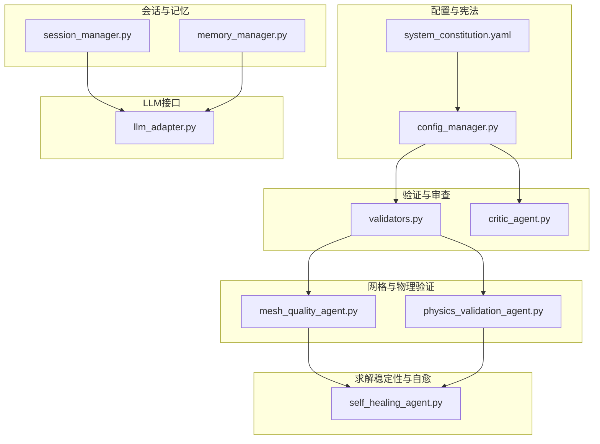
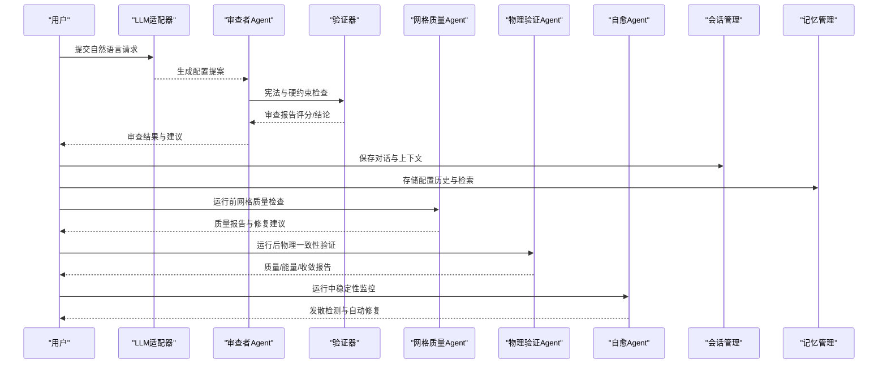
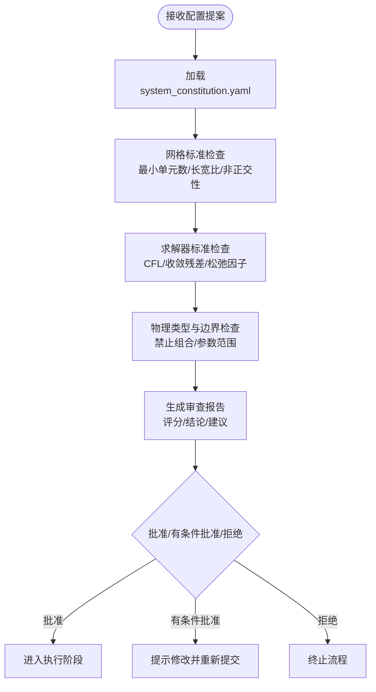
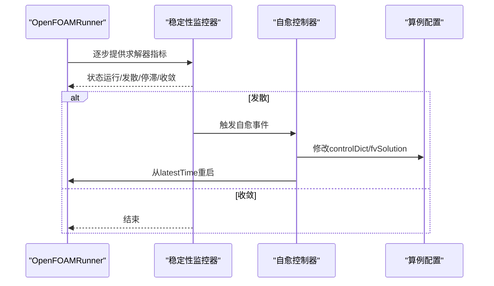
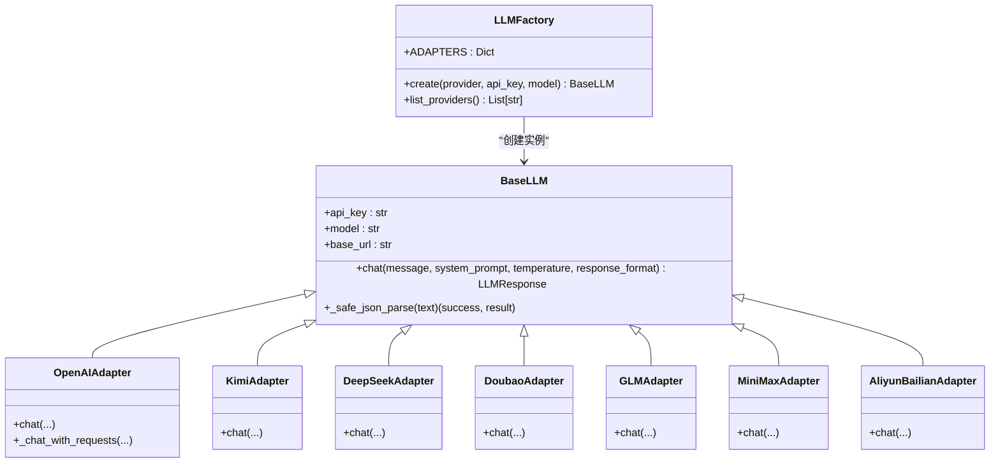
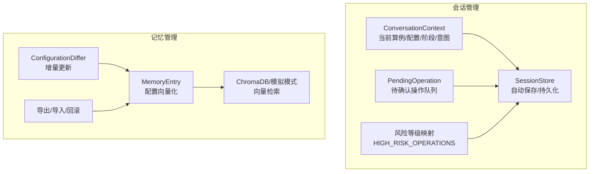
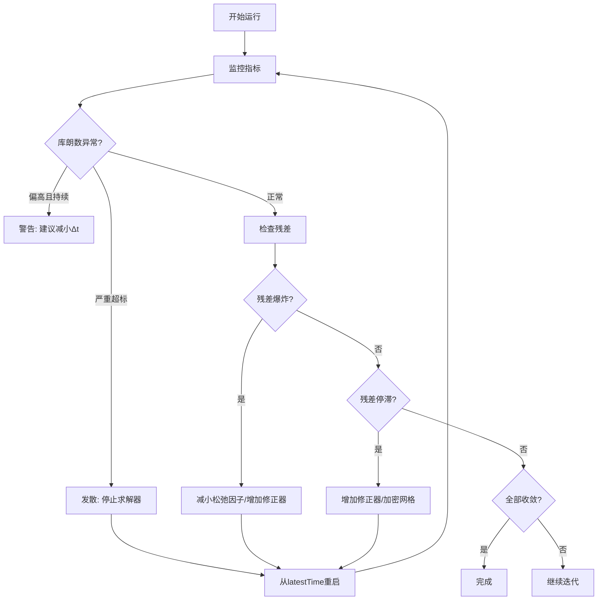
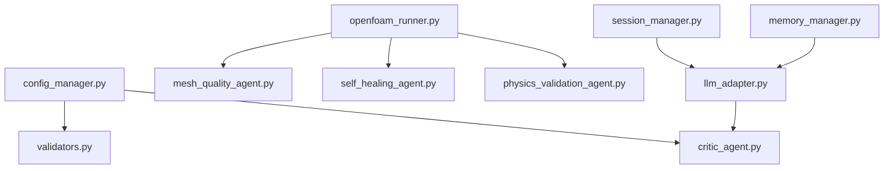

# 安全机制设计

<cite>
**本文档引用的文件**
- [system_constitution.yaml](file://openfoam_ai/config/system_constitution.yaml)
- [validators.py](file://openfoam_ai/core/validators.py)
- [config_manager.py](file://openfoam_ai/core/config_manager.py)
- [llm_adapter.py](file://openfoam_ai/core/llm_adapter.py)
- [session_manager.py](file://openfoam_ai/memory/session_manager.py)
- [memory_manager.py](file://openfoam_ai/memory/memory_manager.py)
- [critic_agent.py](file://openfoam_ai/agents/critic_agent.py)
- [mesh_quality_agent.py](file://openfoam_ai/agents/mesh_quality_agent.py)
- [self_healing_agent.py](file://openfoam_ai/agents/self_healing_agent.py)
- [physics_validation_agent.py](file://openfoam_ai/agents/physics_validation_agent.py)
- [main.py](file://openfoam_ai/main.py)
</cite>

## 目录
1. [引言](#引言)
2. [项目结构](#项目结构)
3. [核心组件](#核心组件)
4. [架构总览](#架构总览)
5. [详细组件分析](#详细组件分析)
6. [依赖关系分析](#依赖关系分析)
7. [性能考虑](#性能考虑)
8. [故障排除指南](#故障排除指南)
9. [结论](#结论)

## 引言
本文件面向OpenFOAM AI系统的安全机制设计，围绕系统宪法（system_constitution.yaml）中的安全约束与质量标准，系统化阐述配置验证机制（物理约束检查、网格质量验证、求解器兼容性验证）、LLM接口安全防护（输入过滤、输出验证、API调用限制）、内存数据安全存储与访问控制（向量数据库安全配置、会话管理安全策略），以及错误处理与异常隔离机制。文档旨在为开发者与运维人员提供可操作的安全实施指南，并结合威胁模型与防护措施的具体细节，确保系统在面对恶意输入与异常状态时仍保持稳定与可信。

## 项目结构
OpenFOAM AI系统采用模块化架构，安全机制贯穿配置管理、验证器、代理（Agent）、内存与会话管理、以及LLM适配层。关键安全相关模块包括：
- 配置与宪法：system_constitution.yaml + config_manager.py
- 验证与审查：validators.py + critic_agent.py
- 网格与物理验证：mesh_quality_agent.py + physics_validation_agent.py
- 求解稳定性与自愈：self_healing_agent.py
- 会话与记忆：session_manager.py + memory_manager.py
- LLM接口：llm_adapter.py

**图表来源**
- [system_constitution.yaml:1-103](file://openfoam_ai/config/system_constitution.yaml#L1-L103)
- [config_manager.py:16-227](file://openfoam_ai/core/config_manager.py#L16-L227)
- [validators.py:1-441](file://openfoam_ai/core/validators.py#L1-L441)
- [critic_agent.py:1-629](file://openfoam_ai/agents/critic_agent.py#L1-L629)
- [mesh_quality_agent.py:1-547](file://openfoam_ai/agents/mesh_quality_agent.py#L1-L547)
- [physics_validation_agent.py:1-517](file://openfoam_ai/agents/physics_validation_agent.py#L1-L517)
- [self_healing_agent.py:1-642](file://openfoam_ai/agents/self_healing_agent.py#L1-L642)
- [session_manager.py:1-565](file://openfoam_ai/memory/session_manager.py#L1-L565)
- [memory_manager.py:1-804](file://openfoam_ai/memory/memory_manager.py#L1-L804)
- [llm_adapter.py:1-688](file://openfoam_ai/core/llm_adapter.py#L1-L688)

**章节来源**
- [system_constitution.yaml:1-103](file://openfoam_ai/config/system_constitution.yaml#L1-L103)
- [config_manager.py:16-227](file://openfoam_ai/core/config_manager.py#L16-L227)
- [main.py:1-251](file://openfoam_ai/main.py#L1-L251)

## 核心组件
本节聚焦系统宪法中的安全约束与质量标准，以及与之对应的验证实现。

- 系统宪法（system_constitution.yaml）定义了：
  - 核心指令：禁止用二维粗网格替代三维真实网格、对流传热必须验证能量守恒、参数反演需收敛至1e-6以下、边界层网格需满足湍流模型y+要求、瞬态计算需验证时间步长独立性、网格分辨率不得低于20x20、默认输出间隔不少于100个时间步。
  - 网格标准：最小单元数（2D 400、3D 8000）、最大长宽比、最大非正交性、每方向最小网格数、y+目标范围（壁面函数30-300、解析边界层0-5）、边界层增长率。
  - 求解器标准：最小收敛残差1e-6、显式库朗数上限0.5、隐式库朗数上限5.0、松弛因子范围（0.1-0.9）、默认写入间隔100、发散阈值1.0、通用库朗数限制1.0。
  - 验证要求：质量守恒误差≤0.1%、能量守恒误差≤0.1%、力平衡误差≤1%。
  - 物理约束：雷诺数范围、普朗特数范围、运动粘度范围、密度范围。
  - 禁止组合：如icoFoam不可用于可压缩流、simpleFoam仅用于稳态、高雷诺数管道必须使用湍流模型。
  - 质量检查清单：运行前（网格质量、边界条件、物理参数、CFL）、运行中（库朗数、残差、连续性误差）、运行后（质量/能量/力平衡、结果合理性）。
  - 错误处理策略：网格质量失败尝试自动修复（最多3次）、检测到发散减半时间步长（不低于1e-6）、收敛停滞调整松弛因子或加密网格。
  - 文档要求：每个算例需README说明设置、所有边界条件需解释、关键结果需截图、收敛历史需记录。

- 配置管理（config_manager.py）：
  - 单例模式加载system_constitution.yaml，支持环境变量覆盖与默认值合并，提供统一访问接口与热重载能力。
  - 通过load_constitution缓存宪法，get_mesh_standard/get_solver_standard等方法为验证器提供标准化查询。

- 验证器（validators.py）：
  - 基于Pydantic的硬约束验证，涵盖网格配置（分辨率、长宽比、总单元数）、求解器配置（求解器名、时间范围、时间步长、CFL条件）、边界条件（类型与值的匹配）、物理参数范围与禁止组合。
  - 提供PhysicsValidator用于后处理阶段的质量/能量守恒与边界兼容性检查。

- 审查者Agent（critic_agent.py）：
  - 基于宪法规则进行硬约束检查，生成审查报告，评分与结论受关键/重要问题数量影响。
  - 与Builder Agent形成对抗，仅当审查通过才允许执行。

**章节来源**
- [system_constitution.yaml:1-103](file://openfoam_ai/config/system_constitution.yaml#L1-L103)
- [config_manager.py:16-227](file://openfoam_ai/core/config_manager.py#L16-L227)
- [validators.py:1-441](file://openfoam_ai/core/validators.py#L1-L441)
- [critic_agent.py:1-629](file://openfoam_ai/agents/critic_agent.py#L1-L629)

## 架构总览
下图展示安全机制在系统中的交互流程：用户输入经由LLM适配层与Agent协作，宪法与验证器保障配置合法性；网格与物理验证Agent在运行前后进行质量与一致性检查；自愈Agent在运行中监控稳定性并自动修复；会话与记忆模块负责上下文与历史的持久化与检索。

**图表来源**
- [llm_adapter.py:1-688](file://openfoam_ai/core/llm_adapter.py#L1-L688)
- [critic_agent.py:1-629](file://openfoam_ai/agents/critic_agent.py#L1-L629)
- [validators.py:1-441](file://openfoam_ai/core/validators.py#L1-L441)
- [mesh_quality_agent.py:1-547](file://openfoam_ai/agents/mesh_quality_agent.py#L1-L547)
- [physics_validation_agent.py:1-517](file://openfoam_ai/agents/physics_validation_agent.py#L1-L517)
- [self_healing_agent.py:1-642](file://openfoam_ai/agents/self_healing_agent.py#L1-L642)
- [session_manager.py:1-565](file://openfoam_ai/memory/session_manager.py#L1-L565)
- [memory_manager.py:1-804](file://openfoam_ai/memory/memory_manager.py#L1-L804)

## 详细组件分析

### 系统宪法与质量标准
- 宪法条目与验证要点：
  - 禁止用二维粗网格替代三维真实网格：验证器中通过几何维度与总单元数阈值实现。
  - 对流传热能量守恒：后处理阶段通过PhysicsValidator的能量守恒验证实现。
  - 参数反演/敏感性分析需收敛至1e-6：通过收敛性检查与阈值对比实现。
  - 边界层y+要求：通过y+检查与目标范围对比实现。
  - 瞬态时间步长独立性：通过时间步长与CFL条件检查实现。
  - 网格分辨率≥20x20：通过网格分辨率与最小单元数阈值实现。
  - 默认输出间隔≥100：通过求解器配置验证实现。
  - 禁止组合：通过求解器与物理类型/湍流模型匹配检查实现。
  - 质量检查清单：通过pre/during/post run检查流程实现。

- 实施细节：
  - 网格标准：最小单元数、最大长宽比、最大非正交性、每方向最小网格数、y+范围、边界层增长率。
  - 求解器标准：最小收敛残差、显式/隐式库朗数上限、松弛因子范围、默认写入间隔、发散阈值、通用库朗数限制。
  - 验证要求：质量/能量/力平衡容差。
  - 物理约束：雷诺数/普朗特数/粘度/密度范围。
  - 错误处理：网格质量失败自动修复、发散时减半时间步长、收敛停滞调整松弛因子或加密网格。

**章节来源**
- [system_constitution.yaml:1-103](file://openfoam_ai/config/system_constitution.yaml#L1-L103)
- [validators.py:1-441](file://openfoam_ai/core/validators.py#L1-L441)
- [physics_validation_agent.py:1-517](file://openfoam_ai/agents/physics_validation_agent.py#L1-L517)

### 配置验证机制
- 物理约束验证器（Pydantic）：
  - MeshConfig：验证网格分辨率、长宽比、总单元数与几何尺寸。
  - SolverConfig：验证求解器名称、时间范围、时间步长、CFL条件。
  - BoundaryCondition：验证边界类型与值的匹配。
  - SimulationConfig：整合验证，检查物理类型与求解器匹配、禁止组合、物理参数范围、湍流模型有效性。
  - PhysicsValidator：后处理阶段的质量/能量守恒与边界兼容性检查。

- 审查者Agent（Critic Agent）：
  - 基于system_constitution.yaml解析硬规则，生成审查报告，评分与结论受问题严重性影响。
  - 与Builder Agent形成对抗，仅批准通过的方案。

**图表来源**
- [critic_agent.py:1-629](file://openfoam_ai/agents/critic_agent.py#L1-L629)
- [validators.py:1-441](file://openfoam_ai/core/validators.py#L1-L441)

**章节来源**
- [validators.py:1-441](file://openfoam_ai/core/validators.py#L1-L441)
- [critic_agent.py:1-629](file://openfoam_ai/agents/critic_agent.py#L1-L629)

### 网格质量验证与自愈
- 网格质量Agent：
  - 执行checkMesh并解析日志，评估质量等级（优秀/良好/可接受/较差/严重），识别非正交性、偏斜度、长宽比、失败检查数等问题。
  - 生成修复建议，对非正交性问题可自动添加非正交修正器。
  - 生成交互提示，支持自动修复或人工确认。

- 自愈Agent：
  - 实时监控求解器日志，检测库朗数超标、残差爆炸、残差停滞等发散模式。
  - 自动调整时间步长、松弛因子、增加非正交修正器，从最新时间步重启，限制最大尝试次数。
  - 提供自愈报告与历史记录。

**图表来源**
- [mesh_quality_agent.py:1-547](file://openfoam_ai/agents/mesh_quality_agent.py#L1-L547)
- [self_healing_agent.py:1-642](file://openfoam_ai/agents/self_healing_agent.py#L1-L642)

**章节来源**
- [mesh_quality_agent.py:1-547](file://openfoam_ai/agents/mesh_quality_agent.py#L1-L547)
- [self_healing_agent.py:1-642](file://openfoam_ai/agents/self_healing_agent.py#L1-L642)

### LLM接口安全防护
- LLM适配器（llm_adapter.py）：
  - 支持多家LLM提供商（OpenAI、KIMI、DeepSeek、豆包、GLM、MiniMax、阿里云百炼），统一接口封装。
  - 安全解析JSON响应（_safe_json_parse），捕获解析异常并返回结构化错误信息。
  - 统一响应结构（LLMResponse），包含内容、模型、用量、成功标志与错误信息，便于上层统一处理。
  - 环境变量读取API Key（create_llm），避免硬编码，支持多提供商切换。

- 输入过滤与输出验证：
  - 输入过滤：通过统一工厂（LLMFactory）与BaseLLM基类，确保消息格式与系统提示词一致。
  - 输出验证：统一的LLMResponse结构，配合上层审查者Agent进行二次校验与评分。

- API调用限制：
  - 通过统一工厂与环境变量管理，避免硬编码密钥；在工厂中提供默认模型映射与错误处理。
  - 在调用外部API时设置超时（requests模式），防止长时间阻塞。

**图表来源**
- [llm_adapter.py:1-688](file://openfoam_ai/core/llm_adapter.py#L1-L688)

**章节来源**
- [llm_adapter.py:1-688](file://openfoam_ai/core/llm_adapter.py#L1-L688)

### 内存数据安全存储与访问控制
- 会话管理（session_manager.py）：
  - 会话上下文（ConversationContext）包含当前算例、配置、对话阶段、意图与待确认操作队列。
  - 高风险操作分类与确认机制（HIGH_RISK_OPERATIONS + RISK_LEVELS），生成确认提示，支持确认/拒绝/完成状态流转。
  - 自动保存与持久化（SessionStore），支持会话列表、加载、删除与导出。
  - 统计信息与安全审计（get_statistics），便于追踪高风险操作与消息历史。

- 记忆管理（memory_manager.py）：
  - 基于ChromaDB的向量数据库（模拟模式降级），支持配置向量化存储、相似性检索与增量更新（Diff update）。
  - 配置差异分析（ConfigurationDiffer），支持新增/删除/修改/未变更的路径级差异，生成变更摘要。
  - 安全导出/导入（export_memory/import_memory），支持历史版本回滚（rollback_to_memory）。
  - 统计信息（get_statistics），便于审计与容量管理。

**图表来源**
- [session_manager.py:1-565](file://openfoam_ai/memory/session_manager.py#L1-L565)
- [memory_manager.py:1-804](file://openfoam_ai/memory/memory_manager.py#L1-L804)

**章节来源**
- [session_manager.py:1-565](file://openfoam_ai/memory/session_manager.py#L1-L565)
- [memory_manager.py:1-804](file://openfoam_ai/memory/memory_manager.py#L1-L804)

### 错误处理与异常隔离
- 网格质量失败：尝试自动修复（最多3次），否则提示人工干预。
- 发散检测：库朗数严重超标（>5.0）直接判定发散，持续偏高（>1.0且连续≥3步）发出警告；残差爆炸（>1.0）与停滞（连续阈值）分别触发不同修复策略。
- 收敛停滞：调整松弛因子或增加非正交修正器，必要时加密网格。
- 物理验证：质量/能量守恒误差超过容差（0.1%）即判定未通过，提供详细错误信息与建议。
- 会话与记忆：异常捕获与日志输出，支持自动保存与恢复，避免状态丢失。

**图表来源**
- [self_healing_agent.py:1-642](file://openfoam_ai/agents/self_healing_agent.py#L1-L642)
- [physics_validation_agent.py:1-517](file://openfoam_ai/agents/physics_validation_agent.py#L1-L517)

**章节来源**
- [self_healing_agent.py:1-642](file://openfoam_ai/agents/self_healing_agent.py#L1-L642)
- [physics_validation_agent.py:1-517](file://openfoam_ai/agents/physics_validation_agent.py#L1-L517)

## 依赖关系分析
- 配置与验证：
  - config_manager.py依赖system_constitution.yaml，validators.py与critic_agent.py依赖配置管理器提供的标准与规则。
- 网格与物理验证：
  - mesh_quality_agent.py依赖OpenFOAMRunner执行checkMesh，self_healing_agent.py依赖OpenFOAMRunner解析日志与修改配置。
- 会话与记忆：
  - session_manager.py与memory_manager.py独立运行，但可与Agent协作进行上下文与历史管理。
- LLM接口：
  - llm_adapter.py为Agent提供统一的LLM调用能力，支持多提供商与错误处理。

**图表来源**
- [config_manager.py:16-227](file://openfoam_ai/core/config_manager.py#L16-L227)
- [validators.py:1-441](file://openfoam_ai/core/validators.py#L1-L441)
- [critic_agent.py:1-629](file://openfoam_ai/agents/critic_agent.py#L1-L629)
- [mesh_quality_agent.py:1-547](file://openfoam_ai/agents/mesh_quality_agent.py#L1-L547)
- [self_healing_agent.py:1-642](file://openfoam_ai/agents/self_healing_agent.py#L1-L642)
- [physics_validation_agent.py:1-517](file://openfoam_ai/agents/physics_validation_agent.py#L1-L517)
- [llm_adapter.py:1-688](file://openfoam_ai/core/llm_adapter.py#L1-L688)
- [session_manager.py:1-565](file://openfoam_ai/memory/session_manager.py#L1-L565)
- [memory_manager.py:1-804](file://openfoam_ai/memory/memory_manager.py#L1-L804)

**章节来源**
- [config_manager.py:16-227](file://openfoam_ai/core/config_manager.py#L16-L227)
- [validators.py:1-441](file://openfoam_ai/core/validators.py#L1-L441)
- [critic_agent.py:1-629](file://openfoam_ai/agents/critic_agent.py#L1-L629)
- [mesh_quality_agent.py:1-547](file://openfoam_ai/agents/mesh_quality_agent.py#L1-L547)
- [self_healing_agent.py:1-642](file://openfoam_ai/agents/self_healing_agent.py#L1-L642)
- [physics_validation_agent.py:1-517](file://openfoam_ai/agents/physics_validation_agent.py#L1-L517)
- [llm_adapter.py:1-688](file://openfoam_ai/core/llm_adapter.py#L1-L688)
- [session_manager.py:1-565](file://openfoam_ai/memory/session_manager.py#L1-L565)
- [memory_manager.py:1-804](file://openfoam_ai/memory/memory_manager.py#L1-L804)

## 性能考虑
- 验证性能：
  - Pydantic验证器在配置阶段进行，开销较小；后处理验证依赖OpenFOAM日志解析，建议在关键节点进行。
- 自愈性能：
  - 自愈操作涉及文件修改与重启，应限制最大尝试次数（默认3次），避免无限循环。
- 记忆检索：
  - 向量检索依赖嵌入生成与相似度计算，建议在批量导入/导出时进行，避免频繁I/O。
- LLM调用：
  - 统一超时设置与错误处理，避免阻塞；在工厂中进行模型映射与密钥管理，减少重复初始化。

## 故障排除指南
- 宪法加载失败：
  - 检查system_constitution.yaml路径与权限；使用reload强制重新加载。
- 配置验证失败：
  - 根据validators.py输出的错误信息调整网格分辨率、CFL、求解器名称或边界条件。
- 网格质量不佳：
  - 使用mesh_quality_agent.py生成报告，按建议增加非正交修正器或重新划分网格。
- 求解发散：
  - 自愈Agent会自动减小时间步长或松弛因子；若无效，检查网格质量与边界条件。
- 物理验证未通过：
  - 检查质量/能量守恒误差，调整算例设置或边界条件。
- 会话/记忆异常：
  - 检查SessionStore/MemoryManager的持久化路径与权限；必要时导出/导入数据。

**章节来源**
- [config_manager.py:16-227](file://openfoam_ai/core/config_manager.py#L16-L227)
- [validators.py:1-441](file://openfoam_ai/core/validators.py#L1-L441)
- [mesh_quality_agent.py:1-547](file://openfoam_ai/agents/mesh_quality_agent.py#L1-L547)
- [self_healing_agent.py:1-642](file://openfoam_ai/agents/self_healing_agent.py#L1-L642)
- [physics_validation_agent.py:1-517](file://openfoam_ai/agents/physics_validation_agent.py#L1-L517)
- [session_manager.py:1-565](file://openfoam_ai/memory/session_manager.py#L1-L565)
- [memory_manager.py:1-804](file://openfoam_ai/memory/memory_manager.py#L1-L804)

## 结论
OpenFOAM AI系统的安全机制以系统宪法为核心，结合配置验证、网格与物理验证、求解稳定性监控与自愈、会话与记忆管理以及LLM接口安全，形成了从输入到执行再到后处理的全链路安全闭环。通过硬约束检查、自动修复与人工确认相结合的方式，系统能够在保证数值稳定性的同时，有效抵御恶意输入与异常状态的影响。建议在生产环境中启用严格的审查流程、限制自愈尝试次数、定期导出会话与记忆数据，并对LLM调用进行限流与监控，以进一步提升整体安全性与可靠性。