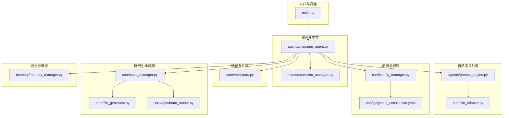
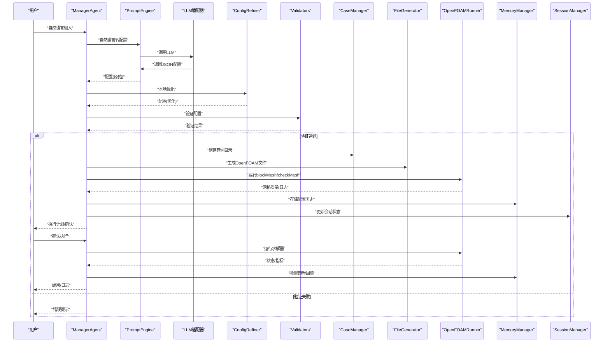
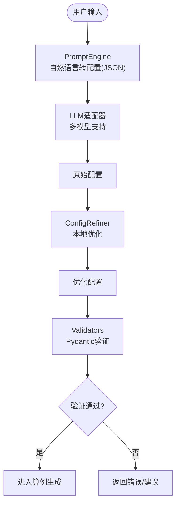
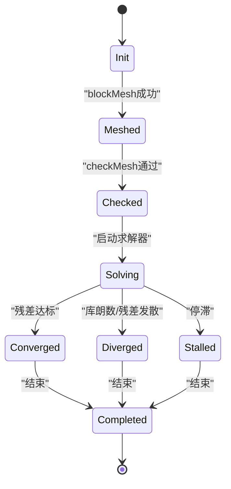
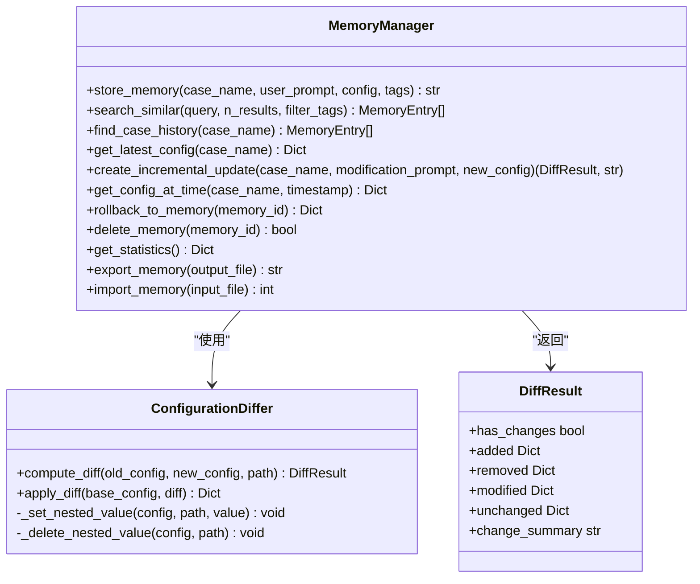
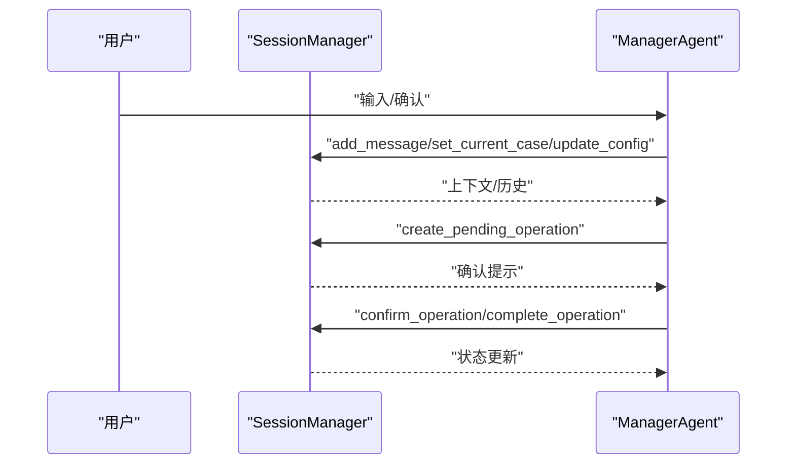
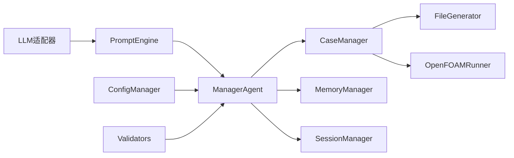

# 数据流架构

<cite>
**本文引用的文件**
- [main.py](file://openfoam_ai/main.py)
- [manager_agent.py](file://openfoam_ai/agents/manager_agent.py)
- [prompt_engine.py](file://openfoam_ai/agents/prompt_engine.py)
- [llm_adapter.py](file://openfoam_ai/core/llm_adapter.py)
- [config_manager.py](file://openfoam_ai/core/config_manager.py)
- [validators.py](file://openfoam_ai/core/validators.py)
- [case_manager.py](file://openfoam_ai/core/case_manager.py)
- [file_generator.py](file://openfoam_ai/core/file_generator.py)
- [openfoam_runner.py](file://openfoam_ai/core/openfoam_runner.py)
- [memory_manager.py](file://openfoam_ai/memory/memory_manager.py)
- [session_manager.py](file://openfoam_ai/memory/session_manager.py)
- [system_constitution.yaml](file://openfoam_ai/config/system_constitution.yaml)
- [utils.py](file://openfoam_ai/core/utils.py)
</cite>

## 目录
1. [引言](#引言)
2. [项目结构](#项目结构)
3. [核心组件](#核心组件)
4. [架构总览](#架构总览)
5. [详细组件分析](#详细组件分析)
6. [依赖关系分析](#依赖关系分析)
7. [性能考量](#性能考量)
8. [故障排查指南](#故障排查指南)
9. [结论](#结论)
10. [附录](#附录)

## 引言
本文件面向OpenFOAM AI系统的数据流架构，围绕“从用户输入到最终结果输出”的完整数据流转过程展开，重点说明：
- 自然语言到结构化配置的数据转换机制（LLM处理、配置优化与验证）
- 算例生命周期中的数据状态变化（创建、执行、监控、清理）
- 内存管理中向量数据的存储、检索与更新机制（向量数据库、增量更新、一致性）
- 数据缓存策略、增量更新与一致性保障
- 关键数据节点与处理步骤的数据流图与状态转换图

## 项目结构
OpenFOAM AI采用模块化分层设计：
- 顶层入口与交互：main.py
- 业务编排与状态管理：agents/manager_agent.py
- 自然语言到配置：agents/prompt_engine.py + core/llm_adapter.py
- 配置与规则：core/config_manager.py + config/system_constitution.yaml
- 验证与约束：core/validators.py
- 算例生命周期：core/case_manager.py + core/file_generator.py + core/openfoam_runner.py
- 记忆与会话：memory/memory_manager.py + memory/session_manager.py
- 通用工具：core/utils.py

图表来源
- [main.py:1-251](file://openfoam_ai/main.py#L1-L251)
- [manager_agent.py:1-458](file://openfoam_ai/agents/manager_agent.py#L1-L458)
- [prompt_engine.py:1-616](file://openfoam_ai/agents/prompt_engine.py#L1-L616)
- [llm_adapter.py:1-688](file://openfoam_ai/core/llm_adapter.py#L1-L688)
- [config_manager.py:1-227](file://openfoam_ai/core/config_manager.py#L1-L227)
- [system_constitution.yaml:1-103](file://openfoam_ai/config/system_constitution.yaml#L1-L103)
- [validators.py:1-441](file://openfoam_ai/core/validators.py#L1-L441)
- [case_manager.py:1-639](file://openfoam_ai/core/case_manager.py#L1-L639)
- [file_generator.py:1-635](file://openfoam_ai/core/file_generator.py#L1-L635)
- [openfoam_runner.py:1-548](file://openfoam_ai/core/openfoam_runner.py#L1-L548)
- [memory_manager.py:1-804](file://openfoam_ai/memory/memory_manager.py#L1-L804)
- [session_manager.py:1-565](file://openfoam_ai/memory/session_manager.py#L1-L565)

章节来源
- [main.py:1-251](file://openfoam_ai/main.py#L1-L251)
- [manager_agent.py:1-458](file://openfoam_ai/agents/manager_agent.py#L1-L458)

## 核心组件
- 自然语言到配置：PromptEngine负责将用户输入转为结构化配置；LLM适配器提供多模型支持；ConfigRefiner进行本地优化。
- 配置与规则：ConfigManager统一加载与缓存system_constitution.yaml，并提供默认值与环境变量覆盖。
- 验证与约束：validators.py基于Pydantic定义网格、求解器、边界条件与整体配置的硬约束，结合宪法规则进行校验。
- 算例生命周期：CaseManager管理算例目录与元数据；FileGenerator生成OpenFOAM字典文件；OpenFOAMRunner执行命令、解析日志、监控状态。
- 记忆与会话：MemoryManager基于向量数据库（或模拟）存储配置历史，支持相似检索与增量更新；SessionManager管理多轮对话上下文与待确认操作。
- 通用工具：utils.py提供JSON读写、目录确保、大小格式化与执行时间装饰器。

章节来源
- [prompt_engine.py:1-616](file://openfoam_ai/agents/prompt_engine.py#L1-L616)
- [llm_adapter.py:1-688](file://openfoam_ai/core/llm_adapter.py#L1-L688)
- [config_manager.py:1-227](file://openfoam_ai/core/config_manager.py#L1-L227)
- [validators.py:1-441](file://openfoam_ai/core/validators.py#L1-L441)
- [case_manager.py:1-639](file://openfoam_ai/core/case_manager.py#L1-L639)
- [file_generator.py:1-635](file://openfoam_ai/core/file_generator.py#L1-L635)
- [openfoam_runner.py:1-548](file://openfoam_ai/core/openfoam_runner.py#L1-L548)
- [memory_manager.py:1-804](file://openfoam_ai/memory/memory_manager.py#L1-L804)
- [session_manager.py:1-565](file://openfoam_ai/memory/session_manager.py#L1-L565)
- [utils.py:1-111](file://openfoam_ai/core/utils.py#L1-L111)

## 架构总览
OpenFOAM AI的数据流由“用户输入”驱动，经过LLM理解与本地优化，进入验证与配置生成，随后进入算例生命周期管理，期间通过记忆与会话进行状态持久化与增量更新，最终在OpenFOAM Runner中执行并监控，形成闭环。

图表来源
- [manager_agent.py:142-338](file://openfoam_ai/agents/manager_agent.py#L142-L338)
- [prompt_engine.py:92-126](file://openfoam_ai/agents/prompt_engine.py#L92-L126)
- [llm_adapter.py:577-671](file://openfoam_ai/core/llm_adapter.py#L577-L671)
- [validators.py:389-411](file://openfoam_ai/core/validators.py#L389-L411)
- [case_manager.py:51-86](file://openfoam_ai/core/case_manager.py#L51-L86)
- [file_generator.py:506-532](file://openfoam_ai/core/file_generator.py#L506-L532)
- [openfoam_runner.py:77-98](file://openfoam_ai/core/openfoam_runner.py#L77-L98)
- [memory_manager.py:291-345](file://openfoam_ai/memory/memory_manager.py#L291-L345)
- [session_manager.py:229-253](file://openfoam_ai/memory/session_manager.py#L229-L253)

## 详细组件分析

### 自然语言到结构化配置的数据转换
- PromptEngine将用户输入转为结构化配置，支持真实API与Mock模式；ConfigRefiner对配置进行本地优化（网格、时间步长等）。
- LLM适配器支持多家模型，统一接口与错误处理，便于替换与扩展。
- ConfigManager加载system_constitution.yaml并提供默认值与环境变量覆盖，确保配置符合宪法约束。

图表来源
- [prompt_engine.py:92-126](file://openfoam_ai/agents/prompt_engine.py#L92-L126)
- [prompt_engine.py:476-533](file://openfoam_ai/agents/prompt_engine.py#L476-L533)
- [llm_adapter.py:577-671](file://openfoam_ai/core/llm_adapter.py#L577-L671)
- [validators.py:389-411](file://openfoam_ai/core/validators.py#L389-L411)

章节来源
- [prompt_engine.py:1-616](file://openfoam_ai/agents/prompt_engine.py#L1-L616)
- [llm_adapter.py:1-688](file://openfoam_ai/core/llm_adapter.py#L1-L688)
- [config_manager.py:1-227](file://openfoam_ai/core/config_manager.py#L1-L227)
- [system_constitution.yaml:1-103](file://openfoam_ai/config/system_constitution.yaml#L1-L103)

### 算例生命周期中的数据状态变化
- 创建阶段：CaseManager创建目录结构并写入元数据；FileGenerator生成blockMeshDict、controlDict、fvSchemes、fvSolution、transportProperties以及初始场文件。
- 执行阶段：OpenFOAMRunner执行blockMesh、checkMesh；随后运行求解器，实时解析日志，提取时间、库朗数与残差，监控收敛与发散。
- 监控阶段：SolverMonitor维护指标历史，检测停滞与收敛；OpenFOAMRunner根据宪法阈值判定状态。
- 清理阶段：CaseManager清理中间结果，保留网格与配置；OpenFOAMRunner提供清理接口。

图表来源
- [case_manager.py:223-241](file://openfoam_ai/core/case_manager.py#L223-L241)
- [openfoam_runner.py:16-25](file://openfoam_ai/core/openfoam_runner.py#L16-L25)
- [openfoam_runner.py:389-409](file://openfoam_ai/core/openfoam_runner.py#L389-L409)
- [openfoam_runner.py:429-517](file://openfoam_ai/core/openfoam_runner.py#L429-L517)

章节来源
- [case_manager.py:1-639](file://openfoam_ai/core/case_manager.py#L1-L639)
- [file_generator.py:1-635](file://openfoam_ai/core/file_generator.py#L1-L635)
- [openfoam_runner.py:1-548](file://openfoam_ai/core/openfoam_runner.py#L1-L548)

### 内存管理与向量数据存储、检索与更新
- MemoryManager提供向量数据库（ChromaDB或模拟）存储配置历史，支持相似性检索与增量更新（Diff update）。
- ConfigurationDiffer实现深度对比，生成added/removed/modified/unchanged与变更摘要，支持apply_diff应用差异。
- get_latest_config、find_case_history、get_config_at_time、rollback_to_memory等接口保障一致性与可追溯性。
- export_memory/import_memory支持数据迁移与备份。

图表来源
- [memory_manager.py:198-583](file://openfoam_ai/memory/memory_manager.py#L198-L583)
- [memory_manager.py:64-196](file://openfoam_ai/memory/memory_manager.py#L64-L196)

章节来源
- [memory_manager.py:1-804](file://openfoam_ai/memory/memory_manager.py#L1-L804)

### 会话管理与上下文持久化
- SessionManager管理多轮对话历史、当前算例上下文、意图追踪与待确认操作队列。
- 支持高风险操作的风险等级划分与确认提示生成，提供自动保存与导出功能。
- 与ManagerAgent协作，确保用户交互与系统动作的一致性。

图表来源
- [session_manager.py:229-448](file://openfoam_ai/memory/session_manager.py#L229-L448)
- [manager_agent.py:176-206](file://openfoam_ai/agents/manager_agent.py#L176-L206)

章节来源
- [session_manager.py:1-565](file://openfoam_ai/memory/session_manager.py#L1-L565)
- [manager_agent.py:1-458](file://openfoam_ai/agents/manager_agent.py#L1-L458)

## 依赖关系分析
- 低耦合高内聚：各模块职责清晰，通过明确接口交互；例如ManagerAgent仅依赖抽象接口（LLM、验证器、生成器等）。
- 配置中心化：ConfigManager集中加载宪法与默认值，validators与runner均通过其读取阈值。
- 数据一致性：MemoryManager与CaseManager分别负责配置历史与算例元数据，两者通过会话与执行结果保持一致。
- 可扩展性：LLM适配器工厂模式支持新增模型；FileGenerator按OpenFOAM规范扩展更多字典类型。

图表来源
- [llm_adapter.py:577-671](file://openfoam_ai/core/llm_adapter.py#L577-L671)
- [prompt_engine.py:92-126](file://openfoam_ai/agents/prompt_engine.py#L92-L126)
- [config_manager.py:94-211](file://openfoam_ai/core/config_manager.py#L94-L211)
- [validators.py:389-411](file://openfoam_ai/core/validators.py#L389-L411)
- [case_manager.py:51-86](file://openfoam_ai/core/case_manager.py#L51-L86)
- [file_generator.py:506-532](file://openfoam_ai/core/file_generator.py#L506-L532)
- [openfoam_runner.py:77-98](file://openfoam_ai/core/openfoam_runner.py#L77-L98)
- [memory_manager.py:291-345](file://openfoam_ai/memory/memory_manager.py#L291-L345)
- [session_manager.py:229-253](file://openfoam_ai/memory/session_manager.py#L229-L253)

章节来源
- [manager_agent.py:1-458](file://openfoam_ai/agents/manager_agent.py#L1-L458)
- [config_manager.py:1-227](file://openfoam_ai/core/config_manager.py#L1-L227)

## 性能考量
- LLM调用成本：PromptEngine在Mock模式下避免外部依赖，生产模式下建议缓存常用提示与结果，减少重复调用。
- 配置验证：validators使用Pydantic进行快速硬约束校验，避免无效配置进入后续流程。
- OpenFOAM执行：OpenFOAMRunner按需解析日志，避免全量读取；SolverMonitor限制历史长度，降低内存占用。
- 向量检索：MemoryManager在ChromaDB不可用时回退模拟模式，建议在生产环境部署ChromaDB以获得更好的相似检索性能。
- 并行与资源：ConfigManager读取CPU核数与内存限制，runner据此设定合理阈值，避免资源耗尽。

## 故障排查指南
- LLM连接失败：检查API Key与网络；LLMFactory提供错误返回，PromptEngine在Mock模式下降级。
- OpenFOAM命令失败：OpenFOAMRunner捕获返回码与异常，写入日志文件；检查OpenFOAM安装与PATH。
- 配置验证失败：validators输出具体错误；建议结合ConfigRefiner进行本地修正。
- 发散/停滞：OpenFOAMRunner根据宪法阈值判定状态；SolverMonitor检测停滞与收敛；MemoryManager支持回滚到历史版本。
- 记忆库异常：MemoryManager提供delete_memory与export/import功能，便于恢复与迁移。

章节来源
- [llm_adapter.py:577-671](file://openfoam_ai/core/llm_adapter.py#L577-L671)
- [openfoam_runner.py:118-198](file://openfoam_ai/core/openfoam_runner.py#L118-L198)
- [validators.py:389-411](file://openfoam_ai/core/validators.py#L389-L411)
- [memory_manager.py:562-583](file://openfoam_ai/memory/memory_manager.py#L562-L583)

## 结论
OpenFOAM AI系统通过“自然语言→结构化配置→验证→生成→执行→监控→记忆”的闭环，实现了从用户意图到仿真结果的高效转化。系统在数据一致性、可追溯性与可扩展性方面具备良好设计，MemoryManager与SessionManager进一步增强了用户体验与工程化能力。建议在生产环境中完善ChromaDB部署、引入缓存与批处理策略，并持续优化LLM提示词与验证规则以提升稳定性与准确性。

## 附录
- 关键数据节点
  - 配置字典：task_id、physics_type、geometry、solver、boundary_conditions、nu等
  - 算例元数据：CaseInfo（name、path、created_at、modified_at、physics_type、solver、status）
  - 记忆条目：MemoryEntry（memory_id、case_name、user_prompt、config_json、timestamp、tags、embedding）
  - 会话上下文：ConversationContext（session_id、current_case、current_config、conversation_stage、last_intent、pending_operations、metadata）

- 处理步骤清单
  - LLM理解与优化：PromptEngine + ConfigRefiner
  - 配置验证：validators + ConfigManager
  - 算例生成：CaseManager + FileGenerator
  - 执行与监控：OpenFOAMRunner + SolverMonitor
  - 记忆与会话：MemoryManager + SessionManager