# 系统架构

<cite>
**本文档引用的文件**
- [README.md](file://openfoam_ai/README.md)
- [main.py](file://openfoam_ai/main.py)
- [main_phase2.py](file://openfoam_ai/main_phase2.py)
- [main_phase3.py](file://openfoam_ai/main_phase3.py)
- [main_phase4.py](file://openfoam_ai/main_phase4.py)
- [manager_agent.py](file://openfoam_ai/agents/manager_agent.py)
- [critic_agent.py](file://openfoam_ai/agents/critic_agent.py)
- [geometry_image_agent.py](file://openfoam_ai/agents/geometry_image_agent.py)
- [postprocessing_agent.py](file://openfoam_ai/agents/postprocessing_agent.py)
- [self_healing_agent.py](file://openfoam_ai/agents/self_healing_agent.py)
- [case_manager.py](file://openfoam_ai/core/case_manager.py)
- [openfoam_runner.py](file://openfoam_ai/core/openfoam_runner.py)
- [memory_manager.py](file://openfoam_ai/memory/memory_manager.py)
- [session_manager.py](file://openfoam_ai/memory/session_manager.py)
- [requirements.txt](file://openfoam_ai/requirements.txt)
</cite>

## 目录
1. [引言](#引言)
2. [项目结构](#项目结构)
3. [核心组件](#核心组件)
4. [架构总览](#架构总览)
5. [详细组件分析](#详细组件分析)
6. [依赖关系分析](#依赖关系分析)
7. [性能考虑](#性能考虑)
8. [故障排查指南](#故障排查指南)
9. [结论](#结论)
10. [附录](#附录)

## 引言
本系统是一个基于大语言模型的自动化CFD仿真智能体平台，围绕OpenFOAM计算引擎构建，提供从自然语言需求到网格生成、求解执行、结果可视化的全流程自动化服务。系统采用Agent架构模式，将任务拆分为Preprocessing（预处理）、Execution（执行）、Postprocessing（后处理）三大Agent协同工作，并通过Manager Agent统一调度与交互。

系统具备以下关键能力：
- 基于自然语言的算例配置生成与优化
- 网格质量自动检查与修复
- 求解稳定性监控与自愈
- 物理一致性验证
- 记忆性建模与增量修改
- 多模态后处理与可视化

## 项目结构
系统采用模块化分层组织，核心目录与职责如下：
- openfoam_ai/agents：智能体模块，包含Manager Agent与各类专用Agent
- openfoam_ai/core：核心功能模块，负责算例管理、OpenFOAM命令执行、验证器等
- openfoam_ai/memory：记忆与会话管理模块
- openfoam_ai/ui：用户界面（CLI与Web）
- openfoam_ai/utils：通用工具集
- openfoam_ai/docker：容器化部署配置
- openfoam_ai/tests：单元测试与演示脚本

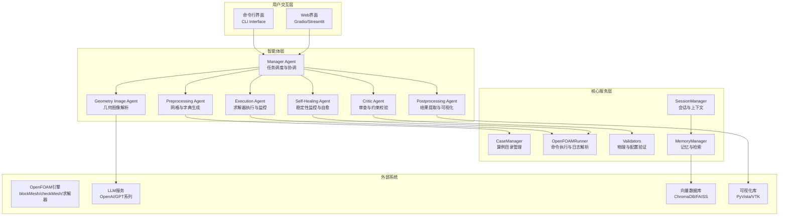

**图表来源**
- [README.md:104-128](file://openfoam_ai/README.md#L104-L128)
- [manager_agent.py:38-74](file://openfoam_ai/agents/manager_agent.py#L38-L74)
- [case_manager.py:27-50](file://openfoam_ai/core/case_manager.py#L27-L50)
- [openfoam_runner.py:44-76](file://openfoam_ai/core/openfoam_runner.py#L44-L76)

**章节来源**
- [README.md:130-150](file://openfoam_ai/README.md#L130-L150)

## 核心组件
本节概述系统的关键组件及其职责与交互关系。

- Manager Agent（任务调度与协调）
  - 负责意图识别、计划生成、执行协调与状态管理
  - 与Prompt Engine协作进行配置生成与优化
  - 与CaseManager、OpenFOAMRunner、MemoryManager、SessionManager等核心模块交互

- Preprocessing Agent（预处理）
  - 负责网格生成、字典文件生成、边界条件设置
  - 与CaseManager协作创建标准算例目录结构
  - 与OpenFOAMRunner协作执行blockMesh与checkMesh

- Execution Agent（执行）
  - 负责求解器执行与实时监控
  - 与OpenFOAMRunner协作解析日志、检测发散与停滞
  - 与Self-Healing Agent协作实现自愈重启

- Postprocessing Agent（后处理）
  - 负责结果数据提取、自然语言绘图请求解析、PyVista脚本生成与执行
  - 支持多种绘图类型与输出格式
  - 与PyVista/VTK集成实现高质量可视化

- 几何图像Agent（多模态）
  - 基于视觉模型解析几何图像，提取关键特征并转换为OpenFOAM配置
  - 与LLM服务集成，遵循AI约束宪法进行硬约束验证

- 审查Agent（质量保障）
  - 基于AI约束宪法进行硬约束检查与审查
  - 与Validator协作进行物理一致性验证

- 自愈Agent（稳定性保障）
  - 实时监控求解稳定性，检测发散与停滞
  - 自动调整求解参数、从最新时间步重启、增加非正交修正器

- 记忆与会话管理
  - MemoryManager：基于ChromaDB的向量存储与相似性检索，支持增量修改
  - SessionManager：多轮对话上下文管理、高风险操作确认机制

**章节来源**
- [manager_agent.py:38-74](file://openfoam_ai/agents/manager_agent.py#L38-L74)
- [postprocessing_agent.py:108-117](file://openfoam_ai/agents/postprocessing_agent.py#L108-L117)
- [geometry_image_agent.py:78-87](file://openfoam_ai/agents/geometry_image_agent.py#L78-L87)
- [critic_agent.py:286-300](file://openfoam_ai/agents/critic_agent.py#L286-L300)
- [self_healing_agent.py:232-241](file://openfoam_ai/agents/self_healing_agent.py#L232-L241)
- [memory_manager.py:198-206](file://openfoam_ai/memory/memory_manager.py#L198-L206)
- [session_manager.py:171-180](file://openfoam_ai/memory/session_manager.py#L171-L180)

## 架构总览
系统采用分层架构与Agent协作模式，通过统一的Manager Agent进行任务编排与状态管理。整体架构遵循“意图识别—计划生成—执行协调—结果汇总”的工作流。

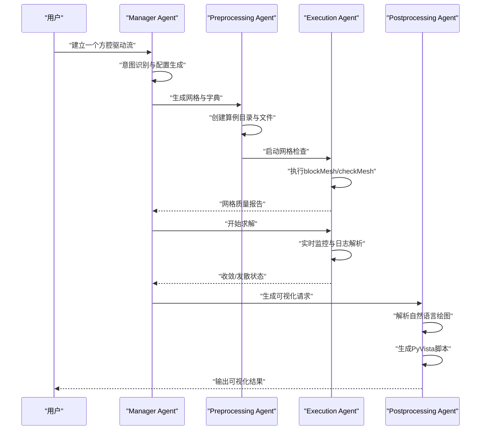

**图表来源**
- [manager_agent.py:75-104](file://openfoam_ai/agents/manager_agent.py#L75-L104)
- [manager_agent.py:207-266](file://openfoam_ai/agents/manager_agent.py#L207-L266)
- [openfoam_runner.py:99-198](file://openfoam_ai/core/openfoam_runner.py#L99-L198)
- [postprocessing_agent.py:172-239](file://openfoam_ai/agents/postprocessing_agent.py#L172-L239)

**章节来源**
- [README.md:104-128](file://openfoam_ai/README.md#L104-L128)

## 详细组件分析

### Manager Agent（任务调度与协调）
Manager Agent是系统的中枢，负责：
- 意图识别：通过关键词匹配识别创建、修改、运行、状态查询等意图
- 配置生成：调用Prompt Engine将自然语言转换为OpenFOAM配置
- 计划生成：生成可执行的任务计划，包含步骤与确认需求
- 执行协调：协调各Agent完成任务，管理会话状态与确认流程
- 状态管理：维护当前算例、配置与执行历史

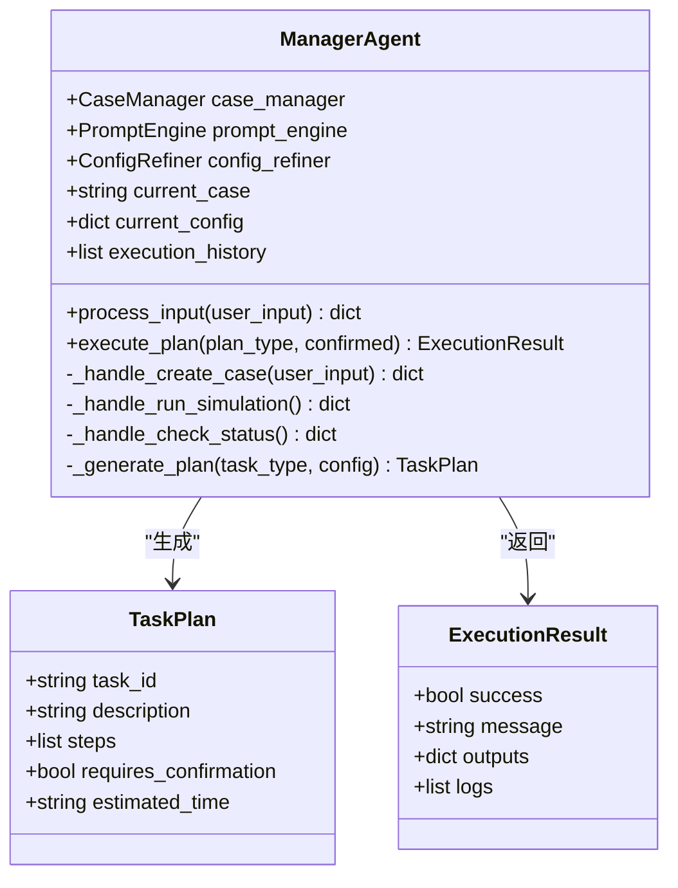

**图表来源**
- [manager_agent.py:19-36](file://openfoam_ai/agents/manager_agent.py#L19-L36)
- [manager_agent.py:50-74](file://openfoam_ai/agents/manager_agent.py#L50-L74)

**章节来源**
- [manager_agent.py:75-174](file://openfoam_ai/agents/manager_agent.py#L75-L174)
- [manager_agent.py:176-338](file://openfoam_ai/agents/manager_agent.py#L176-L338)

### Preprocessing Agent（预处理）
预处理Agent负责：
- 算例目录创建与标准化
- 网格生成与字典文件生成
- 边界条件设置与初始场配置
- 网格质量检查与报告

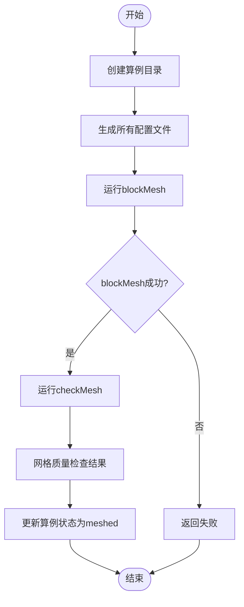

**图表来源**
- [manager_agent.py:207-257](file://openfoam_ai/agents/manager_agent.py#L207-L257)
- [case_manager.py:51-86](file://openfoam_ai/core/case_manager.py#L51-L86)
- [openfoam_runner.py:77-97](file://openfoam_ai/core/openfoam_runner.py#L77-L97)

**章节来源**
- [manager_agent.py:207-257](file://openfoam_ai/agents/manager_agent.py#L207-L257)
- [case_manager.py:51-86](file://openfoam_ai/core/case_manager.py#L51-L86)

### Execution Agent（执行）
执行Agent负责：
- 求解器启动与实时监控
- 日志解析与指标提取
- 发散检测与状态判定
- 与自愈Agent协作实现自动修复

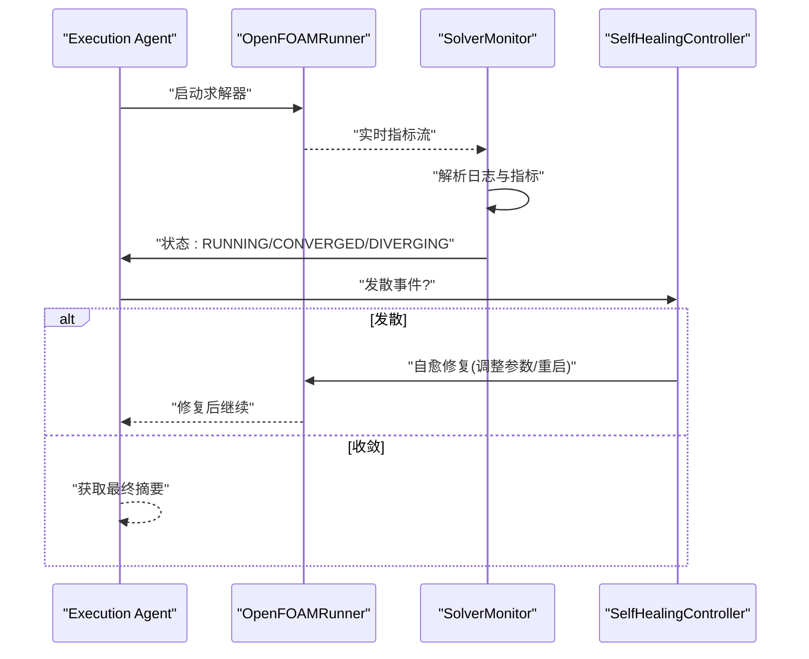

**图表来源**
- [openfoam_runner.py:99-198](file://openfoam_ai/core/openfoam_runner.py#L99-L198)
- [openfoam_runner.py:429-516](file://openfoam_ai/core/openfoam_runner.py#L429-L516)
- [self_healing_agent.py:479-614](file://openfoam_ai/agents/self_healing_agent.py#L479-L614)

**章节来源**
- [openfoam_runner.py:99-198](file://openfoam_ai/core/openfoam_runner.py#L99-L198)
- [openfoam_runner.py:429-516](file://openfoam_ai/core/openfoam_runner.py#L429-L516)
- [self_healing_agent.py:479-614](file://openfoam_ai/agents/self_healing_agent.py#L479-L614)

### Postprocessing Agent（后处理）
后处理Agent负责：
- 自然语言绘图请求解析
- PyVista脚本生成与执行
- 结果质量验证与报告生成
- 多格式输出（PNG/PDF/SVG/VTK）

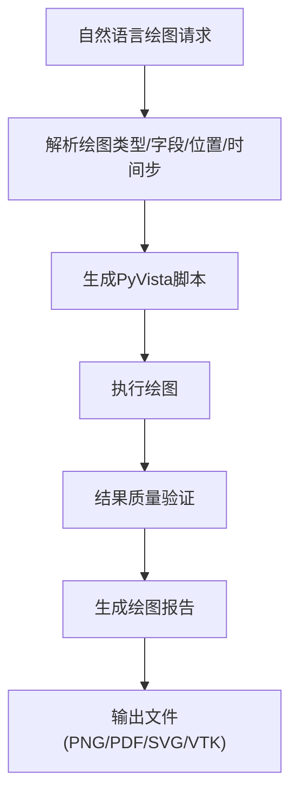

**图表来源**
- [postprocessing_agent.py:172-239](file://openfoam_ai/agents/postprocessing_agent.py#L172-L239)
- [postprocessing_agent.py:241-343](file://openfoam_ai/agents/postprocessing_agent.py#L241-L343)
- [postprocessing_agent.py:345-491](file://openfoam_ai/agents/postprocessing_agent.py#L345-L491)

**章节来源**
- [postprocessing_agent.py:172-239](file://openfoam_ai/agents/postprocessing_agent.py#L172-L239)
- [postprocessing_agent.py:241-343](file://openfoam_ai/agents/postprocessing_agent.py#L241-L343)
- [postprocessing_agent.py:345-491](file://openfoam_ai/agents/postprocessing_agent.py#L345-L491)

### 几何图像Agent（多模态）
几何图像Agent负责：
- 几何图像解析与特征提取
- 结构化配置参数生成
- Pydantic硬约束验证
- 与LLM服务集成进行高级分析

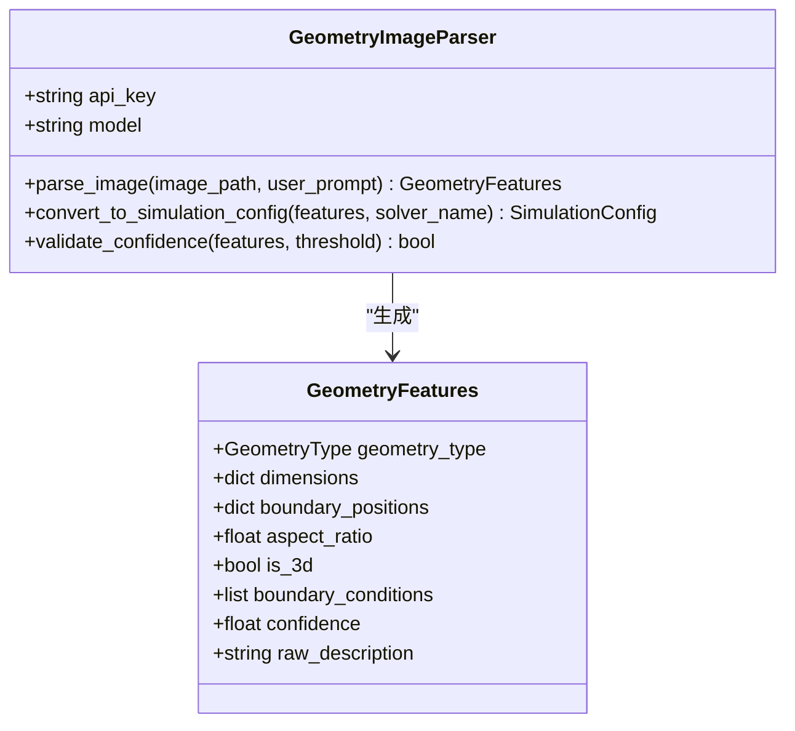

**图表来源**
- [geometry_image_agent.py:78-169](file://openfoam_ai/agents/geometry_image_agent.py#L78-L169)
- [geometry_image_agent.py:350-369](file://openfoam_ai/agents/geometry_image_agent.py#L350-L369)

**章节来源**
- [geometry_image_agent.py:184-348](file://openfoam_ai/agents/geometry_image_agent.py#L184-L348)
- [geometry_image_agent.py:371-482](file://openfoam_ai/agents/geometry_image_agent.py#L371-L482)

### 审查Agent（质量保障）
审查Agent负责：
- 基于AI约束宪法的硬约束检查
- 问题识别与评分体系
- 建议生成与审查报告
- 与Builder Agent形成对抗机制

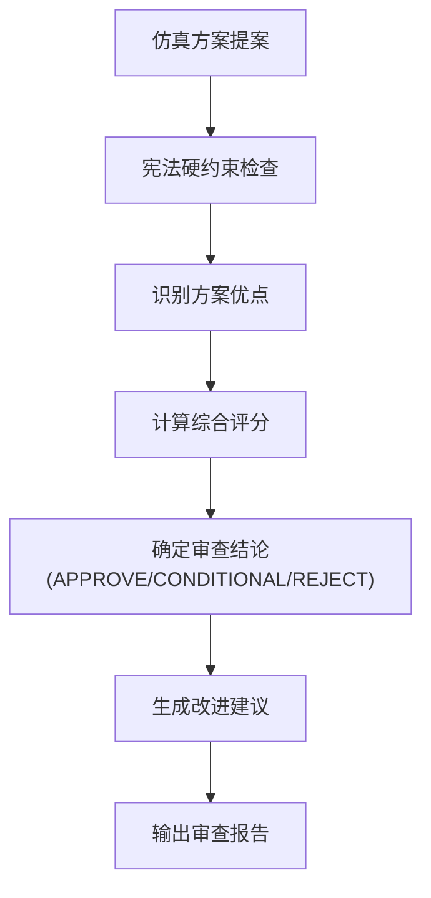

**图表来源**
- [critic_agent.py:360-407](file://openfoam_ai/agents/critic_agent.py#L360-L407)
- [critic_agent.py:444-479](file://openfoam_ai/agents/critic_agent.py#L444-L479)

**章节来源**
- [critic_agent.py:114-130](file://openfoam_ai/agents/critic_agent.py#L114-L130)
- [critic_agent.py:360-407](file://openfoam_ai/agents/critic_agent.py#L360-L407)

### 自愈Agent（稳定性保障）
自愈Agent负责：
- 实时监控求解稳定性
- 发散类型检测与事件记录
- 自动修复策略执行
- 配置回滚与报告生成

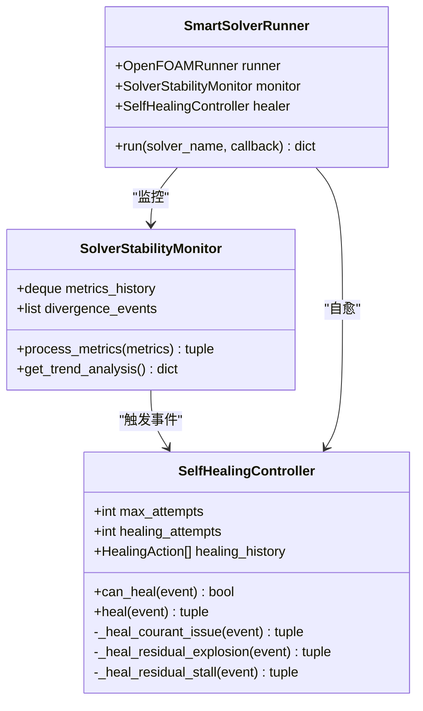

**图表来源**
- [self_healing_agent.py:58-85](file://openfoam_ai/agents/self_healing_agent.py#L58-L85)
- [self_healing_agent.py:232-241](file://openfoam_ai/agents/self_healing_agent.py#L232-L241)
- [self_healing_agent.py:479-490](file://openfoam_ai/agents/self_healing_agent.py#L479-L490)

**章节来源**
- [self_healing_agent.py:86-196](file://openfoam_ai/agents/self_healing_agent.py#L86-L196)
- [self_healing_agent.py:264-441](file://openfoam_ai/agents/self_healing_agent.py#L264-L441)
- [self_healing_agent.py:479-614](file://openfoam_ai/agents/self_healing_agent.py#L479-L614)

### 记忆与会话管理
记忆与会话管理模块负责：
- 算例配置的历史存储与检索
- 增量修改（Diff update）与版本管理
- 多轮对话上下文与高风险操作确认
- 会话状态的持久化与导出

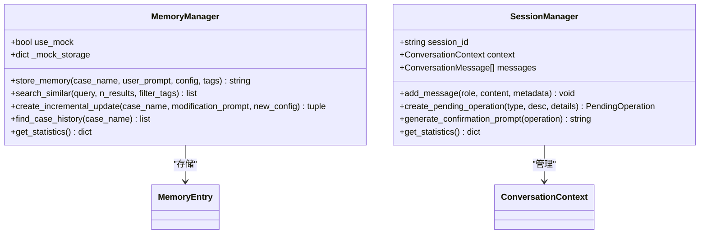

**图表来源**
- [memory_manager.py:198-241](file://openfoam_ai/memory/memory_manager.py#L198-L241)
- [session_manager.py:171-227](file://openfoam_ai/memory/session_manager.py#L171-L227)

**章节来源**
- [memory_manager.py:291-345](file://openfoam_ai/memory/memory_manager.py#L291-L345)
- [memory_manager.py:474-520](file://openfoam_ai/memory/memory_manager.py#L474-L520)
- [session_manager.py:304-333](file://openfoam_ai/memory/session_manager.py#L304-L333)
- [session_manager.py:401-438](file://openfoam_ai/memory/session_manager.py#L401-L438)

## 依赖关系分析
系统依赖关系呈现清晰的分层与模块化特征，各模块间通过明确定义的接口进行交互。

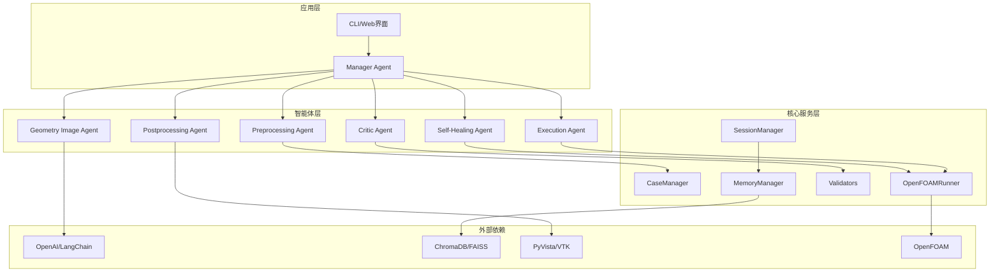

**图表来源**
- [requirements.txt:4-31](file://openfoam_ai/requirements.txt#L4-L31)

**章节来源**
- [requirements.txt:1-40](file://openfoam_ai/requirements.txt#L1-L40)

## 性能考虑
- 并行化与异步处理：求解器执行采用流式日志解析，避免阻塞主线程
- 缓存与重用：算例状态与配置缓存减少重复计算
- 内存管理：会话与记忆管理采用分页与压缩策略
- 可扩展性：模块化设计支持插件化扩展与分布式部署
- 资源隔离：Docker容器化部署确保资源隔离与环境一致性

## 故障排查指南
常见问题与解决方案：
- OpenFOAM环境未检测到：检查OpenFOAM安装与PATH配置
- LLM依赖缺失：安装openai、langchain-openai或使用Mock模式
- 向量数据库不可用：ChromaDB初始化失败时自动回退到模拟模式
- PyVista依赖缺失：后处理功能降级为Mock模式
- 配置验证失败：检查配置参数是否符合AI约束宪法要求

**章节来源**
- [README.md:208-237](file://openfoam_ai/README.md#L208-L237)

## 结论
本系统通过Agent架构模式实现了从自然语言到CFD仿真的端到端自动化，结合AI约束宪法与多智能体审查机制，确保了配置的合理性与执行的可靠性。系统具备良好的扩展性与可维护性，为CFD工程实践提供了智能化支撑。

## 附录

### 系统上下文图
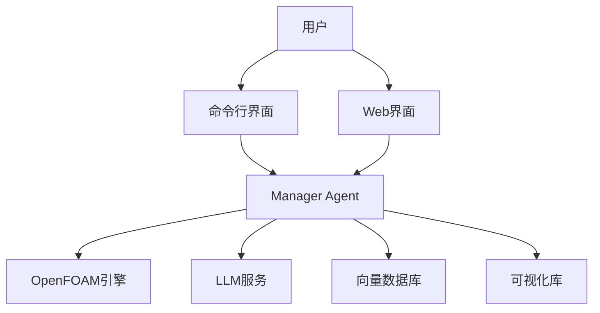

**图表来源**
- [README.md:104-128](file://openfoam_ai/README.md#L104-L128)

### 技术栈与版本兼容性
- Python 3.10+
- OpenFOAM Foundation v11 / ESI v2312
- LLM框架：LangChain、OpenAI
- 向量数据库：ChromaDB、FAISS
- 可视化：PyVista、VTK
- Web框架：Gradio、Streamlit
- 数据验证：Pydantic
- 科学计算：NumPy、SciPy、Pandas、Matplotlib

**章节来源**
- [README.md:19-23](file://openfoam_ai/README.md#L19-L23)
- [requirements.txt:1-40](file://openfoam_ai/requirements.txt#L1-L40)

### 部署拓扑
- 单机部署：适用于开发与测试环境
- 容器化部署：Docker Compose支持一键部署
- 分布式部署：支持多节点求解器集群
- 云端部署：支持公有云与私有云环境

**章节来源**
- [README.md:35-36](file://openfoam_ai/README.md#L35-L36)