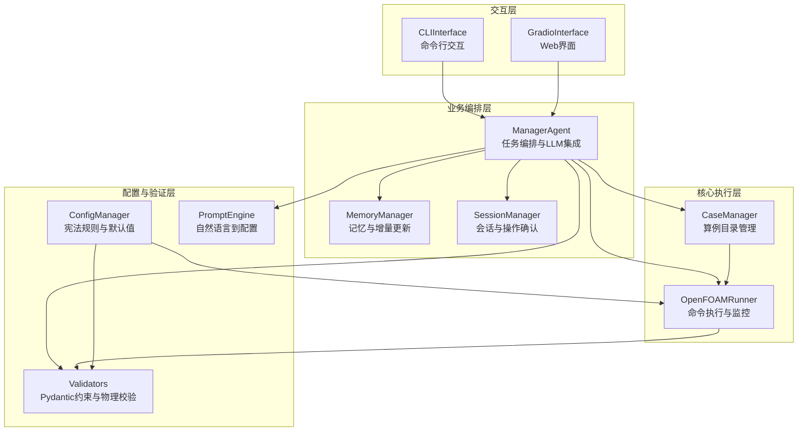
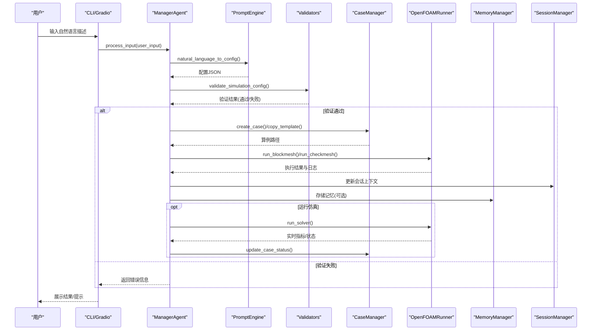
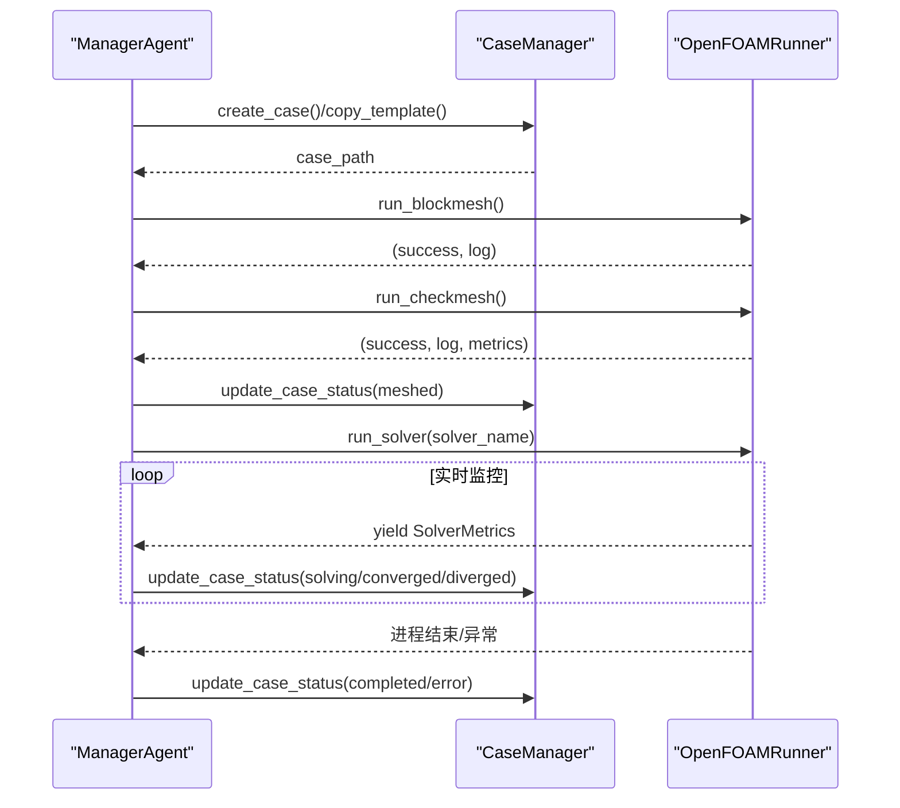
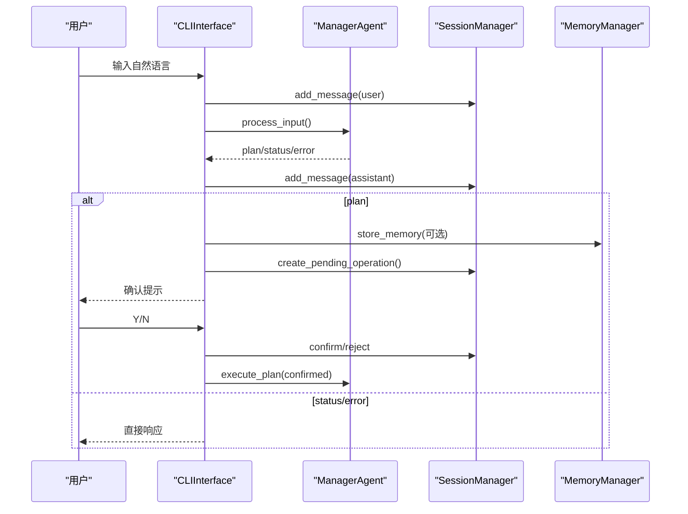
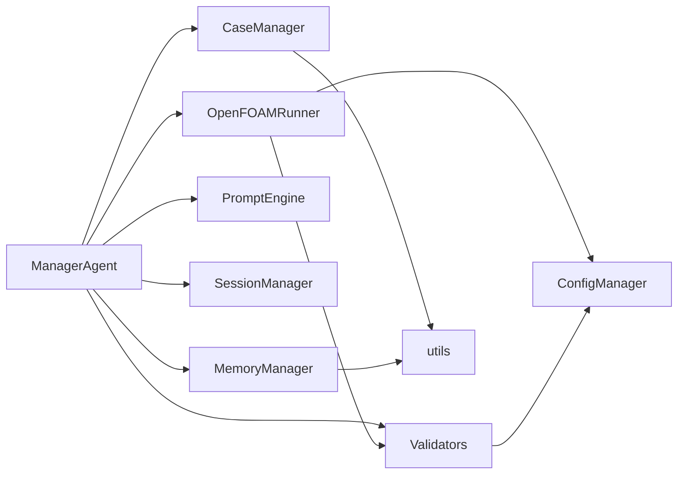

# 组件交互设计

<cite>
**本文档引用的文件**
- [openfoam_ai/core/case_manager.py](file://openfoam_ai/core/case_manager.py)
- [openfoam_ai/core/openfoam_runner.py](file://openfoam_ai/core/openfoam_runner.py)
- [openfoam_ai/agents/manager_agent.py](file://openfoam_ai/agents/manager_agent.py)
- [openfoam_ai/memory/memory_manager.py](file://openfoam_ai/memory/memory_manager.py)
- [openfoam_ai/memory/session_manager.py](file://openfoam_ai/memory/session_manager.py)
- [openfoam_ai/ui/cli_interface.py](file://openfoam_ai/ui/cli_interface.py)
- [openfoam_ai/ui/gradio_interface.py](file://openfoam_ai/ui/gradio_interface.py)
- [openfoam_ai/core/validators.py](file://openfoam_ai/core/validators.py)
- [openfoam_ai/core/config_manager.py](file://openfoam_ai/core/config_manager.py)
- [openfoam_ai/config/system_constitution.yaml](file://openfoam_ai/config/system_constitution.yaml)
- [openfoam_ai/core/utils.py](file://openfoam_ai/core/utils.py)
- [openfoam_ai/agents/prompt_engine.py](file://openfoam_ai/agents/prompt_engine.py)
- [openfoam_ai/main.py](file://openfoam_ai/main.py)
</cite>

## 目录
1. [简介](#简介)
2. [项目结构](#项目结构)
3. [核心组件](#核心组件)
4. [架构总览](#架构总览)
5. [详细组件分析](#详细组件分析)
6. [依赖关系分析](#依赖关系分析)
7. [性能考虑](#性能考虑)
8. [故障排查指南](#故障排查指南)
9. [结论](#结论)
10. [附录](#附录)

## 简介
本文件面向OpenFOAM AI系统的组件交互设计，聚焦以下目标：
- 明确核心组件之间的接口定义、依赖关系与调用顺序
- 详述CaseManager与OpenFOAMRunner之间的协调机制（命令传递、状态同步、错误传播）
- 文档化UI组件（CLI与Web）与核心业务逻辑的交互模式
- 解释组件解耦设计与依赖注入机制
- 给出组件生命周期管理、资源共享与并发控制策略
- 提供组件交互图与时序图，展示典型场景下的调用流程与数据交换

## 项目结构
OpenFOAM AI采用“核心业务逻辑 + 交互界面 + 记忆与会话 + 配置与验证”的分层组织：
- 核心业务逻辑：CaseManager（算例目录管理）、OpenFOAMRunner（命令执行与监控）、ManagerAgent（任务编排与LLM集成）
- 交互界面：CLIInterface（命令行）、GradioInterface（Web界面）
- 记忆与会话：MemoryManager（历史配置向量检索与增量更新）、SessionManager（多轮对话上下文与操作确认）
- 配置与验证：ConfigManager（宪法规则加载与默认值合并）、Validators（Pydantic约束与物理一致性校验）、PromptEngine（自然语言到配置转换）
- 工具与入口：utils（通用工具）、main（主入口）

图表来源
- [openfoam_ai/ui/cli_interface.py:17-138](file://openfoam_ai/ui/cli_interface.py#L17-L138)
- [openfoam_ai/ui/gradio_interface.py:31-122](file://openfoam_ai/ui/gradio_interface.py#L31-L122)
- [openfoam_ai/agents/manager_agent.py:38-105](file://openfoam_ai/agents/manager_agent.py#L38-L105)
- [openfoam_ai/memory/memory_manager.py:198-242](file://openfoam_ai/memory/memory_manager.py#L198-L242)
- [openfoam_ai/memory/session_manager.py:171-228](file://openfoam_ai/memory/session_manager.py#L171-L228)
- [openfoam_ai/core/case_manager.py:27-87](file://openfoam_ai/core/case_manager.py#L27-L87)
- [openfoam_ai/core/openfoam_runner.py:44-116](file://openfoam_ai/core/openfoam_runner.py#L44-L116)
- [openfoam_ai/core/validators.py:13-16](file://openfoam_ai/core/validators.py#L13-L16)
- [openfoam_ai/core/config_manager.py:94-120](file://openfoam_ai/core/config_manager.py#L94-L120)
- [openfoam_ai/agents/prompt_engine.py:20-91](file://openfoam_ai/agents/prompt_engine.py#L20-L91)

章节来源
- [openfoam_ai/main.py:19-251](file://openfoam_ai/main.py#L19-L251)

## 核心组件
- CaseManager：负责创建/复制/清理/OpenFOAM算例目录，维护算例元数据与状态
- OpenFOAMRunner：封装blockMesh/checkMesh/求解器执行，实时解析日志、检测收敛/发散/停滞，提供状态同步与错误传播
- ManagerAgent：接收用户输入，通过PromptEngine生成配置，经Validators验证，协调CM与OR执行，管理Session/Memory
- CLIInterface/GradioInterface：分别提供命令行与Web交互，桥接ManagerAgent与用户
- MemoryManager：基于ChromaDB或模拟模式的向量检索与增量Diff更新
- SessionManager：多轮对话上下文、当前算例、意图追踪、待确认操作队列
- Validators/ConfigManager：Pydantic约束与宪法规则（system_constitution.yaml）加载与合并
- PromptEngine：自然语言到结构化配置的转换与解释
- utils：通用工具（JSON读写、目录创建、格式化等）

章节来源
- [openfoam_ai/core/case_manager.py:27-262](file://openfoam_ai/core/case_manager.py#L27-L262)
- [openfoam_ai/core/openfoam_runner.py:44-427](file://openfoam_ai/core/openfoam_runner.py#L44-L427)
- [openfoam_ai/agents/manager_agent.py:38-381](file://openfoam_ai/agents/manager_agent.py#L38-L381)
- [openfoam_ai/ui/cli_interface.py:17-138](file://openfoam_ai/ui/cli_interface.py#L17-L138)
- [openfoam_ai/ui/gradio_interface.py:31-122](file://openfoam_ai/ui/gradio_interface.py#L31-L122)
- [openfoam_ai/memory/memory_manager.py:198-688](file://openfoam_ai/memory/memory_manager.py#L198-L688)
- [openfoam_ai/memory/session_manager.py:171-489](file://openfoam_ai/memory/session_manager.py#L171-L489)
- [openfoam_ai/core/validators.py:13-411](file://openfoam_ai/core/validators.py#L13-L411)
- [openfoam_ai/core/config_manager.py:94-218](file://openfoam_ai/core/config_manager.py#L94-L218)
- [openfoam_ai/agents/prompt_engine.py:20-216](file://openfoam_ai/agents/prompt_engine.py#L20-L216)
- [openfoam_ai/core/utils.py:16-111](file://openfoam_ai/core/utils.py#L16-L111)

## 架构总览
系统采用“UI → ManagerAgent → 核心执行（CM/OR）/验证/记忆/会话”的分层架构。ManagerAgent作为编排中枢，负责：
- 意图识别与任务规划
- LLM配置生成与本地优化
- 配置验证与错误回退
- 算例生命周期管理（创建/清理/状态更新）
- 求解器执行与监控（含状态同步与异常处理）
- 会话与记忆的持久化与检索

图表来源
- [openfoam_ai/agents/manager_agent.py:75-381](file://openfoam_ai/agents/manager_agent.py#L75-L381)
- [openfoam_ai/ui/cli_interface.py:90-138](file://openfoam_ai/ui/cli_interface.py#L90-L138)
- [openfoam_ai/ui/gradio_interface.py:99-194](file://openfoam_ai/ui/gradio_interface.py#L99-L194)
- [openfoam_ai/core/case_manager.py:51-118](file://openfoam_ai/core/case_manager.py#L51-L118)
- [openfoam_ai/core/openfoam_runner.py:77-198](file://openfoam_ai/core/openfoam_runner.py#L77-L198)
- [openfoam_ai/memory/memory_manager.py:291-346](file://openfoam_ai/memory/memory_manager.py#L291-L346)
- [openfoam_ai/memory/session_manager.py:229-253](file://openfoam_ai/memory/session_manager.py#L229-L253)
- [openfoam_ai/core/validators.py:389-411](file://openfoam_ai/core/validators.py#L389-L411)

## 详细组件分析

### CaseManager 与 OpenFOAMRunner 的协调机制
- 命令传递
  - ManagerAgent在创建阶段调用CaseManager创建/复制算例目录，并在创建完成后调用OpenFOAMRunner执行blockMesh与checkMesh
  - 运行阶段，ManagerAgent通过OpenFOAMRunner.run_solver启动求解器，后者以迭代器形式返回SolverMetrics，便于实时监控
- 状态同步
  - CaseManager维护算例状态（init/meshed/solving/converged/diverged），在关键节点（网格生成、求解开始/结束）更新状态
  - OpenFOAMRunner内部维护SolverState枚举，结合日志解析与阈值判断，将状态同步到外部（ManagerAgent/CaseManager）
- 错误传播
  - OpenFOAMRunner在命令执行失败、进程启动异常、日志解析异常时设置状态为ERROR，并通过返回值与异常传播
  - CaseManager在清理/删除/状态更新失败时记录警告并返回

图表来源
- [openfoam_ai/agents/manager_agent.py:207-338](file://openfoam_ai/agents/manager_agent.py#L207-L338)
- [openfoam_ai/core/case_manager.py:223-241](file://openfoam_ai/core/case_manager.py#L223-L241)
- [openfoam_ai/core/openfoam_runner.py:77-198](file://openfoam_ai/core/openfoam_runner.py#L77-L198)

章节来源
- [openfoam_ai/core/case_manager.py:51-241](file://openfoam_ai/core/case_manager.py#L51-L241)
- [openfoam_ai/core/openfoam_runner.py:77-427](file://openfoam_ai/core/openfoam_runner.py#L77-L427)

### UI 组件与核心业务逻辑的交互模式
- CLIInterface
  - 通过ManagerAgent.process_input处理用户输入，支持相似历史检索与记忆存储
  - 对高风险操作（如创建/删除/覆盖）采用待确认机制，经SessionManager生成确认提示
  - 将响应消息写入会话历史，支持统计与导出
- GradioInterface
  - 基于Gradio构建聊天界面，支持实时状态更新与配置可视化
  - 对复杂计划自动弹出确认对话框，支持Y/N确认与取消
  - 提供记忆检索、导出与统计信息展示

图表来源
- [openfoam_ai/ui/cli_interface.py:90-252](file://openfoam_ai/ui/cli_interface.py#L90-L252)
- [openfoam_ai/ui/gradio_interface.py:99-244](file://openfoam_ai/ui/gradio_interface.py#L99-L244)
- [openfoam_ai/agents/manager_agent.py:176-206](file://openfoam_ai/agents/manager_agent.py#L176-L206)
- [openfoam_ai/memory/session_manager.py:304-333](file://openfoam_ai/memory/session_manager.py#L304-L333)
- [openfoam_ai/memory/memory_manager.py:291-346](file://openfoam_ai/memory/memory_manager.py#L291-L346)

章节来源
- [openfoam_ai/ui/cli_interface.py:90-397](file://openfoam_ai/ui/cli_interface.py#L90-L397)
- [openfoam_ai/ui/gradio_interface.py:299-453](file://openfoam_ai/ui/gradio_interface.py#L299-L453)

### 组件解耦设计与依赖注入
- 依赖注入
  - ManagerAgent构造时接受CaseManager/PromptEngine/ConfigRefiner实例，便于替换与测试
  - UI层（CLI/Gradio）构造时可注入ManagerAgent/MemoryManager/SessionManager，支持不同部署形态
  - OpenFOAMRunner依赖ConfigManager加载宪法阈值，避免硬编码
- 解耦策略
  - 通过抽象接口（如ManagerAgent的process_input/execute_plan）隔离UI与核心逻辑
  - 通过SessionManager/MemoryManager的独立存储与检索能力，降低耦合度
  - 通过Validators与ConfigManager的集中约束，避免业务层重复校验

章节来源
- [openfoam_ai/agents/manager_agent.py:50-74](file://openfoam_ai/agents/manager_agent.py#L50-L74)
- [openfoam_ai/ui/cli_interface.py:36-51](file://openfoam_ai/ui/cli_interface.py#L36-L51)
- [openfoam_ai/ui/gradio_interface.py:38-56](file://openfoam_ai/ui/gradio_interface.py#L38-L56)
- [openfoam_ai/core/config_manager.py:94-120](file://openfoam_ai/core/config_manager.py#L94-L120)

### 组件生命周期管理、资源共享与并发控制
- 生命周期
  - SessionManager自动保存会话，支持恢复与导出；MemoryManager支持导入/导出与统计
  - CaseManager在清理阶段保留关键目录，删除临时文件，更新状态
- 资源共享
  - ConfigManager单例缓存宪法规则，支持默认值合并与环境变量覆盖
  - OpenFOAMRunner在日志目录下写入每次命令/求解的日志文件，便于复盘
- 并发控制
  - OpenFOAMRunner通过subprocess.Popen串行执行命令，避免并发冲突
  - SolverMonitor在迭代器模式下逐帧消费指标，避免阻塞UI线程
  - SessionManager/SessionStore使用文件锁保护（RWMutex）以避免竞态

章节来源
- [openfoam_ai/memory/session_manager.py:108-169](file://openfoam_ai/memory/session_manager.py#L108-L169)
- [openfoam_ai/memory/memory_manager.py:610-688](file://openfoam_ai/memory/memory_manager.py#L610-L688)
- [openfoam_ai/core/case_manager.py:148-194](file://openfoam_ai/core/case_manager.py#L148-L194)
- [openfoam_ai/core/config_manager.py:28-49](file://openfoam_ai/core/config_manager.py#L28-L49)
- [openfoam_ai/core/openfoam_runner.py:118-198](file://openfoam_ai/core/openfoam_runner.py#L118-L198)

## 依赖关系分析
- 组件耦合
  - ManagerAgent是编排中心，耦合度较高，但通过接口注入降低对具体实现的依赖
  - OpenFOAMRunner与Validators存在运行期耦合（阈值来自宪法），但通过ConfigManager解耦
- 外部依赖
  - Gradio（Web UI可选依赖）
  - ChromaDB（记忆库可选依赖，模拟模式降级）
  - OpenAI SDK（PromptEngine可选依赖，Mock模式降级）
- 循环依赖
  - 未发现循环依赖；各模块通过接口与配置中心解耦

图表来源
- [openfoam_ai/agents/manager_agent.py:12-16](file://openfoam_ai/agents/manager_agent.py#L12-L16)
- [openfoam_ai/core/openfoam_runner.py:13-13](file://openfoam_ai/core/openfoam_runner.py#L13-L13)
- [openfoam_ai/core/validators.py:11-11](file://openfoam_ai/core/validators.py#L11-L11)
- [openfoam_ai/core/utils.py:16-36](file://openfoam_ai/core/utils.py#L16-L36)
- [openfoam_ai/memory/memory_manager.py:23-29](file://openfoam_ai/memory/memory_manager.py#L23-L29)

章节来源
- [openfoam_ai/core/utils.py:16-111](file://openfoam_ai/core/utils.py#L16-L111)
- [openfoam_ai/core/config_manager.py:94-218](file://openfoam_ai/core/config_manager.py#L94-L218)

## 性能考虑
- 求解器监控
  - 使用迭代器逐帧消费指标，避免一次性加载大量日志
  - SolverMonitor维护滑动窗口历史，限制内存占用
- I/O与日志
  - 每次命令/求解单独写入日志文件，便于并行分析与定位问题
  - JSON读写使用缓冲与异常捕获，避免阻塞主线程
- 配置与验证
  - ConfigManager缓存宪法规则，避免重复I/O
  - Validators使用Pydantic快速校验，减少业务层重复逻辑

## 故障排查指南
- OpenFOAM命令未找到
  - 现象：OpenFOAMRunner启动求解器时报错
  - 处理：检查OpenFOAM安装与PATH；在main中已做环境检测
- 网格质量检查失败
  - 现象：checkMesh返回失败
  - 处理：根据返回的网格质量指标（非正交性、偏斜度、长宽比）调整网格；可启用自动修复策略
- 求解器发散/停滞
  - 现象：状态变为diverging/stalled
  - 处理：降低时间步长、调整松弛因子、细化网格；SolverMonitor提供阈值与历史窗口辅助诊断
- 记忆库不可用
  - 现象：ChromaDB不可用，MemoryManager回退到模拟模式
  - 处理：确认依赖安装；或使用模拟模式继续工作
- 会话恢复失败
  - 现象：SessionManager加载会话失败
  - 处理：检查sessions目录权限与JSON格式；必要时删除损坏文件

章节来源
- [openfoam_ai/core/openfoam_runner.py:127-142](file://openfoam_ai/core/openfoam_runner.py#L127-L142)
- [openfoam_ai/core/openfoam_runner.py:303-346](file://openfoam_ai/core/openfoam_runner.py#L303-L346)
- [openfoam_ai/memory/memory_manager.py:233-241](file://openfoam_ai/memory/memory_manager.py#L233-L241)
- [openfoam_ai/memory/session_manager.py:137-151](file://openfoam_ai/memory/session_manager.py#L137-L151)
- [openfoam_ai/main.py:230-239](file://openfoam_ai/main.py#L230-L239)

## 结论
OpenFOAM AI系统通过清晰的分层与解耦设计，实现了从自然语言到OpenFOAM仿真的自动化闭环。ManagerAgent作为编排中枢，协调LLM配置、验证、算例管理与求解器执行；UI层提供CLI与Web两种交互路径；记忆与会话模块增强用户体验与可追溯性；配置与验证模块确保生成配置的物理合理性与安全性。整体架构具备良好的扩展性与鲁棒性，适合在不同部署环境下灵活使用。

## 附录
- 宪法规则（system_constitution.yaml）定义了网格、求解器、物理约束与错误处理策略，是Validators与OpenFOAMRunner行为的重要依据
- utils提供通用工具函数，减少模块间重复代码
- main作为统一入口，支持交互模式、演示模式与快速创建模式

章节来源
- [openfoam_ai/config/system_constitution.yaml:13-103](file://openfoam_ai/config/system_constitution.yaml#L13-L103)
- [openfoam_ai/core/utils.py:16-111](file://openfoam_ai/core/utils.py#L16-L111)
- [openfoam_ai/main.py:202-251](file://openfoam_ai/main.py#L202-L251)