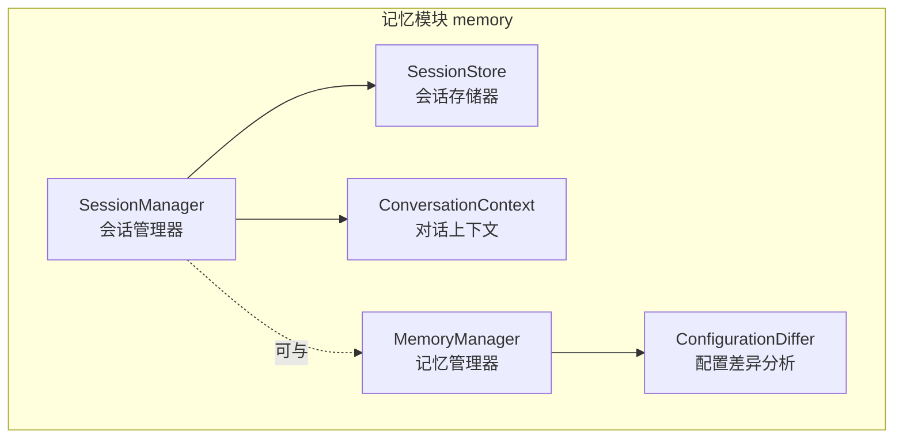
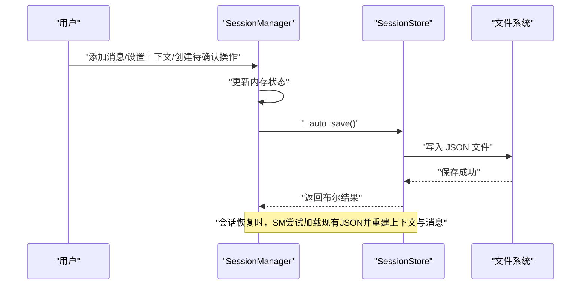
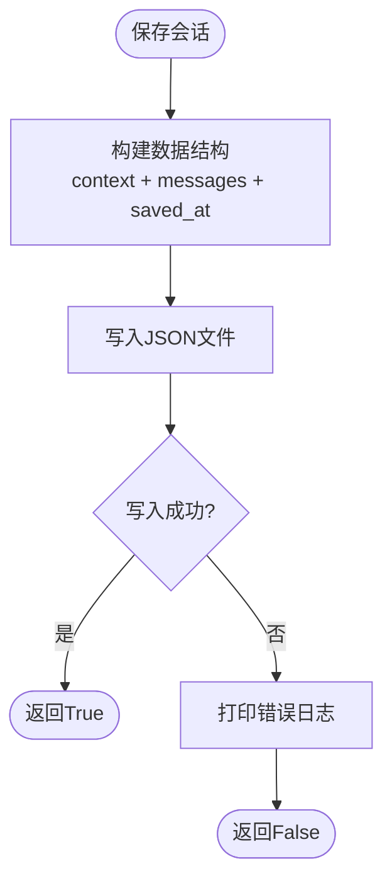
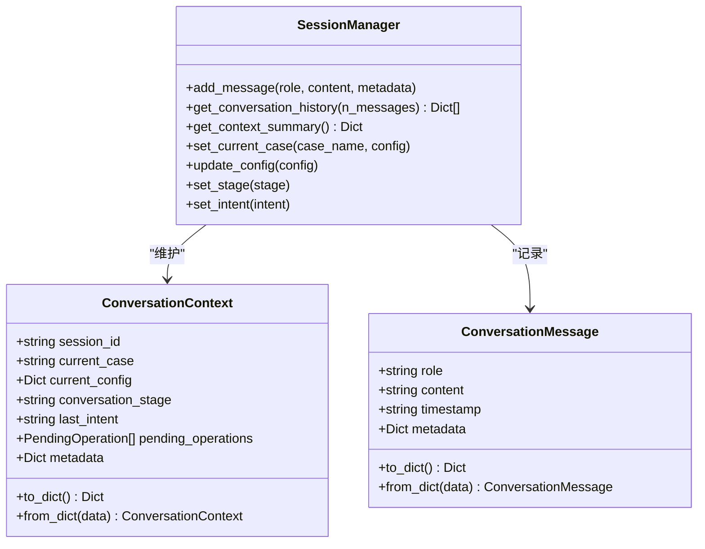
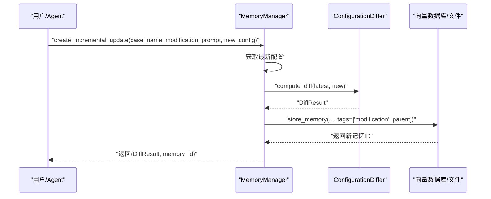
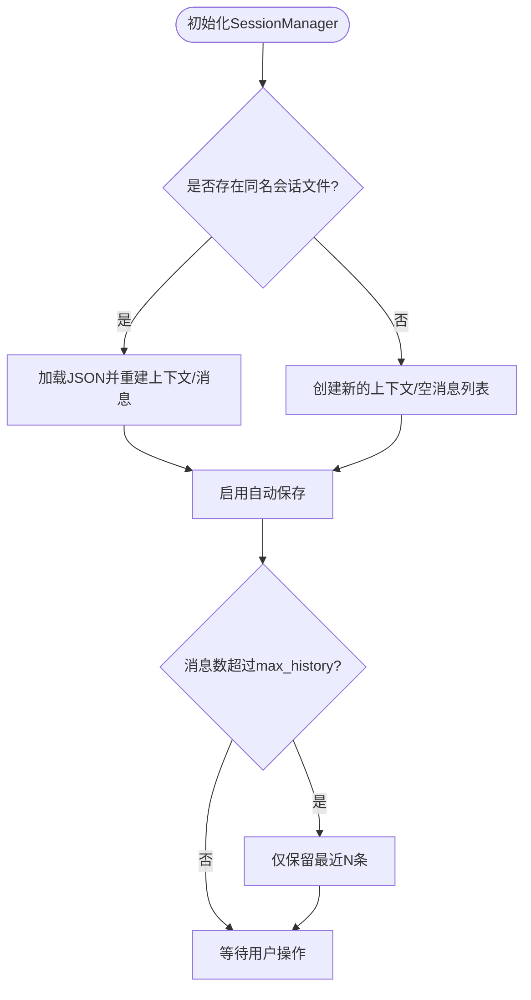
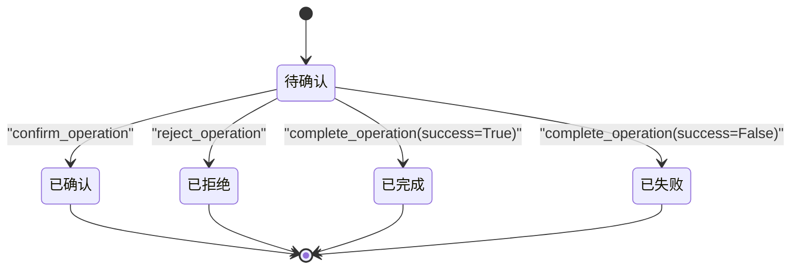
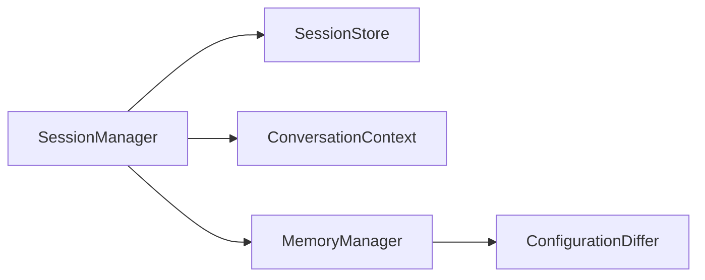

# 会话管理器

<cite>
**本文引用的文件**
- [session_manager.py](file://openfoam_ai/memory/session_manager.py)
- [memory_manager.py](file://openfoam_ai/memory/memory_manager.py)
- [__init__.py](file://openfoam_ai/memory/__init__.py)
- [test_phase3.py](file://openfoam_ai/tests/test_phase3.py)
- [demo_session_001.json](file://openfoam_ai/sessions/demo_session_001.json)
- [integration_demo.json](file://openfoam_ai/sessions/integration_demo.json)
- [main_phase3.py](file://openfoam_ai/main_phase3.py)
- [README.md](file://openfoam_ai/README.md)
</cite>

## 目录
1. [简介](#简介)
2. [项目结构](#项目结构)
3. [核心组件](#核心组件)
4. [架构总览](#架构总览)
5. [详细组件分析](#详细组件分析)
6. [依赖关系分析](#依赖关系分析)
7. [性能考量](#性能考量)
8. [故障排查指南](#故障排查指南)
9. [结论](#结论)
10. [附录](#附录)

## 简介
本文件面向SessionManager类，提供全面的技术文档，重点涵盖：
- 会话状态持久化机制：序列化/反序列化、文件存储策略、数据完整性保障
- 对话历史管理：消息存储结构、时间戳管理、历史查询机制
- 增量更新相关能力：与MemoryManager的配置差异分析（Diff update）协作
- 会话恢复与状态同步：断点续传、状态校验、异常恢复
- 使用示例、配置选项与最佳实践
- 会话安全性与隐私保护建议

## 项目结构
SessionManager位于记忆模块memory下，与MemoryManager共同构成“记忆性建模”能力的一部分。其核心文件如下：
- openfoam_ai/memory/session_manager.py：会话管理器实现
- openfoam_ai/memory/memory_manager.py：记忆管理器（含配置差异分析）
- openfoam_ai/memory/__init__.py：导出入口
- openfoam_ai/tests/test_phase3.py：会话管理器单元测试
- openfoam_ai/sessions/*.json：会话持久化样例
- openfoam_ai/main_phase3.py：阶段三演示（包含会话管理器演示）

图表来源
- [session_manager.py:171-448](file://openfoam_ai/memory/session_manager.py#L171-L448)
- [memory_manager.py:198-521](file://openfoam_ai/memory/memory_manager.py#L198-L521)

章节来源
- [session_manager.py:1-565](file://openfoam_ai/memory/session_manager.py#L1-L565)
- [memory_manager.py:1-804](file://openfoam_ai/memory/memory_manager.py#L1-L804)
- [__init__.py:1-61](file://openfoam_ai/memory/__init__.py#L1-L61)

## 核心组件
- SessionManager：会话生命周期管理，负责消息记录、上下文维护、高风险操作确认、自动/手动持久化
- SessionStore：文件系统持久化，负责JSON格式的读写与目录管理
- ConversationContext：会话上下文，包含当前算例、配置、对话阶段、意图、待确认操作等
- ConversationMessage：单条消息，包含角色、内容、时间戳、元数据
- PendingOperation：待确认操作，包含操作类型、描述、详情、风险等级、状态、时间戳

章节来源
- [session_manager.py:20-106](file://openfoam_ai/memory/session_manager.py#L20-L106)
- [session_manager.py:108-169](file://openfoam_ai/memory/session_manager.py#L108-L169)
- [session_manager.py:171-448](file://openfoam_ai/memory/session_manager.py#L171-L448)

## 架构总览
SessionManager以“上下文+消息”的双轴结构管理会话，并通过SessionStore将二者序列化为JSON文件，实现断点续传与状态同步。同时，SessionManager与MemoryManager协同工作，后者提供配置差异分析与增量更新能力，从而在会话语义层面实现“配置层面的增量更新”。

图表来源
- [session_manager.py:229-253](file://openfoam_ai/memory/session_manager.py#L229-L253)
- [session_manager.py:445-452](file://openfoam_ai/memory/session_manager.py#L445-L452)
- [session_manager.py:119-136](file://openfoam_ai/memory/session_manager.py#L119-L136)

## 详细组件分析

### 会话状态持久化与文件存储策略
- 序列化与反序列化
  - ConversationMessage/ConversationContext均提供to_dict/from_dict，确保数据结构稳定且可逆
  - SessionStore.save_session与load_session分别负责整体会话数据的打包与还原
- 文件存储策略
  - 默认存储目录为“./sessions”，可通过构造参数覆盖
  - 每个会话对应一个以会话ID命名的JSON文件
  - 保存时附加“saved_at”时间戳，便于审计与排序
- 数据完整性保障
  - 写入采用原子性写入（一次性写入整个JSON），避免部分写入导致的损坏
  - 异常捕获与日志输出，便于定位问题
  - 会话恢复时若文件缺失或解析失败，会回退到新建状态

图表来源
- [session_manager.py:119-136](file://openfoam_ai/memory/session_manager.py#L119-L136)

章节来源
- [session_manager.py:108-169](file://openfoam_ai/memory/session_manager.py#L108-L169)
- [session_manager.py:119-136](file://openfoam_ai/memory/session_manager.py#L119-L136)

### 对话历史管理
- 存储结构
  - messages为ConversationMessage列表，每条消息包含role、content、timestamp、metadata
  - 上下文context包含session_id、current_case、current_config、conversation_stage、last_intent、pending_operations、metadata
- 时间戳管理
  - 消息添加时自动记录本地时间字符串；会话保存时记录“saved_at”
  - 历史查询支持最近N条消息截取
- 历史查询机制
  - get_conversation_history支持n_messages参数，返回字典列表
  - get_context_summary提供快速摘要（会话ID、当前算例、阶段、意图、待确认操作数、消息总数）

图表来源
- [session_manager.py:38-106](file://openfoam_ai/memory/session_manager.py#L38-L106)
- [session_manager.py:229-287](file://openfoam_ai/memory/session_manager.py#L229-L287)

章节来源
- [session_manager.py:229-287](file://openfoam_ai/memory/session_manager.py#L229-L287)
- [session_manager.py:254-269](file://openfoam_ai/memory/session_manager.py#L254-L269)
- [session_manager.py:270-279](file://openfoam_ai/memory/session_manager.py#L270-L279)

### 增量更新机制（与MemoryManager协作）
- SessionManager本身不直接进行配置的增量更新，但与MemoryManager的ConfigurationDiffer配合，可在会话语义下实现“配置层面的增量更新”
- ConfigurationDiffer提供compute_diff与apply_diff，支持嵌套字典的新增、删除、修改路径追踪与应用
- MemoryManager的create_incremental_update基于最新配置计算差异并存储新版本，形成“历史版本链”

图表来源
- [memory_manager.py:474-521](file://openfoam_ai/memory/memory_manager.py#L474-L521)
- [memory_manager.py:64-196](file://openfoam_ai/memory/memory_manager.py#L64-L196)

章节来源
- [memory_manager.py:474-521](file://openfoam_ai/memory/memory_manager.py#L474-L521)
- [memory_manager.py:64-196](file://openfoam_ai/memory/memory_manager.py#L64-L196)

### 会话恢复与状态同步（断点续传、状态校验、异常恢复）
- 断点续传
  - SessionManager构造时尝试加载同名会话文件；若存在则恢复上下文与消息，否则新建
  - 自动保存策略：每次消息添加、上下文更新均触发自动保存
- 状态校验
  - 恢复时若文件损坏或解析失败，会打印错误并继续运行（不中断流程）
  - 历史长度受max_history限制，超出时仅保留最近N条
- 异常恢复
  - 所有I/O异常被捕获并记录，调用方可依据返回布尔值判断是否需要重试
  - 支持手动save与export_session，便于外部备份与迁移

图表来源
- [session_manager.py:203-228](file://openfoam_ai/memory/session_manager.py#L203-L228)
- [session_manager.py:247-252](file://openfoam_ai/memory/session_manager.py#L247-L252)

章节来源
- [session_manager.py:203-228](file://openfoam_ai/memory/session_manager.py#L203-L228)
- [session_manager.py:247-252](file://openfoam_ai/memory/session_manager.py#L247-L252)
- [session_manager.py:445-452](file://openfoam_ai/memory/session_manager.py#L445-L452)

### 高风险操作确认机制
- 风险等级映射与高风险操作清单
  - 高风险操作类型包括删除算例、覆盖数据、修改边界、改变求解器、长时间仿真等
  - 不同操作类型映射到低/中/高/严重四个风险等级
- 待确认操作生命周期
  - 创建：生成operation_id、记录类型、描述、详情、风险等级、时间戳、状态为pending
  - 确认/拒绝/完成：更新状态并持久化
  - 生成确认提示：根据风险等级生成带警告的提示文本
- 清理：clear_pending_operations清空待确认队列

图表来源
- [session_manager.py:304-392](file://openfoam_ai/memory/session_manager.py#L304-L392)
- [session_manager.py:401-438](file://openfoam_ai/memory/session_manager.py#L401-L438)

章节来源
- [session_manager.py:182-201](file://openfoam_ai/memory/session_manager.py#L182-L201)
- [session_manager.py:304-392](file://openfoam_ai/memory/session_manager.py#L304-L392)
- [session_manager.py:401-438](file://openfoam_ai/memory/session_manager.py#L401-L438)

### 使用示例与最佳实践
- 基本使用
  - 创建会话管理器：SessionManager(session_id, storage_path, max_history)
  - 添加消息：add_message(role, content, metadata)
  - 设置当前算例：set_current_case(case_name, config)
  - 创建高风险操作：create_pending_operation(type, description, details)
  - 生成确认提示：generate_confirmation_prompt(op)
  - 导出会话：export_session(output_file)
- 最佳实践
  - 合理设置max_history，平衡内存占用与历史可追溯性
  - 对敏感字段使用metadata进行标记，便于后续审计
  - 在关键节点调用save进行显式持久化，避免意外退出丢失
  - 使用风险等级提示与确认流程，降低误操作概率
- 配置选项
  - storage_path：会话文件存储目录
  - max_history：最大历史消息数
  - session_id：会话标识符（缺省自动生成）

章节来源
- [session_manager.py:203-228](file://openfoam_ai/memory/session_manager.py#L203-L228)
- [session_manager.py:229-253](file://openfoam_ai/memory/session_manager.py#L229-L253)
- [session_manager.py:281-303](file://openfoam_ai/memory/session_manager.py#L281-L303)
- [session_manager.py:453-477](file://openfoam_ai/memory/session_manager.py#L453-L477)

## 依赖关系分析
- SessionManager依赖SessionStore进行文件持久化
- SessionStore依赖标准库json、time、pathlib进行序列化与文件操作
- SessionManager与MemoryManager在业务层面协作：前者管理会话与上下文，后者管理配置历史与增量更新
- 单元测试覆盖了消息添加、上下文设置、待确认操作、历史查询、持久化恢复、统计信息等场景

图表来源
- [session_manager.py:171-448](file://openfoam_ai/memory/session_manager.py#L171-L448)
- [memory_manager.py:198-521](file://openfoam_ai/memory/memory_manager.py#L198-L521)

章节来源
- [test_phase3.py:276-435](file://openfoam_ai/tests/test_phase3.py#L276-L435)

## 性能考量
- 序列化开销
  - JSON序列化/反序列化为O(n)（n为消息与上下文大小），通常可接受
  - 建议在高频写入场景下减少metadata冗余，避免不必要的大对象
- 文件I/O
  - 自动保存在每次消息添加时触发，可能带来频繁写盘；可通过批量写或延迟策略优化
  - 建议在批处理场景中合并消息后再保存
- 历史长度控制
  - max_history限制可有效控制内存与磁盘占用，建议结合业务需求调整
- 并发与一致性
  - 当前实现未内置并发锁；多线程/多进程访问需外部加锁或采用单实例策略

## 故障排查指南
- 会话文件损坏或解析失败
  - 现象：加载会话返回None或异常
  - 处理：检查JSON格式合法性；必要时删除损坏文件重新开始
- 保存失败
  - 现象：save/_auto_save返回False
  - 处理：检查存储路径权限与磁盘空间；查看错误日志定位具体异常
- 历史截断不符合预期
  - 现象：历史消息超过max_history
  - 处理：确认max_history设置；检查是否在构造时被覆盖
- 高风险操作未生效
  - 现象：确认/拒绝/完成操作后状态未更新
  - 处理：确认operation_id正确；检查自动保存是否成功

章节来源
- [session_manager.py:137-150](file://openfoam_ai/memory/session_manager.py#L137-L150)
- [session_manager.py:133-135](file://openfoam_ai/memory/session_manager.py#L133-L135)
- [session_manager.py:247-249](file://openfoam_ai/memory/session_manager.py#L247-L249)

## 结论
SessionManager提供了完整的多轮对话会话生命周期管理，具备：
- 稳健的文件持久化与断点续传能力
- 清晰的消息与上下文结构，支持历史查询与统计
- 高风险操作确认机制，提升安全性
- 与MemoryManager的配置差异分析协作，实现“配置层面的增量更新”

在生产环境中，建议结合业务场景合理设置max_history与存储路径，完善异常处理与备份策略，并在涉及敏感数据时加强访问控制与审计。

## 附录

### 会话样例文件
- demo_session_001.json：包含多个消息与多个待确认操作（含不同状态）
- integration_demo.json：包含用户与助手之间的对话历史，以及配置验证失败的错误信息

章节来源
- [demo_session_001.json:1-163](file://openfoam_ai/sessions/demo_session_001.json#L1-L163)
- [integration_demo.json:1-39](file://openfoam_ai/sessions/integration_demo.json#L1-L39)

### 演示与测试
- main_phase3.py中的demo_session_manager展示了从创建会话、添加消息、设置上下文、创建高风险操作、生成确认提示、统计信息到导出会话的完整流程
- test_phase3.py中的TestSessionManager覆盖了消息添加、上下文设置、待确认操作、历史查询、持久化恢复、统计信息等测试用例

章节来源
- [main_phase3.py:146-213](file://openfoam_ai/main_phase3.py#L146-L213)
- [test_phase3.py:276-435](file://openfoam_ai/tests/test_phase3.py#L276-L435)

### 会话安全性与隐私保护建议
- 数据最小化：仅存储必要的消息与上下文，避免存储敏感信息
- 访问控制：限制会话文件所在目录的读写权限
- 审计日志：记录会话创建、保存、删除等关键事件
- 加密存储：在需要时对会话文件进行加密
- 定期备份：定期导出会话数据，防止意外丢失
- 隐私脱敏：对可能包含个人身份信息的内容进行脱敏处理