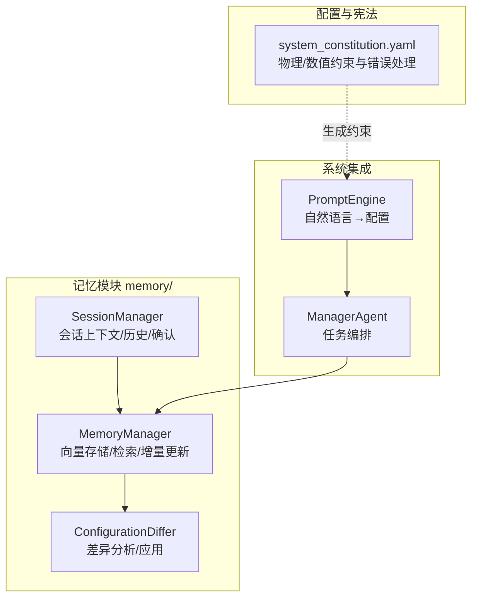
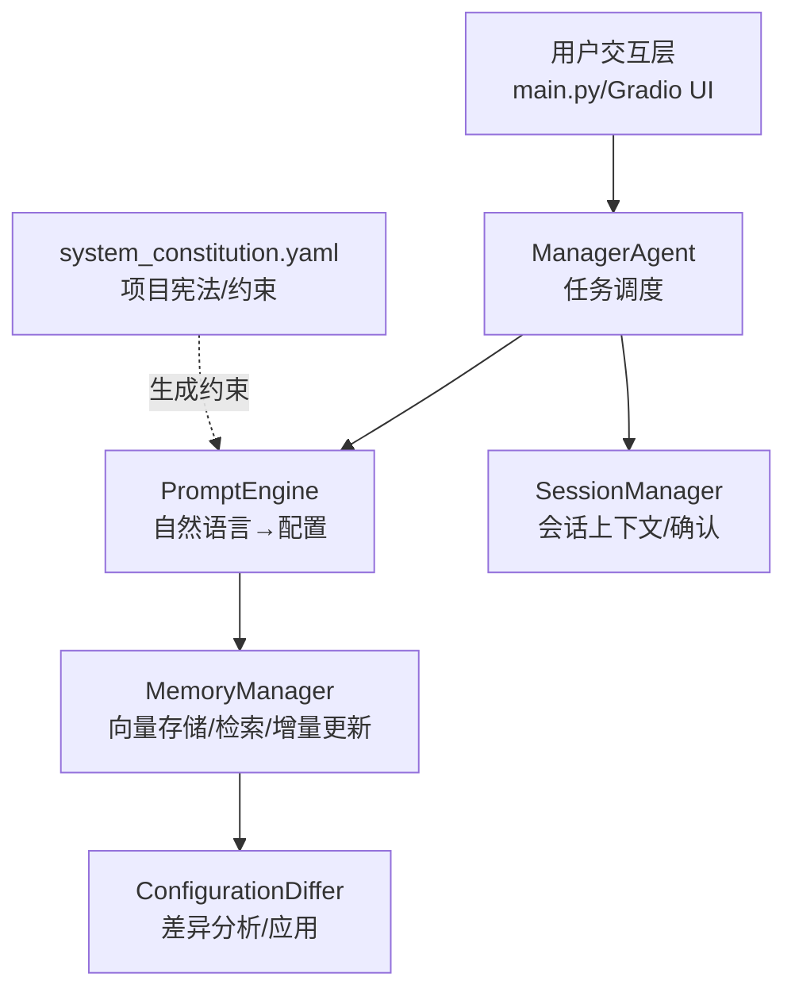
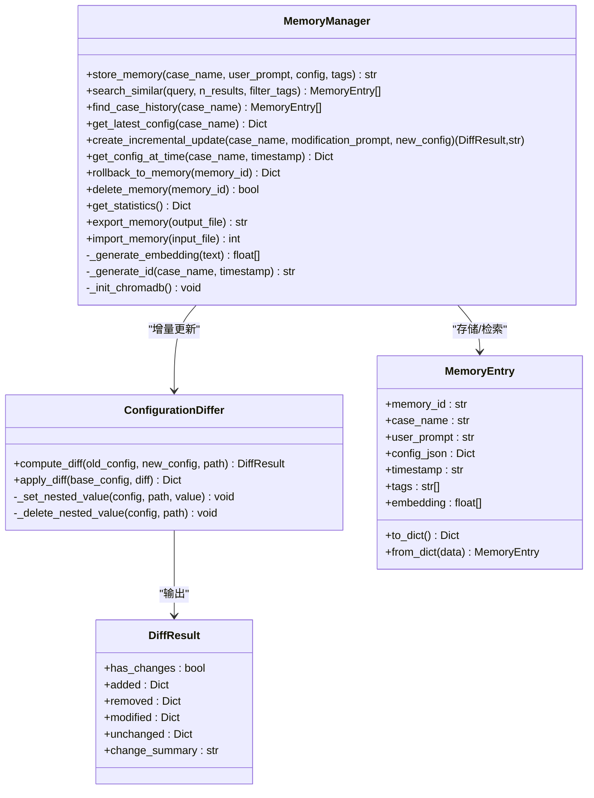
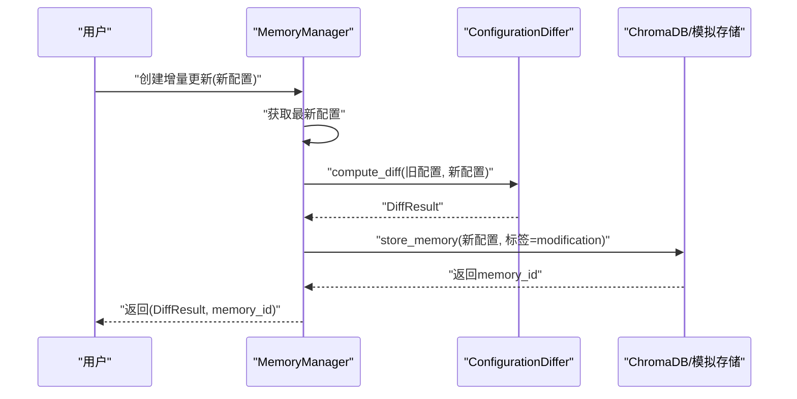
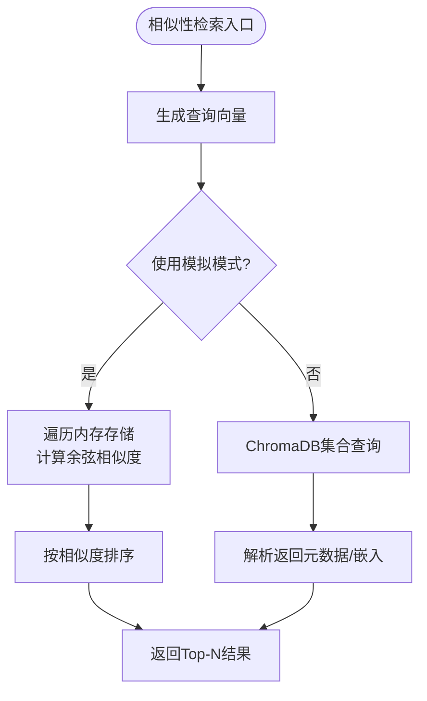
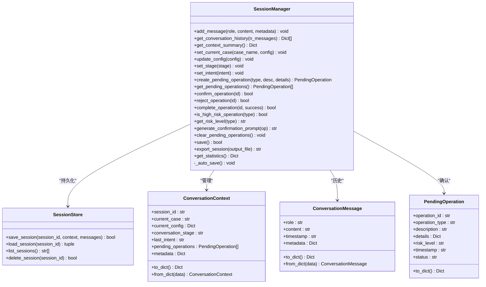
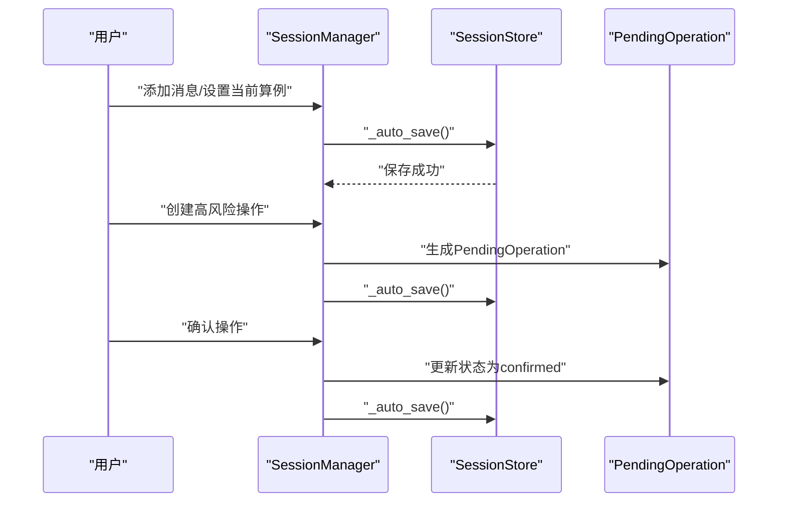
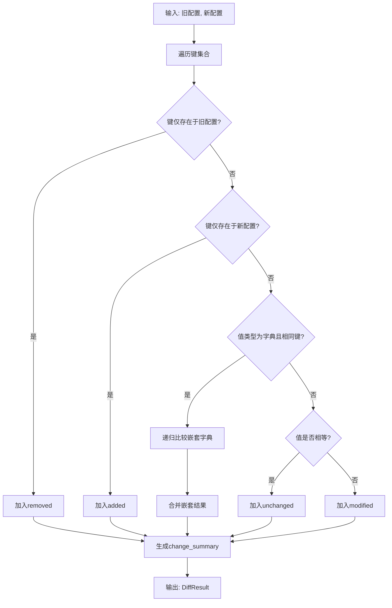
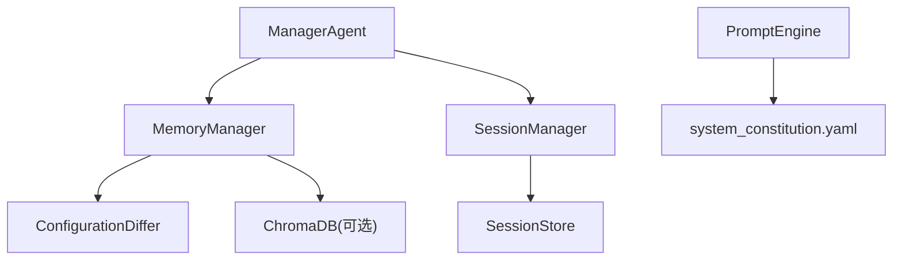

# 记忆性建模系统

<cite>
**本文引用的文件**
- [memory_manager.py](file://openfoam_ai/memory/memory_manager.py)
- [session_manager.py](file://openfoam_ai/memory/session_manager.py)
- [__init__.py](file://openfoam_ai/memory/__init__.py)
- [system_constitution.yaml](file://openfoam_ai/config/system_constitution.yaml)
- [README.md](file://openfoam_ai/README.md)
- [main.py](file://openfoam_ai/main.py)
- [demo_session_001.json](file://openfoam_ai/sessions/demo_session_001.json)
- [session_demo_session_001_export.json](file://openfoam_ai/session_demo_session_001_export.json)
</cite>

## 目录
1. [引言](#引言)
2. [项目结构](#项目结构)
3. [核心组件](#核心组件)
4. [架构总览](#架构总览)
5. [详细组件分析](#详细组件分析)
6. [依赖分析](#依赖分析)
7. [性能考虑](#性能考虑)
8. [故障排查指南](#故障排查指南)
9. [结论](#结论)
10. [附录](#附录)

## 引言
本文件面向OpenFOAM AI的记忆性建模系统，聚焦以下目标：
- 深入解释MemoryManager的向量数据库集成、存储策略与检索算法
- 详解SessionManager的会话状态持久化、对话历史管理与增量更新机制
- 阐述ConfigurationDiffer的配置差异分析、变更检测机制与应用策略
- 解释向量存储的设计原理、相似度计算方法与查询优化策略
- 提供具体使用示例、配置参数与性能调优建议
- 说明记忆系统在AI配置生成中的作用与价值，并给出扩展与定制指导

## 项目结构
记忆性建模系统位于openfoam_ai/memory目录，包含：
- MemoryManager：基于ChromaDB的向量数据库存储与检索，支持相似性检索与增量更新
- SessionManager：多轮对话上下文管理、高风险操作确认与会话持久化
- ConfigurationDiffer：配置差异分析与应用，支撑增量更新流程
- 配置与宪法：system_constitution.yaml提供物理与数值约束，保障生成配置的合理性

图表来源
- [memory_manager.py:198-688](file://openfoam_ai/memory/memory_manager.py#L198-L688)
- [session_manager.py:171-489](file://openfoam_ai/memory/session_manager.py#L171-L489)
- [system_constitution.yaml:1-103](file://openfoam_ai/config/system_constitution.yaml#L1-L103)

章节来源
- [README.md:130-150](file://openfoam_ai/README.md#L130-L150)
- [__init__.py:1-61](file://openfoam_ai/memory/__init__.py#L1-L61)

## 核心组件
- MemoryManager：负责将算例配置向量化并存入ChromaDB或模拟存储；提供相似性检索、历史版本管理、增量更新（Diff）与回滚能力
- SessionManager：维护多轮对话上下文、当前算例状态、意图与待确认操作；提供自动/手动持久化与导出
- ConfigurationDiffer：递归比较两份配置，输出新增、删除、修改、不变项及变更摘要，并可将差异应用到基线配置

章节来源
- [memory_manager.py:64-196](file://openfoam_ai/memory/memory_manager.py#L64-L196)
- [session_manager.py:171-489](file://openfoam_ai/memory/session_manager.py#L171-L489)

## 架构总览
记忆性建模系统在整体系统中的位置如下：

图表来源
- [main.py:19-22](file://openfoam_ai/main.py#L19-L22)
- [memory_manager.py:198-688](file://openfoam_ai/memory/memory_manager.py#L198-L688)
- [session_manager.py:171-489](file://openfoam_ai/memory/session_manager.py#L171-L489)
- [system_constitution.yaml:1-103](file://openfoam_ai/config/system_constitution.yaml#L1-L103)

## 详细组件分析

### MemoryManager：向量数据库集成、存储与检索
- 存储策略
  - 支持ChromaDB与模拟模式双轨运行，自动降级
  - 使用MemoryEntry统一存储结构，包含memory_id、case_name、user_prompt、config_json、timestamp、tags、embedding
  - ChromaDB集合元数据设置余弦距离空间，便于相似性检索
- 嵌入生成
  - 当前实现为简化版：对文本进行分词、哈希、累加并归一化，得到固定维度向量
  - 建议在生产环境替换为sentence-transformers等高质量语义嵌入模型
- 相似度检索
  - 模拟模式：计算余弦相似度（单位向量内积）
  - ChromaDB模式：基于集合元数据空间进行向量查询
- 历史与版本管理
  - 支持按case_name查找历史版本并按时间排序
  - 提供按时间点获取配置、回滚到指定记忆版本、删除记忆条目
- 增量更新（Diff）
  - 基于ConfigurationDiffer计算新旧配置差异，生成变更摘要
  - 将增量更新作为新记忆条目存储，保留父级标识以便溯源

图表来源
- [memory_manager.py:198-688](file://openfoam_ai/memory/memory_manager.py#L198-L688)
- [memory_manager.py:64-196](file://openfoam_ai/memory/memory_manager.py#L64-L196)

图表来源
- [memory_manager.py:474-521](file://openfoam_ai/memory/memory_manager.py#L474-L521)
- [memory_manager.py:64-196](file://openfoam_ai/memory/memory_manager.py#L64-L196)

图表来源
- [memory_manager.py:347-420](file://openfoam_ai/memory/memory_manager.py#L347-L420)
- [memory_manager.py:243-254](file://openfoam_ai/memory/memory_manager.py#L243-L254)

章节来源
- [memory_manager.py:198-688](file://openfoam_ai/memory/memory_manager.py#L198-L688)

### SessionManager：会话状态持久化与对话历史管理
- 会话上下文
  - ConversationContext：包含session_id、current_case、current_config、conversation_stage、last_intent、pending_operations、metadata
- 对话历史
  - ConversationMessage：role、content、timestamp、metadata
  - 支持限制最大历史长度，自动截断并持久化
- 高风险操作确认
  - PendingOperation：operation_id、operation_type、description、details、risk_level、timestamp、status
  - 内置高风险操作类型清单与风险等级映射
  - 提供生成确认提示、确认/拒绝/完成操作的流程
- 存储与导出
  - SessionStore：基于JSON文件的持久化，支持保存、加载、列出、删除
  - 支持导出会话到文件，便于备份与迁移

图表来源
- [session_manager.py:171-489](file://openfoam_ai/memory/session_manager.py#L171-L489)

图表来源
- [session_manager.py:229-448](file://openfoam_ai/memory/session_manager.py#L229-L448)

章节来源
- [session_manager.py:171-489](file://openfoam_ai/memory/session_manager.py#L171-L489)

### ConfigurationDiffer：配置差异分析与应用
- 差异计算
  - 递归比较两份配置，支持字典嵌套
  - 输出added、removed、modified、unchanged与change_summary
- 差异应用
  - 将新增/修改/删除应用到基线配置，生成新配置
- 使用场景
  - 与MemoryManager配合，实现增量更新与版本溯源

图表来源
- [memory_manager.py:64-196](file://openfoam_ai/memory/memory_manager.py#L64-L196)

章节来源
- [memory_manager.py:64-196](file://openfoam_ai/memory/memory_manager.py#L64-L196)

## 依赖分析
- MemoryManager依赖ChromaDB（可选）与ConfigurationDiffer；在ChromaDB不可用时自动切换到模拟模式
- SessionManager依赖SessionStore进行持久化；与MemoryManager无直接耦合，但两者共同服务于对话与配置的历史管理
- system_constitution.yaml为生成配置提供硬性约束，影响PromptEngine产出的配置质量，间接影响MemoryManager的存储内容

图表来源
- [memory_manager.py:23-29](file://openfoam_ai/memory/memory_manager.py#L23-L29)
- [session_manager.py:108-169](file://openfoam_ai/memory/session_manager.py#L108-L169)
- [system_constitution.yaml:1-103](file://openfoam_ai/config/system_constitution.yaml#L1-L103)

章节来源
- [memory_manager.py:23-29](file://openfoam_ai/memory/memory_manager.py#L23-L29)
- [session_manager.py:108-169](file://openfoam_ai/memory/session_manager.py#L108-L169)

## 性能考虑
- 向量嵌入
  - 当前实现为简化版，复杂度与词汇量线性相关；建议在生产环境使用高效语义嵌入模型，并缓存常用文本的向量
- 相似度检索
  - 模拟模式下为O(N)遍历+余弦相似度计算；ChromaDB模式依赖集合索引与查询优化
  - 建议合理设置n_results，避免返回过多候选；必要时引入标签过滤减少候选集规模
- 存储与I/O
  - SessionStore基于JSON文件，建议在高并发场景下引入锁或异步写入；定期压缩与清理过期会话
- 内存占用
  - 大型算例配置与历史版本可能占用较多内存；建议对超长历史进行归档或分页访问

## 故障排查指南
- ChromaDB初始化失败
  - 现象：初始化抛出异常并回退到模拟模式
  - 处理：检查依赖安装与权限；或显式设置use_mock启用模拟模式
- 会话加载失败
  - 现象：加载JSON文件异常
  - 处理：检查文件完整性与编码；必要时重新导出或手动修复
- 增量更新异常
  - 现象：差异应用后配置不一致
  - 处理：核对DiffResult结构；确保路径格式正确；必要时逐层比对嵌套字段

章节来源
- [memory_manager.py:233-241](file://openfoam_ai/memory/memory_manager.py#L233-L241)
- [session_manager.py:137-150](file://openfoam_ai/memory/session_manager.py#L137-L150)

## 结论
记忆性建模系统通过MemoryManager与SessionManager实现了“配置历史与对话上下文”的双轨记忆，结合ConfigurationDiffer的增量更新能力，显著提升了AI配置生成的可追溯性与可维护性。system_constitution.yaml提供的硬性约束进一步保障了生成配置的合理性。建议在生产环境中替换为高质量嵌入模型与稳定的向量数据库，并完善会话与配置的备份与审计机制。

## 附录

### 使用示例与最佳实践
- 创建MemoryManager并存储配置
  - 参考路径：[memory_manager.py:291-345](file://openfoam_ai/memory/memory_manager.py#L291-L345)
- 相似性检索
  - 参考路径：[memory_manager.py:347-395](file://openfoam_ai/memory/memory_manager.py#L347-L395)
- 增量更新（Diff）
  - 参考路径：[memory_manager.py:474-521](file://openfoam_ai/memory/memory_manager.py#L474-L521)
- 创建SessionManager并管理对话
  - 参考路径：[session_manager.py:229-333](file://openfoam_ai/memory/session_manager.py#L229-L333)
- 生成高风险操作确认提示
  - 参考路径：[session_manager.py:401-438](file://openfoam_ai/memory/session_manager.py#L401-L438)

### 配置参数与调优建议
- MemoryManager
  - db_path：向量数据库持久化目录
  - collection_name：ChromaDB集合名
  - use_mock：强制模拟模式开关
  - 建议：在生产环境启用ChromaDB并配置合适的索引参数；对查询文本进行清洗与标准化
- SessionManager
  - storage_path：会话文件存储目录
  - max_history：最大历史消息数
  - 建议：根据对话复杂度调整max_history；对高风险操作类型进行白名单管理

### 记忆系统在AI配置生成中的价值
- 历史复用：通过相似性检索快速找到相近历史配置，减少重复工作
- 变更追踪：增量更新与版本回滚保障配置演进的可追溯性
- 会话连贯：上下文与意图管理提升多轮对话的准确性与一致性
- 约束保障：system_constitution.yaml与验证器共同防止不合理配置生成

章节来源
- [README.md:152-160](file://openfoam_ai/README.md#L152-L160)
- [system_constitution.yaml:1-103](file://openfoam_ai/config/system_constitution.yaml#L1-L103)