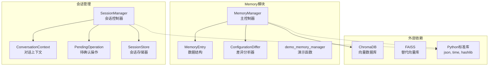
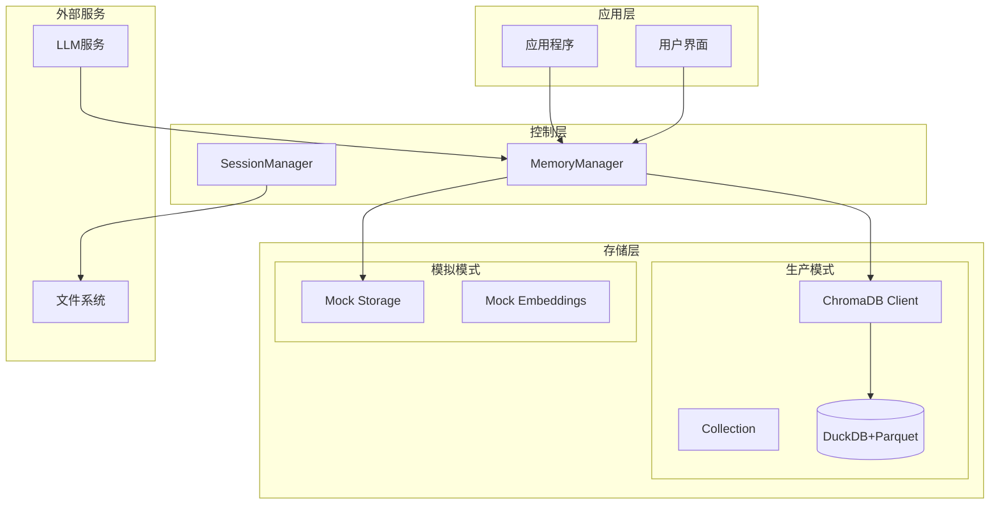
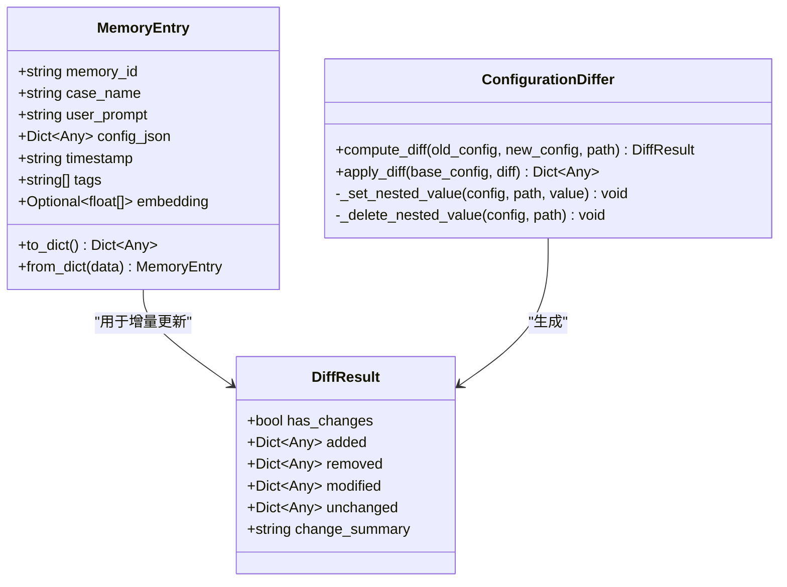
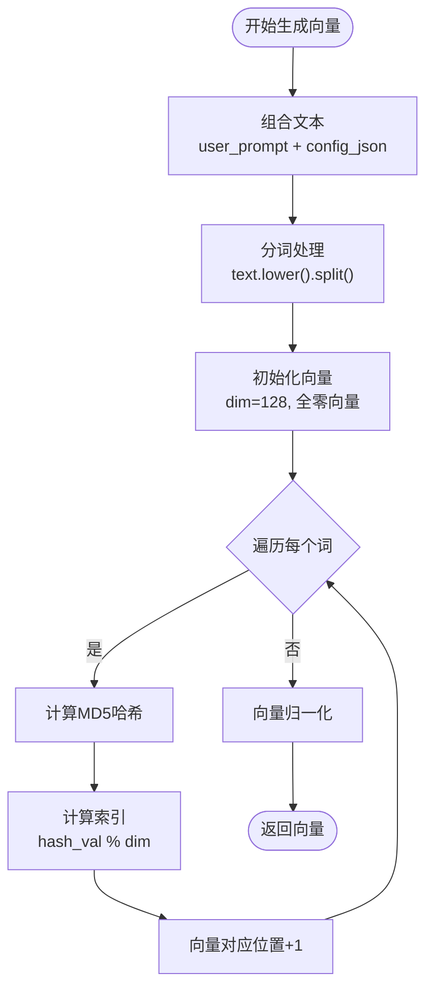
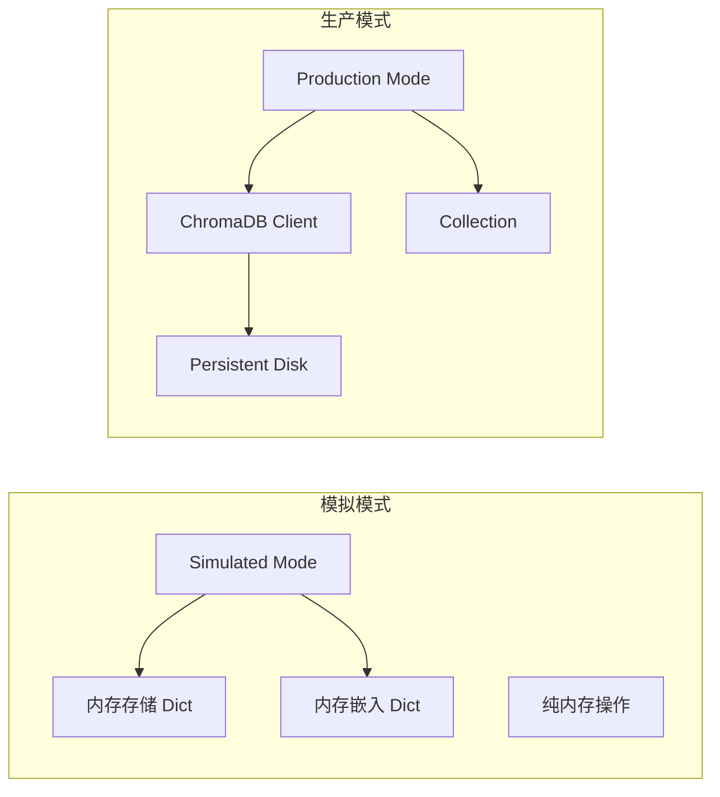
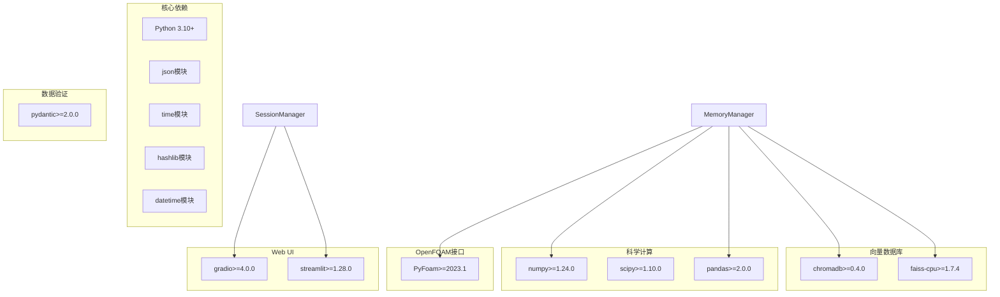
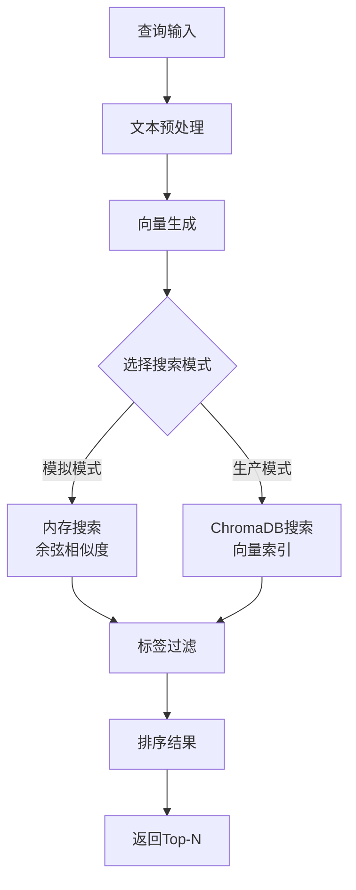
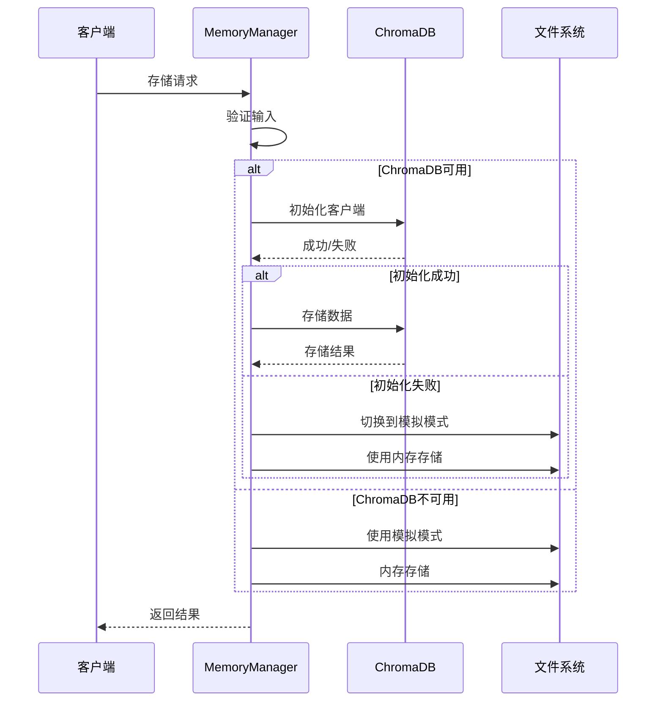

# 向量存储系统

<cite>
**本文档引用的文件**
- [memory_manager.py](file://openfoam_ai/memory/memory_manager.py)
- [__init__.py](file://openfoam_ai/memory/__init__.py)
- [session_manager.py](file://openfoam_ai/memory/session_manager.py)
- [requirements.txt](file://openfoam_ai/requirements.txt)
- [system_constitution.yaml](file://openfoam_ai/config/system_constitution.yaml)
- [test_phase3.py](file://openfoam_ai/tests/test_phase3.py)
</cite>

## 目录
1. [简介](#简介)
2. [项目结构](#项目结构)
3. [核心组件](#核心组件)
4. [架构概览](#架构概览)
5. [详细组件分析](#详细组件分析)
6. [依赖关系分析](#依赖关系分析)
7. [性能考虑](#性能考虑)
8. [故障排除指南](#故障排除指南)
9. [结论](#结论)
10. [附录](#附录)

## 简介

向量存储系统是OpenFOAM AI Agent项目中的核心记忆管理模块，基于ChromaDB构建，专门用于存储和检索OpenFOAM算例配置的历史记录。该系统支持向量数据库存储、相似性检索、增量修改（Diff update）和会话历史管理等功能。

系统的主要目标是：
- 基于ChromaDB的向量数据库存储和检索算例配置历史
- 支持自然语言检索相似历史配置
- 实现配置差异化更新（Diff update）
- 提供会话历史管理功能

## 项目结构

向量存储系统位于`openfoam_ai/memory/`目录下，主要包含以下文件：

**图表来源**
- [memory_manager.py:1-804](file://openfoam_ai/memory/memory_manager.py#L1-L804)
- [session_manager.py:1-565](file://openfoam_ai/memory/session_manager.py#L1-L565)

**章节来源**
- [memory_manager.py:1-804](file://openfoam_ai/memory/memory_manager.py#L1-L804)
- [__init__.py:1-61](file://openfoam_ai/memory/__init__.py#L1-L61)

## 核心组件

### MemoryManager类

MemoryManager是向量存储系统的核心控制器，负责管理算例配置的历史记录和向量数据库操作。

**主要功能**：
- 向量数据库存储（ChromaDB）
- 相似性检索
- 增量修改
- 记忆条目管理

**关键特性**：
- 支持模拟模式和生产模式
- 内存存储和磁盘持久化
- 标签系统和元数据管理
- 导出导入功能

### MemoryEntry数据结构

MemoryEntry是存储在向量数据库中的核心数据结构，定义了记忆条目的完整结构。

**字段定义**：
- `memory_id`: 唯一记忆标识符
- `case_name`: 算例名称
- `user_prompt`: 用户的自然语言输入
- `config_json`: 算例配置JSON
- `timestamp`: 时间戳
- `tags`: 标签列表
- `embedding`: 嵌入向量（可选）

### ConfigurationDiffer类

ConfigurationDiffer实现了配置差异分析功能，支持增量更新（Diff update）。

**核心方法**：
- `compute_diff()`: 计算两个配置的差异
- `apply_diff()`: 将差异应用到基础配置
- `_set_nested_value()`: 设置嵌套字典值
- `_delete_nested_value()`: 删除嵌套字典值

**章节来源**
- [memory_manager.py:198-804](file://openfoam_ai/memory/memory_manager.py#L198-L804)

## 架构概览

向量存储系统采用双模式架构设计，支持模拟模式和生产模式：

**图表来源**
- [memory_manager.py:208-242](file://openfoam_ai/memory/memory_manager.py#L208-L242)
- [session_manager.py:171-228](file://openfoam_ai/memory/session_manager.py#L171-L228)

### ChromaDB集成机制

系统通过以下方式集成ChromaDB：

1. **客户端初始化**：
   - 使用`chromadb.Client(Settings(...))`创建客户端
   - 配置`duckdb+parquet`后端实现磁盘持久化
   - 设置`persist_directory`指定存储路径

2. **集合创建**：
   - 使用`get_or_create_collection()`获取或创建集合
   - 设置`hnsw:space`为`cosine`实现余弦相似度
   - 支持元数据过滤和查询

3. **元数据管理**：
   - 存储`case_name`、`timestamp`、`config_json`、`tags`
   - 支持基于标签的过滤查询
   - 提供完整的元数据检索功能

**章节来源**
- [memory_manager.py:243-254](file://openfoam_ai/memory/memory_manager.py#L243-L254)

## 详细组件分析

### MemoryEntry数据结构设计

MemoryEntry采用了简洁而高效的数据结构设计：

**图表来源**
- [memory_manager.py:32-196](file://openfoam_ai/memory/memory_manager.py#L32-L196)

#### memory_id生成策略

系统使用MD5哈希算法生成唯一ID：

1. **组合内容**：`f"{case_name}_{timestamp}"`
2. **哈希处理**：对组合内容进行MD5哈希
3. **确保唯一性**：结合算例名称和时间戳避免冲突

#### 嵌入向量生成策略

系统实现了简化的向量生成算法：

**图表来源**
- [memory_manager.py:256-284](file://openfoam_ai/memory/memory_manager.py#L256-L284)

**算法特点**：
- **固定维度**：128维向量
- **词频统计**：基于词频的简单统计特征
- **哈希分布**：使用MD5确保均匀分布
- **归一化处理**：确保向量长度为1

### 模拟模式与生产模式对比

系统提供了两种运行模式以适应不同场景：

**模式对比表**：

| 特性 | 模拟模式 | 生产模式 |
|------|----------|----------|
| 存储介质 | 内存字典 | 磁盘文件(DuckDB+Parquet) |
| 持久化 | 否 | 是 |
| 性能 | 高 | 中等 |
| 可靠性 | 低 | 高 |
| 部署复杂度 | 简单 | 复杂 |
| 数据迁移 | 困难 | 容易 |

**章节来源**
- [memory_manager.py:225-241](file://openfoam_ai/memory/memory_manager.py#L225-L241)

### ChromaDB配置参数详解

系统使用以下ChromaDB配置参数：

| 参数 | 默认值 | 描述 | 用途 |
|------|--------|------|------|
| `chroma_db_impl` | `"duckdb+parquet"` | 数据库实现 | 磁盘持久化存储 |
| `persist_directory` | `str(self.db_path)` | 持久化目录 | 存储路径 |
| `collection_name` | `"openfoam_cases"` | 集合名称 | 数据库表名 |
| `hnsw:space` | `"cosine"` | 距离空间 | 余弦相似度 |

**章节来源**
- [memory_manager.py:245-254](file://openfoam_ai/memory/memory_manager.py#L245-L254)

## 依赖关系分析

向量存储系统依赖关系如下：

**图表来源**
- [requirements.txt:1-40](file://openfoam_ai/requirements.txt#L1-L40)

**章节来源**
- [requirements.txt:1-40](file://openfoam_ai/requirements.txt#L1-L40)

## 性能考虑

### 向量维度选择

系统当前使用128维向量，这是一个折衷的选择：

**优势**：
- 计算效率高
- 内存占用适中
- 适合大多数应用场景

**局限性**：
- 表达能力有限
- 可能丢失细节信息

**优化建议**：
- 对于复杂配置，考虑使用256或512维
- 根据数据规模调整维度大小
- 考虑使用预训练的句子嵌入模型

### 相似性检索优化

**性能优化策略**：

1. **索引优化**：
   - 使用HNSW算法提高检索效率
   - 合理设置M和ef参数
   - 定期重建索引

2. **缓存策略**：
   - 缓存常用查询结果
   - 实现LRU缓存机制
   - 避免重复计算

3. **批量处理**：
   - 支持批量向量插入
   - 异步处理查询请求
   - 分页返回结果

### 内存管理

模拟模式下的内存管理：

- **内存存储**：使用字典存储MemoryEntry
- **嵌入向量**：单独存储向量矩阵
- **垃圾回收**：定期清理过期数据
- **内存监控**：监控内存使用情况

**章节来源**
- [memory_manager.py:397-420](file://openfoam_ai/memory/memory_manager.py#L397-L420)

## 故障排除指南

### 常见问题及解决方案

#### ChromaDB初始化失败

**症状**：系统回退到模拟模式

**原因分析**：
- ChromaDB依赖未安装
- DuckDB+Parquet不兼容
- 权限不足

**解决步骤**：
1. 检查依赖安装：`pip install chromadb`
2. 验证权限：确保对存储目录有写权限
3. 检查版本兼容性：确保Python版本符合要求

#### 向量生成异常

**症状**：向量生成失败或结果异常

**排查步骤**：
1. 检查输入文本编码：确保UTF-8编码
2. 验证配置JSON格式：使用`ensure_ascii=False`
3. 检查哈希算法：确保MD5可用

#### 搜索结果不准确

**症状**：相似性检索结果质量不高

**优化建议**：
1. 调整向量维度：增加到256或更高
2. 改进文本预处理：添加停用词过滤
3. 使用更好的嵌入模型：考虑sentence-transformers

### 错误处理机制

系统实现了多层次的错误处理：

**图表来源**
- [memory_manager.py:233-241](file://openfoam_ai/memory/memory_manager.py#L233-L241)

**章节来源**
- [memory_manager.py:233-241](file://openfoam_ai/memory/memory_manager.py#L233-L241)

## 结论

向量存储系统为OpenFOAM AI Agent提供了强大的记忆管理能力。通过ChromaDB的向量数据库技术和模拟模式的灵活性，系统能够在不同部署环境中提供一致的功能体验。

**主要优势**：
- 双模式架构确保部署灵活性
- 简洁高效的内存数据结构
- 完善的错误处理和回退机制
- 支持增量更新和版本管理

**未来改进方向**：
- 集成更先进的嵌入模型
- 实现分布式向量存储
- 优化大规模数据处理能力
- 增强实时检索性能

## 附录

### 配置参数参考

| 参数名称 | 类型 | 默认值 | 描述 |
|----------|------|--------|------|
| `db_path` | string | `"./memory_db"` | 数据库存储路径 |
| `collection_name` | string | `"openfoam_cases"` | 向量集合名称 |
| `use_mock` | boolean | `False` | 是否强制使用模拟模式 |
| `n_results` | integer | `3` | 搜索结果数量 |
| `dim` | integer | `128` | 向量维度 |

### 最佳实践建议

1. **向量维度选择**：根据数据复杂度选择合适的维度
2. **标签系统**：合理设计标签体系便于检索
3. **定期维护**：定期清理过期数据和重建索引
4. **监控告警**：建立系统监控和性能告警机制
5. **备份策略**：制定数据备份和恢复计划

### 扩展性考虑

- **水平扩展**：支持多节点部署和负载均衡
- **垂直扩展**：支持更大规模的数据集
- **插件架构**：支持第三方向量库集成
- **云原生**：支持容器化和微服务部署