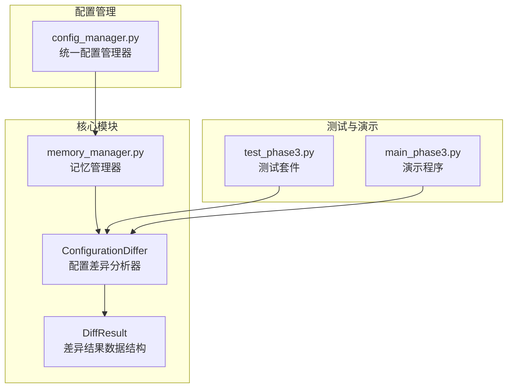
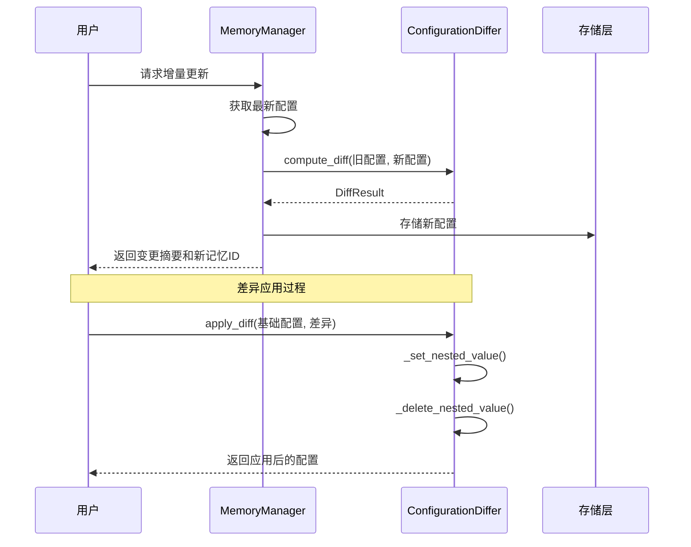
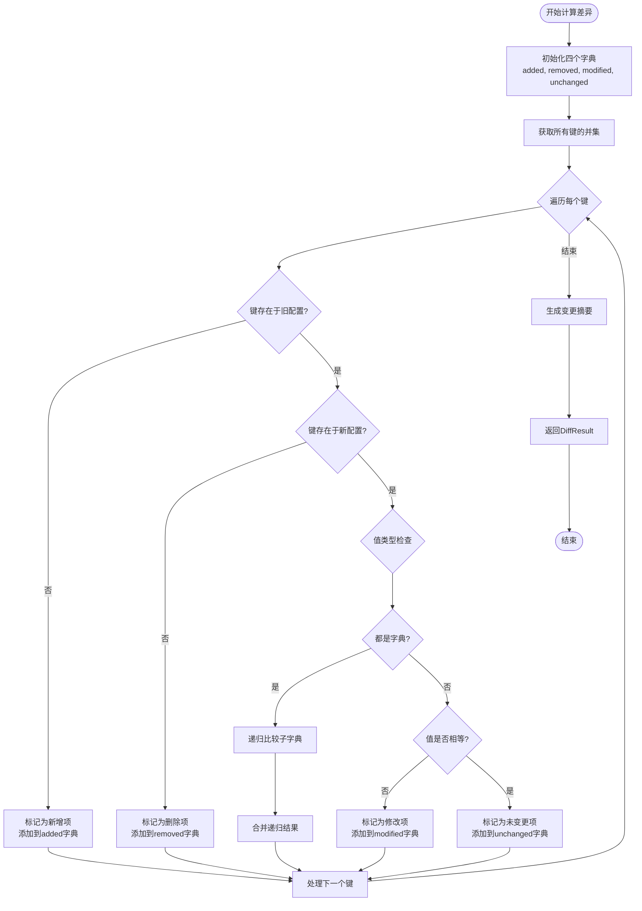
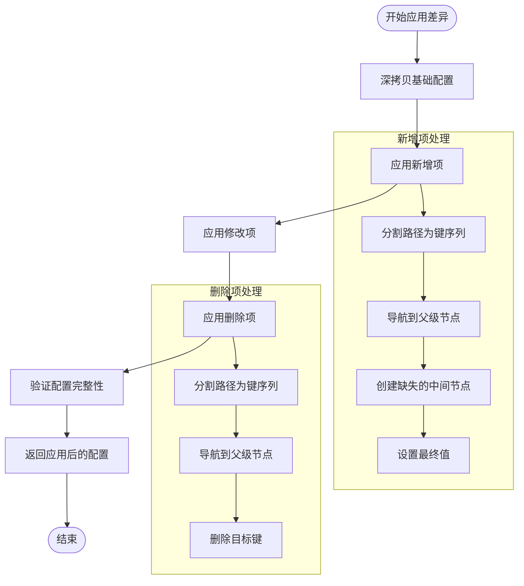
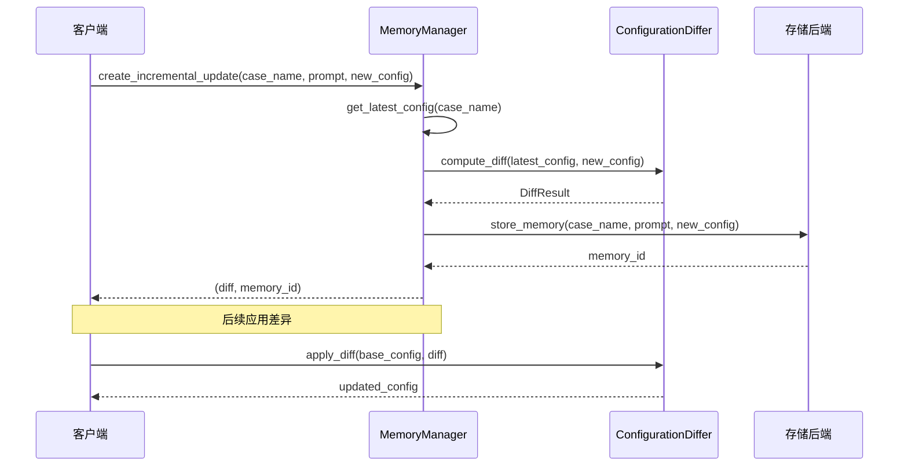
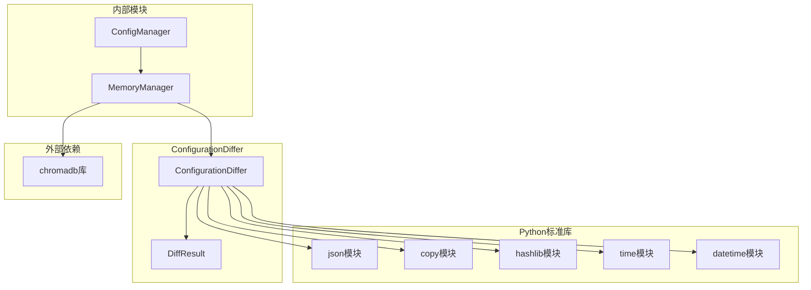

# 增量更新系统

<cite>
**本文档引用的文件**
- [memory_manager.py](file://openfoam_ai/memory/memory_manager.py)
- [config_manager.py](file://openfoam_ai/core/config_manager.py)
- [test_phase3.py](file://openfoam_ai/tests/test_phase3.py)
- [main_phase3.py](file://openfoam_ai/main_phase3.py)
</cite>

## 目录
1. [简介](#简介)
2. [项目结构](#项目结构)
3. [核心组件](#核心组件)
4. [架构概览](#架构概览)
5. [详细组件分析](#详细组件分析)
6. [依赖关系分析](#依赖关系分析)
7. [性能考虑](#性能考虑)
8. [故障排除指南](#故障排除指南)
9. [结论](#结论)
10. [附录](#附录)

## 简介

ConfigurationDiffer类是OpenFOAM AI项目中的核心增量更新系统，专门设计用于处理OpenFOAM算例配置的差异分析和应用。该系统实现了高效的递归比较算法，能够精确识别配置文件中的新增、删除、修改和未变更项，并提供了安全的配置合并机制。

该系统在记忆管理模块中发挥着关键作用，支持用户基于历史配置快速创建新算例，通过智能的差异检测和应用，确保配置的一致性和完整性。系统特别适用于CFD（计算流体力学）领域的配置管理，其中配置文件通常具有复杂的嵌套结构和大量的参数设置。

## 项目结构

OpenFOAM AI项目的配置差异分析系统主要分布在以下文件中：



**图表来源**
- [memory_manager.py:64-196](file://openfoam_ai/memory/memory_manager.py#L64-L196)
- [config_manager.py:16-227](file://openfoam_ai/core/config_manager.py#L16-L227)

**章节来源**
- [memory_manager.py:1-804](file://openfoam_ai/memory/memory_manager.py#L1-L804)
- [config_manager.py:1-227](file://openfoam_ai/core/config_manager.py#L1-L227)

## 核心组件

### ConfigurationDiffer类

ConfigurationDiffer是整个增量更新系统的核心，实现了配置差异分析和应用的完整功能。该类采用静态方法设计，便于在不创建实例的情况下直接调用相关功能。

#### 主要功能特性

1. **递归差异分析**：支持任意深度的嵌套字典比较
2. **路径追踪**：为每个差异项提供精确的路径标识
3. **多类型支持**：处理字符串、数字、布尔值、列表等不同数据类型
4. **安全应用**：提供深拷贝机制，确保原始配置不被意外修改

#### 关键方法

- `compute_diff()`: 计算两个配置之间的差异
- `apply_diff()`: 将差异应用到基础配置
- `_set_nested_value()`: 设置嵌套字典值
- `_delete_nested_value()`: 删除嵌套字典值

**章节来源**
- [memory_manager.py:64-196](file://openfoam_ai/memory/memory_manager.py#L64-L196)

### DiffResult数据结构

DiffResult是一个专门设计的数据类，用于存储差异分析的结果。该结构清晰地分离了不同类型的变化，便于后续处理和展示。

#### 字段设计

- `has_changes`: 布尔值，指示是否存在任何变化
- `added`: 新增项的字典，键为路径，值为新值
- `removed`: 删除项的字典，键为路径，值为旧值
- `modified`: 修改项的字典，键为路径，值为(旧值, 新值)元组
- `unchanged`: 未变更项的字典，键为路径，值为原值
- `change_summary`: 变更的简要描述

**章节来源**
- [memory_manager.py:53-62](file://openfoam_ai/memory/memory_manager.py#L53-L62)

## 架构概览

ConfigurationDiffer系统在整个OpenFOAM AI架构中扮演着重要的桥梁角色，连接了配置管理、记忆存储和用户交互模块。



**图表来源**
- [memory_manager.py:474-521](file://openfoam_ai/memory/memory_manager.py#L474-L521)
- [memory_manager.py:138-166](file://openfoam_ai/memory/memory_manager.py#L138-L166)

**章节来源**
- [memory_manager.py:474-521](file://openfoam_ai/memory/memory_manager.py#L474-L521)

## 详细组件分析

### 差异计算算法

ConfigurationDiffer的差异计算算法采用了高效的递归比较策略，能够准确识别配置文件中的各种变化类型。

#### 算法流程



**图表来源**
- [memory_manager.py:68-136](file://openfoam_ai/memory/memory_manager.py#L68-L136)

#### 边界条件处理

系统针对各种边界条件进行了精心设计：

- **空配置处理**：当任一配置为空时，正确识别所有项为新增或删除
- **类型不匹配**：不同数据类型的比较被视为修改
- **嵌套深度**：支持任意深度的嵌套字典比较
- **特殊字符**：路径中的特殊字符会被正确处理

**章节来源**
- [memory_manager.py:68-136](file://openfoam_ai/memory/memory_manager.py#L68-L136)

### 差异应用策略

差异应用过程是增量更新系统的关键环节，负责将分析得到的差异安全地应用到基础配置中。

#### 应用流程



**图表来源**
- [memory_manager.py:138-196](file://openfoam_ai/memory/memory_manager.py#L138-L196)

#### 路径解析机制

系统使用点分隔符来表示嵌套结构中的路径，例如`geometry.mesh_resolution.nx`。路径解析过程包括：

1. **路径分割**：将点分隔的路径分解为键序列
2. **层级导航**：逐级访问嵌套字典
3. **节点创建**：自动创建缺失的中间节点
4. **值设置**：在目标位置设置相应的值

**章节来源**
- [memory_manager.py:168-196](file://openfoam_ai/memory/memory_manager.py#L168-L196)

### 增量更新工作流程

MemoryManager中的`create_incremental_update`方法实现了完整的增量更新工作流程，从基线配置获取到新版本存储的全过程。

#### 工作流程图



**图表来源**
- [memory_manager.py:474-521](file://openfoam_ai/memory/memory_manager.py#L474-L521)

**章节来源**
- [memory_manager.py:474-521](file://openfoam_ai/memory/memory_manager.py#L474-L521)

## 依赖关系分析

ConfigurationDiffer系统的依赖关系相对简单且清晰，主要依赖于Python标准库和数据结构。



**图表来源**
- [memory_manager.py:14-30](file://openfoam_ai/memory/memory_manager.py#L14-L30)
- [memory_manager.py:64-196](file://openfoam_ai/memory/memory_manager.py#L64-L196)

### 内部耦合关系

- **MemoryManager依赖**：MemoryManager中的增量更新功能直接依赖ConfigurationDiffer
- **ConfigManager集成**：统一配置管理器为差异系统提供配置标准和验证
- **测试框架集成**：单元测试覆盖了差异分析的各个方面

**章节来源**
- [memory_manager.py:474-521](file://openfoam_ai/memory/memory_manager.py#L474-L521)
- [config_manager.py:16-227](file://openfoam_ai/core/config_manager.py#L16-L227)

## 性能考虑

ConfigurationDiffer系统在设计时充分考虑了性能优化，特别是在处理大型配置文件时的效率问题。

### 时间复杂度分析

- **差异计算**：O(n)，其中n是配置中键的总数
- **嵌套字典比较**：递归深度取决于配置的嵌套层数
- **路径解析**：对于每个差异项，路径解析的时间复杂度为O(d)，其中d为路径深度

### 空间复杂度优化

- **增量存储**：只存储差异而非完整配置，节省存储空间
- **浅拷贝策略**：在应用差异时使用深拷贝，避免不必要的内存复制
- **字典合并**：使用字典的update方法进行高效合并

### 性能优化策略

1. **早期退出**：在检测到无变化时立即返回
2. **批量处理**：支持一次性处理多个差异项
3. **缓存机制**：对于重复的配置比较，可以考虑缓存结果
4. **内存管理**：及时释放不再使用的中间结果

## 故障排除指南

### 常见问题及解决方案

#### 配置解析错误

**问题**：路径解析失败或键不存在
**解决方案**：
- 检查路径格式是否正确（使用点分隔符）
- 确保路径中的键名与配置结构一致
- 验证嵌套字典的层次结构

#### 类型不兼容错误

**问题**：不同数据类型的比较导致意外的修改
**解决方案**：
- 在应用差异前进行类型验证
- 对于敏感配置，建议使用严格的类型检查
- 提供类型转换选项

#### 内存使用过高

**问题**：处理大型配置文件时内存占用过高
**解决方案**：
- 分批处理大型配置
- 使用生成器模式减少内存占用
- 及时清理不再使用的中间结果

**章节来源**
- [memory_manager.py:168-196](file://openfoam_ai/memory/memory_manager.py#L168-L196)

### 错误恢复机制

系统提供了多层次的错误恢复机制：

1. **异常捕获**：在关键操作中使用try-catch语句
2. **回滚机制**：支持将配置回滚到之前的版本
3. **日志记录**：详细的错误日志便于问题诊断
4. **数据验证**：在应用差异前后进行数据完整性检查

**章节来源**
- [memory_manager.py:541-561](file://openfoam_ai/memory/memory_manager.py#L541-L561)

## 结论

ConfigurationDiffer类为OpenFOAM AI项目提供了一个强大而灵活的增量更新系统。通过其精心设计的递归比较算法、精确的路径追踪机制和安全的差异应用策略，该系统能够有效处理复杂的配置管理需求。

系统的主要优势包括：

- **准确性**：能够精确识别配置中的各种变化类型
- **安全性**：通过深拷贝机制确保原始配置的安全
- **扩展性**：支持任意深度的嵌套结构和复杂的数据类型
- **易用性**：简洁的API设计，便于集成和使用

该系统不仅满足了当前的配置管理需求，还为未来的功能扩展奠定了坚实的基础。通过与其他模块的紧密集成，ConfigurationDiffer成为了OpenFOAM AI生态系统中不可或缺的重要组成部分。

## 附录

### 实际使用场景示例

#### 场景1：基于历史配置创建新算例

```python
# 获取相似的历史配置
similar_configs = memory.search_similar("方腔驱动流", n_results=1)
if similar_configs:
    latest_config = memory.get_latest_config(similar_configs[0].case_name)
    
    # 修改网格参数
    new_config = latest_config.copy()
    new_config['geometry']['mesh_resolution']['nx'] = 40
    new_config['geometry']['mesh_resolution']['ny'] = 40
    
    # 创建增量更新
    diff, memory_id = memory.create_incremental_update(
        case_name="modified_cavity_flow",
        modification_prompt="加密网格到40x40",
        new_config=new_config
    )
```

#### 场景2：批量配置修改

```python
# 准备多个配置修改
modifications = [
    {"path": "solver.endTime", "old": 0.5, "new": 1.0},
    {"path": "fluid_properties.nu", "old": 0.01, "new": 0.001},
    {"path": "geometry.mesh_resolution.nz", "old": 1, "new": 2}
]

# 应用批量修改
result_config = old_config.copy()
for mod in modifications:
    ConfigurationDiffer._set_nested_value(result_config, mod['path'], mod['new'])
```

### 最佳实践指南

1. **配置设计**：保持配置结构的清晰性和一致性
2. **路径命名**：使用有意义的点分隔路径，便于理解和维护
3. **版本控制**：定期备份重要配置，确保可恢复性
4. **测试验证**：在生产环境中部署前进行充分的测试
5. **监控告警**：建立配置变更的监控和告警机制

### API参考

#### ConfigurationDiffer.compute_diff()

**参数**：
- `old_config`: Dict[str, Any] - 原始配置
- `new_config`: Dict[str, Any] - 新配置  
- `path`: str = "" - 当前路径（递归使用）

**返回值**：DiffResult - 差异分析结果

#### ConfigurationDiffer.apply_diff()

**参数**：
- `base_config`: Dict[str, Any] - 基础配置
- `diff`: DiffResult - 差异分析结果

**返回值**：Dict[str, Any] - 应用差异后的配置

**章节来源**
- [memory_manager.py:68-166](file://openfoam_ai/memory/memory_manager.py#L68-L166)