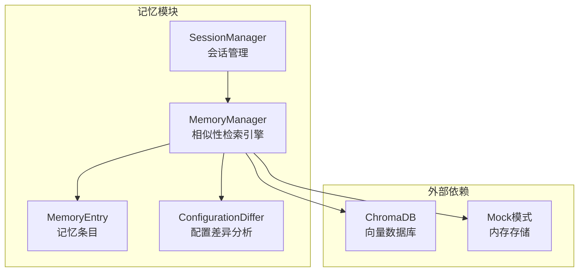
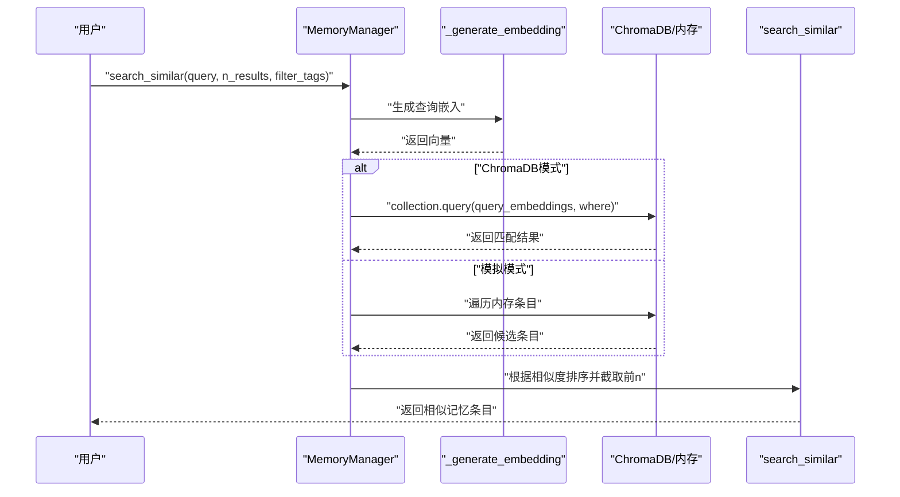
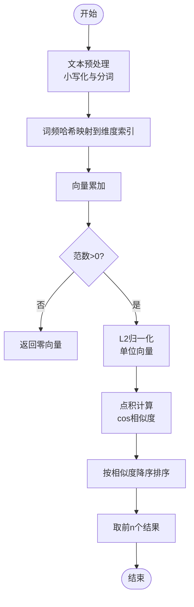
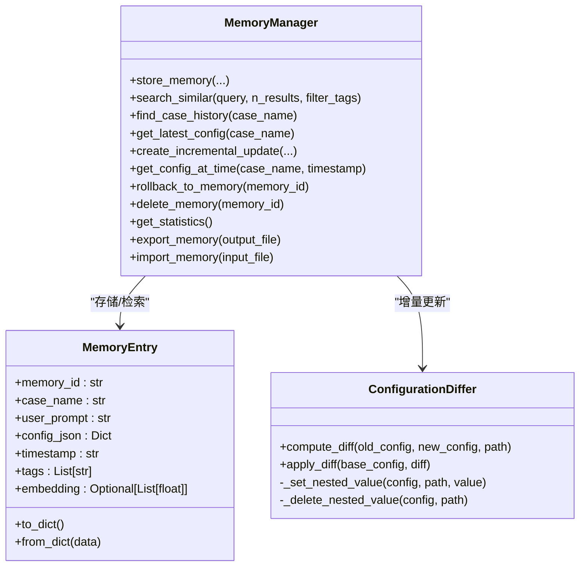
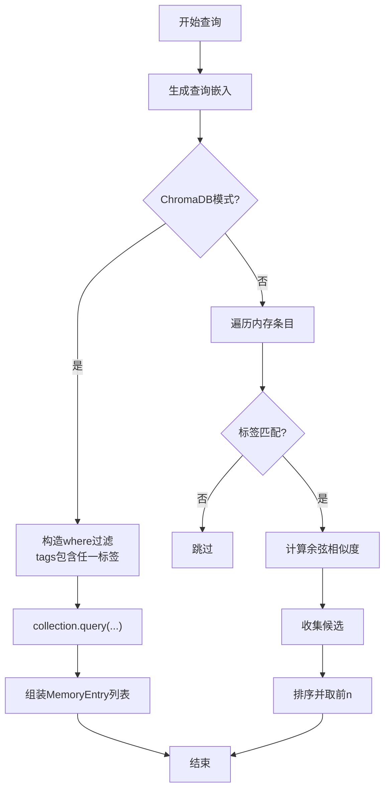
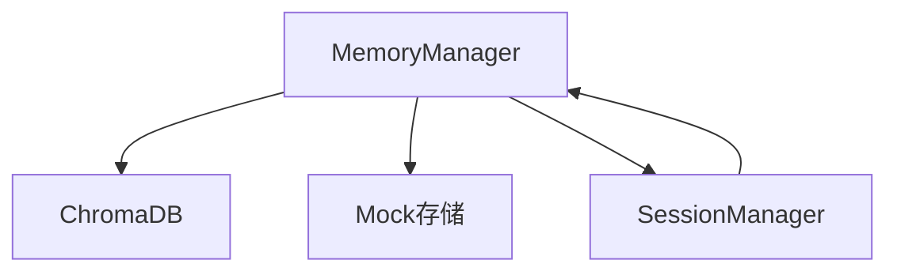

# 相似性检索引擎

<cite>
**本文引用的文件**
- [memory_manager.py](file://openfoam_ai/memory/memory_manager.py)
- [session_manager.py](file://openfoam_ai/memory/session_manager.py)
- [__init__.py](file://openfoam_ai/memory/__init__.py)
- [utils.py](file://openfoam_ai/core/utils.py)
- [prompt_engine.py](file://openfoam_ai/agents/prompt_engine.py)
- [main.py](file://openfoam_ai/main.py)
</cite>

## 目录
1. [简介](#简介)
2. [项目结构](#项目结构)
3. [核心组件](#核心组件)
4. [架构总览](#架构总览)
5. [详细组件分析](#详细组件分析)
6. [依赖分析](#依赖分析)
7. [性能考虑](#性能考虑)
8. [故障排查指南](#故障排查指南)
9. [结论](#结论)
10. [附录](#附录)

## 简介
本技术文档围绕 MemoryManager 的相似性检索引擎展开，重点解释余弦相似度计算、查询嵌入生成、检索优化策略、标签过滤实现以及性能调优建议。文档同时涵盖检索效果评估方法与常见问题解决方案，帮助读者在理解现有实现的基础上进行扩展与优化。

## 项目结构
MemoryManager 位于 openfoam_ai/memory 目录下，提供基于 ChromaDB 的向量数据库存储与检索能力，并内置模拟模式以适配无依赖环境。检索流程涉及：
- 文本预处理与向量维度匹配
- 余弦相似度评分与排序
- 标签过滤（ChromaDB 元数据过滤与模拟模式标签匹配）
- 结果导出与统计

图表来源
- [memory_manager.py:198-688](file://openfoam_ai/memory/memory_manager.py#L198-L688)
- [session_manager.py:171-495](file://openfoam_ai/memory/session_manager.py#L171-L495)

章节来源
- [memory_manager.py:198-688](file://openfoam_ai/memory/memory_manager.py#L198-L688)
- [session_manager.py:171-495](file://openfoam_ai/memory/session_manager.py#L171-L495)

## 核心组件
- MemoryManager：向量数据库存储与相似性检索的核心类，支持 ChromaDB 与模拟模式双通道。
- MemoryEntry：记忆条目的数据结构，包含记忆ID、算例名称、用户提示、配置JSON、时间戳、标签与嵌入向量。
- ConfigurationDiffer：配置差异分析器，实现增量更新（Diff update）。
- SessionManager：会话管理器，与 MemoryManager 协同工作，管理对话上下文与高风险操作确认。

章节来源
- [memory_manager.py:32-136](file://openfoam_ai/memory/memory_manager.py#L32-L136)
- [memory_manager.py:198-688](file://openfoam_ai/memory/memory_manager.py#L198-L688)
- [session_manager.py:171-495](file://openfoam_ai/memory/session_manager.py#L171-L495)

## 架构总览
MemoryManager 的检索架构分为两条路径：
- ChromaDB 路径：使用集合元数据中的 hnsw:space=cosine，查询时通过 query_embeddings 执行相似性检索，并支持 where 元数据过滤。
- 模拟模式路径：在内存中维护条目与嵌入向量，使用余弦相似度（点积）进行评分与排序。

图表来源
- [memory_manager.py:347-395](file://openfoam_ai/memory/memory_manager.py#L347-L395)
- [memory_manager.py:397-419](file://openfoam_ai/memory/memory_manager.py#L397-L419)
- [memory_manager.py:243-254](file://openfoam_ai/memory/memory_manager.py#L243-L254)

## 详细组件分析

### 余弦相似度计算与评分机制
- 向量维度：固定维度（演示实现中为 128），通过词频哈希映射到向量索引并累加，随后进行 L2 归一化，使向量成为单位向量。
- 相似度评分：由于查询向量与存储向量均为单位向量，余弦相似度等价于两者的点积，无需额外归一化。
- 排序策略：按相似度降序排列，取前 n 个结果。

图表来源
- [memory_manager.py:256-284](file://openfoam_ai/memory/memory_manager.py#L256-L284)
- [memory_manager.py:410-415](file://openfoam_ai/memory/memory_manager.py#L410-L415)

章节来源
- [memory_manager.py:256-284](file://openfoam_ai/memory/memory_manager.py#L256-L284)
- [memory_manager.py:397-419](file://openfoam_ai/memory/memory_manager.py#L397-L419)

### 查询嵌入生成过程
- 文本预处理：将用户提示与配置 JSON 拼接后进行小写化与分词。
- 向量维度匹配：固定维度（演示实现为 128），通过哈希取模映射到维度索引，避免维度不一致问题。
- 语义表示转换：词频哈希 + 归一化，形成单位向量；实际生产环境建议使用预训练模型（如 sentence-transformers）以获得更强的语义表达。

章节来源
- [memory_manager.py:322-325](file://openfoam_ai/memory/memory_manager.py#L322-L325)
- [memory_manager.py:256-284](file://openfoam_ai/memory/memory_manager.py#L256-L284)

### 检索算法优化策略
- 索引构建：ChromaDB 集合元数据设置 hnsw:space=cosine，启用 HNSW 索引以支持高效近似最近邻搜索。
- 查询加速：ChromaDB query_embeddings 直接执行向量检索；模拟模式下通过内存字典与向量缓存避免重复计算。
- 结果排序：ChromaDB 返回结果天然按距离排序；模拟模式通过点积评分排序并截取前 n。

图表来源
- [memory_manager.py:198-688](file://openfoam_ai/memory/memory_manager.py#L198-L688)

章节来源
- [memory_manager.py:243-254](file://openfoam_ai/memory/memory_manager.py#L243-L254)
- [memory_manager.py:347-395](file://openfoam_ai/memory/memory_manager.py#L347-L395)
- [memory_manager.py:397-419](file://openfoam_ai/memory/memory_manager.py#L397-L419)

### 标签过滤功能实现
- ChromaDB 元数据过滤：通过 where 子句对元数据字段 tags 进行过滤，当前实现为包含任一给定标签。
- 模拟模式标签匹配：在内存中遍历时检查条目标签是否包含任一给定标签，再参与相似度计算。

图表来源
- [memory_manager.py:369-378](file://openfoam_ai/memory/memory_manager.py#L369-L378)
- [memory_manager.py:406-408](file://openfoam_ai/memory/memory_manager.py#L406-L408)

章节来源
- [memory_manager.py:369-378](file://openfoam_ai/memory/memory_manager.py#L369-L378)
- [memory_manager.py:406-408](file://openfoam_ai/memory/memory_manager.py#L406-L408)

### 增量更新与配置差异分析
- 差异计算：递归比较新旧配置，区分新增、删除、修改与未变项，生成变更摘要。
- 应用差异：将差异应用到基础配置，生成新的配置版本。
- 记忆存储：增量更新后的新配置会被存储为新的记忆条目，便于后续检索与回滚。

章节来源
- [memory_manager.py:64-136](file://openfoam_ai/memory/memory_manager.py#L64-L136)
- [memory_manager.py:474-520](file://openfoam_ai/memory/memory_manager.py#L474-L520)

## 依赖分析
- ChromaDB：作为向量数据库后端，提供持久化存储与高效相似性检索。
- 模拟模式：在缺少依赖或显式启用时，使用内存字典与向量缓存替代数据库，保证功能可用性。
- SessionManager：与 MemoryManager 协作，管理对话上下文与高风险操作确认，间接影响检索场景（如历史案例上下文）。

图表来源
- [memory_manager.py:223-241](file://openfoam_ai/memory/memory_manager.py#L223-L241)
- [session_manager.py:171-495](file://openfoam_ai/memory/session_manager.py#L171-L495)

章节来源
- [memory_manager.py:223-241](file://openfoam_ai/memory/memory_manager.py#L223-L241)
- [session_manager.py:171-495](file://openfoam_ai/memory/session_manager.py#L171-L495)

## 性能考虑
- 向量维度：固定维度便于批量处理与内存管理，但可能牺牲语义表达能力。建议在生产环境采用更高维的预训练模型。
- 归一化成本：单位向量的余弦相似度直接使用点积，避免额外归一化开销。
- 索引策略：ChromaDB 使用 HNSW + cosine 距离，适合大规模向量检索；模拟模式适合小规模数据与快速迭代。
- 查询加速：ChromaDB query_embeddings 直接检索；模拟模式通过内存字典与向量缓存减少重复计算。
- 标签过滤：ChromaDB 元数据过滤在集合层面生效，减少候选集大小；模拟模式在内存中过滤，注意 O(N) 遍历成本。

[本节为通用性能讨论，不直接分析具体文件]

## 故障排查指南
- ChromaDB 初始化失败：当 ChromaDB 不可用或初始化异常时，自动回退到模拟模式。可通过 use_mock 参数强制启用模拟模式。
- 模拟模式下检索结果为空：检查标签过滤条件与条目标签是否匹配；确认嵌入向量是否正确生成与缓存。
- 导入/导出失败：检查文件路径权限与 JSON 格式；使用工具函数进行安全读写。
- 会话与检索协同：SessionManager 提供对话上下文与高风险操作确认，有助于在检索场景中明确用户意图与历史背景。

章节来源
- [memory_manager.py:233-241](file://openfoam_ai/memory/memory_manager.py#L233-L241)
- [memory_manager.py:610-687](file://openfoam_ai/memory/memory_manager.py#L610-L687)
- [utils.py:16-61](file://openfoam_ai/core/utils.py#L16-L61)
- [session_manager.py:171-495](file://openfoam_ai/memory/session_manager.py#L171-L495)

## 结论
MemoryManager 的相似性检索引擎通过统一的嵌入生成与余弦相似度评分，结合 ChromaDB/HNSW 与模拟模式两种部署形态，实现了可扩展且易用的检索能力。在实际应用中，建议：
- 使用更高维的预训练嵌入模型以提升语义表达；
- 合理设计标签体系与过滤策略，平衡召回与准确率；
- 结合会话上下文与高风险操作确认机制，提升检索结果的可用性与安全性。

[本节为总结性内容，不直接分析具体文件]

## 附录
- 检索效果评估方法（建议）
  - 召回率（Recall）：在给定查询下，检索到的相关案例占总相关案例的比例。
  - 准确率（Precision）：检索结果中相关案例的比例。
  - MRR/MAP：平均倒数排名与平均精度均值，衡量排序质量。
  - 人工评估：对检索结果进行专家打分，评估语义相关性与实用性。
- 性能调优参数（建议）
  - 向量维度：根据硬件与精度需求调整（如从 128 提升至 512/768）。
  - n_results：根据业务场景权衡召回与延迟。
  - 标签过滤粒度：细化标签以减少候选集，提升检索效率。
- 常见问题
  - 嵌入维度不一致：确保生成与存储的嵌入维度一致。
  - 标签不匹配：核对标签拼写与过滤逻辑。
  - ChromaDB 磁盘空间不足：定期清理与压缩向量集合。

[本节为通用指导，不直接分析具体文件]