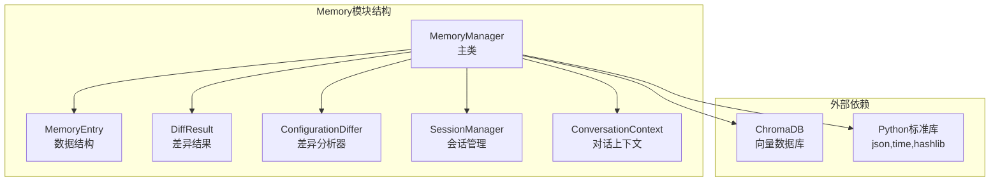
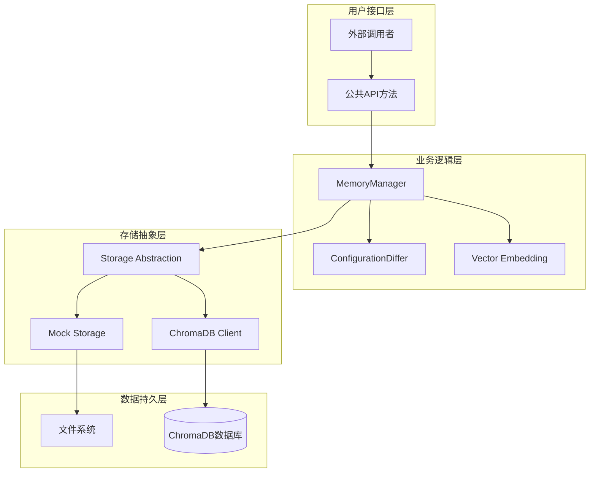
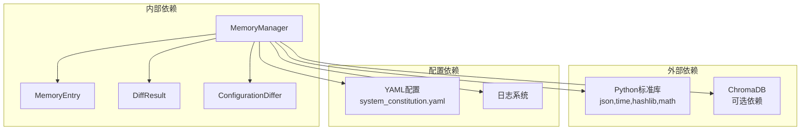

# 记忆管理API

<cite>
**本文档引用的文件**
- [memory_manager.py](file://openfoam_ai/memory/memory_manager.py)
- [__init__.py](file://openfoam_ai/memory/__init__.py)
- [README.md](file://openfoam_ai/README.md)
</cite>

## 目录
1. [简介](#简介)
2. [项目结构](#项目结构)
3. [核心组件](#核心组件)
4. [架构概览](#架构概览)
5. [详细组件分析](#详细组件分析)
6. [依赖关系分析](#依赖关系分析)
7. [性能考虑](#性能考虑)
8. [故障排除指南](#故障排除指南)
9. [结论](#结论)
10. [附录](#附录)

## 简介

MemoryManager类是OpenFOAM AI Agent项目中的核心记忆管理组件，基于ChromaDB向量数据库提供算例配置的历史存储、相似性检索和增量修改功能。该模块支持两种存储模式：生产模式（ChromaDB）和模拟模式，确保在不同环境下都能正常工作。

该API设计的核心目标是：
- **向量数据库存储**：将算例配置转换为向量表示，支持语义相似性检索
- **历史版本管理**：完整保存算例配置的历史版本，支持回滚和版本对比
- **增量更新机制**：通过配置差异分析，实现高效的增量修改和版本演进
- **多模态检索**：支持基于自然语言的语义检索和标签过滤

## 项目结构

MemoryManager模块位于openfoam_ai/memory目录下，包含以下核心文件：



**图表来源**
- [memory_manager.py:198-242](file://openfoam_ai/memory/memory_manager.py#L198-L242)
- [__init__.py:32-45](file://openfoam_ai/memory/__init__.py#L32-L45)

**章节来源**
- [memory_manager.py:1-50](file://openfoam_ai/memory/memory_manager.py#L1-L50)
- [__init__.py:1-61](file://openfoam_ai/memory/__init__.py#L1-L61)

## 核心组件

MemoryManager类提供了完整的记忆管理功能，包括存储、检索、版本管理和导出等核心操作。以下是主要组件的概述：

### 主要数据结构

1. **MemoryEntry**：单个记忆条目的数据结构，包含算例的基本信息、配置和元数据
2. **DiffResult**：配置差异分析的结果，提供详细的变更信息
3. **ConfigurationDiffer**：配置差异分析器，实现复杂的嵌套字典比较和应用

### 存储模式

MemoryManager支持两种存储模式以适应不同的部署环境：

1. **ChromaDB模式**：生产环境使用，提供高性能的向量数据库存储
2. **模拟模式**：开发和测试环境使用，基于内存的数据结构实现相同功能

**章节来源**
- [memory_manager.py:32-62](file://openfoam_ai/memory/memory_manager.py#L32-L62)
- [memory_manager.py:198-242](file://openfoam_ai/memory/memory_manager.py#L198-L242)

## 架构概览

MemoryManager的整体架构采用分层设计，确保了良好的可扩展性和维护性：



**图表来源**
- [memory_manager.py:208-242](file://openfoam_ai/memory/memory_manager.py#L208-L242)
- [memory_manager.py:243-254](file://openfoam_ai/memory/memory_manager.py#L243-L254)

### 设计原则

1. **模式分离**：通过抽象存储层实现ChromaDB和模拟模式的无缝切换
2. **向量检索**：使用向量嵌入实现语义级别的相似性匹配
3. **版本控制**：完整的算例历史版本管理，支持回滚和对比
4. **幂等性**：关键操作设计为幂等，确保重复执行的安全性

## 详细组件分析

### MemoryManager类详解

MemoryManager是整个记忆管理模块的核心类，提供了完整的API接口：

#### 构造函数参数

| 参数名 | 类型 | 默认值 | 描述 |
|--------|------|--------|------|
| db_path | str | "./memory_db" | 数据库文件存储路径 |
| collection_name | str | "openfoam_cases" | 向量数据库集合名称 |
| use_mock | bool | False | 是否强制使用模拟模式 |

#### 核心API方法

##### store_memory方法

**功能**：存储算例配置到记忆库

**参数**：
- case_name (str)：算例名称
- user_prompt (str)：用户的自然语言输入
- config (Dict[str, Any])：算例配置JSON对象
- tags (Optional[List[str]])：标签列表，默认为None

**返回值**：memory_id (str) - 生成的记忆ID

**异常处理**：
- ChromaDB模式：数据库连接异常时抛出Exception
- 模拟模式：无异常处理，返回None

**使用示例**：
```python
# 基本用法
memory_id = memory_manager.store_memory(
    case_name="cavity_flow",
    user_prompt="建立一个二维方腔驱动流，顶部速度1m/s",
    config=config_dict,
    tags=["initial", "lid_driven_cavity"]
)
```

**章节来源**
- [memory_manager.py:291-345](file://openfoam_ai/memory/memory_manager.py#L291-L345)

##### search_similar方法

**功能**：基于自然语言查询进行相似性检索

**参数**：
- query (str)：查询文本（自然语言）
- n_results (int)：返回结果数量，默认为3
- filter_tags (Optional[List[str]])：标签过滤器，默认为None

**返回值**：List[MemoryEntry] - 相似的记忆条目列表

**异常处理**：
- ChromaDB模式：查询异常时返回空列表
- 模拟模式：无异常处理

**使用示例**：
```python
# 基本相似性检索
similar_configs = memory_manager.search_similar("方腔驱动流模拟", n_results=2)

# 带标签过滤的检索
filtered_results = memory_manager.search_similar(
    "传热问题", 
    n_results=5, 
    filter_tags=["heat_transfer"]
)
```

**章节来源**
- [memory_manager.py:347-395](file://openfoam_ai/memory/memory_manager.py#L347-L395)

##### find_case_history方法

**功能**：查找特定算例的所有历史版本

**参数**：
- case_name (str)：算例名称

**返回值**：List[MemoryEntry] - 该算例的所有历史条目，按时间排序

**异常处理**：
- 无显式异常处理，返回空列表

**使用示例**：
```python
# 获取算例历史
history = memory_manager.find_case_history("cavity_flow")
for entry in history:
    print(f"{entry.timestamp}: {entry.user_prompt}")
```

**章节来源**
- [memory_manager.py:421-457](file://openfoam_ai/memory/memory_manager.py#L421-L457)

##### create_incremental_update方法

**功能**：创建增量更新（Diff update）

**参数**：
- case_name (str)：算例名称
- modification_prompt (str)：修改描述
- new_config (Dict[str, Any])：新配置

**返回值**：Tuple[DiffResult, str] - (差异结果, 新记忆ID)

**异常处理**：
- 无显式异常处理，返回默认值

**使用示例**：
```python
# 创建增量更新
diff_result, new_memory_id = memory_manager.create_incremental_update(
    case_name="cavity_flow",
    modification_prompt="在上一次的基础上，将粘度改为0.001，网格加密到40x40",
    new_config=updated_config
)

print(f"变更摘要: {diff_result.change_summary}")
for path, (old_val, new_val) in diff_result.modified.items():
    print(f"修改项: {path}: {old_val} -> {new_val}")
```

**章节来源**
- [memory_manager.py:474-520](file://openfoam_ai/memory/memory_manager.py#L474-L520)

### ConfigurationDiffer类详解

ConfigurationDiffer实现了复杂的配置差异分析功能：

#### compute_diff方法

**功能**：计算两个配置的差异

**参数**：
- old_config (Dict[str, Any])：原始配置
- new_config (Dict[str, Any])：新配置
- path (str)：当前路径（递归使用）

**返回值**：DiffResult - 差异分析结果

**复杂度分析**：
- 时间复杂度：O(n)，其中n是配置中键值对的数量
- 空间复杂度：O(n)，用于存储差异结果

**章节来源**
- [memory_manager.py:64-137](file://openfoam_ai/memory/memory_manager.py#L64-L137)

### MemoryEntry数据结构

MemoryEntry是记忆条目的核心数据结构：

| 字段名 | 类型 | 描述 |
|--------|------|------|
| memory_id | str | 记忆唯一标识符 |
| case_name | str | 算例名称 |
| user_prompt | str | 用户的自然语言描述 |
| config_json | Dict[str, Any] | JSON格式的配置数据 |
| timestamp | str | ISO格式的时间戳 |
| tags | List[str] | 标签列表 |
| embedding | Optional[List[float]] | 向量嵌入表示 |

**章节来源**
- [memory_manager.py:32-51](file://openfoam_ai/memory/memory_manager.py#L32-L51)

## 依赖关系分析

MemoryManager的依赖关系相对简洁，主要依赖于Python标准库和可选的ChromaDB库：



**图表来源**
- [memory_manager.py:14-29](file://openfoam_ai/memory/memory_manager.py#L14-L29)
- [__init__.py:32-45](file://openfoam_ai/memory/__init__.py#L32-L45)

### 关键依赖说明

1. **Python标准库**：json、time、hashlib、math等基础功能
2. **ChromaDB**：可选的向量数据库依赖，提供生产级存储
3. **YAML配置**：系统宪法配置文件，影响行为约束
4. **日志系统**：统一的日志输出机制

**章节来源**
- [memory_manager.py:14-30](file://openfoam_ai/memory/memory_manager.py#L14-L30)
- [__init__.py:32-45](file://openfoam_ai/memory/__init__.py#L32-L45)

## 性能考虑

### 存储性能

MemoryManager在不同模式下的性能特征：

| 模式 | 存储速度 | 检索速度 | 内存使用 | 适用场景 |
|------|----------|----------|----------|----------|
| ChromaDB | 高 | 高 | 中等 | 生产环境，大量数据 |
| 模拟模式 | 高 | 低 | 低 | 开发测试，小规模数据 |

### 向量嵌入性能

当前实现使用简化的哈希算法生成向量表示：
- **维度**：128维
- **生成时间**：O(m)，其中m为词汇数量
- **相似度计算**：O(d)，其中d为向量维度

### 内存使用分析

1. **模拟模式内存占用**：
   - 每个MemoryEntry约占用1-2KB
   - 向量存储额外占用128*4bytes ≈ 512bytes
   - 标签列表按实际数量存储

2. **ChromaDB模式内存占用**：
   - 由ChromaDB内部管理
   - 支持持久化存储，内存占用相对稳定

### 扩展性限制

1. **向量维度限制**：当前128维，可根据需要调整
2. **标签过滤限制**：ChromaDB模式仅支持单标签过滤
3. **并发访问**：未实现专门的并发控制机制

## 故障排除指南

### 常见问题及解决方案

#### ChromaDB初始化失败

**症状**：MemoryManager初始化时报错，回退到模拟模式

**原因**：
- ChromaDB库未安装
- DuckDB依赖缺失
- 文件权限问题

**解决方案**：
```python
# 强制使用模拟模式
mm = MemoryManager(use_mock=True)

# 检查ChromaDB安装
try:
    import chromadb
    print("ChromaDB可用")
except ImportError:
    print("请安装chromadb: pip install chromadb")
```

#### 搜索结果为空

**症状**：search_similar返回空列表

**可能原因**：
- 记忆库为空
- 查询文本过短
- 向量嵌入生成失败

**调试方法**：
```python
# 检查存储状态
stats = memory_manager.get_statistics()
print(f"总记忆数: {stats['total_memories']}")

# 验证向量生成
test_embedding = memory_manager._generate_embedding("测试查询")
print(f"向量维度: {len(test_embedding)}")
```

#### 增量更新异常

**症状**：create_incremental_update返回异常结果

**检查步骤**：
1. 确认算例历史存在
2. 验证配置格式正确
3. 检查DiffResult字段完整性

**章节来源**
- [memory_manager.py:233-241](file://openfoam_ai/memory/memory_manager.py#L233-L241)
- [memory_manager.py:584-608](file://openfoam_ai/memory/memory_manager.py#L584-L608)

## 结论

MemoryManager类为OpenFOAM AI Agent项目提供了强大的记忆管理能力，通过向量数据库技术实现了智能化的算例配置存储和检索。其设计特点包括：

1. **双模式支持**：灵活适应不同部署环境
2. **语义检索**：基于自然语言的相似性匹配
3. **版本管理**：完整的算例历史追踪
4. **增量更新**：高效的配置演进机制

该API为CFD仿真工作流提供了重要的知识积累和复用能力，是实现AI辅助仿真的关键基础设施。

## 附录

### API版本兼容性

当前版本为1.0，遵循以下兼容性原则：
- 向后兼容：新增方法不影响现有调用
- 数据格式：JSON序列化保持稳定
- 错误处理：异常类型保持一致

### 迁移指南

从早期版本迁移到当前版本需要注意：

1. **构造函数参数变化**：新增use_mock参数
2. **返回值格式**：部分方法返回值结构调整
3. **异常处理**：新的异常处理机制

### 使用最佳实践

1. **合理选择存储模式**：生产环境使用ChromaDB，开发环境使用模拟模式
2. **标签管理**：为算例配置添加有意义的标签
3. **定期备份**：重要配置定期导出备份
4. **性能监控**：关注向量嵌入生成和查询性能