# 记忆管理器

<cite>
**本文档引用的文件**
- [memory_manager.py](file://openfoam_ai/memory/memory_manager.py)
- [__init__.py](file://openfoam_ai/memory/__init__.py)
- [session_manager.py](file://openfoam_ai/memory/session_manager.py)
- [requirements.txt](file://openfoam_ai/requirements.txt)
- [test_phase3.py](file://openfoam_ai/tests/test_phase3.py)
- [main_phase3.py](file://openfoam_ai/main_phase3.py)
</cite>

## 目录
1. [简介](#简介)
2. [项目结构](#项目结构)
3. [核心组件](#核心组件)
4. [架构概览](#架构概览)
5. [详细组件分析](#详细组件分析)
6. [依赖关系分析](#依赖关系分析)
7. [性能考虑](#性能考虑)
8. [故障排除指南](#故障排除指南)
9. [结论](#结论)
10. [附录](#附录)

## 简介

MemoryManager是一个基于ChromaDB的向量数据库存储和检索系统，专门用于OpenFOAM算例配置的历史记录管理。该系统提供了以下核心功能：

- **向量数据库存储**：基于ChromaDB的向量数据库，支持相似性检索
- **自然语言检索**：通过自然语言查询相似的历史配置
- **配置差异化更新**：支持增量修改（Diff update）功能
- **会话历史管理**：与SessionManager集成，管理多轮对话上下文

该系统采用双模式架构，既可以在生产环境中使用ChromaDB进行高性能向量检索，也可以在开发或资源受限环境下使用模拟模式。

## 项目结构

MemoryManager模块位于`openfoam_ai/memory/`目录下，主要包含以下文件：

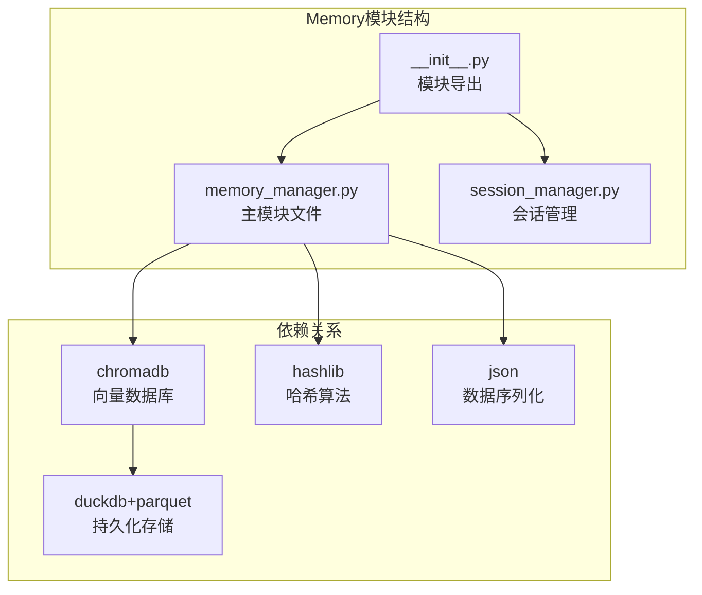

**图表来源**
- [memory_manager.py:1-30](file://openfoam_ai/memory/memory_manager.py#L1-L30)
- [session_manager.py:1-50](file://openfoam_ai/memory/session_manager.py#L1-L50)

**章节来源**
- [memory_manager.py:1-61](file://openfoam_ai/memory/memory_manager.py#L1-L61)
- [__init__.py:1-61](file://openfoam_ai/memory/__init__.py#L1-L61)

## 核心组件

MemoryManager系统由以下几个核心组件构成：

### 1. MemoryEntry数据结构
这是系统中最基本的数据单元，用于存储单个算例配置的历史记录。

### 2. ConfigurationDiffer差异分析器
实现了配置差异计算和应用的核心算法，支持嵌套字典的深度比较。

### 3. MemoryManager主控制器
负责整个系统的协调工作，包括数据库连接、向量生成、存储检索等功能。

### 4. SessionManager会话管理
与MemoryManager集成，管理多轮对话的上下文状态。

**章节来源**
- [memory_manager.py:32-51](file://openfoam_ai/memory/memory_manager.py#L32-L51)
- [memory_manager.py:64-166](file://openfoam_ai/memory/memory_manager.py#L64-L166)
- [memory_manager.py:198-804](file://openfoam_ai/memory/memory_manager.py#L198-L804)

## 架构概览

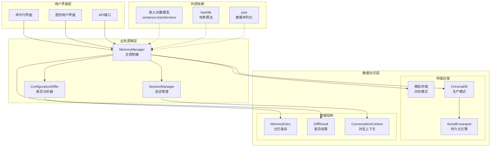

**图表来源**
- [memory_manager.py:198-242](file://openfoam_ai/memory/memory_manager.py#L198-L242)
- [memory_manager.py:64-166](file://openfoam_ai/memory/memory_manager.py#L64-L166)
- [session_manager.py:171-228](file://openfoam_ai/memory/session_manager.py#L171-L228)

## 详细组件分析

### MemoryEntry数据结构

MemoryEntry是系统的基础数据单元，定义了存储在记忆库中的单个配置记录的完整结构。

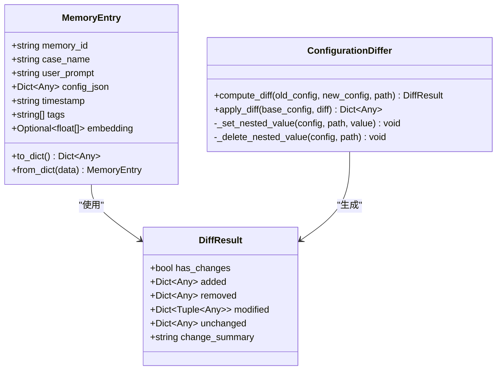

**图表来源**
- [memory_manager.py:32-51](file://openfoam_ai/memory/memory_manager.py#L32-L51)
- [memory_manager.py:53-62](file://openfoam_ai/memory/memory_manager.py#L53-L62)
- [memory_manager.py:64-196](file://openfoam_ai/memory/memory_manager.py#L64-L196)

#### MemoryEntry字段说明

| 字段名 | 类型 | 描述 | 必需 |
|--------|------|------|------|
| memory_id | string | 记忆条目的唯一标识符 | 是 |
| case_name | string | 算例名称 | 是 |
| user_prompt | string | 用户的自然语言描述 | 是 |
| config_json | Dict[Any] | OpenFOAM配置的JSON表示 | 是 |
| timestamp | string | ISO格式的时间戳 | 是 |
| tags | List[string] | 标签列表，用于分类和过滤 | 否 |
| embedding | Optional[List[float]] | 向量嵌入表示 | 否 |

**章节来源**
- [memory_manager.py:32-51](file://openfoam_ai/memory/memory_manager.py#L32-L51)

### ConfigurationDiffer差异分析器

ConfigurationDiffer实现了复杂的配置差异计算算法，支持嵌套字典的深度比较和差异应用。

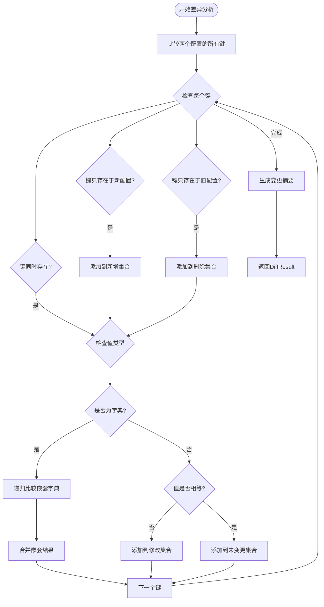

**图表来源**
- [memory_manager.py:67-136](file://openfoam_ai/memory/memory_manager.py#L67-L136)

#### 差异分析算法复杂度

- **时间复杂度**: O(n)，其中n是配置中键值对的总数
- **空间复杂度**: O(n)，用于存储差异结果
- **递归深度**: 取决于配置的嵌套层数

**章节来源**
- [memory_manager.py:64-166](file://openfoam_ai/memory/memory_manager.py#L64-L166)

### MemoryManager主控制器

MemoryManager是系统的核心控制器，负责协调所有功能模块。

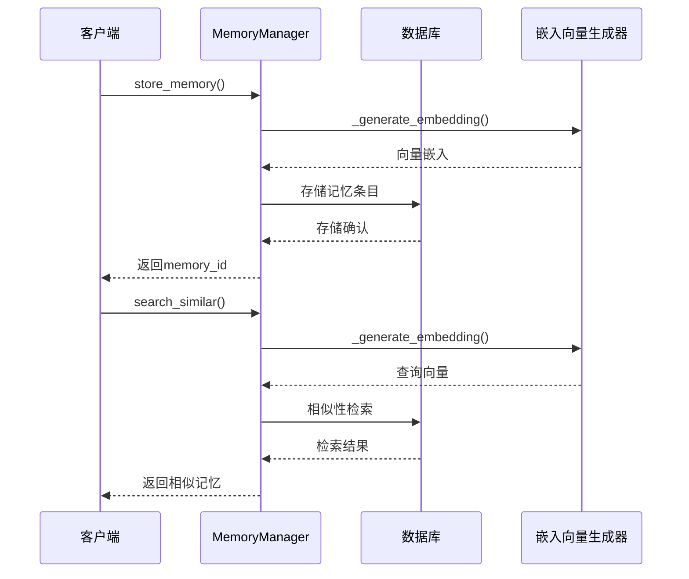

**图表来源**
- [memory_manager.py:291-345](file://openfoam_ai/memory/memory_manager.py#L291-L345)
- [memory_manager.py:347-395](file://openfoam_ai/memory/memory_manager.py#L347-L395)

#### 初始化流程

MemoryManager支持两种初始化模式：

1. **ChromaDB模式**：生产环境，使用真正的向量数据库
2. **模拟模式**：开发环境，使用内存存储

**章节来源**
- [memory_manager.py:198-242](file://openfoam_ai/memory/memory_manager.py#L198-L242)

### 向量数据库集成机制

#### ChromaDB初始化

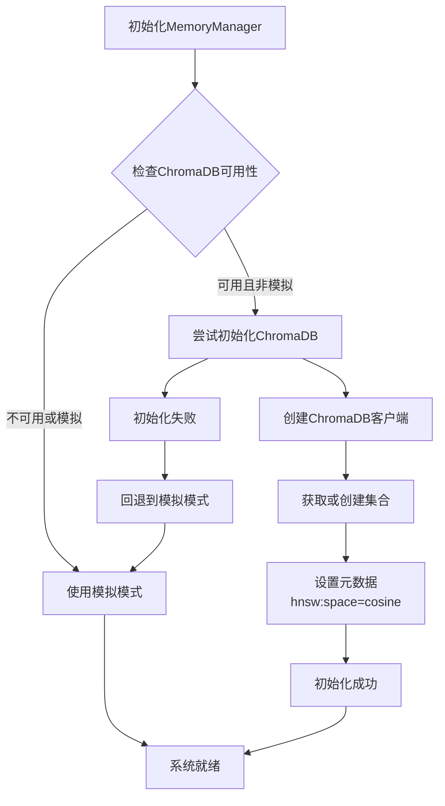

**图表来源**
- [memory_manager.py:233-242](file://openfoam_ai/memory/memory_manager.py#L233-L242)
- [memory_manager.py:243-254](file://openfoam_ai/memory/memory_manager.py#L243-L254)

#### 集合管理

- **集合名称**: `openfoam_cases`
- **向量空间**: `cosine`（余弦相似度）
- **持久化**: 使用duckdb+parquet引擎
- **元数据**: 包含算例名称、时间戳、配置JSON、标签等

**章节来源**
- [memory_manager.py:243-254](file://openfoam_ai/memory/memory_manager.py#L243-L254)

### 嵌入向量生成策略

#### 模拟嵌入生成器

由于项目要求使用简单的嵌入生成策略，系统实现了基于词频哈希的向量生成器：

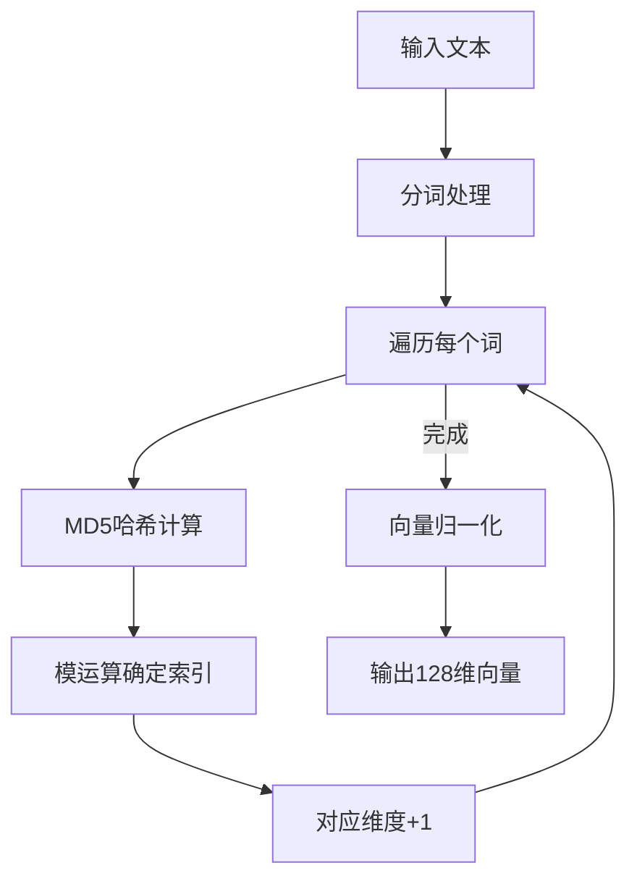

**图表来源**
- [memory_manager.py:256-284](file://openfoam_ai/memory/memory_manager.py#L256-L284)

#### 嵌入向量特性

- **维度**: 128维
- **生成材料**: 用户提示 + 配置JSON的字符串化
- **归一化**: L2范数归一化
- **用途**: 余弦相似度计算

**章节来源**
- [memory_manager.py:256-284](file://openfoam_ai/memory/memory_manager.py#L256-L284)

### 存储机制实现

#### 唯一ID生成

系统使用MD5哈希算法生成唯一的记忆ID：

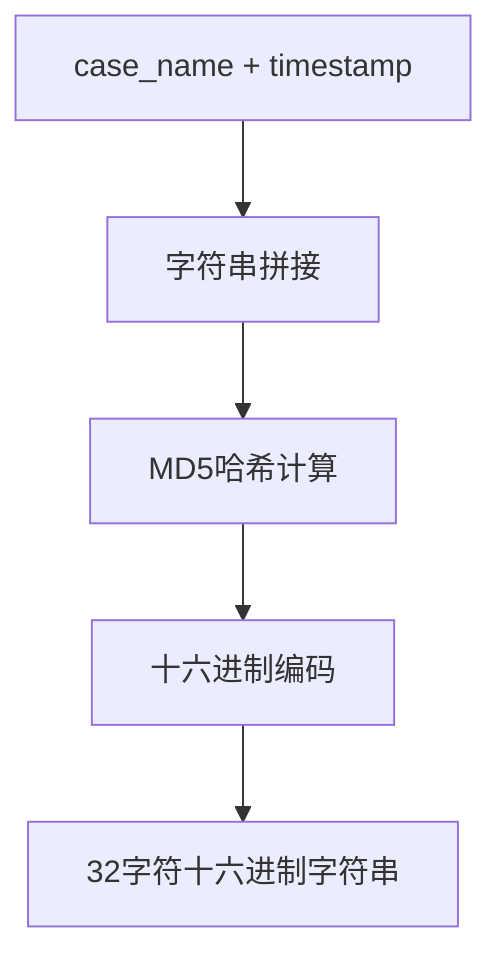

**图表来源**
- [memory_manager.py:286-289](file://openfoam_ai/memory/memory_manager.py#L286-L289)

#### 持久化存储

系统支持两种存储模式：

1. **模拟模式**：内存字典存储
2. **ChromaDB模式**：磁盘持久化存储

**章节来源**
- [memory_manager.py:286-345](file://openfoam_ai/memory/memory_manager.py#L286-L345)

### 相似性检索算法

#### 余弦相似度计算

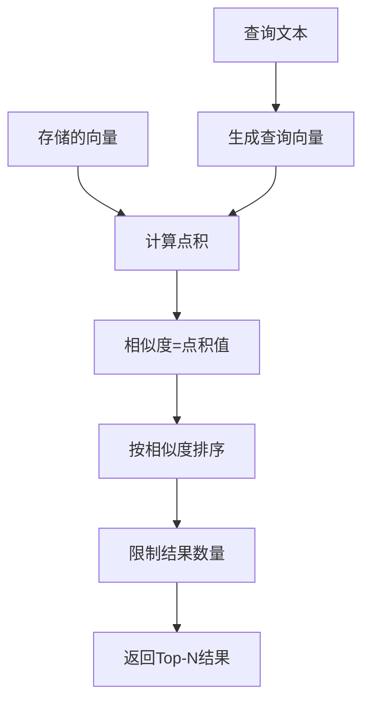

**图表来源**
- [memory_manager.py:347-419](file://openfoam_ai/memory/memory_manager.py#L347-L419)

#### 查询嵌入生成

查询文本的嵌入生成过程与存储时相同，确保查询和存储向量在同一向量空间中。

#### 结果排序机制

1. **相似度计算**: 使用余弦相似度（即向量点积）
2. **排序**: 按相似度降序排列
3. **过滤**: 支持标签过滤
4. **限制**: 可配置返回结果数量

**章节来源**
- [memory_manager.py:347-419](file://openfoam_ai/memory/memory_manager.py#L347-L419)

### 增量更新功能

#### ConfigurationDiffer集成

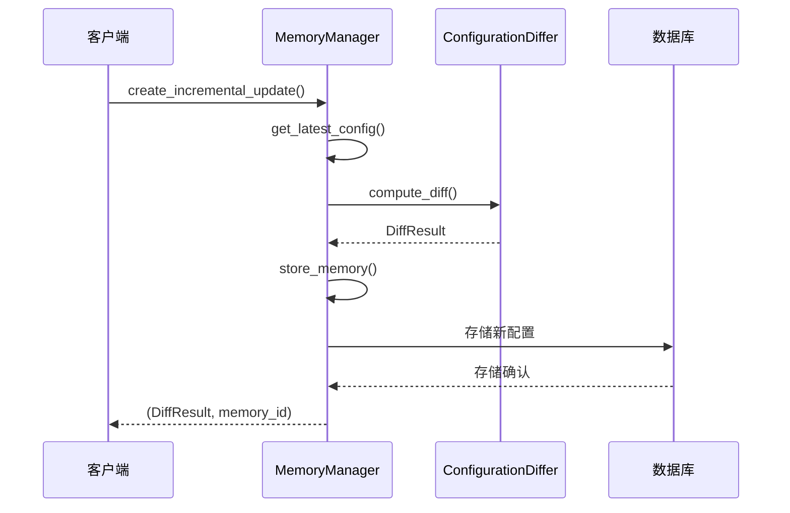

**图表来源**
- [memory_manager.py:474-520](file://openfoam_ai/memory/memory_manager.py#L474-L520)
- [memory_manager.py:67-136](file://openfoam_ai/memory/memory_manager.py#L67-L136)

#### 变更检测策略

1. **深度比较**: 支持嵌套字典的递归比较
2. **类型检查**: 确保比较的值类型一致
3. **路径跟踪**: 记录变更发生的具体路径
4. **摘要生成**: 提供人类可读的变更摘要

**章节来源**
- [memory_manager.py:474-520](file://openfoam_ai/memory/memory_manager.py#L474-L520)

## 依赖关系分析

### 外部依赖

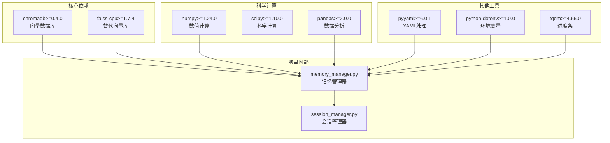

**图表来源**
- [requirements.txt:9-11](file://openfoam_ai/requirements.txt#L9-L11)
- [requirements.txt:13-17](file://openfoam_ai/requirements.txt#L13-L17)
- [requirements.txt:33-39](file://openfoam_ai/requirements.txt#L33-L39)

### 内部模块依赖

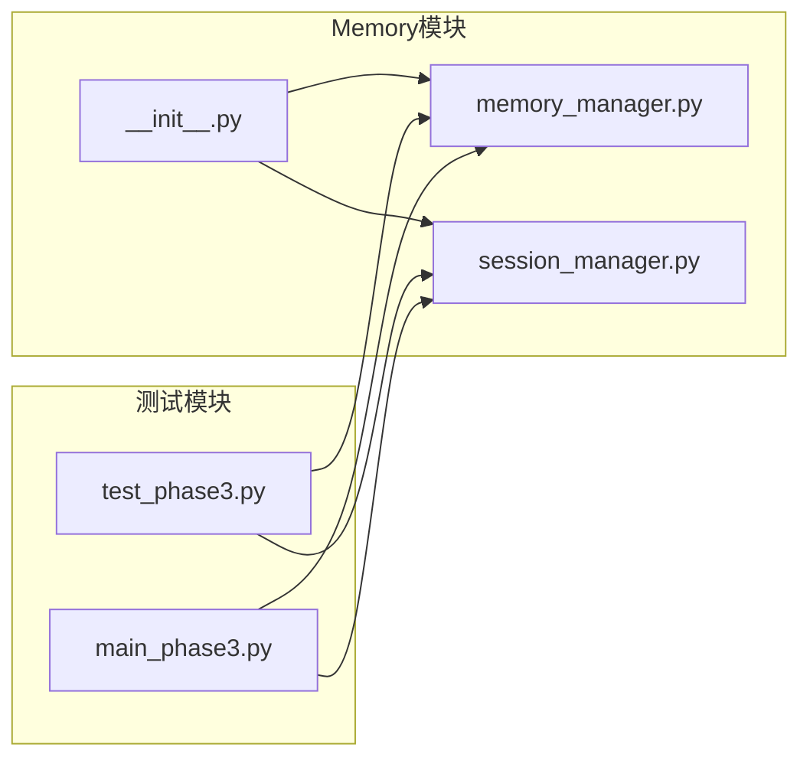

**图表来源**
- [__init__.py:32-45](file://openfoam_ai/memory/__init__.py#L32-L45)
- [test_phase3.py:443-452](file://openfoam_ai/tests/test_phase3.py#L443-L452)

**章节来源**
- [requirements.txt:1-40](file://openfoam_ai/requirements.txt#L1-L40)
- [__init__.py:32-60](file://openfoam_ai/memory/__init__.py#L32-L60)

## 性能考虑

### 向量数据库性能

1. **索引类型**: 使用HNSW（Hierarchical Navigable Small World）算法
2. **距离度量**: 余弦相似度，适合高维稀疏向量
3. **批量操作**: 支持批量插入和查询
4. **内存管理**: 自动内存缓存和垃圾回收

### 模拟模式优化

1. **内存效率**: 使用字典存储，避免磁盘I/O
2. **快速查找**: 哈希表实现O(1)平均查找时间
3. **简单算法**: 余弦相似度的直接计算
4. **低延迟**: 无网络通信开销

### 嵌入向量优化

1. **维度选择**: 128维在精度和性能间取得平衡
2. **归一化**: 预先归一化减少计算开销
3. **缓存策略**: 相同文本的嵌入结果可缓存
4. **批处理**: 大量相似性计算时的批处理优化

## 故障排除指南

### 常见问题及解决方案

#### ChromaDB初始化失败

**症状**: 系统回退到模拟模式，打印初始化失败信息

**可能原因**:
1. ChromaDB依赖未安装
2. DuckDB权限问题
3. 磁盘空间不足
4. 文件系统权限问题

**解决方案**:
```python
# 强制使用模拟模式
mm = MemoryManager(use_mock=True)

# 检查依赖安装
# pip install chromadb

# 检查磁盘空间和权限
```

#### 相似性检索结果异常

**症状**: 检索结果不准确或为空

**排查步骤**:
1. 检查嵌入向量维度是否正确
2. 验证查询文本是否包含有效信息
3. 确认标签过滤条件是否过于严格
4. 检查数据库连接状态

#### 内存泄漏问题

**症状**: 长时间运行后内存占用持续增长

**解决方案**:
1. 定期清理不需要的记忆条目
2. 使用`delete_memory()`方法删除过期数据
3. 监控`get_statistics()`返回的统计信息
4. 考虑重启服务释放内存

**章节来源**
- [memory_manager.py:233-242](file://openfoam_ai/memory/memory_manager.py#L233-L242)
- [memory_manager.py:562-582](file://openfoam_ai/memory/memory_manager.py#L562-L582)

## 结论

MemoryManager系统为OpenFOAM算例配置管理提供了一个强大而灵活的解决方案。其主要优势包括：

1. **双模式架构**: 既能满足生产环境的高性能需求，又能适应开发环境的便利性
2. **智能差异分析**: 提供精确的配置变更检测和应用能力
3. **向量数据库集成**: 利用ChromaDB实现高效的相似性检索
4. **模块化设计**: 清晰的组件分离便于维护和扩展

该系统为OpenFOAM AI代理提供了坚实的记忆基础，使得AI系统能够基于历史经验做出更好的决策。

## 附录

### 使用示例

#### 基本使用流程

```python
# 创建记忆管理器
mm = MemoryManager(db_path="./memory_db")

# 存储初始配置
config1 = {
    "physics_type": "incompressible",
    "solver": {"name": "icoFoam"}
}

memory_id = mm.store_memory(
    case_name="cavity_flow",
    user_prompt="建立方腔驱动流算例",
    config=config1,
    tags=["initial", "lid_driven_cavity"]
)

# 创建增量更新
config2 = config1.copy()
config2["geometry"] = {"mesh_resolution": {"nx": 40, "ny": 40}}

diff, new_memory_id = mm.create_incremental_update(
    case_name="cavity_flow",
    modification_prompt="加密网格到40x40",
    new_config=config2
)

# 相似性检索
similar_configs = mm.search_similar("方腔流动", n_results=3)
```

#### 配置参数说明

| 参数名 | 类型 | 默认值 | 描述 |
|--------|------|--------|------|
| db_path | string | "./memory_db" | 数据库存储路径 |
| collection_name | string | "openfoam_cases" | ChromaDB集合名称 |
| use_mock | bool | False | 是否强制使用模拟模式 |
| n_results | int | 3 | 相似性检索返回结果数量 |
| max_history | int | 50 | 会话最大历史消息数 |

#### 性能优化建议

1. **向量维度调优**: 根据硬件条件调整嵌入向量维度
2. **批量操作**: 大量数据操作时使用批量API
3. **索引优化**: 定期重建索引以保持查询性能
4. **内存监控**: 定期检查内存使用情况
5. **备份策略**: 定期备份ChromaDB数据文件