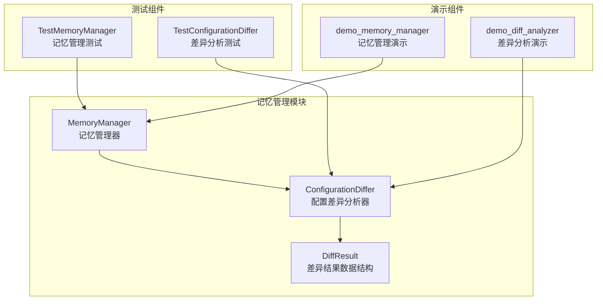
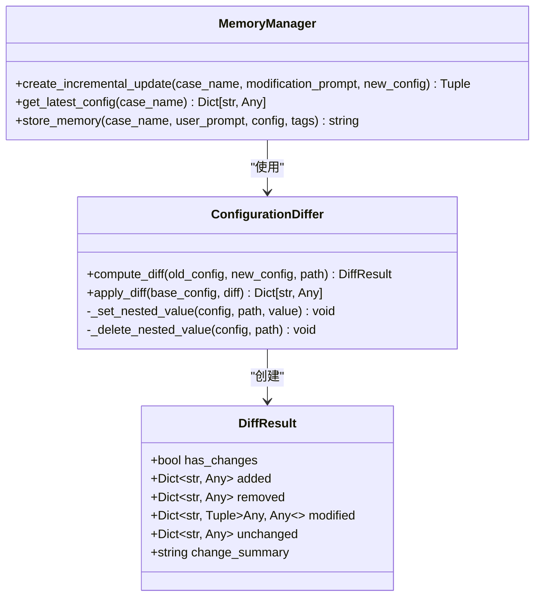
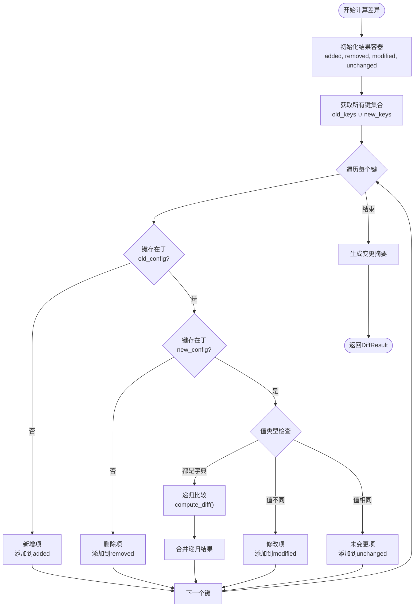
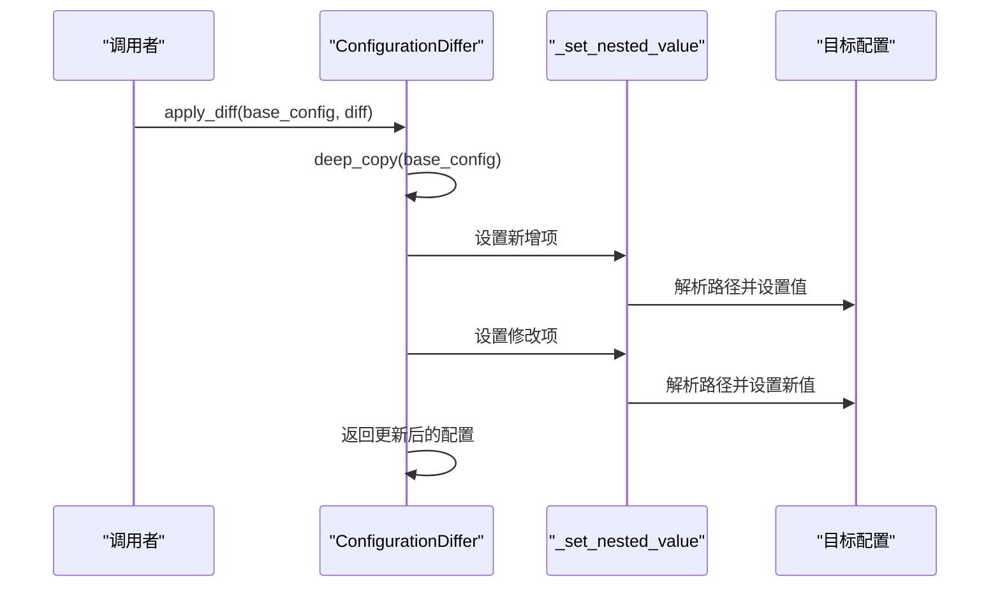
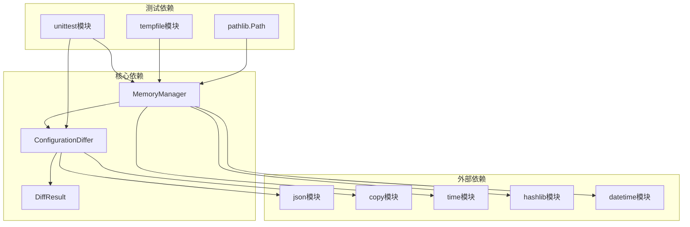

# 配置差异分析器

<cite>
**本文档引用的文件**
- [memory_manager.py](file://openfoam_ai/memory/memory_manager.py)
- [main_phase3.py](file://openfoam_ai/main_phase3.py)
- [test_phase3.py](file://openfoam_ai/tests/test_phase3.py)
</cite>

## 目录
1. [简介](#简介)
2. [项目结构](#项目结构)
3. [核心组件](#核心组件)
4. [架构概览](#架构概览)
5. [详细组件分析](#详细组件分析)
6. [依赖关系分析](#依赖关系分析)
7. [性能考虑](#性能考虑)
8. [故障排除指南](#故障排除指南)
9. [结论](#结论)

## 简介

ConfigurationDiffer类是OpenFOAM AI项目中的核心配置差异分析组件，负责比较两个配置字典之间的差异，并提供增量更新能力。该组件支持复杂的嵌套配置结构，能够准确识别新增、删除、修改和未变更的配置项，并提供安全的差异应用机制。

该组件在记忆管理模块中发挥关键作用，支持基于历史配置的智能增量更新，为用户提供高效、准确的配置管理体验。

## 项目结构

ConfigurationDiffer类位于记忆管理模块中，与相关组件共同构成完整的配置管理生态系统：



**图表来源**
- [memory_manager.py:64-196](file://openfoam_ai/memory/memory_manager.py#L64-L196)
- [test_phase3.py:36-104](file://openfoam_ai/tests/test_phase3.py#L36-L104)
- [main_phase3.py:216-278](file://openfoam_ai/main_phase3.py#L216-L278)

**章节来源**
- [memory_manager.py:1-804](file://openfoam_ai/memory/memory_manager.py#L1-L804)
- [main_phase3.py:216-415](file://openfoam_ai/main_phase3.py#L216-L415)

## 核心组件

### ConfigurationDiffer类

ConfigurationDiffer是一个静态工具类，提供配置差异分析的核心功能。其设计遵循单一职责原则，专注于配置比较和差异应用。

### DiffResult数据结构

DiffResult是配置差异分析的结果容器，采用dataclass设计，提供清晰的数据组织和访问接口：

| 字段名 | 类型 | 描述 | 使用场景 |
|--------|------|------|----------|
| has_changes | bool | 是否存在任何变更 | 快速判断是否有差异 |
| added | Dict[str, Any] | 新增的配置项 | 标识新增的配置键值对 |
| removed | Dict[str, Any] | 删除的配置项 | 标识被移除的配置键值对 |
| modified | Dict[str, Tuple[Any, Any]] | 修改的配置项 | 标识变更的配置键值对，包含(旧值, 新值) |
| unchanged | Dict[str, Any] | 未变更的配置项 | 标识保持不变的配置键值对 |
| change_summary | str | 变更摘要字符串 | 提供人类可读的变更描述 |

**章节来源**
- [memory_manager.py:53-62](file://openfoam_ai/memory/memory_manager.py#L53-L62)
- [memory_manager.py:64-196](file://openfoam_ai/memory/memory_manager.py#L64-L196)

## 架构概览

ConfigurationDiffer的架构设计体现了良好的分层结构和职责分离：



**图表来源**
- [memory_manager.py:64-196](file://openfoam_ai/memory/memory_manager.py#L64-L196)
- [memory_manager.py:474-520](file://openfoam_ai/memory/memory_manager.py#L474-L520)

## 详细组件分析

### 差异计算算法

ConfigurationDiffer的差异计算采用递归比较机制，能够处理任意深度的嵌套配置结构：

#### 核心算法流程



**图表来源**
- [memory_manager.py:68-136](file://openfoam_ai/memory/memory_manager.py#L68-L136)

#### 递归比较机制

递归比较是ConfigurationDiffer的核心特性，能够处理复杂的嵌套配置结构：

1. **路径追踪策略**：使用点号分隔的路径标识符，如`geometry.mesh_resolution.nx`
2. **类型检查**：优先检查是否为字典类型，确保递归比较的准确性
3. **深度遍历**：对嵌套字典进行深度优先遍历，确保所有层级都被正确比较

#### 数据类型处理

ConfigurationDiffer支持多种数据类型的比较：

| 数据类型 | 处理方式 | 特殊考虑 |
|----------|----------|----------|
| 字典(dict) | 递归比较 | 路径拼接，深度遍历 |
| 基本类型 | 直接比较 | 数值、字符串、布尔值 |
| 列表(list) | 直接比较 | 注意列表顺序影响 |
| None | 直接比较 | 空值处理 |

**章节来源**
- [memory_manager.py:68-136](file://openfoam_ai/memory/memory_manager.py#L68-L136)

### 差异应用机制

差异应用提供了安全的配置更新能力，支持三种主要操作：

#### 嵌套值设置



**图表来源**
- [memory_manager.py:139-166](file://openfoam_ai/memory/memory_manager.py#L139-L166)
- [memory_manager.py:169-181](file://openfoam_ai/memory/memory_manager.py#L169-L181)

#### 路径解析算法

路径解析是差异应用的关键组件，负责将点号分隔的路径转换为嵌套字典的访问序列：

1. **路径分割**：使用`.`字符分割路径字符串
2. **逐级导航**：从根字典开始，逐级访问子字典
3. **自动创建**：如果中间路径不存在，自动创建空字典
4. **最终赋值**：将值设置到目标位置

#### 配置合并算法

配置合并采用增量更新策略，确保只应用必要的变更：

1. **深拷贝基础配置**：避免修改原始配置
2. **应用新增项**：递归创建缺失的嵌套结构
3. **应用修改项**：替换现有值
4. **应用删除项**：递归删除指定键

**章节来源**
- [memory_manager.py:139-196](file://openfoam_ai/memory/memory_manager.py#L139-L196)

### 使用示例

#### 基本差异分析

```python
# 原始配置
old_config = {
    "physics_type": "incompressible",
    "solver": {"name": "icoFoam"},
    "geometry": {
        "dimensions": {"L": 1.0, "W": 1.0, "H": 0.1},
        "mesh_resolution": {"nx": 20, "ny": 20, "nz": 1}
    },
    "fluid_properties": {"nu": 0.01}
}

# 新配置
new_config = {
    "physics_type": "incompressible",
    "solver": {"name": "icoFoam"},
    "geometry": {
        "dimensions": {"L": 1.0, "W": 1.0, "H": 0.1},
        "mesh_resolution": {"nx": 40, "ny": 40, "nz": 1}
    },
    "fluid_properties": {"nu": 0.001},
    "new_parameter": "added_value"
}

# 计算差异
diff = ConfigurationDiffer.compute_diff(old_config, new_config)
print(f"是否有变更: {diff.has_changes}")
print(f"变更摘要: {diff.change_summary}")

# 应用差异
updated_config = ConfigurationDiffer.apply_diff(old_config, diff)
```

#### 复杂嵌套配置处理

对于更复杂的配置结构，ConfigurationDiffer同样能够准确处理：

```python
complex_old = {
    "simulation": {
        "time": {
            "startTime": 0.0,
            "endTime": 1.0,
            "deltaT": 0.01
        },
        "turbulence": {
            "model": "kOmegaSST",
            "wallFunctions": {
                "yPlus": 11.6
            }
        }
    }
}

complex_new = {
    "simulation": {
        "time": {
            "startTime": 0.0,
            "endTime": 2.0,  # 修改
            "deltaT": 0.01
        },
        "turbulence": {
            "model": "kOmegaSST",
            "wallFunctions": {
                "yPlus": 11.6,
                "additionalParam": "new_value"  # 新增
            }
        },
        "new_section": {  # 新增
            "param": "value"
        }
    }
}
```

**章节来源**
- [main_phase3.py:216-278](file://openfoam_ai/main_phase3.py#L216-L278)
- [test_phase3.py:39-104](file://openfoam_ai/tests/test_phase3.py#L39-L104)

## 依赖关系分析

ConfigurationDiffer与其他组件的依赖关系体现了清晰的模块化设计：



**图表来源**
- [memory_manager.py:14-21](file://openfoam_ai/memory/memory_manager.py#L14-L21)
- [test_phase3.py:17-26](file://openfoam_ai/tests/test_phase3.py#L17-L26)

**章节来源**
- [memory_manager.py:14-21](file://openfoam_ai/memory/memory_manager.py#L14-L21)
- [test_phase3.py:17-26](file://openfoam_ai/tests/test_phase3.py#L17-L26)

## 性能考虑

### 时间复杂度分析

ConfigurationDiffer的时间复杂度为O(n)，其中n是配置中键值对的总数：

- **最佳情况**：O(n) - 需要检查每个键值对
- **最坏情况**：O(n) - 需要检查每个键值对
- **平均情况**：O(n) - 线性扫描所有配置项

### 空间复杂度分析

空间复杂度为O(d)，其中d是配置的最大嵌套深度：

- **递归栈空间**：O(d) - 递归调用的深度
- **结果存储空间**：O(n) - 存储差异结果
- **临时变量空间**：O(1) - 常量级别的额外空间

### 优化建议

1. **早期退出优化**：对于完全相同的配置，可以快速返回
2. **缓存机制**：对频繁比较的配置结果进行缓存
3. **批量处理**：支持批量配置比较以提高效率
4. **内存池**：对于大量配置比较场景，考虑内存池优化

### 边界情况处理

ConfigurationDiffer能够妥善处理以下边界情况：

1. **空配置**：两个空字典比较返回无变更
2. **类型不匹配**：不同类型的值被视为修改
3. **None值**：None值的处理遵循Python的None比较规则
4. **循环引用**：通过递归深度限制防止无限递归
5. **大整数和浮点数**：精确数值比较，注意浮点精度问题

**章节来源**
- [memory_manager.py:68-136](file://openfoam_ai/memory/memory_manager.py#L68-L136)
- [memory_manager.py:139-196](file://openfoam_ai/memory/memory_manager.py#L139-L196)

## 故障排除指南

### 常见问题及解决方案

#### 1. 路径解析错误

**问题**：路径包含特殊字符导致解析失败
**解决方案**：确保路径使用标准的点号分隔格式

#### 2. 递归深度超限

**问题**：过深的嵌套配置导致递归超时
**解决方案**：设置合理的递归深度限制

#### 3. 内存使用过高

**问题**：大型配置比较占用过多内存
**解决方案**：考虑分批处理或使用流式处理

#### 4. 类型转换异常

**问题**：不同数据类型比较产生异常
**解决方案**：在比较前进行类型验证和转换

### 调试技巧

1. **启用详细日志**：记录每一步的比较过程
2. **单元测试覆盖**：编写全面的测试用例
3. **性能监控**：监控时间和内存使用情况
4. **边界测试**：测试极端情况和异常输入

**章节来源**
- [test_phase3.py:62-104](file://openfoam_ai/tests/test_phase3.py#L62-L104)
- [memory_manager.py:68-196](file://openfoam_ai/memory/memory_manager.py#L68-L196)

## 结论

ConfigurationDiffer类为OpenFOAM AI项目提供了强大而灵活的配置差异分析能力。其设计体现了以下优势：

1. **算法简洁高效**：O(n)时间复杂度，适合大规模配置比较
2. **功能完整**：支持新增、删除、修改、未变更四种类型的识别
3. **扩展性强**：递归设计支持任意深度的嵌套配置
4. **应用广泛**：在记忆管理和增量更新场景中发挥重要作用

通过精心设计的DiffResult数据结构和健壮的差异应用机制，ConfigurationDiffer为用户提供了可靠、高效的配置管理解决方案。其在实际应用中的表现证明了设计的有效性和实用性。