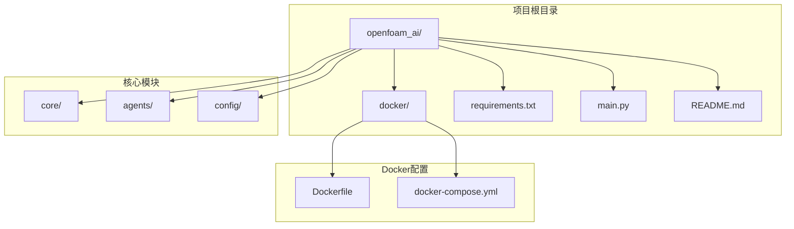
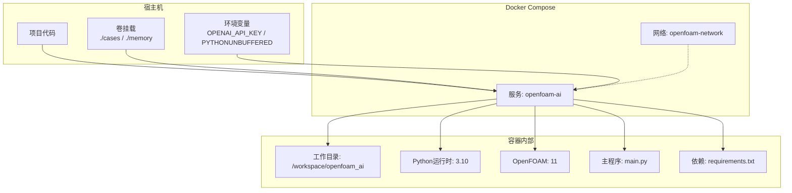
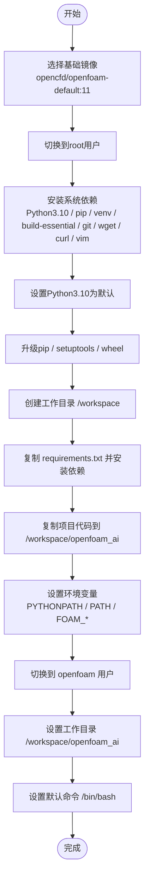
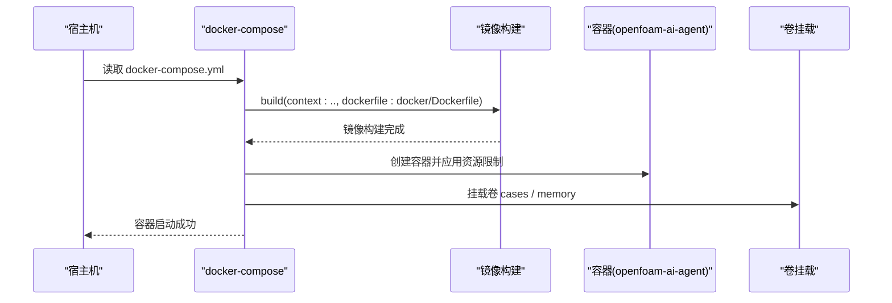
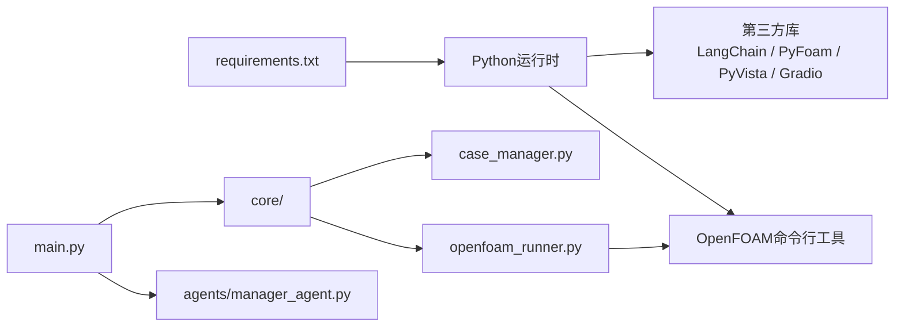
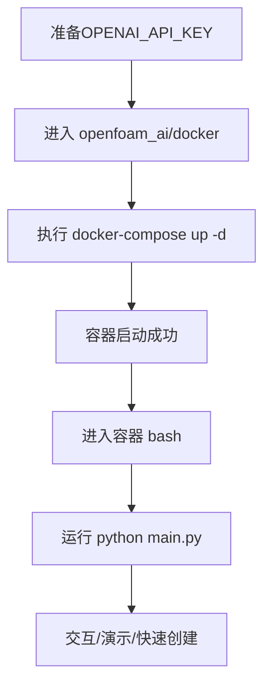
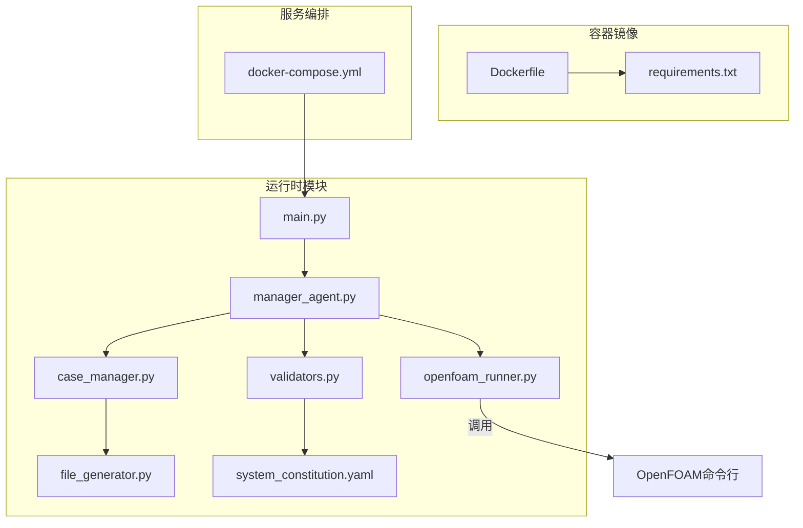

# Docker容器化部署

<cite>
**本文档引用的文件**
- [Dockerfile](file://openfoam_ai/docker/Dockerfile)
- [docker-compose.yml](file://openfoam_ai/docker/docker-compose.yml)
- [requirements.txt](file://openfoam_ai/requirements.txt)
- [main.py](file://openfoam_ai/main.py)
- [README.md](file://openfoam_ai/README.md)
- [openfoam_runner.py](file://openfoam_ai/core/openfoam_runner.py)
- [case_manager.py](file://openfoam_ai/core/case_manager.py)
- [manager_agent.py](file://openfoam_ai/agents/manager_agent.py)
- [system_constitution.yaml](file://openfoam_ai/config/system_constitution.yaml)
- [validators.py](file://openfoam_ai/core/validators.py)
- [file_generator.py](file://openfoam_ai/core/file_generator.py)
- [start.bat](file://start.bat)
- [start_gui.bat](file://start_gui.bat)
</cite>

## 目录
1. [简介](#简介)
2. [项目结构](#项目结构)
3. [核心组件](#核心组件)
4. [架构总览](#架构总览)
5. [详细组件分析](#详细组件分析)
6. [依赖关系分析](#依赖关系分析)
7. [性能考虑](#性能考虑)
8. [故障排除指南](#故障排除指南)
9. [结论](#结论)
10. [附录](#附录)

## 简介
本文件面向OpenFOAM AI的Docker容器化部署，提供从镜像构建到服务编排的完整技术文档。内容涵盖：
- Dockerfile构建流程：基础镜像选择、系统依赖安装、Python环境配置、OpenFOAM集成与环境变量设置
- docker-compose.yml服务编排：容器网络、数据卷挂载、环境变量、资源限制与持久化
- 部署流程：镜像构建、容器启动、交互与演示模式运行
- 容器配置优化：资源限制、安全加固、性能调优
- 最佳实践与故障排除：常见问题定位与解决方案

## 项目结构
OpenFOAM AI的Docker相关配置集中在openfoam_ai/docker目录，配合项目根目录的requirements.txt与核心模块共同构成容器化运行环境。

**图表来源**
- [Dockerfile](file://openfoam_ai/docker/Dockerfile)
- [docker-compose.yml](file://openfoam_ai/docker/docker-compose.yml)
- [requirements.txt](file://openfoam_ai/requirements.txt)
- [main.py](file://openfoam_ai/main.py)
- [README.md](file://openfoam_ai/README.md)

**章节来源**
- [Dockerfile](file://openfoam_ai/docker/Dockerfile)
- [docker-compose.yml](file://openfoam_ai/docker/docker-compose.yml)
- [requirements.txt](file://openfoam_ai/requirements.txt)
- [README.md](file://openfoam_ai/README.md)

## 核心组件
- Dockerfile：定义容器基础镜像、系统依赖、Python环境、项目复制与环境变量，切换到OpenFOAM用户并设置默认工作目录与命令
- docker-compose.yml：定义服务镜像构建上下文、环境变量、卷挂载、资源限制、网络与容器命名
- requirements.txt：声明Python依赖，包括LLM框架、向量数据库、科学计算、OpenFOAM接口、后处理与Web UI组件
- 核心运行入口：main.py提供交互模式、演示模式与快速创建模式，依赖OpenFOAM命令执行器与算例管理器

**章节来源**
- [Dockerfile](file://openfoam_ai/docker/Dockerfile)
- [docker-compose.yml](file://openfoam_ai/docker/docker-compose.yml)
- [requirements.txt](file://openfoam_ai/requirements.txt)
- [main.py](file://openfoam_ai/main.py)

## 架构总览
下图展示容器化部署的整体架构：Dockerfile构建镜像，docker-compose编排服务，容器内运行OpenFOAM AI主程序，通过卷挂载实现数据持久化与开发调试。

**图表来源**
- [Dockerfile](file://openfoam_ai/docker/Dockerfile)
- [docker-compose.yml](file://openfoam_ai/docker/docker-compose.yml)
- [requirements.txt](file://openfoam_ai/requirements.txt)
- [main.py](file://openfoam_ai/main.py)

## 详细组件分析

### Dockerfile构建流程
- 基础镜像：opencfd/openfoam-default:11，确保OpenFOAM 11可用
- 权限与用户：以root执行系统依赖安装，随后切换到openfoam用户
- 系统依赖：安装Python 3.10、pip、venv、build-essential、git、wget、curl、vim等
- Python环境：设置Python3.10为默认，升级pip与setuptools
- 项目复制与依赖安装：复制requirements.txt并安装；复制项目代码至/workspace/openfoam_ai
- 环境变量：设置PYTHONPATH、PATH、FOAM_USER_LIBBIN、FOAM_USER_APPBIN
- 工作目录与默认命令：WORKDIR为/workspace/openfoam_ai，CMD为/bin/bash

**图表来源**
- [Dockerfile](file://openfoam_ai/docker/Dockerfile)

**章节来源**
- [Dockerfile](file://openfoam_ai/docker/Dockerfile)

### docker-compose.yml服务编排
- 服务定义：基于Dockerfile在上层目录构建镜像，命名为openfoam-ai:latest，容器名为openfoam-ai-agent
- 环境变量：OPENAI_API_KEY（来自宿主机环境变量）、PYTHONUNBUFFERED=1
- 卷挂载：将宿主机项目目录映射到/workspace/openfoam_ai，将cases与memory目录映射到容器内对应路径
- 工作目录：/workspace/openfoam_ai
- 资源限制：CPU限制4核、内存8GB，预留2核与4GB
- 网络：创建并加入bridge网络openfoam-network

**图表来源**
- [docker-compose.yml](file://openfoam_ai/docker/docker-compose.yml)

**章节来源**
- [docker-compose.yml](file://openfoam_ai/docker/docker-compose.yml)

### Python依赖与OpenFOAM集成
- 依赖清单：包含LangChain、OpenAI SDK、ChromaDB、FAISS、NumPy、SciPy、Matplotlib、Pydantic、PyFoam、PyVista、VTK、Gradio、Streamlit等
- OpenFOAM集成：通过PyFoam与系统命令行工具（blockMesh、checkMesh、icoFoam等）进行算例生成与求解器执行
- 运行入口：main.py支持交互模式、演示模式与快速创建模式，内部调用ManagerAgent、CaseManager与OpenFOAMRunner

**图表来源**
- [requirements.txt](file://openfoam_ai/requirements.txt)
- [main.py](file://openfoam_ai/main.py)
- [manager_agent.py](file://openfoam_ai/agents/manager_agent.py)
- [openfoam_runner.py](file://openfoam_ai/core/openfoam_runner.py)
- [case_manager.py](file://openfoam_ai/core/case_manager.py)

**章节来源**
- [requirements.txt](file://openfoam_ai/requirements.txt)
- [main.py](file://openfoam_ai/main.py)
- [manager_agent.py](file://openfoam_ai/agents/manager_agent.py)
- [openfoam_runner.py](file://openfoam_ai/core/openfoam_runner.py)
- [case_manager.py](file://openfoam_ai/core/case_manager.py)

### 部署流程
- 步骤1：准备环境变量OPENAI_API_KEY（可选）
- 步骤2：在openfoam_ai/docker目录执行docker-compose构建与启动
- 步骤3：进入容器交互模式，运行main.py进行演示或交互
- 步骤4：通过卷挂载cases与memory目录实现数据持久化与外部访问

**图表来源**
- [docker-compose.yml](file://openfoam_ai/docker/docker-compose.yml)
- [main.py](file://openfoam_ai/main.py)

**章节来源**
- [docker-compose.yml](file://openfoam_ai/docker/docker-compose.yml)
- [main.py](file://openfoam_ai/main.py)
- [README.md](file://openfoam_ai/README.md)

### 容器配置优化与安全加固
- 资源限制：通过deploy.resources.limits与reservations设置CPU与内存上限与预留，避免资源争用
- 用户与权限：以openfoam用户运行，降低权限风险
- 网络隔离：使用自定义bridge网络，便于后续扩展与隔离
- 卷挂载策略：仅挂载必要目录，避免暴露宿主机敏感路径
- 环境变量：通过环境变量注入API密钥，避免硬编码

**章节来源**
- [docker-compose.yml](file://openfoam_ai/docker/docker-compose.yml)
- [Dockerfile](file://openfoam_ai/docker/Dockerfile)

## 依赖关系分析
OpenFOAM AI的容器化运行依赖于Dockerfile中的系统与Python环境配置，以及docker-compose.yml中的服务编排与卷挂载。核心模块之间的依赖关系如下：

**图表来源**
- [Dockerfile](file://openfoam_ai/docker/Dockerfile)
- [docker-compose.yml](file://openfoam_ai/docker/docker-compose.yml)
- [requirements.txt](file://openfoam_ai/requirements.txt)
- [main.py](file://openfoam_ai/main.py)
- [manager_agent.py](file://openfoam_ai/agents/manager_agent.py)
- [case_manager.py](file://openfoam_ai/core/case_manager.py)
- [openfoam_runner.py](file://openfoam_ai/core/openfoam_runner.py)
- [file_generator.py](file://openfoam_ai/core/file_generator.py)
- [validators.py](file://openfoam_ai/core/validators.py)
- [system_constitution.yaml](file://openfoam_ai/config/system_constitution.yaml)

**章节来源**
- [Dockerfile](file://openfoam_ai/docker/Dockerfile)
- [docker-compose.yml](file://openfoam_ai/docker/docker-compose.yml)
- [requirements.txt](file://openfoam_ai/requirements.txt)
- [main.py](file://openfoam_ai/main.py)
- [manager_agent.py](file://openfoam_ai/agents/manager_agent.py)
- [case_manager.py](file://openfoam_ai/core/case_manager.py)
- [openfoam_runner.py](file://openfoam_ai/core/openfoam_runner.py)
- [file_generator.py](file://openfoam_ai/core/file_generator.py)
- [validators.py](file://openfoam_ai/core/validators.py)
- [system_constitution.yaml](file://openfoam_ai/config/system_constitution.yaml)

## 性能考虑
- CPU与内存：合理设置容器的CPU与内存上限与预留，避免与其他容器争抢资源
- I/O与卷：将cases与memory目录挂载到高性能存储，减少磁盘I/O瓶颈
- Python缓冲：设置PYTHONUNBUFFERED=1，便于实时日志输出与调试
- OpenFOAM求解器：根据算例规模调整写入间隔与时间步长，平衡精度与性能

[本节为通用指导，无需特定文件来源]

## 故障排除指南
- OpenFOAM命令未找到：确认容器内OpenFOAM已正确安装且PATH已设置
- 模块导入错误：检查requirements.txt依赖是否完整安装
- 网络连接问题：检查docker-compose网络配置与端口映射
- 权限问题：确认容器以openfoam用户运行，卷挂载路径具有相应权限
- 资源不足：根据容器资源限制调整宿主机资源或降低容器限制

**章节来源**
- [openfoam_runner.py](file://openfoam_ai/core/openfoam_runner.py)
- [docker-compose.yml](file://openfoam_ai/docker/docker-compose.yml)
- [requirements.txt](file://openfoam_ai/requirements.txt)

## 结论
通过Dockerfile与docker-compose.yml的协同，OpenFOAM AI实现了标准化的容器化部署。Dockerfile确保OpenFOAM与Python环境的一致性，docker-compose提供灵活的服务编排与资源控制。结合合理的卷挂载与环境变量配置，可实现高效、可维护的开发与生产环境。

[本节为总结性内容，无需特定文件来源]

## 附录
- 启动脚本：start.bat与start_gui.bat展示了Windows环境下启动交互与GUI模式的方式，便于本地开发与演示

**章节来源**
- [start.bat](file://start.bat)
- [start_gui.bat](file://start_gui.bat)