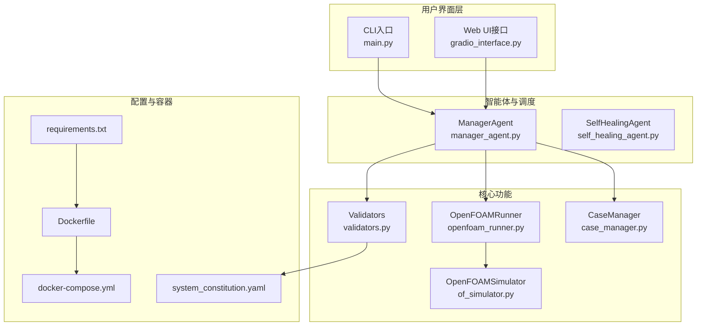
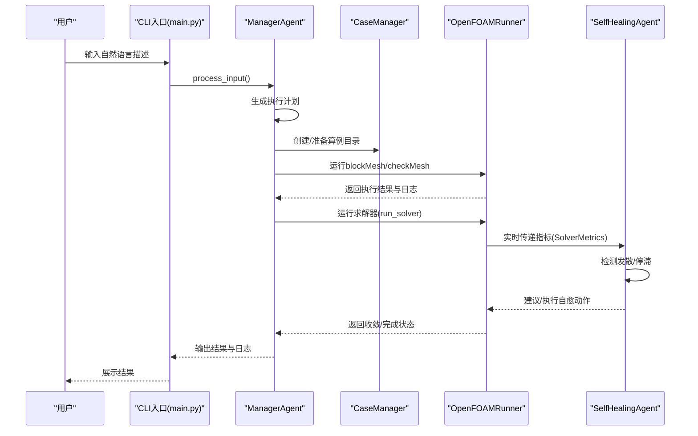
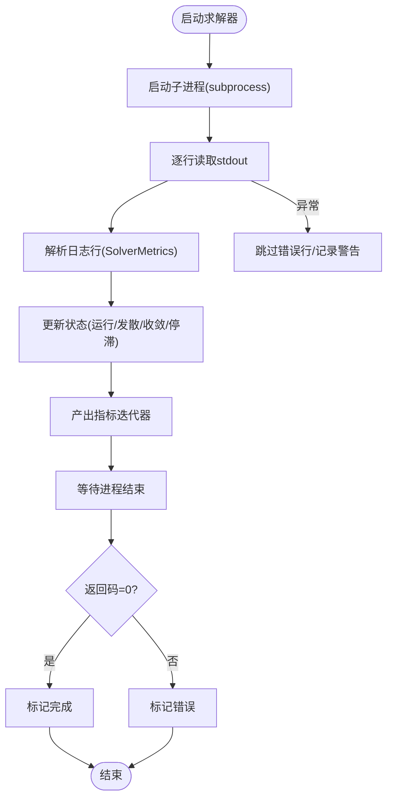
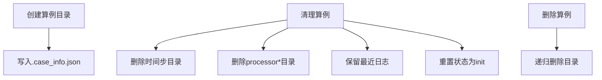
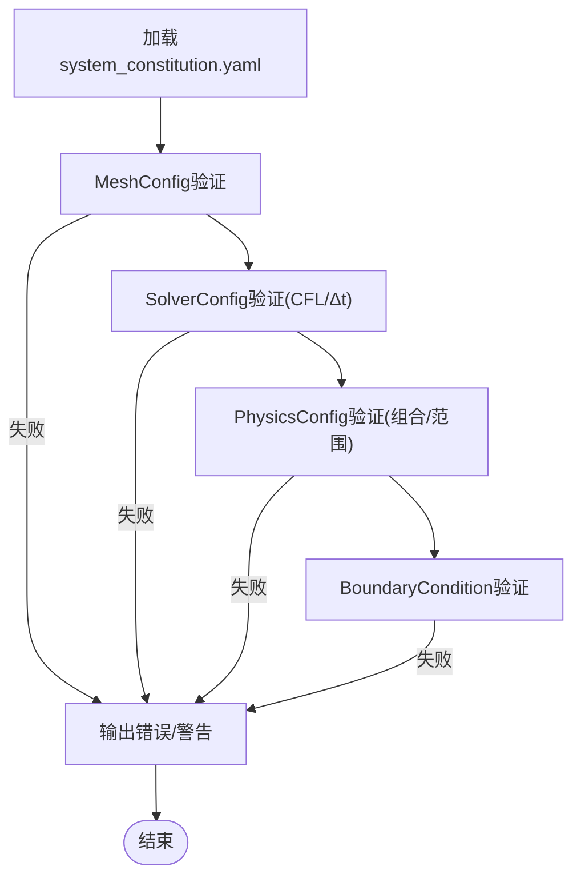
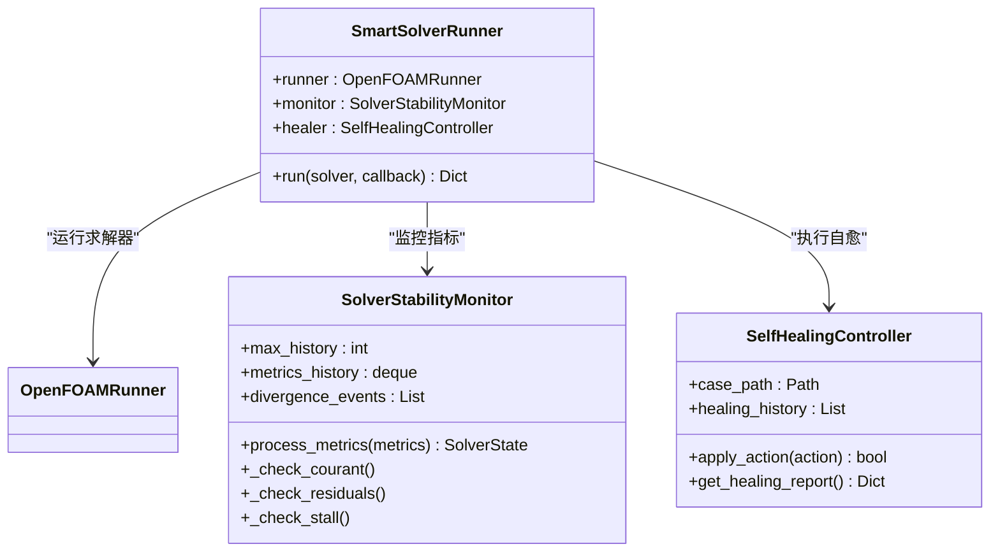
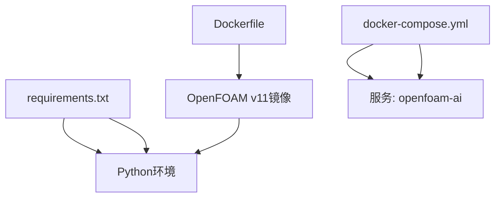

# 故障排除指南

<cite>
**本文档引用的文件**
- [README.md](file://openfoam_ai/README.md)
- [main.py](file://openfoam_ai/main.py)
- [openfoam_runner.py](file://openfoam_ai/core/openfoam_runner.py)
- [validators.py](file://openfoam_ai/core/validators.py)
- [system_constitution.yaml](file://openfoam_ai/config/system_constitution.yaml)
- [case_manager.py](file://openfoam_ai/core/case_manager.py)
- [Dockerfile](file://openfoam_ai/docker/Dockerfile)
- [docker-compose.yml](file://openfoam_ai/docker/docker-compose.yml)
- [requirements.txt](file://openfoam_ai/requirements.txt)
- [of_simulator.py](file://openfoam_ai/utils/of_simulator.py)
- [test_basic.py](file://openfoam_ai/tests/test_basic.py)
- [test_case_manager.py](file://openfoam_ai/tests/test_case_manager.py)
- [self_healing_agent.py](file://openfoam_ai/agents/self_healing_agent.py)
- [manager_agent.py](file://openfoam_ai/agents/manager_agent.py)
</cite>

## 目录
1. [简介](#简介)
2. [项目结构](#项目结构)
3. [核心组件](#核心组件)
4. [架构总览](#架构总览)
5. [详细组件分析](#详细组件分析)
6. [依赖关系分析](#依赖关系分析)
7. [性能考虑](#性能考虑)
8. [故障排除指南](#故障排除指南)
9. [结论](#结论)
10. [附录](#附录)

## 简介
本指南面向技术支持人员与高级用户，系统性梳理OpenFOAM AI在安装、依赖、OpenFOAM集成与容器运行等方面的常见问题与解决步骤。文档结合项目源码中的错误处理、日志记录与验证机制，提供可操作的诊断流程、性能问题定位方法、调试工具使用以及优化建议。

## 项目结构
OpenFOAM AI采用模块化设计，核心围绕“算例管理”“命令执行”“物理验证”“智能体调度”展开，并提供Docker容器化部署方案与测试用例支撑。

**图表来源**
- [main.py:1-251](file://openfoam_ai/main.py#L1-L251)
- [manager_agent.py:299-331](file://openfoam_ai/agents/manager_agent.py#L299-L331)
- [self_healing_agent.py:479-517](file://openfoam_ai/agents/self_healing_agent.py#L479-L517)
- [case_manager.py:27-86](file://openfoam_ai/core/case_manager.py#L27-L86)
- [openfoam_runner.py:44-76](file://openfoam_ai/core/openfoam_runner.py#L44-L76)
- [validators.py:18-441](file://openfoam_ai/core/validators.py#L18-L441)
- [of_simulator.py:13-180](file://openfoam_ai/utils/of_simulator.py#L13-L180)
- [system_constitution.yaml:1-103](file://openfoam_ai/config/system_constitution.yaml#L1-L103)
- [Dockerfile:1-52](file://openfoam_ai/docker/Dockerfile#L1-L52)
- [docker-compose.yml:1-46](file://openfoam_ai/docker/docker-compose.yml#L1-L46)
- [requirements.txt:1-40](file://openfoam_ai/requirements.txt#L1-L40)

**章节来源**
- [README.md:130-150](file://openfoam_ai/README.md#L130-L150)
- [main.py:1-251](file://openfoam_ai/main.py#L1-L251)

## 核心组件
- 算例管理器（CaseManager）：负责创建/复制/清理/删除算例目录结构与元数据维护。
- OpenFOAM执行器（OpenFOAMRunner）：封装blockMesh/checkMesh/求解器执行，提供日志解析、状态检测与错误处理。
- 物理验证器（Validators）：基于Pydantic与宪法规则进行网格、求解器、边界条件与物理参数的硬约束验证。
- 智能体调度（ManagerAgent）：接收用户输入，生成执行计划，协调各Agent与Runner。
- 自愈Agent（SelfHealingAgent）：监控求解过程，检测发散与停滞，触发自愈动作。
- 容器化（Docker）：提供OpenFOAM Foundation v11环境与Python依赖的标准化部署。

**章节来源**
- [case_manager.py:27-86](file://openfoam_ai/core/case_manager.py#L27-L86)
- [openfoam_runner.py:44-76](file://openfoam_ai/core/openfoam_runner.py#L44-L76)
- [validators.py:18-441](file://openfoam_ai/core/validators.py#L18-L441)
- [manager_agent.py:299-331](file://openfoam_ai/agents/manager_agent.py#L299-L331)
- [self_healing_agent.py:479-517](file://openfoam_ai/agents/self_healing_agent.py#L479-L517)

## 架构总览
下图展示从用户交互到OpenFOAM执行与监控的关键流程，以及自愈机制的介入点。

**图表来源**
- [main.py:37-99](file://openfoam_ai/main.py#L37-L99)
- [manager_agent.py:299-331](file://openfoam_ai/agents/manager_agent.py#L299-L331)
- [openfoam_runner.py:99-198](file://openfoam_ai/core/openfoam_runner.py#L99-L198)
- [self_healing_agent.py:479-517](file://openfoam_ai/agents/self_healing_agent.py#L479-L517)

## 详细组件分析

### OpenFOAMRunner（命令执行与日志解析）
- 关键职责：执行OpenFOAM命令、捕获标准输出、解析日志行、生成SolverMetrics、检测发散/停滞/完成状态。
- 错误处理：对命令未找到、权限不足、日志解码错误、进程等待异常等进行分类处理与降级。
- 指标解析：支持解析库朗数、残差、时间步等关键信息；状态机根据阈值判定发散/收敛。
- 日志管理：统一写入logs目录，便于后续分析与可视化。

**图表来源**
- [openfoam_runner.py:99-198](file://openfoam_ai/core/openfoam_runner.py#L99-L198)
- [openfoam_runner.py:347-387](file://openfoam_ai/core/openfoam_runner.py#L347-L387)

**章节来源**
- [openfoam_runner.py:77-198](file://openfoam_ai/core/openfoam_runner.py#L77-L198)
- [openfoam_runner.py:303-387](file://openfoam_ai/core/openfoam_runner.py#L303-L387)

### CaseManager（算例生命周期管理）
- 负责创建标准OpenFOAM目录结构（0、constant、system、logs），保存算例元信息，支持清理与删除。
- 清理逻辑：删除时间步目录、并行处理器目录，保留最近日志，重置状态。

**图表来源**
- [case_manager.py:51-86](file://openfoam_ai/core/case_manager.py#L51-L86)
- [case_manager.py:148-194](file://openfoam_ai/core/case_manager.py#L148-L194)

**章节来源**
- [case_manager.py:51-86](file://openfoam_ai/core/case_manager.py#L51-L86)
- [case_manager.py:148-194](file://openfoam_ai/core/case_manager.py#L148-L194)

### Validators（物理约束与宪法规则）
- 基于Pydantic模型与system_constitution.yaml进行硬约束验证，包括网格数量、长宽比、CFL条件、求解器与物理类型匹配、禁止组合等。
- 运行期通过load_constitution读取宪法阈值，作为Runner状态判断与自愈策略的依据。

**图表来源**
- [validators.py:13-16](file://openfoam_ai/core/validators.py#L13-L16)
- [validators.py:18-275](file://openfoam_ai/core/validators.py#L18-L275)
- [system_constitution.yaml:13-64](file://openfoam_ai/config/system_constitution.yaml#L13-L64)

**章节来源**
- [validators.py:18-275](file://openfoam_ai/core/validators.py#L18-L275)
- [system_constitution.yaml:13-64](file://openfoam_ai/config/system_constitution.yaml#L13-L64)

### SelfHealingAgent（稳定性监控与自愈）
- 实时解析指标，检测库朗数超限、残差爆炸、收敛停滞等发散模式。
- 提供HealingAction与SelfHealingController，记录自愈历史，支持时间步缩减、松弛因子调整等策略。

**图表来源**
- [self_healing_agent.py:58-85](file://openfoam_ai/agents/self_healing_agent.py#L58-L85)
- [self_healing_agent.py:436-477](file://openfoam_ai/agents/self_healing_agent.py#L436-L477)
- [self_healing_agent.py:479-517](file://openfoam_ai/agents/self_healing_agent.py#L479-L517)

**章节来源**
- [self_healing_agent.py:58-85](file://openfoam_ai/agents/self_healing_agent.py#L58-L85)
- [self_healing_agent.py:436-477](file://openfoam_ai/agents/self_healing_agent.py#L436-L477)
- [self_healing_agent.py:479-517](file://openfoam_ai/agents/self_healing_agent.py#L479-L517)

## 依赖关系分析
- Python依赖通过requirements.txt集中管理，包含LLM框架、向量数据库、科学计算、OpenFOAM接口、后处理与Web UI等。
- Dockerfile基于OpenFOAM Foundation v11镜像，安装Python3.10及相关工具，设置工作目录与环境变量。
- docker-compose提供资源限制、卷映射与网络配置，便于在容器内运行项目并与宿主机共享算例与记忆数据。

**图表来源**
- [requirements.txt:1-40](file://openfoam_ai/requirements.txt#L1-L40)
- [Dockerfile:1-52](file://openfoam_ai/docker/Dockerfile#L1-L52)
- [docker-compose.yml:1-46](file://openfoam_ai/docker/docker-compose.yml#L1-L46)

**章节来源**
- [requirements.txt:1-40](file://openfoam_ai/requirements.txt#L1-L40)
- [Dockerfile:1-52](file://openfoam_ai/docker/Dockerfile#L1-L52)
- [docker-compose.yml:1-46](file://openfoam_ai/docker/docker-compose.yml#L1-L46)

## 性能考虑
- 求解稳定性阈值来自system_constitution.yaml，包括库朗数上限、残差收敛目标、松弛因子范围等，Runner与Validator均依赖这些阈值进行判断与优化建议。
- 自愈Agent通过降低时间步、调整松弛因子等方式缓解发散，避免长时间无效计算。
- 建议在大规模算例中启用日志裁剪与定期清理，避免日志文件膨胀影响I/O性能。

**章节来源**
- [system_constitution.yaml:23-31](file://openfoam_ai/config/system_constitution.yaml#L23-L31)
- [openfoam_runner.py:389-408](file://openfoam_ai/core/openfoam_runner.py#L389-L408)
- [validators.py:120-155](file://openfoam_ai/core/validators.py#L120-L155)

## 故障排除指南

### 1. 安装与环境问题
- 症状：命令未找到（如blockMesh）、模块导入失败（如openai）。
- 诊断步骤：
  - 在CLI入口处检测OpenFOAM环境，若未检测到则给出警告。
  - 检查Python依赖是否完整安装，必要时使用requirements.txt进行安装。
  - 若使用Docker，确认镜像构建成功且容器已启动。
- 解决方案：
  - 在宿主机安装OpenFOAM并确保PATH正确；或使用提供的Docker镜像与compose文件。
  - 安装缺失的Python包；若无需LLM，可使用Mock模式（PromptEngine(api_key=None)）。
  - 使用docker-compose启动服务，并挂载算例与记忆目录。

**章节来源**
- [main.py:230-238](file://openfoam_ai/main.py#L230-L238)
- [README.md:210-237](file://openfoam_ai/README.md#L210-L237)
- [requirements.txt:1-40](file://openfoam_ai/requirements.txt#L1-L40)
- [Dockerfile:1-52](file://openfoam_ai/docker/Dockerfile#L1-L52)
- [docker-compose.yml:1-46](file://openfoam_ai/docker/docker-compose.yml#L1-L46)

### 2. 依赖冲突与版本不兼容
- 症状：安装时报错或运行时报模块版本不兼容。
- 诊断步骤：
  - 使用虚拟环境隔离依赖，避免系统Python与项目依赖冲突。
  - 核对requirements.txt中的版本范围，特别是langchain、openai、pydantic等关键包。
- 解决方案：
  - 清理现有环境，重新创建虚拟环境并安装依赖。
  - 如需特定版本，锁定版本号后安装。

**章节来源**
- [requirements.txt:1-40](file://openfoam_ai/requirements.txt#L1-L40)

### 3. OpenFOAM集成问题
- 症状：blockMesh/checkMesh/求解器执行失败、返回码非零、日志解析异常。
- 诊断步骤：
  - 检查算例目录结构是否完整（0、constant、system、logs）。
  - 查看logs目录下的具体日志文件，定位错误信息。
  - 使用OpenFOAMRunner的run_blockmesh/run_checkmesh/run_solver方法，观察返回状态与指标。
- 解决方案：
  - 确保算例目录结构完整，必要时使用CaseManager重建。
  - 根据日志调整网格/边界条件/求解器参数。
  - 对于发散，启用自愈Agent自动降低时间步或调整松弛因子。

**章节来源**
- [case_manager.py:51-86](file://openfoam_ai/core/case_manager.py#L51-L86)
- [openfoam_runner.py:245-301](file://openfoam_ai/core/openfoam_runner.py#L245-L301)
- [openfoam_runner.py:111-198](file://openfoam_ai/core/openfoam_runner.py#L111-L198)
- [self_healing_agent.py:479-517](file://openfoam_ai/agents/self_healing_agent.py#L479-L517)

### 4. 容器运行异常
- 症状：容器启动失败、资源不足、卷映射错误。
- 诊断步骤：
  - 检查Dockerfile与docker-compose.yml的资源限制与卷映射配置。
  - 查看容器日志，确认Python路径与OpenFOAM环境变量是否正确设置。
- 解决方案：
  - 调整deploy.resources中的CPU与内存限制，确保满足算例需求。
  - 确认卷映射路径正确，容器内可访问算例与记忆目录。
  - 使用docker-compose logs查看详细错误信息。

**章节来源**
- [Dockerfile:38-43](file://openfoam_ai/docker/Dockerfile#L38-L43)
- [docker-compose.yml:29-41](file://openfoam_ai/docker/docker-compose.yml#L29-L41)

### 5. 配置验证与物理约束错误
- 症状：Pydantic验证失败、网格长宽比过大、CFL条件不满足、求解器与物理类型不匹配。
- 诊断步骤：
  - 使用validators.validate_simulation_config检查配置是否通过。
  - 查看system_constitution.yaml中的阈值，核对网格、求解器、边界条件与物理参数。
- 解决方案：
  - 调整网格分辨率、时间步长与边界条件，使其满足宪法规则。
  - 更换合适的求解器或物理模型组合。

**章节来源**
- [validators.py:389-411](file://openfoam_ai/core/validators.py#L389-L411)
- [system_constitution.yaml:13-64](file://openfoam_ai/config/system_constitution.yaml#L13-L64)

### 6. 性能问题诊断与优化
- 内存不足：
  - 通过docker-compose的memory限制观察容器内存占用。
  - 优化算例网格密度与时间步长，减少内存峰值。
- 计算超时：
  - 使用OpenFOAMRunner的进程等待与超时处理，必要时手动终止。
  - 启用自愈Agent自动降低时间步或调整松弛因子。
- 结果异常：
  - 使用PhysicsValidator进行质量/能量守恒验证，检查边界条件兼容性。
  - 对比历史收敛曲线，定位发散或停滞阶段。

**章节来源**
- [openfoam_runner.py:179-197](file://openfoam_ai/core/openfoam_runner.py#L179-L197)
- [validators.py:277-387](file://openfoam_ai/core/validators.py#L277-L387)
- [system_constitution.yaml:23-31](file://openfoam_ai/config/system_constitution.yaml#L23-L31)

### 7. 调试工具与日志分析
- 启用详细日志：设置环境变量LOG_LEVEL=DEBUG（如适用）。
- 使用Mock模式：PromptEngine(api_key=None)进行配置生成测试。
- 运行单元测试：pytest openfoam_ai/tests/验证核心模块导入与功能。
- 检查算例目录结构：确保0/constant/system/logs存在。
- 分析日志文件：关注SolverMetrics输出、库朗数与残差变化趋势。

**章节来源**
- [README.md:232-237](file://openfoam_ai/README.md#L232-L237)
- [test_basic.py:12-58](file://openfoam_ai/tests/test_basic.py#L12-L58)
- [test_case_manager.py:18-180](file://openfoam_ai/tests/test_case_manager.py#L18-L180)

## 结论
本指南基于OpenFOAM AI的源码实现，提供了从安装、依赖、OpenFOAM集成到容器运行的全链路故障排除方法。通过合理利用日志、验证器与自愈Agent，能够快速定位并解决大多数问题。建议在生产环境中配合容器资源限制与定期清理策略，确保系统稳定高效运行。

## 附录

### 常见错误与解决对照表
- ModuleNotFoundError: openai → 安装openai或使用Mock模式
- FileNotFoundError: blockMesh → 安装OpenFOAM或使用Docker
- PydanticValidationError → 检查system_constitution.yaml中的约束
- UnicodeEncodeError: gbk → 设置PYTHONIOENCODING=utf-8

**章节来源**
- [README.md:210-237](file://openfoam_ai/README.md#L210-L237)