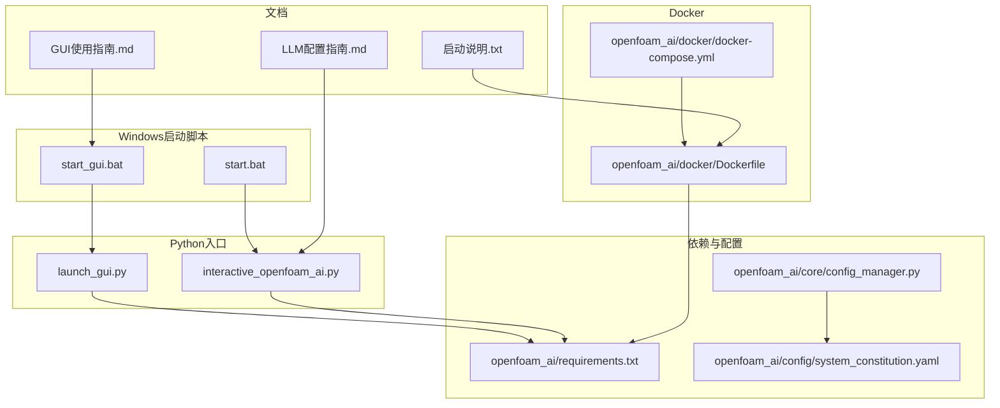
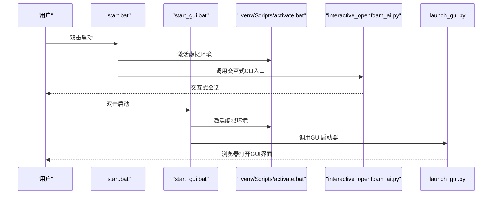
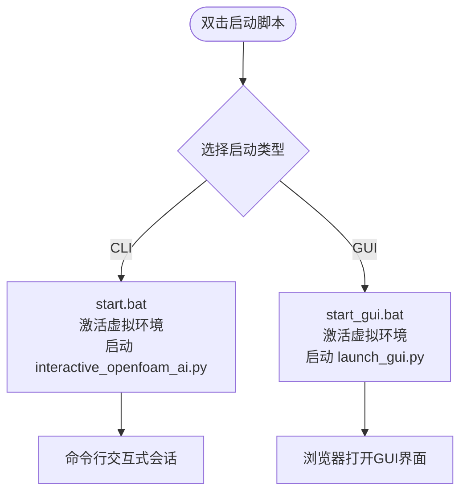
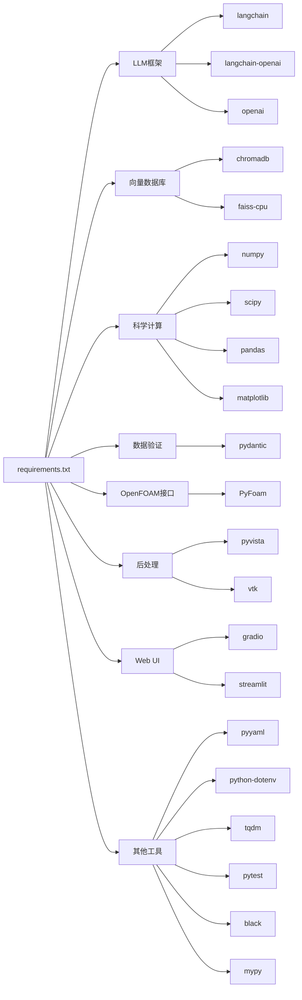
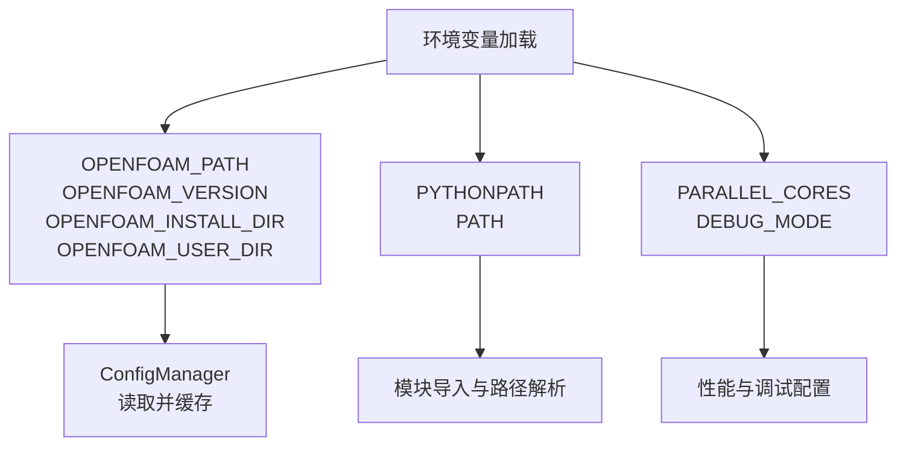
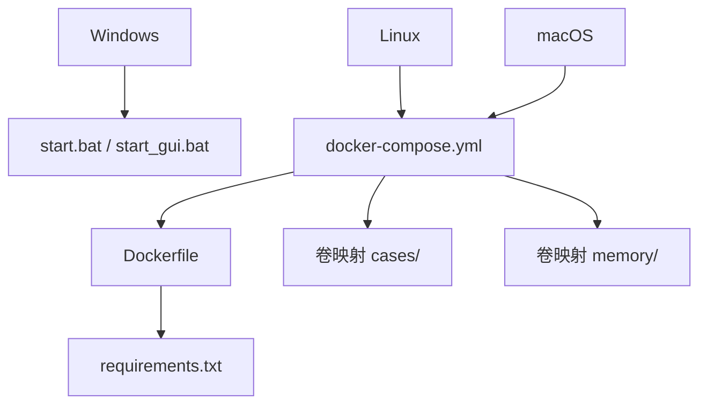
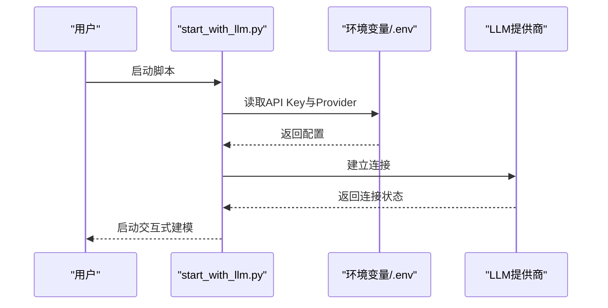
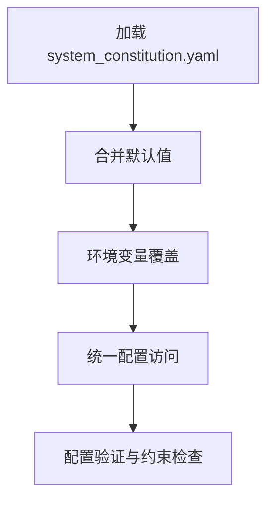
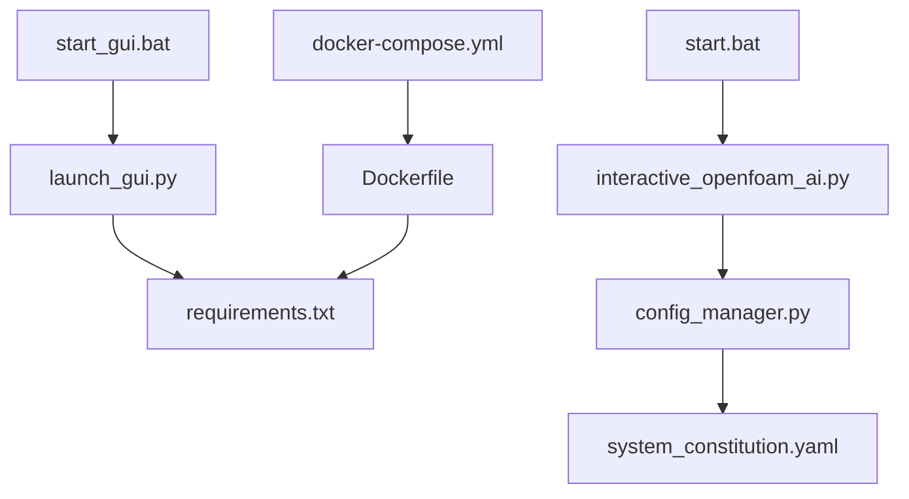

# 环境配置管理

<cite>
**本文档引用的文件**
- [start.bat](file://start.bat)
- [start_gui.bat](file://start_gui.bat)
- [interactive_openfoam_ai.py](file://interactive_openfoam_ai.py)
- [launch_gui.py](file://launch_gui.py)
- [openfoam_ai/requirements.txt](file://openfoam_ai/requirements.txt)
- [openfoam_ai/README.md](file://openfoam_ai/README.md)
- [openfoam_ai/config/system_constitution.yaml](file://openfoam_ai/config/system_constitution.yaml)
- [openfoam_ai/core/config_manager.py](file://openfoam_ai/core/config_manager.py)
- [openfoam_ai/docker/Dockerfile](file://openfoam_ai/docker/Dockerfile)
- [openfoam_ai/docker/docker-compose.yml](file://openfoam_ai/docker/docker-compose.yml)
- [GUI使用指南.md](file://GUI使用指南.md)
- [LLM配置指南.md](file://LLM配置指南.md)
- [启动说明.txt](file://启动说明.txt)
</cite>

## 目录
1. [简介](#简介)
2. [项目结构](#项目结构)
3. [核心组件](#核心组件)
4. [架构总览](#架构总览)
5. [详细组件分析](#详细组件分析)
6. [依赖关系分析](#依赖关系分析)
7. [性能考虑](#性能考虑)
8. [故障排除指南](#故障排除指南)
9. [结论](#结论)
10. [附录](#附录)

## 简介
本文件面向OpenFOAM AI项目的环境配置管理，重点覆盖Windows环境下启动脚本的配置与差异、requirements.txt中的依赖包管理、环境变量设置方法（OpenFOAM路径、Python路径、CUDA等）、跨平台配置指南以及新用户的完整搭建与验证流程。内容以仓库现有文件为依据，结合启动脚本、依赖清单、配置文件与使用指南，形成可操作、可追溯的技术文档。

## 项目结构
OpenFOAM AI采用模块化组织，核心目录与文件如下：
- 启动脚本：start.bat、start_gui.bat
- 交互式CLI入口：interactive_openfoam_ai.py
- GUI启动器：launch_gui.py
- 依赖清单：openfoam_ai/requirements.txt
- 项目说明：openfoam_ai/README.md
- 宪法规则：openfoam_ai/config/system_constitution.yaml
- 配置管理：openfoam_ai/core/config_manager.py
- Docker镜像与编排：openfoam_ai/docker/Dockerfile、openfoam_ai/docker/docker-compose.yml
- 使用指南与配置指南：GUI使用指南.md、LLM配置指南.md
- 容器启动说明：启动说明.txt

**图表来源**
- [start.bat:1-16](file://start.bat#L1-L16)
- [start_gui.bat:1-21](file://start_gui.bat#L1-L21)
- [interactive_openfoam_ai.py:1-532](file://interactive_openfoam_ai.py#L1-L532)
- [launch_gui.py:1-97](file://launch_gui.py#L1-L97)
- [openfoam_ai/requirements.txt:1-40](file://openfoam_ai/requirements.txt#L1-L40)
- [openfoam_ai/config/system_constitution.yaml:1-103](file://openfoam_ai/config/system_constitution.yaml#L1-L103)
- [openfoam_ai/core/config_manager.py:1-227](file://openfoam_ai/core/config_manager.py#L1-L227)
- [openfoam_ai/docker/Dockerfile:1-51](file://openfoam_ai/docker/Dockerfile#L1-L51)
- [openfoam_ai/docker/docker-compose.yml:1-46](file://openfoam_ai/docker/docker-compose.yml#L1-L46)
- [GUI使用指南.md:1-176](file://GUI使用指南.md#L1-L176)
- [LLM配置指南.md:1-315](file://LLM配置指南.md#L1-L315)
- [启动说明.txt:1-41](file://启动说明.txt#L1-L41)

**章节来源**
- [start.bat:1-16](file://start.bat#L1-L16)
- [start_gui.bat:1-21](file://start_gui.bat#L1-L21)
- [openfoam_ai/README.md:1-291](file://openfoam_ai/README.md#L1-L291)

## 核心组件
- 启动脚本与入口
  - start.bat：激活虚拟环境并启动交互式CLI（interactive_openfoam_ai.py）。
  - start_gui.bat：激活虚拟环境并启动GUI服务器（launch_gui.py）。
- 依赖管理
  - requirements.txt：定义LLM框架、向量数据库、科学计算、OpenFOAM接口、后处理、Web UI、其他工具等依赖及其版本下限。
- 配置与规则
  - system_constitution.yaml：系统宪法，约束网格标准、求解器标准、物理约束、禁止组合、质量检查与错误处理策略。
  - config_manager.py：统一配置管理器，加载宪法、读取环境变量、提供默认值与热重载。
- Docker与容器
  - Dockerfile：基于OpenFOAM基础镜像，安装Python 3.10、系统依赖与项目依赖，设置环境变量与工作目录。
  - docker-compose.yml：定义服务、环境变量、卷映射、资源限制与网络。

**章节来源**
- [start.bat:1-16](file://start.bat#L1-L16)
- [start_gui.bat:1-21](file://start_gui.bat#L1-L21)
- [openfoam_ai/requirements.txt:1-40](file://openfoam_ai/requirements.txt#L1-L40)
- [openfoam_ai/config/system_constitution.yaml:1-103](file://openfoam_ai/config/system_constitution.yaml#L1-L103)
- [openfoam_ai/core/config_manager.py:1-227](file://openfoam_ai/core/config_manager.py#L1-L227)
- [openfoam_ai/docker/Dockerfile:1-51](file://openfoam_ai/docker/Dockerfile#L1-L51)
- [openfoam_ai/docker/docker-compose.yml:1-46](file://openfoam_ai/docker/docker-compose.yml#L1-L46)

## 架构总览
下图展示Windows环境下启动脚本与Python入口之间的调用关系，以及依赖与配置的关联。

**图表来源**
- [start.bat:1-16](file://start.bat#L1-L16)
- [start_gui.bat:1-21](file://start_gui.bat#L1-L21)
- [interactive_openfoam_ai.py:1-532](file://interactive_openfoam_ai.py#L1-L532)
- [launch_gui.py:1-97](file://launch_gui.py#L1-L97)

## 详细组件分析

### Windows启动脚本对比与使用场景
- start.bat
  - 功能：激活虚拟环境，启动交互式CLI（interactive_openfoam_ai.py），适合命令行用户与开发者。
  - 关键行为：设置编码、激活虚拟环境、调用Python入口、暂停等待。
- start_gui.bat
  - 功能：激活虚拟环境，启动GUI服务器（launch_gui.py），自动打开浏览器，适合图形界面用户。
  - 关键行为：显示特性列表、激活虚拟环境、调用Python入口、暂停等待。

**图表来源**
- [start.bat:1-16](file://start.bat#L1-L16)
- [start_gui.bat:1-21](file://start_gui.bat#L1-L21)

**章节来源**
- [start.bat:1-16](file://start.bat#L1-L16)
- [start_gui.bat:1-21](file://start_gui.bat#L1-L21)
- [GUI使用指南.md:1-176](file://GUI使用指南.md#L1-L176)

### requirements.txt依赖包管理
- LLM框架
  - langchain、langchain-openai、openai：用于与大语言模型交互。
- 向量数据库
  - chromadb、faiss-cpu：用于向量检索与存储。
- 科学计算
  - numpy、scipy、pandas、matplotlib：数值计算与可视化。
- 数据验证
  - pydantic：配置模型验证。
- OpenFOAM接口
  - PyFoam：OpenFOAM字典生成与命令封装。
- 后处理
  - pyvista、vtk：科学数据可视化。
- Web UI
  - gradio、streamlit：图形界面与演示。
- 其他工具
  - pyyaml、python-dotenv、tqdm、pytest、black、mypy：配置、环境变量、进度条、测试与静态检查。

**图表来源**
- [openfoam_ai/requirements.txt:1-40](file://openfoam_ai/requirements.txt#L1-L40)

**章节来源**
- [openfoam_ai/requirements.txt:1-40](file://openfoam_ai/requirements.txt#L1-L40)

### 环境变量设置方法
- OpenFOAM路径配置
  - 通过环境变量读取：OPENFOAM_PATH、OPENFOAM_VERSION、OPENFOAM_INSTALL_DIR、OPENFOAM_USER_DIR。
  - 用途：配置管理器在初始化时加载这些变量，用于OpenFOAM环境的定位与兼容性判断。
- Python路径管理
  - Docker镜像中设置PYTHONPATH指向项目路径，确保模块导入正确。
- CUDA环境设置
  - 仓库未显式声明CUDA依赖；如需GPU加速，应在系统层面安装CUDA并确保相关库可用。

**图表来源**
- [openfoam_ai/core/config_manager.py:74-84](file://openfoam_ai/core/config_manager.py#L74-L84)
- [openfoam_ai/docker/Dockerfile:38-42](file://openfoam_ai/docker/Dockerfile#L38-L42)

**章节来源**
- [openfoam_ai/core/config_manager.py:74-84](file://openfoam_ai/core/config_manager.py#L74-L84)
- [openfoam_ai/docker/Dockerfile:38-42](file://openfoam_ai/docker/Dockerfile#L38-L42)

### 不同操作系统下的环境配置指南
- Windows
  - 使用start.bat或start_gui.bat启动，确保已激活虚拟环境。
  - GUI使用指南提供端口与浏览器访问信息。
- Linux
  - Docker方式：使用docker-compose.yml构建并运行服务，映射项目目录与持久化内存目录。
  - 容器内通过source加载OpenFOAM环境，运行blockMesh、icoFoam等命令。
- macOS
  - 建议使用Docker方式，或在本地安装OpenFOAM与Python 3.10+，安装requirements.txt依赖后运行。

**图表来源**
- [openfoam_ai/docker/docker-compose.yml:1-46](file://openfoam_ai/docker/docker-compose.yml#L1-L46)
- [openfoam_ai/docker/Dockerfile:1-51](file://openfoam_ai/docker/Dockerfile#L1-L51)
- [GUI使用指南.md:1-176](file://GUI使用指南.md#L1-L176)
- [启动说明.txt:1-41](file://启动说明.txt#L1-L41)

**章节来源**
- [GUI使用指南.md:1-176](file://GUI使用指南.md#L1-L176)
- [启动说明.txt:1-41](file://启动说明.txt#L1-L41)
- [openfoam_ai/docker/docker-compose.yml:1-46](file://openfoam_ai/docker/docker-compose.yml#L1-L46)
- [openfoam_ai/docker/Dockerfile:1-51](file://openfoam_ai/docker/Dockerfile#L1-L51)

### LLM服务集成与配置
- 支持的提供商与模型：KIMI、DeepSeek、豆包、GLM、MiniMax、阿里云百炼。
- 配置方式：
  - 环境变量（推荐）：设置DEFAULT_LLM_PROVIDER与对应API_KEY。
  - .env文件：使用python-dotenv加载。
  - 命令行参数：通过脚本参数指定提供商与模型。
- 连接测试：提供测试脚本验证LLM连通性。

**图表来源**
- [LLM配置指南.md:1-315](file://LLM配置指南.md#L1-L315)

**章节来源**
- [LLM配置指南.md:1-315](file://LLM配置指南.md#L1-L315)

### 系统宪法与配置验证
- system_constitution.yaml定义网格标准、求解器标准、物理约束、禁止组合、质量检查与错误处理策略。
- config_manager.py负责加载宪法、合并默认值、支持环境变量覆盖，并提供统一访问接口。

**图表来源**
- [openfoam_ai/config/system_constitution.yaml:1-103](file://openfoam_ai/config/system_constitution.yaml#L1-L103)
- [openfoam_ai/core/config_manager.py:121-181](file://openfoam_ai/core/config_manager.py#L121-L181)

**章节来源**
- [openfoam_ai/config/system_constitution.yaml:1-103](file://openfoam_ai/config/system_constitution.yaml#L1-L103)
- [openfoam_ai/core/config_manager.py:121-181](file://openfoam_ai/core/config_manager.py#L121-L181)

## 依赖关系分析
- 启动脚本依赖虚拟环境激活与Python解释器。
- GUI启动器依赖Gradio与Matplotlib等UI与可视化库。
- 交互式CLI入口依赖LLM引擎与配置管理器。
- Docker镜像依赖requirements.txt中的全部依赖。
- 容器编排定义了卷映射与资源限制。

**图表来源**
- [start.bat:1-16](file://start.bat#L1-L16)
- [start_gui.bat:1-21](file://start_gui.bat#L1-L21)
- [launch_gui.py:1-97](file://launch_gui.py#L1-L97)
- [interactive_openfoam_ai.py:1-532](file://interactive_openfoam_ai.py#L1-L532)
- [openfoam_ai/requirements.txt:1-40](file://openfoam_ai/requirements.txt#L1-L40)
- [openfoam_ai/core/config_manager.py:1-227](file://openfoam_ai/core/config_manager.py#L1-L227)
- [openfoam_ai/config/system_constitution.yaml:1-103](file://openfoam_ai/config/system_constitution.yaml#L1-L103)
- [openfoam_ai/docker/Dockerfile:1-51](file://openfoam_ai/docker/Dockerfile#L1-L51)
- [openfoam_ai/docker/docker-compose.yml:1-46](file://openfoam_ai/docker/docker-compose.yml#L1-L46)

**章节来源**
- [openfoam_ai/README.md:1-291](file://openfoam_ai/README.md#L1-L291)

## 性能考虑
- 并行核心与内存限制：通过环境变量PARALLEL_CORES与性能配置项控制并行度与内存上限。
- Docker资源限制：compose文件中设置了CPU与内存的限制与预留，避免资源争用。
- 日志与监控：GUI与CLI均提供运行日志与收敛监控，便于性能分析与问题定位。

**章节来源**
- [openfoam_ai/core/config_manager.py:67-72](file://openfoam_ai/core/config_manager.py#L67-L72)
- [openfoam_ai/docker/docker-compose.yml:29-38](file://openfoam_ai/docker/docker-compose.yml#L29-L38)

## 故障排除指南
- 依赖缺失
  - GUI启动失败：检查Gradio与Matplotlib是否安装。
  - 交互式CLI依赖：确保requirements.txt中依赖已安装。
- OpenFOAM环境
  - 容器内需source加载OpenFOAM环境；确认blockMesh、icoFoam等命令可用。
- 编码与路径
  - Windows控制台编码问题可通过环境变量或忽略处理。
  - Docker卷映射确保项目目录与持久化目录正确挂载。
- LLM连接
  - 检查API Key有效性、网络连通性与代理设置；使用测试脚本验证。

**章节来源**
- [GUI使用指南.md:147-176](file://GUI使用指南.md#L147-L176)
- [启动说明.txt:1-41](file://启动说明.txt#L1-L41)
- [LLM配置指南.md:235-272](file://LLM配置指南.md#L235-L272)
- [openfoam_ai/README.md:208-237](file://openfoam_ai/README.md#L208-L237)

## 结论
本文档基于仓库现有文件，系统梳理了OpenFOAM AI在Windows与跨平台环境下的启动脚本、依赖管理、环境变量与Docker配置，并结合GUI与CLI使用指南提供了新用户的完整搭建与验证流程。建议在生产环境中优先采用Docker隔离运行，确保OpenFOAM与LLM依赖的一致性与可移植性。

## 附录
- 新用户环境搭建与验证流程（Windows）
  1) 安装Python 3.10+与Git，克隆仓库。
  2) 在项目根目录创建并激活虚拟环境，安装requirements.txt依赖。
  3) 双击start.bat启动交互式CLI，或双击start_gui.bat启动GUI。
  4) 如需LLM功能，按LLM配置指南设置API Key与Provider。
  5) 如需在容器内运行OpenFOAM，参考启动说明.txt与Docker compose配置。
  6) 使用GUI使用指南进行界面操作与结果查看。
  7) 若遇到问题，参考故障排除指南逐项排查。

**章节来源**
- [openfoam_ai/README.md:17-51](file://openfoam_ai/README.md#L17-L51)
- [GUI使用指南.md:1-176](file://GUI使用指南.md#L1-L176)
- [LLM配置指南.md:18-55](file://LLM配置指南.md#L18-L55)
- [启动说明.txt:1-41](file://启动说明.txt#L1-L41)
- [openfoam_ai/docker/docker-compose.yml:1-46](file://openfoam_ai/docker/docker-compose.yml#L1-L46)