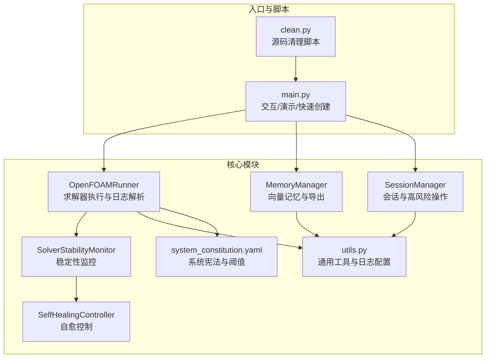
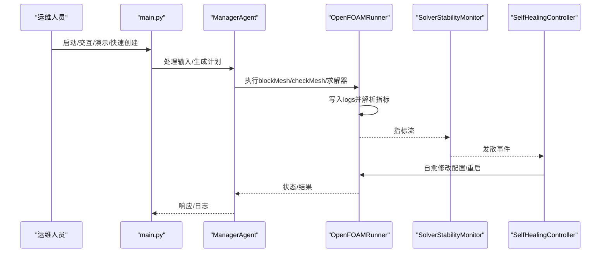
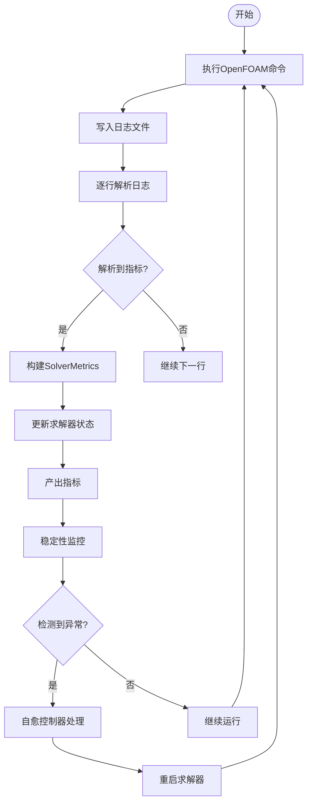
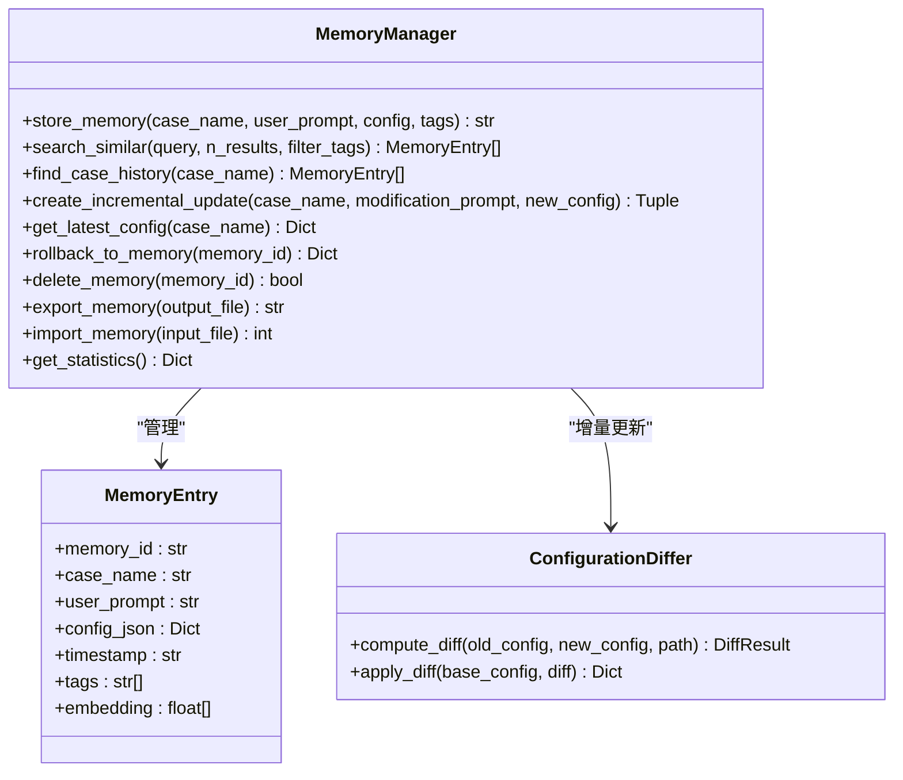
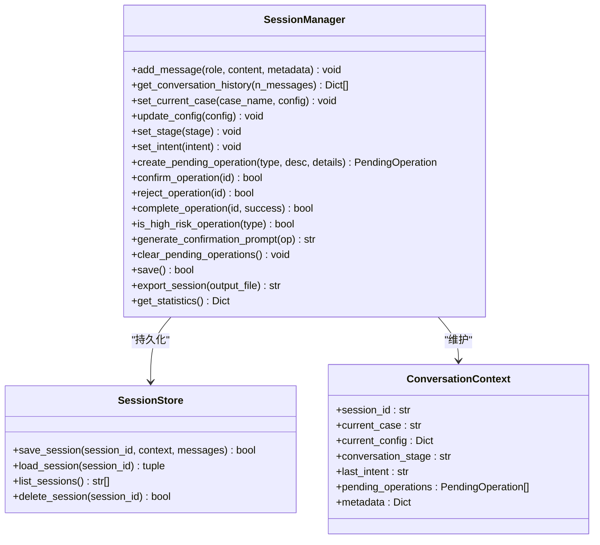
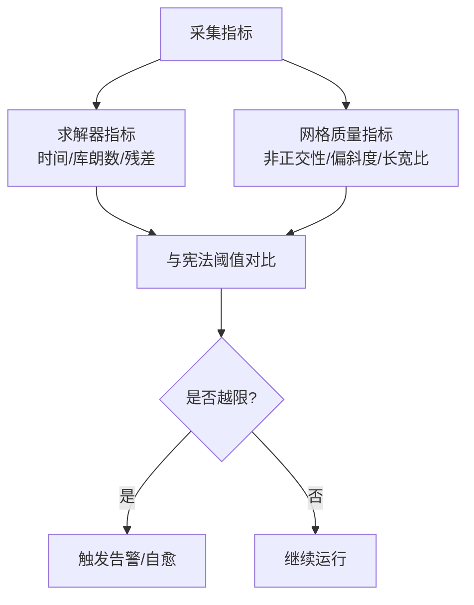
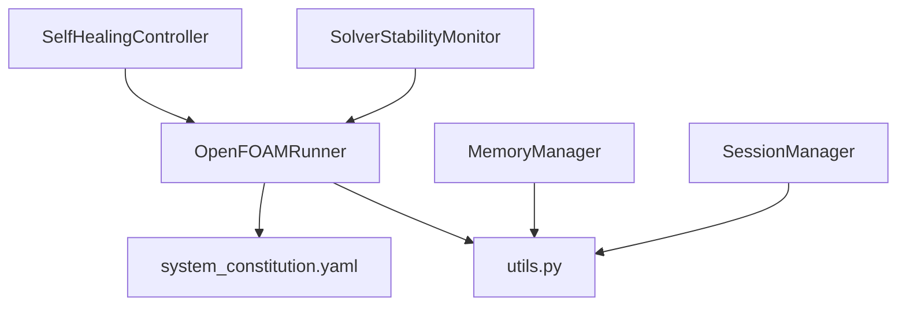

# 监控与维护

<cite>
**本文引用的文件**
- [openfoam_ai/memory/memory_manager.py](file://openfoam_ai/memory/memory_manager.py)
- [openfoam_ai/memory/session_manager.py](file://openfoam_ai/memory/session_manager.py)
- [openfoam_ai/core/openfoam_runner.py](file://openfoam_ai/core/openfoam_runner.py)
- [openfoam_ai/core/utils.py](file://openfoam_ai/core/utils.py)
- [openfoam_ai/agents/self_healing_agent.py](file://openfoam_ai/agents/self_healing_agent.py)
- [openfoam_ai/main.py](file://openfoam_ai/main.py)
- [openfoam_ai/clean.py](file://openfoam_ai/clean.py)
- [openfoam_ai/config/system_constitution.yaml](file://openfoam_ai/config/system_constitution.yaml)
- [demo_cases/cavity_demo/.case_info.json](file://demo_cases/cavity_demo/.case_info.json)
- [interactive_cases/cylinder_around_flow/.case_info.json](file://interactive_cases/cylinder_around_flow/.case_info.json)
</cite>

## 目录
1. [简介](#简介)
2. [项目结构](#项目结构)
3. [核心组件](#核心组件)
4. [架构总览](#架构总览)
5. [详细组件分析](#详细组件分析)
6. [依赖分析](#依赖分析)
7. [性能考虑](#性能考虑)
8. [故障排查指南](#故障排查指南)
9. [结论](#结论)
10. [附录](#附录)

## 简介
本文件面向OpenFOAM AI系统的运维人员，提供系统监控与维护的专业文档。内容覆盖日志系统配置与管理、内存数据库维护（向量存储清理、备份与性能优化）、系统清理脚本使用方法、性能监控指标定义与采集、以及定期维护检查清单与应急响应流程。文档结合仓库中的实际代码与配置，给出可操作的实践建议。

## 项目结构
OpenFOAM AI采用模块化设计，核心围绕“算例管理”“求解器执行”“记忆与会话管理”“自愈监控”等模块展开。日志主要由求解器执行器统一写入算例目录下的logs子目录；内存数据库通过MemoryManager管理向量存储；SessionManager负责多轮对话上下文与高风险操作确认；SelfHealingAgent提供实时监控与自动修复能力；clean.py提供源码文件清理工具。

**图表来源**
- [openfoam_ai/core/openfoam_runner.py:44-209](file://openfoam_ai/core/openfoam_runner.py#L44-L209)
- [openfoam_ai/agents/self_healing_agent.py:58-113](file://openfoam_ai/agents/self_healing_agent.py#L58-L113)
- [openfoam_ai/memory/memory_manager.py:198-687](file://openfoam_ai/memory/memory_manager.py#L198-L687)
- [openfoam_ai/memory/session_manager.py:171-488](file://openfoam_ai/memory/session_manager.py#L171-L488)
- [openfoam_ai/core/utils.py:11-13](file://openfoam_ai/core/utils.py#L11-L13)
- [openfoam_ai/config/system_constitution.yaml:1-103](file://openfoam_ai/config/system_constitution.yaml#L1-L103)
- [openfoam_ai/main.py:1-251](file://openfoam_ai/main.py#L1-L251)
- [openfoam_ai/clean.py:1-31](file://openfoam_ai/clean.py#L1-L31)

**章节来源**
- [openfoam_ai/main.py:1-251](file://openfoam_ai/main.py#L1-L251)
- [openfoam_ai/core/openfoam_runner.py:44-209](file://openfoam_ai/core/openfoam_runner.py#L44-L209)
- [openfoam_ai/memory/memory_manager.py:198-687](file://openfoam_ai/memory/memory_manager.py#L198-L687)
- [openfoam_ai/memory/session_manager.py:171-488](file://openfoam_ai/memory/session_manager.py#L171-L488)
- [openfoam_ai/agents/self_healing_agent.py:58-113](file://openfoam_ai/agents/self_healing_agent.py#L58-L113)
- [openfoam_ai/core/utils.py:11-13](file://openfoam_ai/core/utils.py#L11-L13)
- [openfoam_ai/config/system_constitution.yaml:1-103](file://openfoam_ai/config/system_constitution.yaml#L1-L103)
- [openfoam_ai/clean.py:1-31](file://openfoam_ai/clean.py#L1-L31)

## 核心组件
- 求解器执行与日志解析：OpenFOAMRunner负责执行blockMesh、checkMesh与求解器，并将日志写入算例logs目录，同时解析库朗数、残差等关键指标。
- 稳定性监控与自愈：SelfHealingAgent集成监控器与自愈控制器，自动检测发散并尝试修复（如减小时间步长、调整松弛因子、增加非正交修正器）。
- 记忆与会话管理：MemoryManager提供向量存储、相似检索、增量更新与导出；SessionManager管理对话历史、当前算例上下文与高风险操作确认。
- 通用工具与日志配置：utils.py提供日志基础配置与常用工具函数；system_constitution.yaml定义系统阈值与规范。
- 源码清理脚本：clean.py扫描并清理Python源码中的空字节与UTF-8 BOM。

**章节来源**
- [openfoam_ai/core/openfoam_runner.py:44-209](file://openfoam_ai/core/openfoam_runner.py#L44-L209)
- [openfoam_ai/agents/self_healing_agent.py:58-113](file://openfoam_ai/agents/self_healing_agent.py#L58-L113)
- [openfoam_ai/memory/memory_manager.py:198-687](file://openfoam_ai/memory/memory_manager.py#L198-L687)
- [openfoam_ai/memory/session_manager.py:171-488](file://openfoam_ai/memory/session_manager.py#L171-L488)
- [openfoam_ai/core/utils.py:11-13](file://openfoam_ai/core/utils.py#L11-L13)
- [openfoam_ai/config/system_constitution.yaml:1-103](file://openfoam_ai/config/system_constitution.yaml#L1-L103)
- [openfoam_ai/clean.py:1-31](file://openfoam_ai/clean.py#L1-L31)

## 架构总览
下图展示OpenFOAM AI在执行仿真时的关键交互：入口脚本触发ManagerAgent，ManagerAgent调用CaseManager与OpenFOAMRunner；Runner解析日志并产出指标；Monitor检测异常；Healer根据事件自动修复；MM与SM分别维护记忆与会话。

**图表来源**
- [openfoam_ai/main.py:37-99](file://openfoam_ai/main.py#L37-L99)
- [openfoam_ai/core/openfoam_runner.py:99-198](file://openfoam_ai/core/openfoam_runner.py#L99-L198)
- [openfoam_ai/agents/self_healing_agent.py:479-568](file://openfoam_ai/agents/self_healing_agent.py#L479-L568)

**章节来源**
- [openfoam_ai/main.py:37-99](file://openfoam_ai/main.py#L37-L99)
- [openfoam_ai/core/openfoam_runner.py:99-198](file://openfoam_ai/core/openfoam_runner.py#L99-L198)
- [openfoam_ai/agents/self_healing_agent.py:479-568](file://openfoam_ai/agents/self_healing_agent.py#L479-L568)

## 详细组件分析

### 日志系统配置与管理
- 日志落盘位置：每次运行求解器时，OpenFOAMRunner在算例目录下创建logs子目录，并将blockMesh、checkMesh与求解器日志写入对应文件。
- 日志解析与指标：Runner解析库朗数与残差，生成SolverMetrics对象；Monitor基于阈值判定发散/停滞/收敛状态。
- 日志级别与格式：utils.py中使用标准logging模块，格式包含时间戳与级别，便于统一管理。
- 关键指标：
  - 库朗数（最大/平均）：用于判断时间步长是否合适。
  - 残差：各变量的初始/最终残差，用于收敛判断。
  - 网格质量：checkMesh输出的最大非正交性、平均非正交性、偏斜度、长宽比等。
- 建议：
  - 定期检查logs目录大小，必要时清理旧日志。
  - 结合system_constitution.yaml中的阈值，设定告警策略（如库朗数超过限制、残差爆炸）。

**图表来源**
- [openfoam_ai/core/openfoam_runner.py:146-198](file://openfoam_ai/core/openfoam_runner.py#L146-L198)
- [openfoam_ai/agents/self_healing_agent.py:86-113](file://openfoam_ai/agents/self_healing_agent.py#L86-L113)

**章节来源**
- [openfoam_ai/core/openfoam_runner.py:77-198](file://openfoam_ai/core/openfoam_runner.py#L77-L198)
- [openfoam_ai/core/utils.py:11-13](file://openfoam_ai/core/utils.py#L11-L13)
- [openfoam_ai/config/system_constitution.yaml:23-31](file://openfoam_ai/config/system_constitution.yaml#L23-L31)

### 内存数据库维护（向量存储）
- 存储后端：MemoryManager支持ChromaDB与模拟模式；模拟模式下使用内存字典与嵌入向量字典存储。
- 核心功能：
  - 存储：生成记忆ID、嵌入向量、元数据（含标签），并写入数据库。
  - 检索：基于查询文本生成嵌入向量，相似度匹配返回历史配置。
  - 增量更新：对比最新配置与新配置，生成DiffResult并存储新版本。
  - 导出/导入：支持将所有记忆导出为JSON，便于备份与迁移。
  - 统计：统计总记忆数、唯一算例数、存储模式与路径。
- 清理策略：
  - 删除单条记忆：delete_memory。
  - 导出备份：export_memory。
  - 批量清理：结合业务需求定期删除低价值或过期记忆。
- 性能优化：
  - 选择合适的嵌入维度与相似度算法（当前为简单哈希向量，生产建议使用高质量语义嵌入模型）。
  - 合理设置标签过滤，缩小检索范围。
  - 控制collection规模，必要时拆分集合或定期归档。

**图表来源**
- [openfoam_ai/memory/memory_manager.py:198-687](file://openfoam_ai/memory/memory_manager.py#L198-L687)

**章节来源**
- [openfoam_ai/memory/memory_manager.py:198-687](file://openfoam_ai/memory/memory_manager.py#L198-L687)

### 会话管理与高风险操作确认
- 会话存储：SessionStore负责会话JSON文件的保存、加载、列举与删除。
- 上下文管理：ConversationContext跟踪当前算例、配置、对话阶段、意图与待确认操作队列。
- 高风险操作：内置高风险操作类型清单与风险等级映射；生成确认提示，支持确认/拒绝/完成。
- 统计与导出：提供会话统计信息与导出会话文件能力。

**图表来源**
- [openfoam_ai/memory/session_manager.py:171-488](file://openfoam_ai/memory/session_manager.py#L171-L488)

**章节来源**
- [openfoam_ai/memory/session_manager.py:171-488](file://openfoam_ai/memory/session_manager.py#L171-L488)

### 系统清理脚本使用说明
- 功能概述：clean.py遍历openfoam_ai目录下的Python源文件，清理空字节与UTF-8 BOM，避免编码问题影响运行。
- 使用方法：
  - 直接运行：python clean.py
  - 注意：该脚本仅处理.py文件，不会删除其他类型文件。
- 安全注意事项：
  - 运行前建议备份源码。
  - 在受控环境中执行，避免在生产分支上直接运行。
  - 如需清理其他目录，请谨慎扩展脚本范围。

**章节来源**
- [openfoam_ai/clean.py:1-31](file://openfoam_ai/clean.py#L1-L31)

### 性能监控指标定义与采集
- 指标定义（来自Runner与Constitution）：
  - 求解器运行指标：时间步、库朗数（均值/最大）、各变量残差。
  - 网格质量指标：checkMesh失败数、最大/平均非正交性、最大偏斜度、最大长宽比。
  - 收敛阈值：最小收敛残差、库朗数限制、发散阈值。
- 采集方式：
  - Runner实时解析日志并产出指标；Monitor基于阈值判定状态。
  - utils.py提供日志基础配置，便于统一输出格式。
- 建议采集频率：
  - 求解器运行期间：每N步（如20步）采集一次关键指标。
  - 网格质量：在checkMesh后一次性采集。

**图表来源**
- [openfoam_ai/core/openfoam_runner.py:303-387](file://openfoam_ai/core/openfoam_runner.py#L303-L387)
- [openfoam_ai/config/system_constitution.yaml:23-31](file://openfoam_ai/config/system_constitution.yaml#L23-L31)

**章节来源**
- [openfoam_ai/core/openfoam_runner.py:303-387](file://openfoam_ai/core/openfoam_runner.py#L303-L387)
- [openfoam_ai/core/utils.py:11-13](file://openfoam_ai/core/utils.py#L11-L13)
- [openfoam_ai/config/system_constitution.yaml:23-31](file://openfoam_ai/config/system_constitution.yaml#L23-L31)

## 依赖分析
- 模块耦合：
  - OpenFOAMRunner与utils.py存在日志配置依赖；与system_constitution.yaml存在阈值依赖。
  - SelfHealingAgent依赖OpenFOAMRunner的状态与指标；依赖system_constitution.yaml中的收敛阈值。
  - MemoryManager与SessionManager各自独立，但均可通过utils.py的日志配置获得一致的日志输出。
- 外部依赖：
  - ChromaDB（可选）：MemoryManager支持模拟模式与ChromaDB两种存储后端。
  - OpenFOAM命令：Runner依赖blockMesh、checkMesh与具体求解器命令可用性。

**图表来源**
- [openfoam_ai/core/openfoam_runner.py:70-76](file://openfoam_ai/core/openfoam_runner.py#L70-L76)
- [openfoam_ai/agents/self_healing_agent.py:487-489](file://openfoam_ai/agents/self_healing_agent.py#L487-L489)
- [openfoam_ai/memory/memory_manager.py:223-241](file://openfoam_ai/memory/memory_manager.py#L223-L241)
- [openfoam_ai/memory/session_manager.py:216-227](file://openfoam_ai/memory/session_manager.py#L216-L227)

**章节来源**
- [openfoam_ai/core/openfoam_runner.py:70-76](file://openfoam_ai/core/openfoam_runner.py#L70-L76)
- [openfoam_ai/agents/self_healing_agent.py:487-489](file://openfoam_ai/agents/self_healing_agent.py#L487-L489)
- [openfoam_ai/memory/memory_manager.py:223-241](file://openfoam_ai/memory/memory_manager.py#L223-L241)
- [openfoam_ai/memory/session_manager.py:216-227](file://openfoam_ai/memory/session_manager.py#L216-L227)

## 性能考虑
- 日志与I/O：
  - Runner在stdout流中逐行写入日志，建议定期清理logs目录，避免磁盘占用过高。
  - 对于大规模算例，建议将日志输出重定向到独立磁盘或网络存储。
- 内存数据库：
  - 模拟模式下使用内存字典，适合小规模场景；大规模部署建议启用ChromaDB并配置持久化目录。
  - 合理设置标签过滤与检索结果数量，降低相似检索开销。
- 自愈策略：
  - 自愈控制器在检测到异常时会修改控制字典与求解参数，建议限制最大尝试次数，避免无限重启。
- 并发与资源：
  - 多算例并发运行时，注意CPU与内存峰值；合理设置求解器并行度与时间步长。

[本节为通用指导，无需特定文件引用]

## 故障排查指南
- 求解器异常：
  - 症状：求解器异常结束、日志显示库朗数超标或残差爆炸。
  - 处理：使用SelfHealingAgent自动减小时间步长、调整松弛因子或增加非正交修正器；必要时人工干预。
- 网格质量检查失败：
  - 症状：checkMesh失败数大于0，非正交性/偏斜度过高。
  - 处理：根据日志定位问题区域，优化网格或调整边界条件。
- 记忆库问题：
  - 症状：ChromaDB初始化失败或查询异常。
  - 处理：回退到模拟模式；检查数据库路径权限与磁盘空间；必要时导出/导入记忆数据。
- 会话异常：
  - 症状：会话文件损坏或加载失败。
  - 处理：使用SessionStore的删除接口清理异常会话；重新创建会话。
- 源码编码问题：
  - 症状：运行时报Unicode/编码错误。
  - 处理：运行clean.py清理空字节与UTF-8 BOM；检查文件编码格式。

**章节来源**
- [openfoam_ai/core/openfoam_runner.py:118-142](file://openfoam_ai/core/openfoam_runner.py#L118-L142)
- [openfoam_ai/agents/self_healing_agent.py:302-350](file://openfoam_ai/agents/self_healing_agent.py#L302-L350)
- [openfoam_ai/memory/memory_manager.py:233-241](file://openfoam_ai/memory/memory_manager.py#L233-L241)
- [openfoam_ai/memory/session_manager.py:137-150](file://openfoam_ai/memory/session_manager.py#L137-L150)
- [openfoam_ai/clean.py:1-31](file://openfoam_ai/clean.py#L1-L31)

## 结论
通过统一的日志管理、完善的稳定性监控与自愈机制、可备份的内存数据库与会话管理，OpenFOAM AI实现了高效且可靠的仿真工作流。运维人员应重点关注日志落盘与清理、阈值配置与告警、向量存储的备份与清理策略，以及在出现异常时的快速自愈与人工干预流程。

[本节为总结，无需特定文件引用]

## 附录

### 定期维护检查清单
- 日志与磁盘
  - 检查算例logs目录大小，清理过期日志。
  - 监控系统磁盘空间，预留充足容量。
- 内存数据库
  - 导出记忆备份（export_memory）。
  - 清理低价值或过期记忆（delete_memory）。
  - 校验ChromaDB可用性与权限。
- 会话管理
  - 导出会话备份（export_session）。
  - 清理长时间未使用的会话（delete_session）。
- 源码与环境
  - 运行clean.py清理编码问题。
  - 检查OpenFOAM命令可用性与版本兼容性。
- 自愈与阈值
  - 校验system_constitution.yaml中的阈值是否合理。
  - 回顾近期自愈事件，评估策略有效性。

**章节来源**
- [openfoam_ai/core/openfoam_runner.py:62-68](file://openfoam_ai/core/openfoam_runner.py#L62-L68)
- [openfoam_ai/memory/memory_manager.py:610-687](file://openfoam_ai/memory/memory_manager.py#L610-L687)
- [openfoam_ai/memory/session_manager.py:453-476](file://openfoam_ai/memory/session_manager.py#L453-L476)
- [openfoam_ai/clean.py:1-31](file://openfoam_ai/clean.py#L1-L31)
- [openfoam_ai/config/system_constitution.yaml:1-103](file://openfoam_ai/config/system_constitution.yaml#L1-L103)

### 应急响应流程
- 发现异常
  - 记录日志文件路径与关键错误信息。
  - 检查Runner状态与Monitor事件。
- 快速处置
  - 若为库朗数/残差异常，优先尝试自愈（减小时间步长/调整松弛因子/增加非正交修正器）。
  - 若为网格质量问题，执行网格优化或重新生成。
- 复盘与恢复
  - 导出当前会话与记忆备份。
  - 重置配置到原始状态（如需要）。
  - 更新system_constitution.yaml中的阈值或流程规范。

**章节来源**
- [openfoam_ai/agents/self_healing_agent.py:232-476](file://openfoam_ai/agents/self_healing_agent.py#L232-L476)
- [openfoam_ai/core/openfoam_runner.py:199-208](file://openfoam_ai/core/openfoam_runner.py#L199-L208)