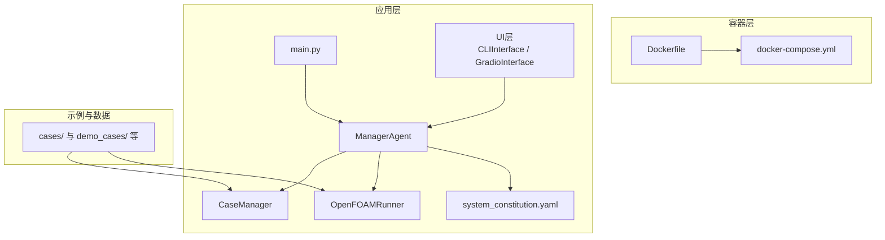
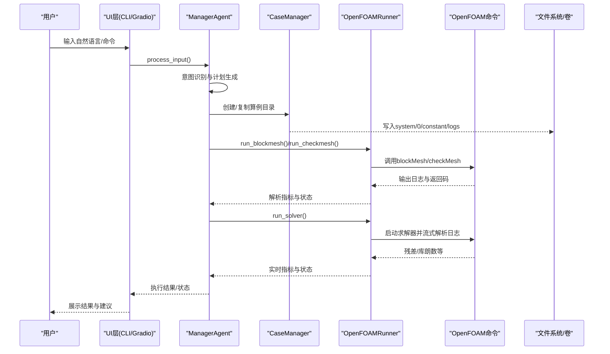
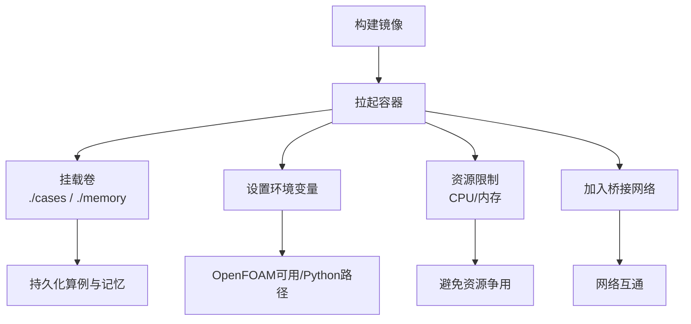
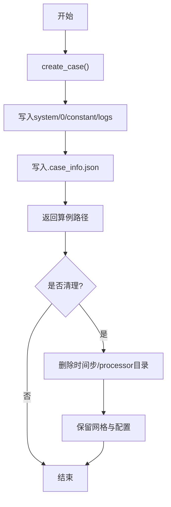
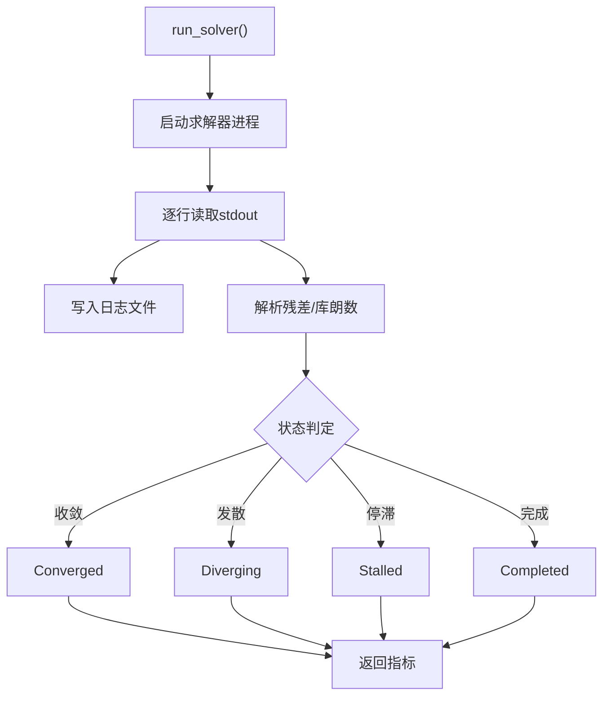
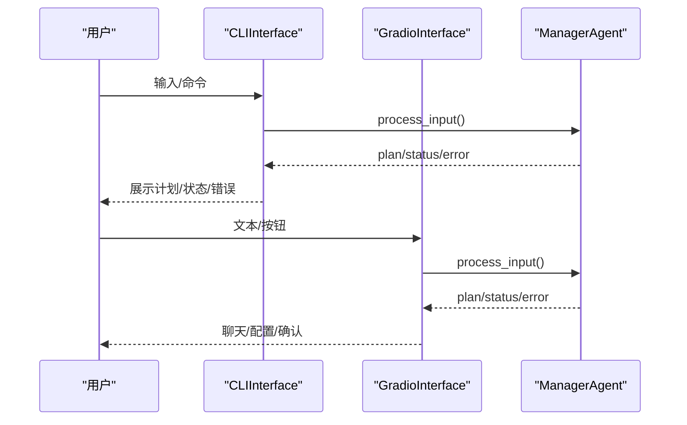
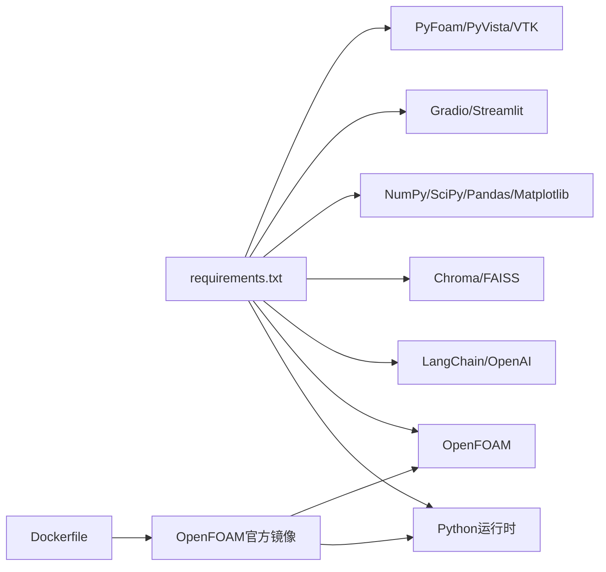

# 部署与运维

<cite>
**本文引用的文件**   
- [openfoam_ai/README.md](file://openfoam_ai/README.md)
- [openfoam_ai/docker/Dockerfile](file://openfoam_ai/docker/Dockerfile)
- [openfoam_ai/docker/docker-compose.yml](file://openfoam_ai/docker/docker-compose.yml)
- [openfoam_ai/main.py](file://openfoam_ai/main.py)
- [openfoam_ai/requirements.txt](file://openfoam_ai/requirements.txt)
- [openfoam_ai/core/openfoam_runner.py](file://openfoam_ai/core/openfoam_runner.py)
- [openfoam_ai/core/case_manager.py](file://openfoam_ai/core/case_manager.py)
- [openfoam_ai/agents/manager_agent.py](file://openfoam_ai/agents/manager_agent.py)
- [openfoam_ai/config/system_constitution.yaml](file://openfoam_ai/config/system_constitution.yaml)
- [openfoam_ai/ui/cli_interface.py](file://openfoam_ai/ui/cli_interface.py)
- [openfoam_ai/ui/gradio_interface.py](file://openfoam_ai/ui/gradio_interface.py)
- [start.bat](file://start.bat)
- [start_gui.bat](file://start_gui.bat)
</cite>

## 目录
1. [简介](#简介)
2. [项目结构](#项目结构)
3. [核心组件](#核心组件)
4. [架构总览](#架构总览)
5. [详细组件分析](#详细组件分析)
6. [依赖分析](#依赖分析)
7. [性能考虑](#性能考虑)
8. [故障排除指南](#故障排除指南)
9. [结论](#结论)
10. [附录](#附录)

## 简介
本文件面向运维工程师与平台管理员，围绕OpenFOAM AI的生产部署与运维展开，涵盖环境配置、容器化部署、镜像构建、服务编排、环境变量与网络存储、监控与日志、性能指标、故障排除、备份恢复、版本升级与回滚等主题。文档同时提供可操作的流程与可视化图示，帮助团队高效落地与稳定运行。

## 项目结构
OpenFOAM AI采用模块化分层设计：UI层（CLI/Web）、Agent层（任务调度与记忆）、核心层（算例管理、OpenFOAM执行、校验）、配置层（宪法规则）、容器层（Docker镜像与Compose）。关键目录与职责如下：
- openfoam_ai/docker：容器化相关（Dockerfile、docker-compose）
- openfoam_ai/ui：CLI与Web界面（Gradio）
- openfoam_ai/agents：Manager Agent与提示词引擎
- openfoam_ai/core：算例管理、OpenFOAM命令执行、物理验证
- openfoam_ai/config：系统宪法（约束与标准）
- demo_cases/gui_cases/interactive_cases/my_cases：示例与演示算例
- 根目录启动脚本：Windows批处理脚本用于启动交互与GUI

图表来源
- [openfoam_ai/docker/Dockerfile:1-52](file://openfoam_ai/docker/Dockerfile#L1-L52)
- [openfoam_ai/docker/docker-compose.yml:1-46](file://openfoam_ai/docker/docker-compose.yml#L1-L46)
- [openfoam_ai/main.py:1-251](file://openfoam_ai/main.py#L1-L251)
- [openfoam_ai/ui/cli_interface.py:1-401](file://openfoam_ai/ui/cli_interface.py#L1-L401)
- [openfoam_ai/ui/gradio_interface.py:1-484](file://openfoam_ai/ui/gradio_interface.py#L1-L484)
- [openfoam_ai/agents/manager_agent.py:1-458](file://openfoam_ai/agents/manager_agent.py#L1-L458)
- [openfoam_ai/core/case_manager.py:1-639](file://openfoam_ai/core/case_manager.py#L1-L639)
- [openfoam_ai/core/openfoam_runner.py:1-548](file://openfoam_ai/core/openfoam_runner.py#L1-L548)
- [openfoam_ai/config/system_constitution.yaml:1-103](file://openfoam_ai/config/system_constitution.yaml#L1-L103)

章节来源
- [openfoam_ai/README.md:130-150](file://openfoam_ai/README.md#L130-L150)
- [openfoam_ai/docker/Dockerfile:1-52](file://openfoam_ai/docker/Dockerfile#L1-L52)
- [openfoam_ai/docker/docker-compose.yml:1-46](file://openfoam_ai/docker/docker-compose.yml#L1-L46)

## 核心组件
- 主入口与运行模式：支持交互模式、演示模式、快速创建；内置OpenFOAM环境检测提示。
- Manager Agent：意图识别、计划生成、执行协调、状态管理与确认机制。
- CaseManager：标准化算例目录结构、复制模板、清理与状态更新。
- OpenFOAMRunner：封装blockMesh/checkMesh/求解器执行，日志解析与状态判定。
- UI层：CLI增强交互与Gradio Web界面，支持记忆检索与导出。
- 宪法配置：定义网格、求解器、物理约束与错误处理标准，作为防错与自愈依据。

章节来源
- [openfoam_ai/main.py:1-251](file://openfoam_ai/main.py#L1-L251)
- [openfoam_ai/agents/manager_agent.py:1-458](file://openfoam_ai/agents/manager_agent.py#L1-L458)
- [openfoam_ai/core/case_manager.py:1-639](file://openfoam_ai/core/case_manager.py#L1-L639)
- [openfoam_ai/core/openfoam_runner.py:1-548](file://openfoam_ai/core/openfoam_runner.py#L1-L548)
- [openfoam_ai/ui/cli_interface.py:1-401](file://openfoam_ai/ui/cli_interface.py#L1-L401)
- [openfoam_ai/ui/gradio_interface.py:1-484](file://openfoam_ai/ui/gradio_interface.py#L1-L484)
- [openfoam_ai/config/system_constitution.yaml:1-103](file://openfoam_ai/config/system_constitution.yaml#L1-L103)

## 架构总览
下图展示从用户交互到OpenFOAM执行与日志产出的端到端流程，以及容器编排与卷挂载关系。

图表来源
- [openfoam_ai/ui/cli_interface.py:90-252](file://openfoam_ai/ui/cli_interface.py#L90-L252)
- [openfoam_ai/ui/gradio_interface.py:99-244](file://openfoam_ai/ui/gradio_interface.py#L99-L244)
- [openfoam_ai/agents/manager_agent.py:176-338](file://openfoam_ai/agents/manager_agent.py#L176-L338)
- [openfoam_ai/core/case_manager.py:51-86](file://openfoam_ai/core/case_manager.py#L51-L86)
- [openfoam_ai/core/openfoam_runner.py:77-198](file://openfoam_ai/core/openfoam_runner.py#L77-L198)

## 详细组件分析

### 容器化与编排（Docker）
- 镜像基础：基于OpenFOAM Foundation官方镜像，预装Python 3.10及相关系统工具。
- 环境变量：设置Python路径、OpenFOAM用户二进制目录、缓冲输出等。
- 卷挂载：将宿主机项目目录与cases/memory等持久化目录映射到容器。
- 资源限制：CPU与内存上限与预留，保障多用户场景下的资源隔离。
- 网络：桥接网络，便于后续扩展外部服务或共享网络。

图表来源
- [openfoam_ai/docker/Dockerfile:1-52](file://openfoam_ai/docker/Dockerfile#L1-L52)
- [openfoam_ai/docker/docker-compose.yml:1-46](file://openfoam_ai/docker/docker-compose.yml#L1-L46)

章节来源
- [openfoam_ai/docker/Dockerfile:1-52](file://openfoam_ai/docker/Dockerfile#L1-L52)
- [openfoam_ai/docker/docker-compose.yml:1-46](file://openfoam_ai/docker/docker-compose.yml#L1-L46)

### 环境变量与网络设置
- 关键环境变量
  - OPENAI_API_KEY：可选，用于LLM接口（Mock模式可禁用）
  - PYTHONUNBUFFERED=1：确保Python输出实时可见
  - PYTHONPATH/PATH：确保OpenFOAM与项目模块可被发现
  - FOAM_USER_LIBBIN/FOAM_USER_APPBIN：OpenFOAM用户库与可执行路径
- 网络：使用bridge网络，便于未来接入监控或日志采集代理
- 存储：卷映射cases与memory目录，实现跨容器重启的数据持久化

章节来源
- [openfoam_ai/docker/docker-compose.yml:11-21](file://openfoam_ai/docker/docker-compose.yml#L11-L21)
- [openfoam_ai/docker/Dockerfile:38-42](file://openfoam_ai/docker/Dockerfile#L38-L42)

### 算例生命周期管理（CaseManager）
- 创建：标准化0/constant/system/logs目录，写入算例元信息
- 复制：从模板复制完整算例结构
- 清理：删除时间步与并行目录，保留网格与配置；保留最近日志
- 状态：记录当前算例状态（init/meshed/solving/converged/diverged）

图表来源
- [openfoam_ai/core/case_manager.py:51-86](file://openfoam_ai/core/case_manager.py#L51-L86)
- [openfoam_ai/core/case_manager.py:148-194](file://openfoam_ai/core/case_manager.py#L148-L194)

章节来源
- [openfoam_ai/core/case_manager.py:1-639](file://openfoam_ai/core/case_manager.py#L1-L639)

### OpenFOAM执行与监控（OpenFOAMRunner）
- 预处理：blockMesh/checkMesh，捕获日志并解析网格质量指标
- 求解器：实时解析残差与库朗数，判定收敛/发散/停滞/完成
- 状态机：Idle/Running/Converged/Diverging/Stalled/Error/Completed
- 自愈阈值：来源于system_constitution.yaml（如Courant限制、残差阈值）

图表来源
- [openfoam_ai/core/openfoam_runner.py:99-198](file://openfoam_ai/core/openfoam_runner.py#L99-L198)
- [openfoam_ai/core/openfoam_runner.py:389-408](file://openfoam_ai/core/openfoam_runner.py#L389-L408)
- [openfoam_ai/config/system_constitution.yaml:23-31](file://openfoam_ai/config/system_constitution.yaml#L23-L31)

章节来源
- [openfoam_ai/core/openfoam_runner.py:1-548](file://openfoam_ai/core/openfoam_runner.py#L1-L548)
- [openfoam_ai/config/system_constitution.yaml:1-103](file://openfoam_ai/config/system_constitution.yaml#L1-L103)

### 任务调度与交互（ManagerAgent + UI）
- ManagerAgent：意图识别、计划生成、执行协调、状态更新、确认机制
- CLIInterface：增强CLI，支持多轮对话、记忆检索、导出、统计
- GradioInterface：Web界面，支持聊天式交互、配置可视化、操作确认

图表来源
- [openfoam_ai/ui/cli_interface.py:90-252](file://openfoam_ai/ui/cli_interface.py#L90-L252)
- [openfoam_ai/ui/gradio_interface.py:99-244](file://openfoam_ai/ui/gradio_interface.py#L99-L244)
- [openfoam_ai/agents/manager_agent.py:75-104](file://openfoam_ai/agents/manager_agent.py#L75-L104)

章节来源
- [openfoam_ai/agents/manager_agent.py:1-458](file://openfoam_ai/agents/manager_agent.py#L1-L458)
- [openfoam_ai/ui/cli_interface.py:1-401](file://openfoam_ai/ui/cli_interface.py#L1-L401)
- [openfoam_ai/ui/gradio_interface.py:1-484](file://openfoam_ai/ui/gradio_interface.py#L1-L484)

## 依赖分析
- 运行时依赖：Python 3.10+、OpenFOAM v11、LangChain与OpenAI SDK、向量数据库（Chroma/FAISS）、科学计算与可视化库、Gradio/Streamlit、PyFoam、PyVista/VTK等
- 容器镜像依赖：基于OpenFOAM官方镜像，预装Python与系统工具
- 组件耦合：ManagerAgent依赖CaseManager与OpenFOAMRunner；UI层依赖ManagerAgent；OpenFOAMRunner依赖宪法配置

图表来源
- [openfoam_ai/requirements.txt:1-40](file://openfoam_ai/requirements.txt#L1-L40)
- [openfoam_ai/docker/Dockerfile:4-26](file://openfoam_ai/docker/Dockerfile#L4-L26)

章节来源
- [openfoam_ai/requirements.txt:1-40](file://openfoam_ai/requirements.txt#L1-L40)
- [openfoam_ai/docker/Dockerfile:1-52](file://openfoam_ai/docker/Dockerfile#L1-L52)

## 性能考虑
- 求解器监控：实时解析残差与库朗数，及时发现发散与停滞，减少无效计算
- 资源限制：容器层面设置CPU/内存上限与预留，避免单容器占用过多资源
- 日志与I/O：将日志写入容器内logs目录，结合卷持久化，避免频繁磁盘抖动
- 网络与存储：使用桥接网络与卷映射，降低跨网络访问开销，提升I/O吞吐
- 并行与分布式：OpenFOAM原生支持并行，可在容器内通过OpenFOAM并行命令运行

## 故障排除指南
- 环境未就绪
  - 现象：提示未检测到OpenFOAM环境
  - 处理：在容器内运行或确保宿主机OpenFOAM已安装且PATH正确
- 模块缺失
  - 现象：ModuleNotFoundError或依赖安装失败
  - 处理：安装requirements.txt中依赖；若无OpenAI密钥，使用Mock模式
- 命令不可用
  - 现象：找不到blockMesh/求解器
  - 处理：确认OpenFOAM安装与PATH；在容器内运行
- 配置验证失败
  - 现象：Pydantic校验报错
  - 处理：检查system_constitution.yaml中的约束；调整输入参数
- 编码与控制台显示
  - 现象：Unicode/GBK编码错误
  - 处理：设置环境变量PYTHONIOENCODING=utf-8；使用容器内终端
- 调试建议
  - 设置LOG_LEVEL=DEBUG
  - 使用Mock模式测试配置生成
  - 运行单元测试
  - 检查算例目录结构与权限

章节来源
- [openfoam_ai/README.md:208-237](file://openfoam_ai/README.md#L208-L237)
- [openfoam_ai/main.py:230-238](file://openfoam_ai/main.py#L230-L238)

## 结论
通过容器化与编排，OpenFOAM AI实现了环境一致性与资源隔离；借助ManagerAgent与UI层，实现了从自然语言到仿真执行的闭环；借助宪法配置与Runner监控，提供了可靠的防错与自愈能力。运维团队可据此建立标准化的部署流程、监控与日志策略，并制定备份恢复与版本升级方案，确保系统在生产环境中的稳定与高效。

## 附录

### 生产部署策略与流程
- 策略选择
  - 优先容器化部署，统一环境与依赖
  - 使用docker-compose编排，便于扩展与迁移
- 环境配置
  - 安装Docker与Compose
  - 准备OpenFOAM v11环境（推荐容器内运行）
  - 配置OPENAI_API_KEY（可选）
- 部署流程
  - 构建镜像：docker-compose -f docker/docker-compose.yml build
  - 启动服务：docker-compose -f docker/docker-compose.yml up -d
  - 访问Web UI：浏览器打开http://localhost:7860（默认）
  - 交互模式：python main.py 或 CLI/Gradio界面
- 卷与持久化
  - cases与memory目录映射到宿主机，实现数据持久化
  - 建议定期备份cases与memory目录

章节来源
- [openfoam_ai/README.md:25-50](file://openfoam_ai/README.md#L25-L50)
- [openfoam_ai/docker/docker-compose.yml:1-46](file://openfoam_ai/docker/docker-compose.yml#L1-L46)

### 监控方案与日志策略
- 监控方案
  - 求解器指标：库朗数、残差、时间步；通过OpenFOAMRunner解析
  - 状态机：Idle/Running/Converged/Diverging/Stalled/Error/Completed
  - 建议：将指标写入时序数据库或Prometheus（需自建采集器）
- 日志策略
  - Runner将blockMesh/checkMesh/solver日志写入logs目录
  - 建议：集中采集容器日志，按算例归档，保留最近N份
- 性能指标
  - 计算时间、收敛步数、发散/停滞次数、网格质量指标

章节来源
- [openfoam_ai/core/openfoam_runner.py:77-198](file://openfoam_ai/core/openfoam_runner.py#L77-L198)
- [openfoam_ai/config/system_constitution.yaml:23-31](file://openfoam_ai/config/system_constitution.yaml#L23-L31)

### 备份与恢复
- 备份对象
  - cases目录（算例与结果）
  - memory目录（记忆与会话）
- 备份方式
  - 文件系统快照或tar归档
  - 建议周期性增量备份
- 恢复流程
  - 停止容器
  - 恢复对应卷目录
  - 启动容器并验证

章节来源
- [openfoam_ai/docker/docker-compose.yml:16-21](file://openfoam_ai/docker/docker-compose.yml#L16-L21)

### 版本升级与回滚
- 升级流程
  - 拉取最新镜像或重建镜像
  - 备份cases与memory
  - 停止旧容器，启动新容器
  - 验证功能与性能
- 回滚策略
  - 使用历史镜像标签
  - 恢复备份的cases与memory
  - 重新启动服务

章节来源
- [openfoam_ai/docker/Dockerfile:1-52](file://openfoam_ai/docker/Dockerfile#L1-L52)
- [openfoam_ai/docker/docker-compose.yml:5-8](file://openfoam_ai/docker/docker-compose.yml#L5-L8)

### 启动脚本与入口
- Windows批处理
  - start.bat：激活虚拟环境并启动交互模式
  - start_gui.bat：激活虚拟环境并启动GUI
- 主入口
  - main.py：支持交互/演示/快速创建模式；内置OpenFOAM环境检测

章节来源
- [start.bat:1-16](file://start.bat#L1-L16)
- [start_gui.bat:1-21](file://start_gui.bat#L1-L21)
- [openfoam_ai/main.py:202-247](file://openfoam_ai/main.py#L202-L247)