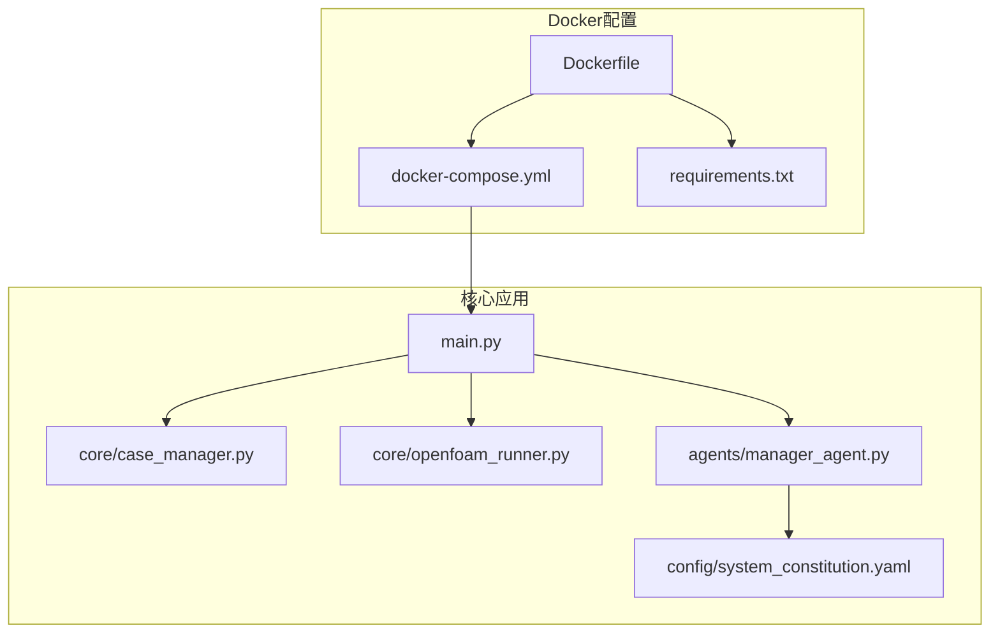
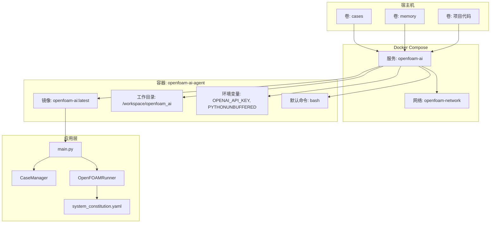
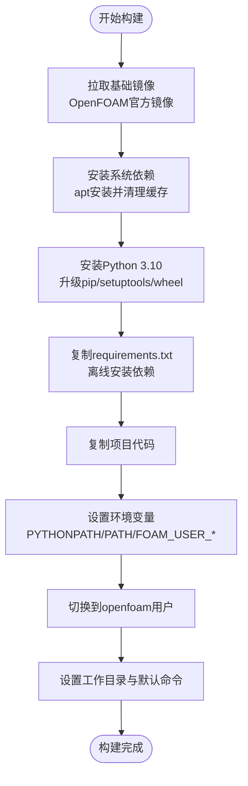
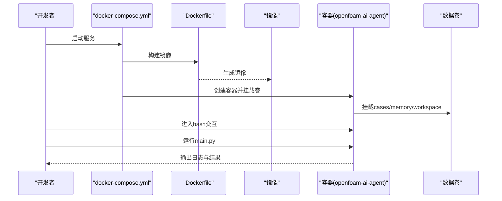
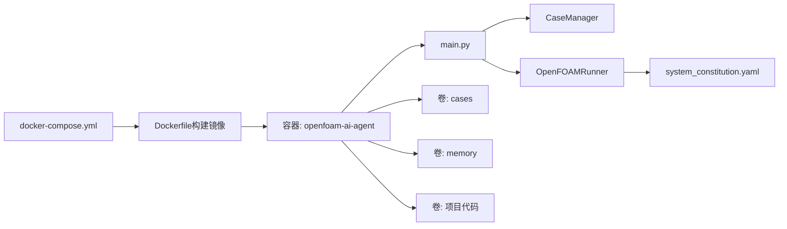

# Docker部署配置

<cite>
**本文引用的文件**
- [Dockerfile](file://openfoam_ai/docker/Dockerfile)
- [docker-compose.yml](file://openfoam_ai/docker/docker-compose.yml)
- [requirements.txt](file://openfoam_ai/requirements.txt)
- [main.py](file://openfoam_ai/main.py)
- [README.md](file://openfoam_ai/README.md)
- [system_constitution.yaml](file://openfoam_ai/config/system_constitution.yaml)
- [start.bat](file://start.bat)
- [start_gui.bat](file://start_gui.bat)
- [test_basic.py](file://openfoam_ai/tests/test_basic.py)
- [test_case_manager.py](file://openfoam_ai/tests/test_case_manager.py)
- [case_manager.py](file://openfoam_ai/core/case_manager.py)
- [openfoam_runner.py](file://openfoam_ai/core/openfoam_runner.py)
- [manager_agent.py](file://openfoam_ai/agents/manager_agent.py)
</cite>

## 目录
1. [简介](#简介)
2. [项目结构](#项目结构)
3. [核心组件](#核心组件)
4. [架构总览](#架构总览)
5. [详细组件分析](#详细组件分析)
6. [依赖关系分析](#依赖关系分析)
7. [性能考虑](#性能考虑)
8. [故障排除指南](#故障排除指南)
9. [结论](#结论)
10. [附录](#附录)

## 简介
本文件面向OpenFOAM AI项目的Docker部署配置，系统性阐述Dockerfile构建指令、镜像分层策略与优化技巧；详解docker-compose.yml服务编排、容器网络与数据卷管理；说明多阶段构建思路、镜像体积优化与安全加固；给出开发与生产环境差异化的部署策略、环境变量与配置文件挂载方案；提供容器监控、日志管理与健康检查配置建议；详述容器间通信、端口映射与网络隔离；涵盖部署自动化脚本、CI/CD集成与滚动更新策略；最后提供故障排除与性能调优建议。

## 项目结构
OpenFOAM AI的Docker相关配置位于openfoam_ai/docker目录，核心文件包括：
- Dockerfile：镜像构建定义，基于OpenFOAM官方基础镜像，安装Python与系统依赖，复制项目代码并设置环境变量与工作目录。
- docker-compose.yml：服务编排定义，构建镜像、挂载卷、设置资源限制、定义网络与容器命名。
- requirements.txt：Python依赖清单，包含LLM框架、向量数据库、科学计算、OpenFOAM接口、后处理与Web UI等依赖。
- main.py：项目主入口，支持交互模式、演示模式与快速创建算例，同时检查OpenFOAM环境可用性。
- README.md：项目说明，包含Docker使用示例与运行方式。
- system_constitution.yaml：项目宪法，定义网格、求解器、物理约束与质量检查等核心规则，影响运行期行为与日志解析。
- 启动脚本：start.bat与start_gui.bat，便于Windows环境下启动交互与GUI模式。
- 测试文件：test_basic.py与test_case_manager.py，验证核心模块导入、算例管理与配置验证等。

**图表来源**
- [Dockerfile:1-52](file://openfoam_ai/docker/Dockerfile#L1-L52)
- [docker-compose.yml:1-46](file://openfoam_ai/docker/docker-compose.yml#L1-L46)
- [requirements.txt:1-40](file://openfoam_ai/requirements.txt#L1-L40)
- [main.py:1-251](file://openfoam_ai/main.py#L1-L251)
- [case_manager.py:1-200](file://openfoam_ai/core/case_manager.py#L1-L200)
- [openfoam_runner.py:1-200](file://openfoam_ai/core/openfoam_runner.py#L1-L200)
- [manager_agent.py:1-200](file://openfoam_ai/agents/manager_agent.py#L1-L200)
- [system_constitution.yaml:1-103](file://openfoam_ai/config/system_constitution.yaml#L1-L103)

**章节来源**
- [Dockerfile:1-52](file://openfoam_ai/docker/Dockerfile#L1-L52)
- [docker-compose.yml:1-46](file://openfoam_ai/docker/docker-compose.yml#L1-L46)
- [requirements.txt:1-40](file://openfoam_ai/requirements.txt#L1-L40)
- [main.py:1-251](file://openfoam_ai/main.py#L1-L251)
- [README.md:1-291](file://openfoam_ai/README.md#L1-L291)

## 核心组件
- Dockerfile构建要点
  - 基础镜像：基于OpenFOAM Foundation版本的基础镜像，内置OpenFOAM工具链，确保blockMesh、checkMesh、求解器等命令可用。
  - 系统依赖：安装Python 3.10、pip、构建工具、git、wget、curl、vim等，随后清理apt缓存减少镜像体积。
  - Python环境：设置Python与pip为最新版本，并升级pip、setuptools、wheel。
  - 工作目录与代码：创建工作目录/workspace，复制requirements.txt并安装依赖，再复制项目代码至/workspace/openfoam_ai。
  - 环境变量：设置PYTHONPATH、PATH，以及OpenFOAM用户自定义库与可执行目录。
  - 用户切换：从root切换到openfoam用户，降低权限风险。
  - 默认命令：设置容器默认为交互式bash，便于调试与进入容器。
- docker-compose.yml编排要点
  - 构建上下文：指定构建上下文为父目录，Dockerfile路径为docker/Dockerfile。
  - 镜像与容器：镜像名为openfoam-ai:latest，容器名为openfoam-ai-agent。
  - 环境变量：传递OPENAI_API_KEY（若存在）、设置Python缓冲输出。
  - 数据卷：挂载项目根目录到/workspace/openfoam_ai，挂载cases与memory目录，便于持久化与共享。
  - 工作目录：设置为/workspace/openfoam_ai。
  - 资源限制：限制CPU与内存，预留与上限分离，避免资源争抢。
  - 网络：加入自定义bridge网络openfoam-network，便于后续扩展其他服务。
- requirements.txt依赖
  - LLM框架：langchain、langchain-openai、openai。
  - 向量数据库：chromadb、faiss-cpu。
  - 科学计算：numpy、scipy、pandas、matplotlib。
  - 数据验证：pydantic。
  - OpenFOAM接口：PyFoam。
  - 后处理：pyvista、vtk。
  - Web UI：gradio、streamlit。
  - 其他工具：pyyaml、python-dotenv、tqdm、pytest、black、mypy。
- main.py与运行期行为
  - 支持交互模式、演示模式与快速创建算例。
  - 运行前检查OpenFOAM环境，提示未检测到OpenFOAM时的注意事项。
  - 与OpenFOAM Runner协作执行blockMesh、checkMesh与求解器，实时解析日志与指标。
- system_constitution.yaml
  - 定义网格标准、求解器标准、物理约束、禁止组合、质量检查与错误处理策略，影响运行期日志解析与状态判断。

**章节来源**
- [Dockerfile:1-52](file://openfoam_ai/docker/Dockerfile#L1-L52)
- [docker-compose.yml:1-46](file://openfoam_ai/docker/docker-compose.yml#L1-L46)
- [requirements.txt:1-40](file://openfoam_ai/requirements.txt#L1-L40)
- [main.py:1-251](file://openfoam_ai/main.py#L1-L251)
- [system_constitution.yaml:1-103](file://openfoam_ai/config/system_constitution.yaml#L1-L103)

## 架构总览
下图展示Docker部署的整体架构：Compose编排单个服务openfoam-ai，构建自Dockerfile；容器内运行main.py，通过CaseManager与OpenFOAM Runner与OpenFOAM工具链交互；数据卷挂载cases与memory目录，system_constitution.yaml作为运行期约束参与日志解析与状态判定。

**图表来源**
- [docker-compose.yml:1-46](file://openfoam_ai/docker/docker-compose.yml#L1-L46)
- [Dockerfile:1-52](file://openfoam_ai/docker/Dockerfile#L1-L52)
- [main.py:1-251](file://openfoam_ai/main.py#L1-L251)
- [case_manager.py:1-200](file://openfoam_ai/core/case_manager.py#L1-L200)
- [openfoam_runner.py:1-200](file://openfoam_ai/core/openfoam_runner.py#L1-L200)
- [system_constitution.yaml:1-103](file://openfoam_ai/config/system_constitution.yaml#L1-L103)

## 详细组件分析

### Dockerfile构建流程与优化
- 分层策略
  - 基础镜像层：来自OpenFOAM官方镜像，包含OpenFOAM工具链。
  - 系统依赖层：apt安装必要工具并清理缓存，减少镜像体积。
  - Python环境层：安装Python 3.10、pip与构建工具，升级pip相关组件。
  - 依赖安装层：复制requirements.txt并离线安装，利用pip缓存与no-cache-dir策略平衡速度与体积。
  - 代码层：复制项目代码，避免重复拷贝。
  - 环境变量与用户层：设置PATH与OpenFOAM自定义目录，切换到非root用户。
- 优化技巧
  - apt缓存清理：安装后清理缓存，避免长期缓存占用空间。
  - pip离线安装：先复制requirements.txt再安装，提升缓存命中率。
  - no-cache-dir：避免pip缓存写入镜像层，减小体积。
  - 用户切换：使用非root用户运行，降低安全风险。
  - 默认命令：设置bash便于交互调试。
- 多阶段构建建议
  - 当前为单阶段构建，适合开发与演示场景；生产环境可考虑多阶段构建：构建阶段安装依赖与编译，运行阶段仅包含运行时依赖，进一步缩小镜像体积并提升安全性。

**图表来源**
- [Dockerfile:1-52](file://openfoam_ai/docker/Dockerfile#L1-L52)

**章节来源**
- [Dockerfile:1-52](file://openfoam_ai/docker/Dockerfile#L1-L52)

### docker-compose.yml服务编排与网络
- 服务定义
  - 构建：指定构建上下文与Dockerfile路径，镜像名为openfoam-ai:latest，容器名为openfoam-ai-agent。
  - 环境变量：传递OPENAI_API_KEY（若存在），设置PYTHONUNBUFFERED=1以禁用Python缓冲，便于实时日志输出。
  - 数据卷：挂载项目根目录到/workspace/openfoam_ai，挂载cases与memory目录，实现持久化与共享。
  - 工作目录：/workspace/openfoam_ai，便于直接运行main.py。
  - 资源限制：限制CPU与内存，区分limits与reservations，避免资源争抢。
  - 网络：加入openfoam-network桥接网络，便于未来扩展其他服务。
- 网络隔离与端口映射
  - 当前未暴露端口映射，容器通过卷与网络内部通信；如需Web UI访问，可在compose中增加ports映射。
- 健康检查与监控
  - 当前未配置健康检查；可在compose中增加healthcheck，定期探测容器内关键进程或端口。
  - 日志管理：容器stdout/stderr由Docker守护进程收集，结合日志驱动与外部日志系统（如ELK/Fluentd）集中管理。

**图表来源**
- [docker-compose.yml:1-46](file://openfoam_ai/docker/docker-compose.yml#L1-L46)
- [Dockerfile:1-52](file://openfoam_ai/docker/Dockerfile#L1-L52)

**章节来源**
- [docker-compose.yml:1-46](file://openfoam_ai/docker/docker-compose.yml#L1-L46)

### 多阶段构建、镜像体积与安全加固
- 多阶段构建
  - 构建阶段：安装Python、pip与依赖，编译/打包产物。
  - 运行阶段：仅复制运行时必需文件，移除开发工具与缓存，显著减小镜像体积。
- 镜像体积优化
  - 合理使用apt缓存清理与no-cache-dir策略。
  - 合并RUN指令，减少层数与中间文件。
  - 使用更小的基础镜像（如Debian/Alpine）替代Ubuntu，注意兼容性。
- 安全加固
  - 使用非root用户运行，限制文件权限。
  - 清理不必要的系统包与缓存。
  - 限制容器资源，避免资源滥用。
  - 使用只读根文件系统（ro），仅对必要卷设置可写。

**章节来源**
- [Dockerfile:1-52](file://openfoam_ai/docker/Dockerfile#L1-L52)

### 开发与生产环境差异化部署
- 开发环境
  - 使用卷挂载项目代码，便于热更新与调试。
  - 保持交互式bash，默认命令为bash，便于快速试验。
  - 无需严格资源限制，便于快速迭代。
- 生产环境
  - 关闭交互式模式，设置合适的CMD或ENTRYPOINT。
  - 明确资源限制与重启策略，提升稳定性。
  - 配置健康检查与日志采集，便于运维监控。
  - 使用只读根文件系统与最小化依赖，增强安全性。

**章节来源**
- [docker-compose.yml:1-46](file://openfoam_ai/docker/docker-compose.yml#L1-L46)
- [Dockerfile:1-52](file://openfoam_ai/docker/Dockerfile#L1-L52)

### 环境变量与配置文件挂载
- 环境变量
  - OPENAI_API_KEY：用于LLM接口（如LangChain/OpenAI）。
  - PYTHONUNBUFFERED=1：禁用Python缓冲，便于实时日志输出。
- 配置文件挂载
  - system_constitution.yaml：作为运行期约束，影响日志解析与状态判断，建议挂载到容器内对应路径以便动态更新。
- 依赖管理
  - requirements.txt：集中管理Python依赖，确保镜像与容器内一致性。

**章节来源**
- [docker-compose.yml:1-46](file://openfoam_ai/docker/docker-compose.yml#L1-L46)
- [system_constitution.yaml:1-103](file://openfoam_ai/config/system_constitution.yaml#L1-L103)
- [requirements.txt:1-40](file://openfoam_ai/requirements.txt#L1-L40)

### 容器监控、日志管理与健康检查
- 日志管理
  - 容器stdout/stderr由Docker收集，建议配置日志驱动（如json-file/syslog/fluentd）并设置轮转策略。
  - 在compose中设置日志选项，如max-size与max-file，避免磁盘占满。
- 健康检查
  - 建议增加健康检查，探测关键进程或端口，失败时自动重启。
  - 对于OpenFOAM场景，可探测求解器进程或日志更新时间。
- 监控指标
  - CPU、内存、磁盘I/O与网络使用情况可通过Docker统计与外部监控系统（如Prometheus/Grafana）采集。

**章节来源**
- [docker-compose.yml:1-46](file://openfoam_ai/docker/docker-compose.yml#L1-L46)

### 容器间通信、端口映射与网络隔离
- 网络
  - 当前服务加入自定义bridge网络openfoam-network，便于未来扩展其他服务（如Web UI、数据库）。
- 端口映射
  - 当前未暴露端口映射；如需Web UI访问，可在compose中增加ports映射。
- 网络隔离
  - 使用自定义bridge网络隔离服务，避免与其他项目冲突。
  - 如需更强隔离，可使用overlay网络或外部防火墙策略。

**章节来源**
- [docker-compose.yml:1-46](file://openfoam_ai/docker/docker-compose.yml#L1-L46)

### 部署自动化脚本、CI/CD集成与滚动更新
- 自动化脚本
  - start.bat与start_gui.bat：Windows环境下启动交互与GUI模式，便于本地开发与演示。
  - 可扩展为部署脚本：一键构建镜像、推送镜像、拉起服务、健康检查与日志采集。
- CI/CD集成
  - 在CI流水线中执行：构建镜像、运行单元测试、推送镜像、部署到目标环境。
  - 使用compose的--compatibility模式与stack部署，实现声明式编排。
- 滚动更新
  - 使用Compose的默认重启策略或外部编排工具（如Kubernetes）进行滚动更新，确保服务连续性。

**章节来源**
- [start.bat:1-16](file://start.bat#L1-L16)
- [start_gui.bat:1-21](file://start_gui.bat#L1-L21)
- [docker-compose.yml:1-46](file://openfoam_ai/docker/docker-compose.yml#L1-L46)

## 依赖关系分析
OpenFOAM AI的运行依赖关系如下：Compose编排服务，Dockerfile构建镜像，镜像内运行main.py；main.py协调CaseManager与OpenFOAMRunner；OpenFOAMRunner解析system_constitution.yaml并执行OpenFOAM命令；数据卷提供cases与memory持久化。

**图表来源**
- [docker-compose.yml:1-46](file://openfoam_ai/docker/docker-compose.yml#L1-L46)
- [Dockerfile:1-52](file://openfoam_ai/docker/Dockerfile#L1-L52)
- [main.py:1-251](file://openfoam_ai/main.py#L1-L251)
- [case_manager.py:1-200](file://openfoam_ai/core/case_manager.py#L1-L200)
- [openfoam_runner.py:1-200](file://openfoam_ai/core/openfoam_runner.py#L1-L200)
- [system_constitution.yaml:1-103](file://openfoam_ai/config/system_constitution.yaml#L1-L103)

**章节来源**
- [docker-compose.yml:1-46](file://openfoam_ai/docker/docker-compose.yml#L1-L46)
- [Dockerfile:1-52](file://openfoam_ai/docker/Dockerfile#L1-L52)
- [main.py:1-251](file://openfoam_ai/main.py#L1-L251)
- [case_manager.py:1-200](file://openfoam_ai/core/case_manager.py#L1-L200)
- [openfoam_runner.py:1-200](file://openfoam_ai/core/openfoam_runner.py#L1-L200)
- [system_constitution.yaml:1-103](file://openfoam_ai/config/system_constitution.yaml#L1-L103)

## 性能考虑
- 镜像体积
  - 合理使用apt缓存清理与no-cache-dir策略，合并RUN指令减少层数。
  - 使用更小的基础镜像（如Alpine）替代Ubuntu，注意兼容性与依赖可用性。
- 运行性能
  - 合理设置CPU与内存资源限制，避免资源争抢。
  - 使用SSD存储与合适的卷驱动，提升I/O性能。
- 日志与监控
  - 配置日志轮转与外部日志系统，避免容器日志占用过多磁盘。
  - 使用轻量级监控工具，关注CPU、内存、磁盘与网络指标。

[本节为通用指导，无需具体文件引用]

## 故障排除指南
- OpenFOAM命令未找到
  - 现象：运行时提示找不到blockMesh或求解器命令。
  - 原因：OpenFOAM未正确安装或PATH未设置。
  - 解决：在容器内确认OpenFOAM安装与PATH，或使用官方OpenFOAM镜像。
- Python模块导入失败
  - 现象：ModuleNotFoundError或依赖缺失。
  - 原因：requirements.txt未正确安装或版本冲突。
  - 解决：检查requirements.txt与pip安装过程，确保依赖完整。
- 配置验证失败
  - 现象：Pydantic校验报错。
  - 原因：配置不符合system_constitution.yaml中的约束。
  - 解决：根据宪法规则调整配置参数，确保网格、求解器与物理参数合理。
- Windows控制台编码问题
  - 现象：Unicode字符显示异常。
  - 原因：默认编码为GBK。
  - 解决：设置环境变量PYTHONIOENCODING=utf-8或忽略该问题。
- 测试失败
  - 现象：单元测试未通过。
  - 原因：模块导入异常、算例管理器功能异常或配置验证失败。
  - 解决：运行pytest进行定位，检查模块路径与依赖安装。

**章节来源**
- [README.md:208-237](file://openfoam_ai/README.md#L208-L237)
- [test_basic.py:1-270](file://openfoam_ai/tests/test_basic.py#L1-L270)
- [test_case_manager.py:1-180](file://openfoam_ai/tests/test_case_manager.py#L1-L180)
- [system_constitution.yaml:1-103](file://openfoam_ai/config/system_constitution.yaml#L1-L103)

## 结论
本文围绕OpenFOAM AI的Docker部署配置，系统阐述了Dockerfile构建策略、compose编排要点、数据卷与网络设计、依赖管理与运行期行为，并给出了开发与生产环境的差异化策略、监控与健康检查建议、故障排除与性能调优指导。通过合理的分层与优化策略，可显著提升镜像体积与运行效率；通过严格的环境变量与配置挂载，可确保部署一致性与可维护性；通过完善的监控与健康检查，可保障生产环境的稳定性与可观测性。

[本节为总结性内容，无需具体文件引用]

## 附录
- 快速开始
  - 使用Docker Compose启动服务：docker-compose -f docker/docker-compose.yml up -d。
  - 进入容器交互：docker exec -it openfoam-ai-agent bash。
  - 运行主程序：python main.py。
- 常用命令
  - 查看日志：docker logs -f openfoam-ai-agent。
  - 停止服务：docker-compose -f docker/docker-compose.yml down。
- 扩展建议
  - 增加Web UI服务并与openfoam-ai-agent在同一网络中。
  - 配置持久化存储与备份策略。
  - 引入CI/CD流水线自动化构建与部署。

**章节来源**
- [README.md:35-50](file://openfoam_ai/README.md#L35-L50)
- [docker-compose.yml:1-46](file://openfoam_ai/docker/docker-compose.yml#L1-L46)
- [main.py:1-251](file://openfoam_ai/main.py#L1-L251)