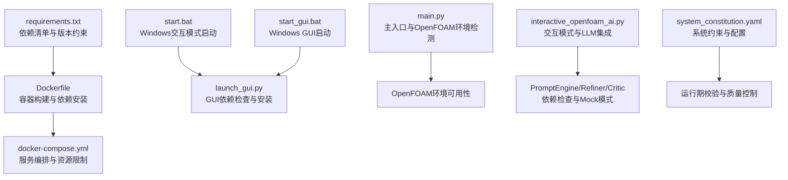
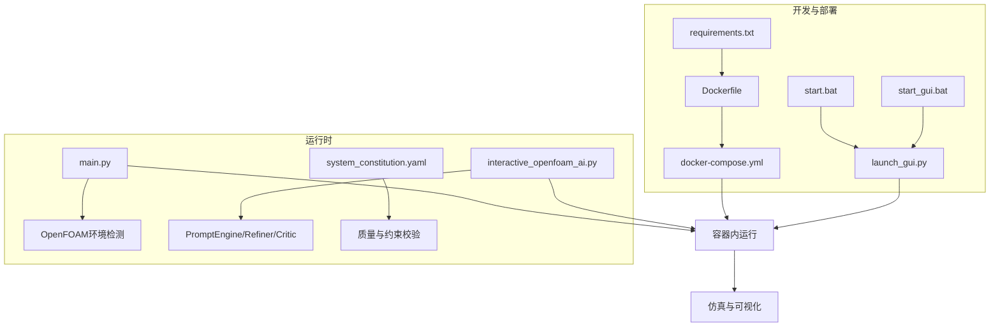
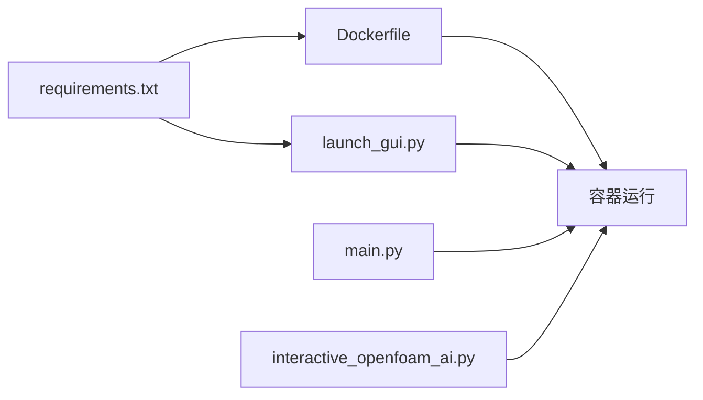

# 依赖管理系统

<cite>
**本文引用的文件**
- [requirements.txt](file://openfoam_ai/requirements.txt)
- [Dockerfile](file://openfoam_ai/docker/Dockerfile)
- [docker-compose.yml](file://openfoam_ai/docker/docker-compose.yml)
- [main.py](file://openfoam_ai/main.py)
- [start_openfoam_ai.py](file://start_openfoam_ai.py)
- [start.bat](file://start.bat)
- [start_gui.bat](file://start_gui.bat)
- [launch_gui.py](file://launch_gui.py)
- [interactive_openfoam_ai.py](file://interactive_openfoam_ai.py)
- [system_constitution.yaml](file://openfoam_ai/config/system_constitution.yaml)
- [simple_test.py](file://openfoam_ai/tests/simple_test.py)
- [启动说明.txt](file://启动说明.txt)
</cite>

## 目录
1. [简介](#简介)
2. [项目结构](#项目结构)
3. [核心组件](#核心组件)
4. [架构总览](#架构总览)
5. [详细组件分析](#详细组件分析)
6. [依赖关系分析](#依赖关系分析)
7. [性能考虑](#性能考虑)
8. [故障排查指南](#故障排查指南)
9. [结论](#结论)
10. [附录](#附录)

## 简介
本文件面向OpenFOAM AI的依赖管理系统，系统性梳理requirements.txt中的依赖清单、版本约束与兼容性要求；阐明Python包管理策略、虚拟环境配置与依赖冲突处理；说明第三方库的集成方式、版本管理与升级策略；对比开发与生产环境差异、安装脚本与自动化部署；给出依赖审计、安全扫描与许可证合规建议；并提供依赖更新流程、向后兼容性保障与回滚机制，以及常见依赖问题的诊断与解决方法。

## 项目结构
OpenFOAM AI采用“requirements.txt + Docker容器 + 批处理脚本”的组合方式管理依赖与运行环境。核心依赖集中在requirements.txt，容器化构建由Dockerfile负责，docker-compose用于服务编排与资源限制；Windows侧通过批处理脚本激活虚拟环境并启动GUI或交互模式。

图表来源
- [requirements.txt](file://openfoam_ai/requirements.txt)
- [Dockerfile](file://openfoam_ai/docker/Dockerfile)
- [docker-compose.yml](file://openfoam_ai/docker/docker-compose.yml)
- [start.bat](file://start.bat)
- [start_gui.bat](file://start_gui.bat)
- [launch_gui.py](file://launch_gui.py)
- [main.py](file://openfoam_ai/main.py)
- [interactive_openfoam_ai.py](file://interactive_openfoam_ai.py)
- [system_constitution.yaml](file://openfoam_ai/config/system_constitution.yaml)

章节来源
- [requirements.txt](file://openfoam_ai/requirements.txt)
- [Dockerfile](file://openfoam_ai/docker/Dockerfile)
- [docker-compose.yml](file://openfoam_ai/docker/docker-compose.yml)
- [start.bat](file://start.bat)
- [start_gui.bat](file://start_gui.bat)
- [launch_gui.py](file://launch_gui.py)
- [main.py](file://openfoam_ai/main.py)
- [interactive_openfoam_ai.py](file://interactive_openfoam_ai.py)
- [system_constitution.yaml](file://openfoam_ai/config/system_constitution.yaml)

## 核心组件
- 依赖清单与版本约束：集中于requirements.txt，按功能域分组（LLM框架、向量数据库、科学计算、数据验证、OpenFOAM接口、后处理、Web UI、其他工具），并标注最低Python版本要求。
- 容器化构建：Dockerfile基于OpenFOAM官方镜像，安装系统依赖、设置Python 3.10、升级pip并安装Python依赖，复制项目代码并设置OpenFOAM相关环境变量。
- 服务编排：docker-compose定义服务、环境变量、卷映射、工作目录、资源限制与网络，便于本地开发与演示。
- 启动脚本与虚拟环境：Windows批处理脚本激活虚拟环境后启动交互或GUI；GUI启动器具备依赖检查与自动安装能力。
- 主入口与环境检测：main.py在启动时检测OpenFOAM环境可用性；interactive_openfoam_ai.py提供交互式会话与LLM集成，具备Mock模式降级能力。
- 系统约束与配置：system_constitution.yaml定义网格、求解器、物理约束与质量检查等硬性规则，作为运行期校验依据。

章节来源
- [requirements.txt](file://openfoam_ai/requirements.txt)
- [Dockerfile](file://openfoam_ai/docker/Dockerfile)
- [docker-compose.yml](file://openfoam_ai/docker/docker-compose.yml)
- [start.bat](file://start.bat)
- [start_gui.bat](file://start_gui.bat)
- [launch_gui.py](file://launch_gui.py)
- [main.py](file://openfoam_ai/main.py)
- [interactive_openfoam_ai.py](file://interactive_openfoam_ai.py)
- [system_constitution.yaml](file://openfoam_ai/config/system_constitution.yaml)

## 架构总览
下图展示依赖管理在整体系统中的位置与交互：从requirements.txt出发，经由Dockerfile构建容器镜像，再由docker-compose编排运行；Windows侧通过批处理脚本与GUI启动器接入；主入口与交互模式负责运行期环境检测与功能调用。

图表来源
- [requirements.txt](file://openfoam_ai/requirements.txt)
- [Dockerfile](file://openfoam_ai/docker/Dockerfile)
- [docker-compose.yml](file://openfoam_ai/docker/docker-compose.yml)
- [start.bat](file://start.bat)
- [start_gui.bat](file://start_gui.bat)
- [launch_gui.py](file://launch_gui.py)
- [main.py](file://openfoam_ai/main.py)
- [interactive_openfoam_ai.py](file://interactive_openfoam_ai.py)
- [system_constitution.yaml](file://openfoam_ai/config/system_constitution.yaml)

## 详细组件分析

### 依赖清单与版本约束（requirements.txt）
- 分组与用途
  - LLM框架：langchain、langchain-openai、openai，用于提示工程与大模型交互。
  - 向量数据库：chromadb、faiss-cpu，用于向量检索与知识存储。
  - 科学计算：numpy、scipy、pandas、matplotlib，支撑数值计算与可视化。
  - 数据验证：pydantic，用于配置与数据结构的运行期校验。
  - OpenFOAM接口：PyFoam，用于与OpenFOAM工具链交互。
  - 后处理：pyvista、vtk，用于三维可视化与网格后处理。
  - Web UI：gradio、streamlit，用于构建交互式界面。
  - 其他工具：pyyaml、python-dotenv、tqdm、pytest、black、mypy，用于配置管理、环境变量、进度条、测试、代码格式化与静态类型检查。
- 版本约束与兼容性
  - Python版本：明确要求Python 3.10及以上。
  - 各子系统版本均采用“>=”下限约束，避免过旧版本导致的功能缺失或API变更。
  - PyFoam对OpenFOAM版本敏感，需结合容器镜像的OpenFOAM版本进行兼容性验证。
- 依赖冲突与规避
  - 将UI框架（gradio/streamlit）与科学计算（numpy/pandas/matplotlib）分离，降低冲突概率。
  - 通过容器化隔离系统级依赖，减少宿主机Python环境污染。

章节来源
- [requirements.txt](file://openfoam_ai/requirements.txt)

### 容器化构建与运行（Dockerfile）
- 基础镜像与系统依赖
  - 基于OpenFOAM官方镜像，预装Python 3.10、pip、venv、build-essential、git、wget、curl、vim等。
  - 设置Python与pip为系统默认版本，便于后续pip安装。
- 依赖安装与环境变量
  - 升级pip、setuptools、wheel后，基于requirements.txt安装Python依赖。
  - 设置PYTHONPATH、PATH、FOAM_USER_LIBBIN、FOAM_USER_APPBIN等OpenFOAM相关环境变量。
  - 切换到openfoam用户，设置工作目录为/workspace/openfoam_ai。
- 与requirements.txt的耦合
  - Dockerfile显式COPY并安装requirements.txt，确保镜像内依赖与清单一致。
  - 若requirements.txt变更，需重建镜像以应用新依赖。

章节来源
- [Dockerfile](file://openfoam_ai/docker/Dockerfile)
- [requirements.txt](file://openfoam_ai/requirements.txt)

### 服务编排与资源管理（docker-compose.yml）
- 服务定义
  - 构建上下文指向根目录，使用docker/Dockerfile。
  - 容器名称与镜像标签固定，便于识别与管理。
- 环境变量与卷映射
  - 通过环境变量传递API密钥等敏感信息。
  - 卷映射本地项目目录、算例目录与记忆目录，便于持久化与共享。
- 资源限制
  - 限制CPU与内存上限与预留，避免资源争用影响稳定性。
- 网络
  - 定义bridge网络，便于多容器协作（如未来扩展）。

章节来源
- [docker-compose.yml](file://openfoam_ai/docker/docker-compose.yml)

### 启动脚本与虚拟环境（Windows）
- 交互模式启动（start.bat）
  - 激活虚拟环境后启动交互式脚本，便于本地开发调试。
- GUI启动（start_gui.bat）
  - 激活虚拟环境后启动GUI服务器，自动打开浏览器。
- GUI依赖检查与安装（launch_gui.py）
  - 启动前检查gradio、matplotlib、numpy等依赖是否存在。
  - 若缺失，使用subprocess调用pip安装指定版本，确保UI可用。
- 与requirements.txt的关系
  - GUI启动器的依赖检查逻辑与requirements.txt中的UI与可视化依赖保持一致，避免版本不一致导致的运行时错误。

章节来源
- [start.bat](file://start.bat)
- [start_gui.bat](file://start_gui.bat)
- [launch_gui.py](file://launch_gui.py)
- [requirements.txt](file://openfoam_ai/requirements.txt)

### 主入口与运行期环境检测（main.py）
- OpenFOAM环境检测
  - 启动时尝试调用blockMesh -help，若失败则提示未检测到OpenFOAM环境，部分功能受限。
- 功能入口
  - 支持交互模式、演示模式与快速创建模式，分别对应不同使用场景。
- 与依赖的关系
  - 依赖于PyFoam与OpenFOAM工具链，若环境不完整，将影响网格生成与求解器运行。

章节来源
- [main.py](file://openfoam_ai/main.py)

### 交互模式与LLM集成（interactive_openfoam_ai.py）
- LLM初始化与Mock模式
  - 通过PromptEngineV2初始化LLM，若初始化失败则进入Mock模式，避免因API不可用导致的完全不可用。
- 依赖检查与降级
  - 在Mock模式下仍可进行配置解析与优化建议，但不调用真实大模型。
- 与requirements.txt的对应
  - LLM框架（langchain、langchain-openai、openai）与向量数据库（chromadb、faiss-cpu）在requirements.txt中均有体现，确保容器与本地环境一致。

章节来源
- [interactive_openfoam_ai.py](file://interactive_openfoam_ai.py)
- [requirements.txt](file://openfoam_ai/requirements.txt)

### 系统约束与配置（system_constitution.yaml）
- 约束内容
  - 核心指令、网格标准、求解器标准、物理约束、禁止组合、质量检查、错误处理与文档要求。
- 与依赖的关系
  - 依赖于PyFoam（网格生成）、matplotlib（可视化）、pyvista/vtk（后处理）等，系统约束指导运行期校验与质量控制。

章节来源
- [system_constitution.yaml](file://openfoam_ai/config/system_constitution.yaml)

### 依赖审计与测试（simple_test.py）
- 项目结构验证
  - 简化测试脚本验证核心模块与关键文件的存在性，间接反映依赖清单与项目结构的一致性。
- 依赖一致性检查
  - 通过读取并执行核心模块源码，验证依赖安装后的语法正确性与可导入性。

章节来源
- [simple_test.py](file://openfoam_ai/tests/simple_test.py)

## 依赖关系分析
- 组件耦合
  - requirements.txt是依赖管理的唯一事实来源，Dockerfile与GUI启动器均与其保持强耦合。
  - main.py与interactive_openfoam_ai.py对OpenFOAM与LLM依赖存在直接调用关系。
- 外部依赖
  - OpenFOAM工具链（blockMesh、icoFoam等）与系统级库（matplotlib、numpy等）通过容器与系统安装共同满足。
- 潜在循环依赖
  - 无明显循环依赖；各组件职责清晰：清单定义、容器构建、脚本启动、运行期检测与调用。
- 接口契约
  - GUI启动器与requirements.txt之间形成“约定式契约”，确保UI功能可用。

图表来源
- [requirements.txt](file://openfoam_ai/requirements.txt)
- [Dockerfile](file://openfoam_ai/docker/Dockerfile)
- [launch_gui.py](file://launch_gui.py)
- [main.py](file://openfoam_ai/main.py)
- [interactive_openfoam_ai.py](file://interactive_openfoam_ai.py)

章节来源
- [requirements.txt](file://openfoam_ai/requirements.txt)
- [Dockerfile](file://openfoam_ai/docker/Dockerfile)
- [launch_gui.py](file://launch_gui.py)
- [main.py](file://openfoam_ai/main.py)
- [interactive_openfoam_ai.py](file://interactive_openfoam_ai.py)

## 性能考虑
- 容器资源限制：docker-compose对CPU与内存进行了上限与预留设置，有助于在多任务环境下稳定运行。
- 依赖精简：按功能域分组的依赖清单减少了不必要的包引入，有利于缩短安装时间与降低镜像体积。
- 运行期降级：GUI启动器在依赖缺失时自动安装，避免长时间等待；交互模式在LLM初始化失败时进入Mock模式，保障基本功能可用。
- I/O与缓存：容器内使用--no-cache-dir安装依赖，避免缓存占用；同时将项目目录与数据目录映射到宿主机，便于持久化与加速二次启动。

## 故障排查指南
- 依赖安装失败
  - 现象：容器构建或本地安装过程中报错。
  - 排查：核对requirements.txt版本约束与系统Python版本；检查网络代理与pip源；在容器内使用--no-cache-dir重试。
- OpenFOAM环境不可用
  - 现象：main.py提示未检测到OpenFOAM环境。
  - 排查：确认容器内已加载OpenFOAM环境（source /opt/openfoam-xx/etc/bashrc）；检查blockMesh与icoFoam是否可用；核对docker-compose卷映射是否正确。
- GUI依赖缺失
  - 现象：启动GUI时报缺少matplotlib、numpy或gradio。
  - 排查：使用launch_gui.py的依赖检查逻辑，确认缺失项并按提示安装；核对requirements.txt中的UI与可视化依赖版本。
- LLM初始化失败
  - 现象：interactive_openfoam_ai.py进入Mock模式。
  - 排查：检查API密钥与网络连通性；确认langchain、langchain-openai、openai版本满足requirements.txt要求；必要时切换到Mock模式进行离线开发。
- 版本冲突
  - 现象：同一功能域出现多个版本或相互冲突的包。
  - 排查：统一使用requirements.txt作为唯一来源；在容器内安装以避免宿主机污染；必要时通过容器shell进入后手动修复。

章节来源
- [main.py](file://openfoam_ai/main.py)
- [launch_gui.py](file://launch_gui.py)
- [interactive_openfoam_ai.py](file://interactive_openfoam_ai.py)
- [requirements.txt](file://openfoam_ai/requirements.txt)

## 结论
OpenFOAM AI的依赖管理以requirements.txt为核心，配合Docker容器化与Windows启动脚本，实现了跨平台、可复现且易于维护的依赖体系。通过Mock模式与降级策略，系统在外部依赖不稳定时仍能保持基本功能；通过系统约束与运行期校验，确保仿真配置的质量与安全性。建议在后续迭代中引入更完善的依赖锁定与审计工具，并完善CI/CD中的依赖扫描与许可证合规检查流程。

## 附录

### 开发环境与生产环境差异
- 开发环境
  - 使用Windows批处理脚本启动交互或GUI；GUI启动器具备依赖检查与自动安装能力。
  - 通过docker-compose进行本地编排，卷映射便于代码热更新与数据持久化。
- 生产环境
  - 建议使用Dockerfile构建的镜像进行部署，确保依赖与运行环境一致。
  - 通过docker-compose管理服务与资源限制，结合环境变量注入敏感配置。

章节来源
- [start.bat](file://start.bat)
- [start_gui.bat](file://start_gui.bat)
- [launch_gui.py](file://launch_gui.py)
- [docker-compose.yml](file://openfoam_ai/docker/docker-compose.yml)

### 依赖更新流程与回滚机制
- 更新流程
  - 在requirements.txt中调整版本约束或新增依赖；在容器内重新安装依赖并验证功能。
  - 对关键依赖（如PyFoam、OpenFOAM工具链）进行兼容性测试，确保与容器镜像版本匹配。
- 回滚机制
  - 保留上一版requirements.txt与镜像标签，必要时回退到历史版本。
  - 通过docker-compose的镜像标签切换，快速恢复到稳定版本。

章节来源
- [requirements.txt](file://openfoam_ai/requirements.txt)
- [Dockerfile](file://openfoam_ai/docker/Dockerfile)
- [docker-compose.yml](file://openfoam_ai/docker/docker-compose.yml)

### 依赖审计、安全扫描与许可证合规
- 依赖审计
  - 使用pip-tools或pipreqs生成锁定文件，定期比对差异。
  - 在CI中加入依赖扫描步骤，识别高危漏洞与过时依赖。
- 安全扫描
  - 使用pip-audit或类似工具扫描已知漏洞；对容器镜像进行安全扫描。
- 许可证合规
  - 建立许可证白名单，对第三方依赖进行合规性检查；在发布前生成依赖许可证清单。

### 自动化部署与安装脚本
- 容器化部署
  - 使用Dockerfile构建镜像；通过docker-compose编排服务；结合环境变量与卷映射实现配置与数据持久化。
- Windows安装脚本
  - start.bat与start_gui.bat用于激活虚拟环境并启动交互或GUI；GUI启动器具备依赖检查与自动安装能力。
- OpenFOAM容器启动说明
  - 提供Windows侧容器启动的详细步骤与注意事项，包括图形界面支持与常用命令。

章节来源
- [Dockerfile](file://openfoam_ai/docker/Dockerfile)
- [docker-compose.yml](file://openfoam_ai/docker/docker-compose.yml)
- [start.bat](file://start.bat)
- [start_gui.bat](file://start_gui.bat)
- [launch_gui.py](file://launch_gui.py)
- [启动说明.txt](file://启动说明.txt)