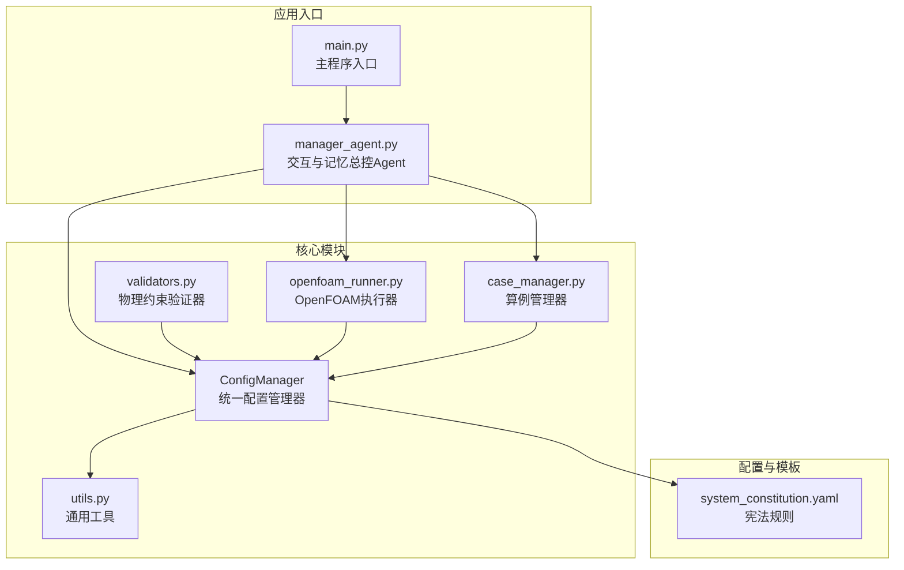
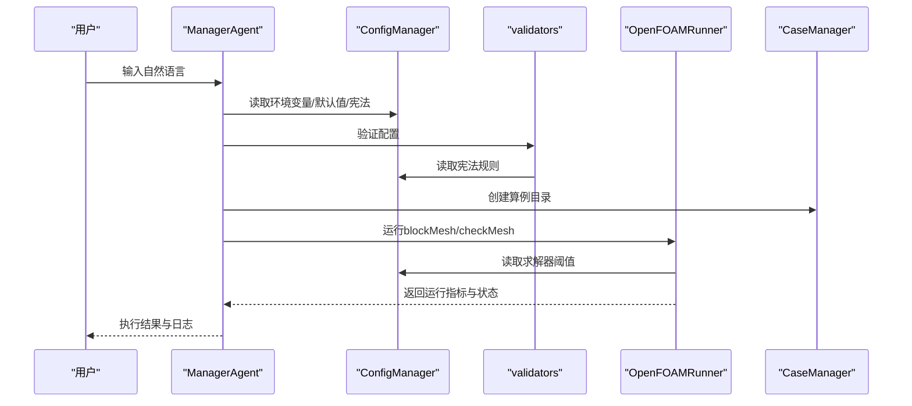
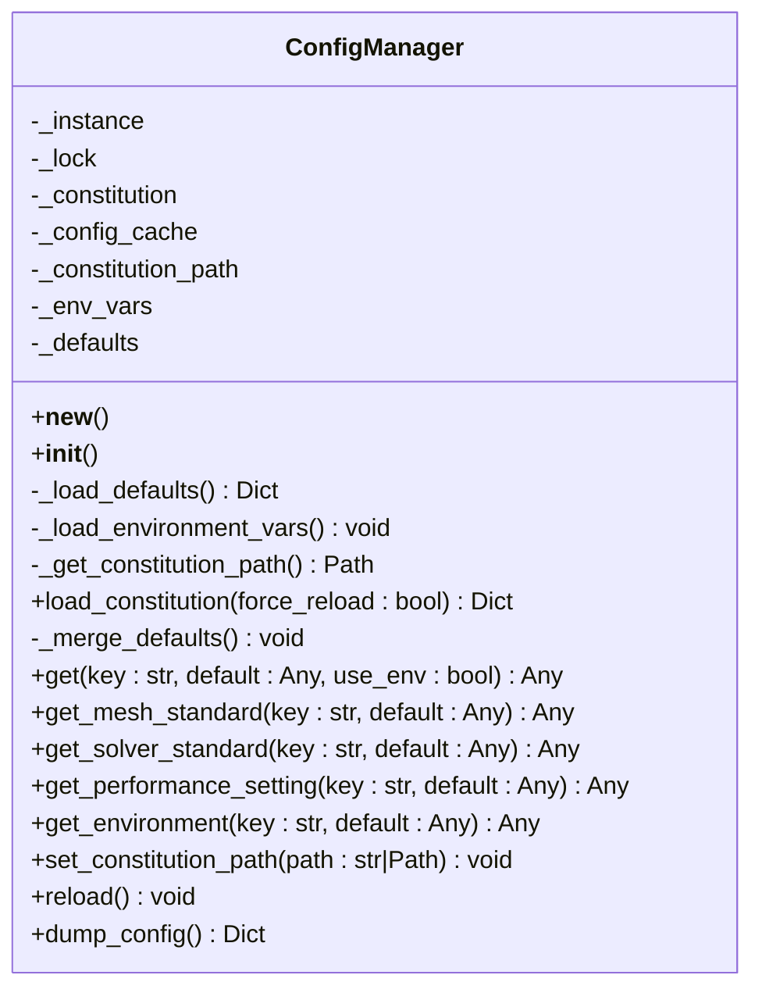
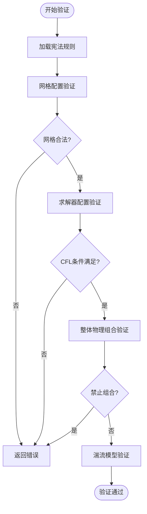
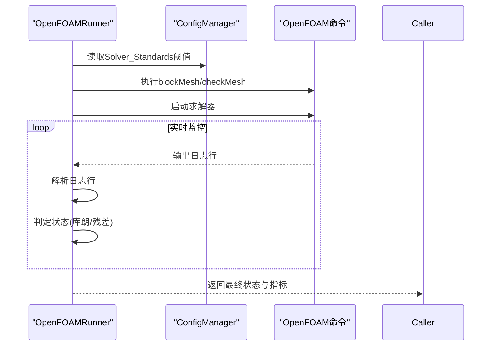
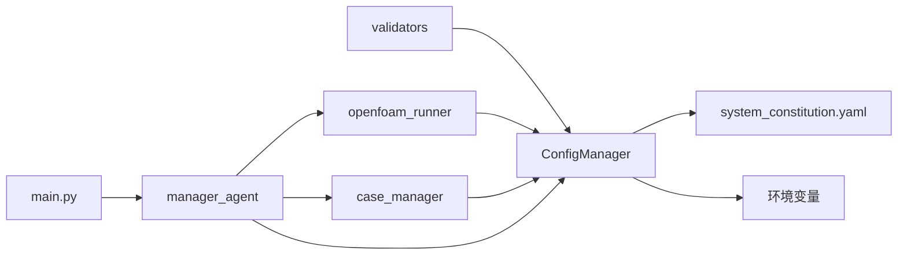

# 配置管理器

<cite>
**本文引用的文件**
- [config_manager.py](file://openfoam_ai/core/config_manager.py)
- [validators.py](file://openfoam_ai/core/validators.py)
- [system_constitution.yaml](file://openfoam_ai/config/system_constitution.yaml)
- [utils.py](file://openfoam_ai/core/utils.py)
- [main.py](file://openfoam_ai/main.py)
- [case_manager.py](file://openfoam_ai/core/case_manager.py)
- [openfoam_runner.py](file://openfoam_ai/core/openfoam_runner.py)
- [manager_agent.py](file://openfoam_ai/agents/manager_agent.py)
</cite>

## 目录
1. [简介](#简介)
2. [项目结构](#项目结构)
3. [核心组件](#核心组件)
4. [架构总览](#架构总览)
5. [详细组件分析](#详细组件分析)
6. [依赖分析](#依赖分析)
7. [性能考虑](#性能考虑)
8. [故障排除指南](#故障排除指南)
9. [结论](#结论)
10. [附录](#附录)

## 简介
本文件面向OpenFOAM AI项目的ConfigManager配置管理器，提供从架构、实现细节到使用与维护的完整技术文档。重点覆盖以下方面：
- 配置文件加载机制与缓存策略
- 配置解析流程与优先级处理
- 配置验证逻辑、参数校验规则与错误处理
- 配置模板系统、动态配置生成与运行时配置更新
- 配置文件格式规范、字段定义与默认值设置
- 与各模块的集成方式、接口设计与扩展机制
- 配置调试工具、性能优化策略与故障排除方法

## 项目结构
OpenFOAM AI采用“核心模块 + 应用入口 + 集成代理”的分层组织方式。ConfigManager位于核心层，负责统一加载与缓存“宪法”规则、环境变量与默认配置，并向其他模块提供统一访问接口。

图表来源
- [config_manager.py:1-227](file://openfoam_ai/core/config_manager.py#L1-L227)
- [validators.py:1-441](file://openfoam_ai/core/validators.py#L1-L441)
- [openfoam_runner.py:1-548](file://openfoam_ai/core/openfoam_runner.py#L1-L548)
- [case_manager.py:1-639](file://openfoam_ai/core/case_manager.py#L1-L639)
- [system_constitution.yaml:1-103](file://openfoam_ai/config/system_constitution.yaml#L1-L103)
- [utils.py:1-111](file://openfoam_ai/core/utils.py#L1-L111)
- [main.py:1-251](file://openfoam_ai/main.py#L1-L251)
- [manager_agent.py:1-458](file://openfoam_ai/agents/manager_agent.py#L1-L458)

章节来源
- [config_manager.py:1-227](file://openfoam_ai/core/config_manager.py#L1-L227)
- [system_constitution.yaml:1-103](file://openfoam_ai/config/system_constitution.yaml#L1-L103)

## 核心组件
- ConfigManager：单例配置管理器，负责加载并缓存宪法规则、读取环境变量、提供统一访问接口、支持热重载与默认值合并。
- validators：基于Pydantic的硬约束验证系统，提供网格、求解器、边界条件与整体仿真配置的验证。
- system_constitution.yaml：项目宪法，定义网格标准、求解器标准、物理约束、禁止组合、质量检查与错误处理策略等。
- openfoam_runner：封装OpenFOAM命令执行、日志捕获与运行时监控，读取宪法中的阈值用于状态判断。
- case_manager：算例生命周期管理，配合ConfigManager生成标准OpenFOAM目录结构与模板文件。
- utils：通用工具函数，提供JSON读写、目录确保、格式化大小与执行时间装饰器等。

章节来源
- [config_manager.py:16-227](file://openfoam_ai/core/config_manager.py#L16-L227)
- [validators.py:13-441](file://openfoam_ai/core/validators.py#L13-L441)
- [system_constitution.yaml:1-103](file://openfoam_ai/config/system_constitution.yaml#L1-L103)
- [openfoam_runner.py:44-548](file://openfoam_ai/core/openfoam_runner.py#L44-L548)
- [case_manager.py:27-639](file://openfoam_ai/core/case_manager.py#L27-L639)
- [utils.py:16-111](file://openfoam_ai/core/utils.py#L16-L111)

## 架构总览
ConfigManager作为统一入口，向上游模块提供配置查询能力；validators与openfoam_runner通过ConfigManager读取宪法规则，形成“宪法驱动”的验证与执行策略；case_manager在创建算例时使用ConfigManager提供的默认值与环境变量；utils为配置与文件操作提供基础能力。

图表来源
- [manager_agent.py:142-338](file://openfoam_ai/agents/manager_agent.py#L142-L338)
- [config_manager.py:94-218](file://openfoam_ai/core/config_manager.py#L94-L218)
- [validators.py:13-15](file://openfoam_ai/core/validators.py#L13-L15)
- [openfoam_runner.py:55-76](file://openfoam_ai/core/openfoam_runner.py#L55-L76)
- [case_manager.py:51-86](file://openfoam_ai/core/case_manager.py#L51-L86)

## 详细组件分析

### ConfigManager：统一配置管理器
- 单例模式与线程安全：通过锁保护实例创建与初始化，避免并发竞态。
- 配置来源与优先级：
  - 环境变量：键名转换为大写并按类型转换后优先。
  - 宪法文件：首次访问时加载，后续缓存；支持强制重载。
  - 默认值：内置默认配置，仅在宪法缺失对应键时合并。
- 访问接口：
  - get(key, default=None, use_env=True)：支持点分隔路径访问，可选择是否启用环境变量。
  - get_mesh_standard/get_solver_standard/get_performance_setting：便捷访问特定命名空间。
  - get_environment：访问环境变量缓存。
  - reload/set_constitution_path：热重载与路径切换。
- 缓存策略：宪法文件缓存于内存，强制重载时清空并重新加载；环境变量每reload刷新。
- 调试接口：dump_config导出当前全部配置，便于诊断。

图表来源
- [config_manager.py:16-227](file://openfoam_ai/core/config_manager.py#L16-L227)

章节来源
- [config_manager.py:16-227](file://openfoam_ai/core/config_manager.py#L16-L227)

### system_constitution.yaml：宪法规则与默认值
- 结构与命名空间：
  - Core_Directives：核心指令（用于指导AI生成合理配置）。
  - Mesh_Standards：网格标准（最小网格数、最大长宽比、边界层增长等）。
  - Solver_Standards：求解器标准（库朗数限制、收敛阈值、松弛因子等）。
  - Validation_Requirements：验证要求（质量/能量守恒容差等）。
  - Physical_Constraints：物理参数范围（粘度、密度、雷诺/普朗特数范围）。
  - Prohibited_Combinations：禁止组合（求解器与物理类型的禁配）。
  - Quality_Checks：运行前后质量检查清单。
  - Error_Handling：错误处理策略（网格质量、发散、收敛停滞等）。
- 默认值来源：ConfigManager内置默认值与宪法合并，确保关键阈值可用。
- 字段定义与默认值：
  - 网格：min_cells_2d、min_cells_3d、max_aspect_ratio、min_cells_per_direction等。
  - 求解器：min_convergence_residual、max_courant_explicit、max_courant_implicit、divergence_threshold、courant_limit_general等。
  - 性能：max_parallel_threads、memory_limit_gb、timeout_hours等。

章节来源
- [system_constitution.yaml:1-103](file://openfoam_ai/config/system_constitution.yaml#L1-L103)
- [config_manager.py:51-72](file://openfoam_ai/core/config_manager.py#L51-L72)

### validators：物理约束验证器
- 验证层次：
  - MeshConfig：网格分辨率与长宽比、总网格数检查。
  - SolverConfig：时间范围、时间步长、CFL条件（基于宪法阈值估算）。
  - BoundaryCondition：边界类型与值的匹配。
  - SimulationConfig：整体配置的物理组合合法性、湍流模型选择、物理参数范围。
  - PhysicsValidator：后处理阶段的质量/能量守恒与边界兼容性检查。
- 与ConfigManager集成：
  - 通过load_constitution从ConfigManager获取宪法规则，避免重复加载。
  - 使用宪法中的阈值进行硬约束判断（如CFL、收敛阈值、禁止组合）。
- 错误处理：
  - 根据宪法规则抛出异常或发出警告，便于上层Agent决策与提示。

图表来源
- [validators.py:13-441](file://openfoam_ai/core/validators.py#L13-L441)
- [config_manager.py:94-119](file://openfoam_ai/core/config_manager.py#L94-L119)

章节来源
- [validators.py:13-441](file://openfoam_ai/core/validators.py#L13-L441)

### openfoam_runner：运行时监控与阈值读取
- 阈值来源：从宪法读取Solver_Standards中的阈值，用于运行时状态判断（库朗数、发散阈值、收敛目标）。
- 运行流程：执行blockMesh/checkMesh，启动求解器并实时解析日志，产出SolverMetrics并判定状态（运行/发散/收敛/停滞/完成/错误）。
- 错误处理：捕获命令未找到、权限不足、日志解码错误等异常，保证稳定性。

图表来源
- [openfoam_runner.py:55-76](file://openfoam_ai/core/openfoam_runner.py#L55-L76)
- [openfoam_runner.py:99-198](file://openfoam_ai/core/openfoam_runner.py#L99-L198)
- [config_manager.py:183-193](file://openfoam_ai/core/config_manager.py#L183-L193)

章节来源
- [openfoam_runner.py:44-548](file://openfoam_ai/core/openfoam_runner.py#L44-L548)

### case_manager：模板与动态配置生成
- 创建标准OpenFOAM算例目录结构（0、constant、system、logs），并生成blockMeshDict、controlDict、fvSchemes、fvSolution、初始场与transportProperties等模板文件。
- 与ConfigManager协作：使用环境变量与默认值填充模板参数，确保生成的配置符合宪法与性能要求。
- 算例信息管理：通过.json文件记录算例元数据，支持状态更新与清理。

章节来源
- [case_manager.py:27-639](file://openfoam_ai/core/case_manager.py#L27-L639)

### utils：通用工具与调试辅助
- JSON读写：save_json/load_json，带日志与异常处理。
- 目录确保：ensure_directory，自动创建缺失目录。
- 格式化大小：format_size，便于显示文件大小。
- 执行时间装饰器：log_execution_time，用于性能分析与调试。

章节来源
- [utils.py:16-111](file://openfoam_ai/core/utils.py#L16-L111)

## 依赖分析
- ConfigManager依赖system_constitution.yaml与环境变量，向上提供统一访问接口。
- validators依赖ConfigManager加载宪法，形成“宪法驱动”的验证体系。
- openfoam_runner依赖ConfigManager读取阈值，结合日志解析实现运行时监控。
- case_manager依赖ConfigManager的默认值与环境变量，生成标准化模板。
- main与manager_agent作为入口，协调各模块工作流。

图表来源
- [config_manager.py:94-218](file://openfoam_ai/core/config_manager.py#L94-L218)
- [validators.py:13-15](file://openfoam_ai/core/validators.py#L13-L15)
- [openfoam_runner.py:55-76](file://openfoam_ai/core/openfoam_runner.py#L55-L76)
- [case_manager.py:51-86](file://openfoam_ai/core/case_manager.py#L51-L86)
- [main.py:19-22](file://openfoam_ai/main.py#L19-L22)
- [manager_agent.py:12-16](file://openfoam_ai/agents/manager_agent.py#L12-L16)

章节来源
- [config_manager.py:94-218](file://openfoam_ai/core/config_manager.py#L94-L218)
- [validators.py:13-15](file://openfoam_ai/core/validators.py#L13-L15)
- [openfoam_runner.py:55-76](file://openfoam_ai/core/openfoam_runner.py#L55-L76)
- [case_manager.py:51-86](file://openfoam_ai/core/case_manager.py#L51-L86)
- [main.py:19-22](file://openfoam_ai/main.py#L19-L22)
- [manager_agent.py:12-16](file://openfoam_ai/agents/manager_agent.py#L12-L16)

## 性能考虑
- 缓存策略：宪法文件与环境变量缓存，避免重复I/O与解析开销；强制重载时清空缓存并重建。
- 线程安全：使用可重入锁保护单例创建与配置更新，适合多线程场景。
- 日志解析：实时解析日志行，按需判定状态，减少不必要的中间存储。
- 默认值合并：仅在宪法缺失键时合并，默认值来自ConfigManager内置配置，降低验证成本。
- I/O优化：utils提供安全的JSON读写与目录确保，减少异常与重试开销。

[本节为通用性能讨论，无需列出具体文件来源]

## 故障排除指南
- 宪法文件加载失败：
  - 现象：警告日志提示无法加载宪法文件，返回空配置。
  - 处理：检查system_constitution.yaml路径与权限；使用reload强制重载；必要时设置自定义路径。
- 环境变量未生效：
  - 现象：get(key)返回默认值而非期望的环境变量。
  - 处理：确认环境变量名与ConfigManager转换规则一致（点转下划线、大写）；检查类型转换逻辑。
- 验证失败：
  - 现象：validators抛出异常或输出警告。
  - 处理：根据错误信息调整网格分辨率、时间步长、求解器类型或物理参数；参考宪法中的阈值与禁止组合。
- 运行时发散或停滞：
  - 现象：OpenFOAMRunner判定发散/停滞状态。
  - 处理：减小时间步长、调整松弛因子、细化网格或更换求解器；参考宪法中的阈值与错误处理策略。
- 算例生成异常：
  - 现象：case_manager创建失败或模板文件缺失。
  - 处理：检查默认值与环境变量；确认目录权限；使用utils.ensure_directory确保目录存在。

章节来源
- [config_manager.py:113-115](file://openfoam_ai/core/config_manager.py#L113-L115)
- [validators.py:406-410](file://openfoam_ai/core/validators.py#L406-L410)
- [openfoam_runner.py:127-142](file://openfoam_ai/core/openfoam_runner.py#L127-L142)
- [case_manager.py:242-261](file://openfoam_ai/core/case_manager.py#L242-L261)

## 结论
ConfigManager通过“宪法驱动”的配置体系，实现了对OpenFOAM AI各模块的统一约束与协同。其缓存与热重载机制提升了性能与灵活性；validators与openfoam_runner基于宪法阈值的验证与监控保障了仿真质量与稳定性；case_manager与utils提供了完善的模板生成与文件管理能力。整体架构清晰、扩展性强，适合在复杂工程场景中持续演进。

[本节为总结性内容，无需列出具体文件来源]

## 附录

### 配置文件格式规范与字段定义
- system_constitution.yaml字段与含义（节选）：
  - Mesh_Standards：min_cells_2d、min_cells_3d、max_aspect_ratio、min_cells_per_direction、y_plus_target_*、boundary_layer_growth_rate。
  - Solver_Standards：min_convergence_residual、max_courant_explicit、max_courant_implicit、relaxation_factor_*、default_write_interval、divergence_threshold、courant_limit_general。
  - Validation_Requirements：mass_conservation_tolerance、energy_conservation_tolerance、force_balance_tolerance。
  - Physical_Constraints：min_reynolds_number、max_reynolds_number、min_prandtl_number、max_prandtl_number、kinematic_viscosity范围、density范围。
  - Prohibited_Combinations：solver/physics/turbulence_model等禁止组合及其原因。
  - Quality_Checks：pre_run/during_run/post_run检查清单。
  - Error_Handling：mesh_quality_fail/divergence_detected/convergence_stall等策略。

章节来源
- [system_constitution.yaml:13-103](file://openfoam_ai/config/system_constitution.yaml#L13-L103)

### 默认值设置
- ConfigManager内置默认值（节选）：
  - mesh：min_cells_2d、min_cells_3d、min_cells_per_direction、max_aspect_ratio、max_non_orthogonality。
  - solver：courant_limit_general、divergence_threshold、min_convergence_residual、max_cells_per_core。
  - performance：max_parallel_threads、memory_limit_gb、timeout_hours。
- 合并策略：仅在宪法缺失对应键时合并，保留宪法优先。

章节来源
- [config_manager.py:51-72](file://openfoam_ai/core/config_manager.py#L51-L72)
- [config_manager.py:121-134](file://openfoam_ai/core/config_manager.py#L121-L134)

### 配置优先级与继承关系
- 优先级顺序：环境变量 > 宪法配置 > 默认值。
- 继承与合并：宪法与默认值采用深度合并，仅在目标缺失时填充默认值。
- 运行时更新：通过reload刷新环境变量与宪法缓存；set_constitution_path支持自定义路径。

章节来源
- [config_manager.py:148-181](file://openfoam_ai/core/config_manager.py#L148-L181)
- [config_manager.py:205-210](file://openfoam_ai/core/config_manager.py#L205-L210)
- [config_manager.py:121-134](file://openfoam_ai/core/config_manager.py#L121-L134)

### 配置模板系统与动态生成
- 模板生成：case_manager在创建算例时生成标准OpenFOAM文件（blockMeshDict、controlDict、fvSchemes、fvSolution、初始场、transportProperties）。
- 参数注入：使用ConfigManager的默认值与环境变量填充模板参数，确保配置合规。
- 扩展机制：可通过新增模板文件与参数映射扩展生成逻辑。

章节来源
- [case_manager.py:265-622](file://openfoam_ai/core/case_manager.py#L265-L622)

### 与各模块的集成方式与接口设计
- ConfigManager对外接口：
  - get、get_mesh_standard、get_solver_standard、get_performance_setting、get_environment、reload、set_constitution_path、dump_config。
- 集成点：
  - validators：通过load_constitution读取宪法。
  - openfoam_runner：读取Solver_Standards阈值。
  - case_manager：读取默认值与环境变量。
  - main/manager_agent：协调流程与状态管理。

章节来源
- [config_manager.py:136-218](file://openfoam_ai/core/config_manager.py#L136-L218)
- [validators.py:13-15](file://openfoam_ai/core/validators.py#L13-L15)
- [openfoam_runner.py:55-76](file://openfoam_ai/core/openfoam_runner.py#L55-L76)
- [case_manager.py:51-86](file://openfoam_ai/core/case_manager.py#L51-L86)
- [main.py:19-22](file://openfoam_ai/main.py#L19-L22)
- [manager_agent.py:12-16](file://openfoam_ai/agents/manager_agent.py#L12-L16)

### 配置调试工具与最佳实践
- 调试工具：
  - dump_config：导出宪法、环境变量与默认值，便于诊断。
  - utils.log_execution_time：装饰器记录函数执行时间。
- 最佳实践：
  - 在开发模式下使用reload进行热重载。
  - 通过环境变量快速覆盖关键参数。
  - 使用validators在生成配置后立即验证。
  - 在运行前执行checkMesh并关注网格质量指标。

章节来源
- [config_manager.py:212-218](file://openfoam_ai/core/config_manager.py#L212-L218)
- [utils.py:97-111](file://openfoam_ai/core/utils.py#L97-L111)