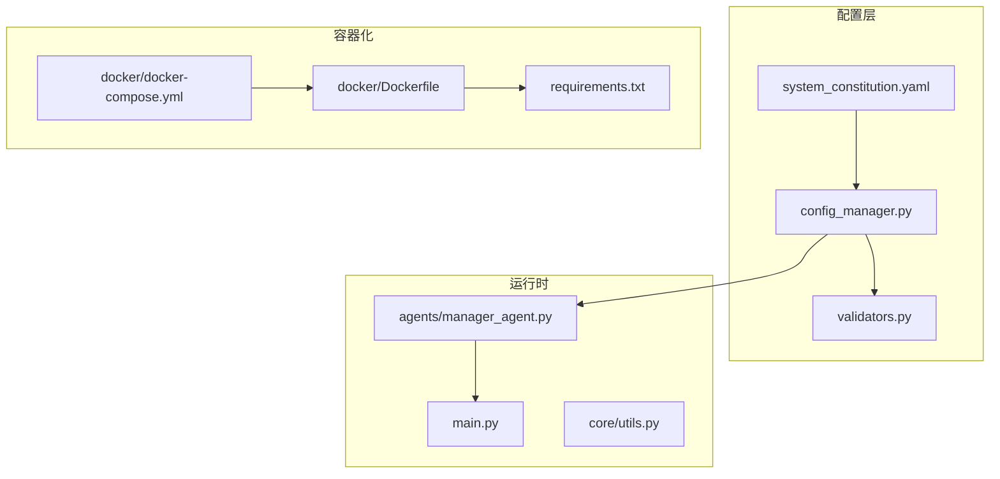
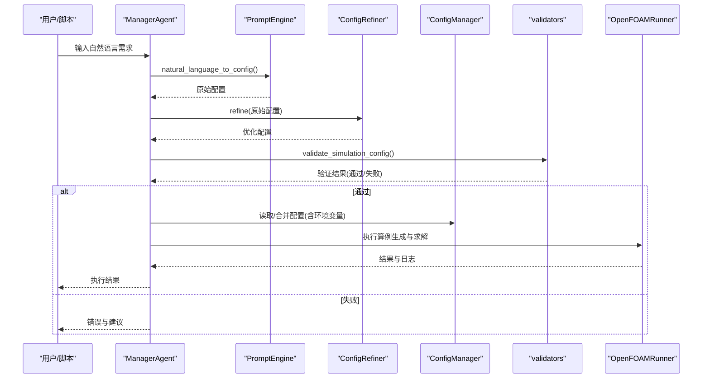
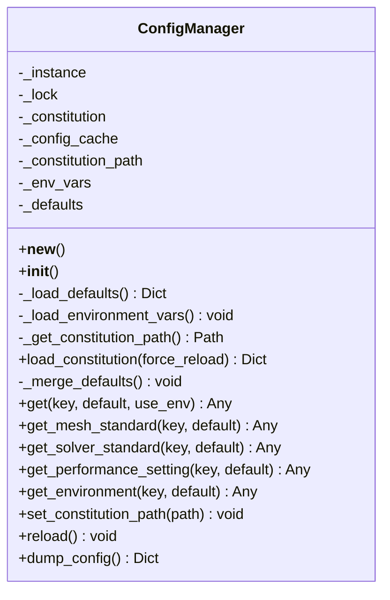
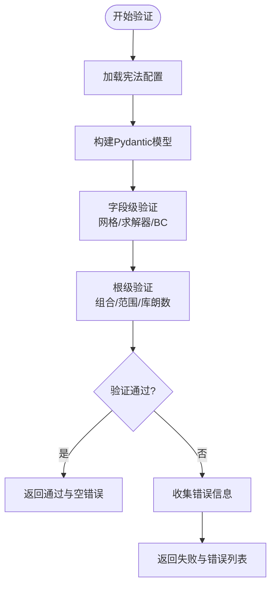
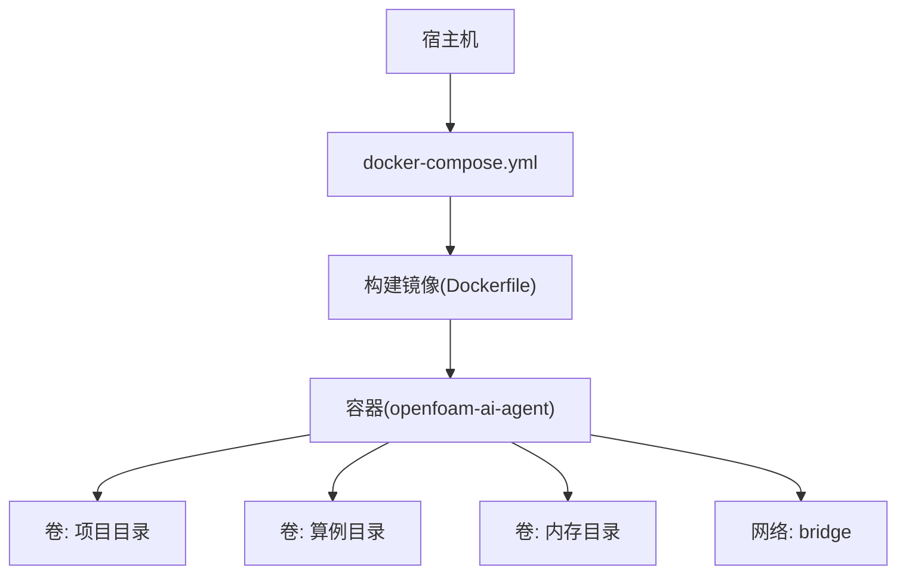
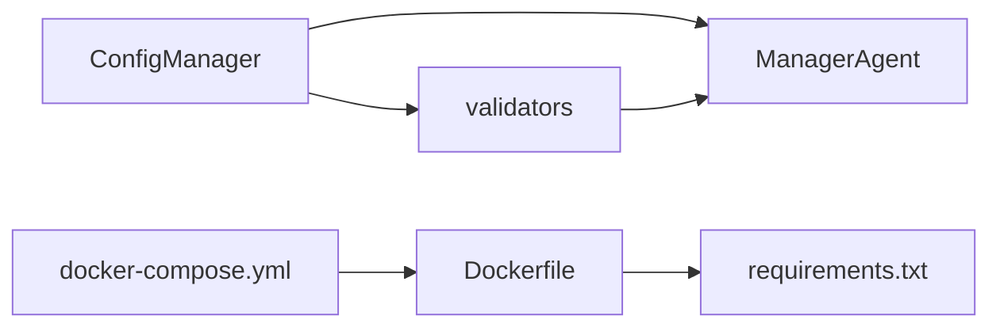

# 配置管理系统

<cite>
**本文引用的文件**
- [system_constitution.yaml](file://openfoam_ai/config/system_constitution.yaml)
- [config_manager.py](file://openfoam_ai/core/config_manager.py)
- [validators.py](file://openfoam_ai/core/validators.py)
- [requirements.txt](file://openfoam_ai/requirements.txt)
- [Dockerfile](file://openfoam_ai/docker/Dockerfile)
- [docker-compose.yml](file://openfoam_ai/docker/docker-compose.yml)
- [utils.py](file://openfoam_ai/core/utils.py)
- [main.py](file://openfoam_ai/main.py)
- [manager_agent.py](file://openfoam_ai/agents/manager_agent.py)
- [demo_full_workflow.py](file://demo_full_workflow.py)
</cite>

## 目录
1. [简介](#简介)
2. [项目结构](#项目结构)
3. [核心组件](#核心组件)
4. [架构总览](#架构总览)
5. [详细组件分析](#详细组件分析)
6. [依赖分析](#依赖分析)
7. [性能考虑](#性能考虑)
8. [故障排查指南](#故障排查指南)
9. [结论](#结论)
10. [附录](#附录)

## 简介
本文件面向OpenFOAM AI的配置管理系统，系统性阐述如下内容：
- system_constitution.yaml的项目宪法设计、核心约束规则与质量标准定义
- ConfigManager的配置加载机制、验证逻辑与优先级处理
- requirements.txt的依赖管理策略、版本控制与环境隔离
- Docker部署配置的容器化策略、服务编排与环境一致性保证
- 配置文件的格式规范、参数说明与默认值设置
- 配置验证规则、错误处理策略与调试方法
- 面向开发者的配置定制与扩展指导

## 项目结构
OpenFOAM AI的配置相关文件分布于以下模块：
- 配置宪法：openfoam_ai/config/system_constitution.yaml
- 配置管理：openfoam_ai/core/config_manager.py
- 验证器：openfoam_ai/core/validators.py
- 依赖清单：openfoam_ai/requirements.txt
- 容器化：openfoam_ai/docker/Dockerfile、openfoam_ai/docker/docker-compose.yml
- 工具函数：openfoam_ai/core/utils.py
- 应用入口：openfoam_ai/main.py
- 管理Agent：openfoam_ai/agents/manager_agent.py
- 使用示例：demo_full_workflow.py

图表来源
- [system_constitution.yaml:1-103](file://openfoam_ai/config/system_constitution.yaml#L1-L103)
- [config_manager.py:1-227](file://openfoam_ai/core/config_manager.py#L1-L227)
- [validators.py:1-441](file://openfoam_ai/core/validators.py#L1-L441)
- [Dockerfile:1-52](file://openfoam_ai/docker/Dockerfile#L1-L52)
- [docker-compose.yml:1-46](file://openfoam_ai/docker/docker-compose.yml#L1-L46)
- [requirements.txt:1-40](file://openfoam_ai/requirements.txt#L1-L40)
- [utils.py:1-111](file://openfoam_ai/core/utils.py#L1-L111)
- [main.py:1-251](file://openfoam_ai/main.py#L1-L251)
- [manager_agent.py:1-458](file://openfoam_ai/agents/manager_agent.py#L1-L458)

章节来源
- [system_constitution.yaml:1-103](file://openfoam_ai/config/system_constitution.yaml#L1-L103)
- [config_manager.py:1-227](file://openfoam_ai/core/config_manager.py#L1-L227)
- [validators.py:1-441](file://openfoam_ai/core/validators.py#L1-L441)
- [requirements.txt:1-40](file://openfoam_ai/requirements.txt#L1-L40)
- [Dockerfile:1-52](file://openfoam_ai/docker/Dockerfile#L1-L52)
- [docker-compose.yml:1-46](file://openfoam_ai/docker/docker-compose.yml#L1-L46)
- [utils.py:1-111](file://openfoam_ai/core/utils.py#L1-L111)
- [main.py:1-251](file://openfoam_ai/main.py#L1-L251)
- [manager_agent.py:1-458](file://openfoam_ai/agents/manager_agent.py#L1-L458)

## 核心组件
- 项目宪法（system_constitution.yaml）
  - 定义Core_Directives、Mesh_Standards、Solver_Standards、Validation_Requirements、Physical_Constraints、Prohibited_Combinations、Quality_Checks、Error_Handling、Documentation_Requirements等九大部分，作为配置生成与验证的权威约束来源。
- 配置管理器（ConfigManager）
  - 单例模式，负责加载宪法、合并默认值、读取环境变量、提供统一访问接口、支持热重载与调试导出。
- 验证器（validators.py）
  - 基于Pydantic的硬约束验证系统，覆盖网格、求解器、边界条件与整体仿真配置，并提供后处理阶段的物理一致性校验。
- 容器化与依赖（Dockerfile、docker-compose.yml、requirements.txt）
  - 统一Python运行时、系统依赖与OpenFOAM环境；通过compose挂载卷与资源限制保障一致性与可复现性。

章节来源
- [system_constitution.yaml:1-103](file://openfoam_ai/config/system_constitution.yaml#L1-L103)
- [config_manager.py:16-227](file://openfoam_ai/core/config_manager.py#L16-L227)
- [validators.py:1-441](file://openfoam_ai/core/validators.py#L1-L441)
- [requirements.txt:1-40](file://openfoam_ai/requirements.txt#L1-L40)
- [Dockerfile:1-52](file://openfoam_ai/docker/Dockerfile#L1-L52)
- [docker-compose.yml:1-46](file://openfoam_ai/docker/docker-compose.yml#L1-L46)

## 架构总览
配置系统围绕“宪法—配置—验证—执行”的闭环展开：
- 宪法文件提供硬性约束与质量标准
- 配置管理器统一加载与合并配置，支持环境变量覆盖
- 验证器在配置生成后进行强约束校验
- 执行阶段由Agent协调，结合工具函数与运行器完成算例生成与求解

图表来源
- [manager_agent.py:142-200](file://openfoam_ai/agents/manager_agent.py#L142-L200)
- [validators.py:389-411](file://openfoam_ai/core/validators.py#L389-L411)
- [config_manager.py:136-182](file://openfoam_ai/core/config_manager.py#L136-L182)
- [main.py:175-200](file://openfoam_ai/main.py#L175-L200)

## 详细组件分析

### 项目宪法（system_constitution.yaml）
- 设计要点
  - 采用YAML结构化定义九大部分，涵盖核心指令、网格标准、求解器标准、验证要求、物理约束、禁止组合、质量检查、错误处理与文档要求。
  - 为验证器提供权威数据源，确保生成配置符合工程实践与数值稳定性要求。
- 关键域说明
  - Core_Directives：防止AI生成不合理的工程方案（如用二维网格替代三维真实网格、忽略能量守恒等）。
  - Mesh_Standards：最小网格数、长宽比、非正交性、边界层增长、y+目标等。
  - Solver_Standards：收敛阈值、库朗数限制、松弛因子、写入间隔、发散阈值等。
  - Validation_Requirements：质量守恒、能量守恒、力平衡容差。
  - Physical_Constraints：雷诺数、普朗特数、运动粘度、密度范围。
  - Prohibited_Combinations：求解器与物理类型/湍流模型的禁用组合。
  - Quality_Checks：运行前后质量检查清单。
  - Error_Handling：网格质量失败、发散检测、收敛停滞的自动处理策略。
  - Documentation_Requirements：算例文档与结果记录要求。
- 默认值与扩展
  - 宪法文件缺失的键值可通过ConfigManager的默认配置进行回退，保证系统可用性。

章节来源
- [system_constitution.yaml:1-103](file://openfoam_ai/config/system_constitution.yaml#L1-L103)

### ConfigManager（配置管理器）
- 单例与线程安全
  - 使用RLock保护实例创建与配置更新，避免并发竞态。
- 加载与合并策略
  - 首次访问时加载宪法文件，若失败则记录警告并回退为空配置；随后与内置默认配置进行深度合并，保留宪法优先。
- 环境变量优先级
  - get()支持点分路径访问；当use_env为真时，优先读取与键对应的环境变量（自动类型转换：布尔、整数、浮点、字符串）。
- 访问接口
  - 提供get_mesh_standard、get_solver_standard、get_performance_setting、get_environment等便捷方法。
- 热重载与调试
  - reload()强制重新加载宪法与环境变量；dump_config()导出当前配置快照，便于调试。

图表来源
- [config_manager.py:16-227](file://openfoam_ai/core/config_manager.py#L16-L227)

章节来源
- [config_manager.py:16-227](file://openfoam_ai/core/config_manager.py#L16-L227)

### 验证器（validators.py）
- Pydantic模型与约束
  - MeshConfig：网格分辨率、几何尺寸、长宽比与总网格数校验。
  - SolverConfig：求解器名称、时间范围、时间步长、写入间隔与库朗数估计。
  - BoundaryCondition：边界类型与值的合法性。
  - SimulationConfig：整体配置的物理组合验证、湍流模型校验、物理参数范围检查。
- 运行期物理一致性校验
  - PhysicsValidator：质量守恒、能量守恒、边界兼容性检查（简化实现，示意流程）。
- 验证流程
  - validate_simulation_config()作为入口，捕获异常并返回错误列表；通过宪法中的禁止组合与物理约束进行强约束。

图表来源
- [validators.py:18-275](file://openfoam_ai/core/validators.py#L18-L275)

章节来源
- [validators.py:1-441](file://openfoam_ai/core/validators.py#L1-L441)

### 依赖管理（requirements.txt）
- 依赖分类
  - LLM框架：langchain、langchain-openai、openai
  - 向量数据库：chromadb、faiss-cpu
  - 科学计算：numpy、scipy、pandas、matplotlib
  - 数据验证：pydantic
  - OpenFOAM接口：PyFoam
  - 后处理：pyvista、vtk
  - Web UI：gradio、streamlit
  - 开发工具：pyyaml、python-dotenv、tqdm、pytest、black、mypy
- 版本控制与环境隔离
  - 通过容器内pip安装固定版本依赖，结合compose卷映射实现宿主机与容器环境的一致性与隔离。

章节来源
- [requirements.txt:1-40](file://openfoam_ai/requirements.txt#L1-L40)

### Docker部署配置
- Dockerfile
  - 基于OpenFOAM官方镜像，安装Python3.10与系统依赖，升级pip，复制requirements.txt并安装，复制项目代码，设置环境变量（PYTHONPATH、FOAM_USER_LIBBIN、FOAM_USER_APPBIN），切换到openfoam用户，设置工作目录与默认命令。
- docker-compose.yml
  - 构建镜像并命名为openfoam-ai:latest，设置容器名，注入环境变量（如OPENAI_API_KEY），挂载项目目录与算例/内存目录，设置工作目录，开启TTY/STDIN保持容器运行，配置CPU与内存资源限制，定义bridge网络。

图表来源
- [Dockerfile:1-52](file://openfoam_ai/docker/Dockerfile#L1-L52)
- [docker-compose.yml:1-46](file://openfoam_ai/docker/docker-compose.yml#L1-L46)

章节来源
- [Dockerfile:1-52](file://openfoam_ai/docker/Dockerfile#L1-L52)
- [docker-compose.yml:1-46](file://openfoam_ai/docker/docker-compose.yml#L1-L46)

### 配置使用与集成示例
- 管理Agent在创建算例前调用LLM生成配置，再经ConfigRefiner优化，随后通过validators进行强约束验证，最后由OpenFOAMRunner执行。
- demo_full_workflow.py展示了从自然语言到配置生成、优化、验证、算例创建的完整流程。

章节来源
- [manager_agent.py:142-200](file://openfoam_ai/agents/manager_agent.py#L142-L200)
- [demo_full_workflow.py:100-226](file://demo_full_workflow.py#L100-L226)

## 依赖分析
- 组件耦合
  - ConfigManager与validators紧密耦合：validators通过ConfigManager加载宪法数据；ConfigManager与Agent/Runner解耦，通过统一接口提供配置。
  - Dockerfile与requirements.txt强关联：容器内安装requirements.txt声明的依赖。
- 外部依赖
  - OpenFOAM运行环境（通过基础镜像提供）
  - LLM服务（通过环境变量OPENAI_API_KEY等接入）

图表来源
- [config_manager.py:16-227](file://openfoam_ai/core/config_manager.py#L16-L227)
- [validators.py:1-441](file://openfoam_ai/core/validators.py#L1-L441)
- [manager_agent.py:1-458](file://openfoam_ai/agents/manager_agent.py#L1-L458)
- [Dockerfile:1-52](file://openfoam_ai/docker/Dockerfile#L1-L52)
- [docker-compose.yml:1-46](file://openfoam_ai/docker/docker-compose.yml#L1-L46)
- [requirements.txt:1-40](file://openfoam_ai/requirements.txt#L1-L40)

## 性能考虑
- 配置加载与缓存
  - ConfigManager对宪法文件进行缓存，避免重复IO；仅在force_reload或路径变更时重新加载。
- 环境变量覆盖
  - 通过环境变量快速覆盖关键参数（如OpenFOAM路径、并行核数、调试模式），无需修改宪法文件。
- 并行与资源限制
  - compose中限制容器CPU与内存，避免资源争抢影响仿真稳定性。
- I/O与日志
  - utils提供统一日志格式，便于定位性能瓶颈与问题根因。

章节来源
- [config_manager.py:94-120](file://openfoam_ai/core/config_manager.py#L94-L120)
- [docker-compose.yml:29-38](file://openfoam_ai/docker/docker-compose.yml#L29-L38)
- [utils.py:11-13](file://openfoam_ai/core/utils.py#L11-L13)

## 故障排查指南
- 宪法文件加载失败
  - 现象：加载警告，配置为空
  - 处理：检查system_constitution.yaml路径与权限；使用reload()重载；通过dump_config()导出当前配置快照
- 配置验证失败
  - 现象：validators抛出异常，返回错误列表
  - 处理：根据错误提示调整网格、求解器、边界条件或物理参数；参考宪法中的禁止组合与物理约束
- 环境变量未生效
  - 现象：get()返回默认值而非期望值
  - 处理：确认环境变量命名（点分路径转为大写下划线）、类型转换；检查compose或shell环境
- 容器内OpenFOAM不可用
  - 现象：main.py检测OpenFOAM失败
  - 处理：确认Dockerfile基础镜像与用户切换；检查容器内PATH与FOAM_*环境变量

章节来源
- [config_manager.py:104-119](file://openfoam_ai/core/config_manager.py#L104-L119)
- [validators.py:389-411](file://openfoam_ai/core/validators.py#L389-L411)
- [main.py:230-239](file://openfoam_ai/main.py#L230-L239)
- [docker-compose.yml:12-14](file://openfoam_ai/docker/docker-compose.yml#L12-L14)

## 结论
OpenFOAM AI的配置管理系统以system_constitution.yaml为权威约束，通过ConfigManager统一加载与合并配置，借助validators实现强约束与物理一致性校验，并以Docker与compose确保环境一致性与可复现性。该体系为开发者提供了清晰的配置定制与扩展路径，既保障工程安全，又提升自动化效率。

## 附录

### 配置文件格式规范与参数说明
- system_constitution.yaml
  - 结构：九大部分（Core_Directives、Mesh_Standards、Solver_Standards、Validation_Requirements、Physical_Constraints、Prohibited_Combinations、Quality_Checks、Error_Handling、Documentation_Requirements）
  - 参数示例：网格最小单元数、长宽比上限、库朗数限制、收敛阈值、物理参数范围、禁止组合规则等
- ConfigManager.get()访问路径
  - 支持点分路径（如“Mesh_Standards.min_cells_2d”）；当use_env为真时，键名转为大写下划线（如“MESH_STANDARDS_MIN_CELLS_2D”）
- 默认值
  - 当宪法文件缺失键时，ConfigManager使用内置默认配置进行回退

章节来源
- [system_constitution.yaml:1-103](file://openfoam_ai/config/system_constitution.yaml#L1-L103)
- [config_manager.py:136-182](file://openfoam_ai/core/config_manager.py#L136-L182)

### 开发者定制与扩展指导
- 定制宪法
  - 在system_constitution.yaml中新增或调整约束；注意与validators的字段/键保持一致
- 扩展验证器
  - 在validators.py中新增Pydantic模型或root_validator，读取宪法数据进行强约束
- 环境变量扩展
  - 在config_manager.py中扩展_get_constitution_path()与_load_environment_vars()，并在get()中处理新键
- 容器化扩展
  - 在Dockerfile中添加系统依赖或应用二进制；在docker-compose.yml中新增卷或环境变量

章节来源
- [system_constitution.yaml:1-103](file://openfoam_ai/config/system_constitution.yaml#L1-L103)
- [config_manager.py:74-83](file://openfoam_ai/core/config_manager.py#L74-L83)
- [validators.py:1-441](file://openfoam_ai/core/validators.py#L1-L441)
- [Dockerfile:8-26](file://openfoam_ai/docker/Dockerfile#L8-L26)
- [docker-compose.yml:11-21](file://openfoam_ai/docker/docker-compose.yml#L11-L21)