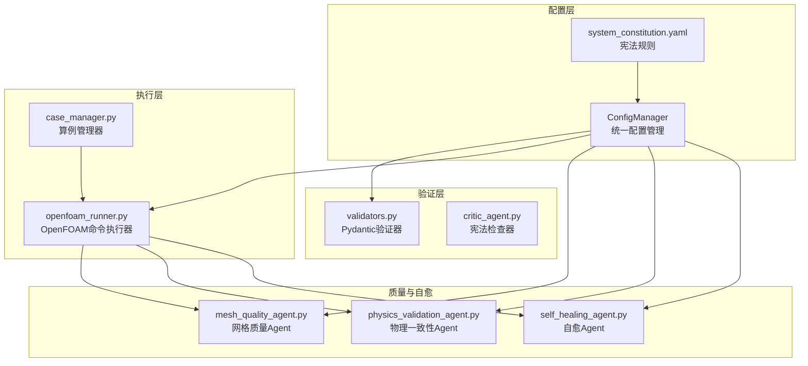
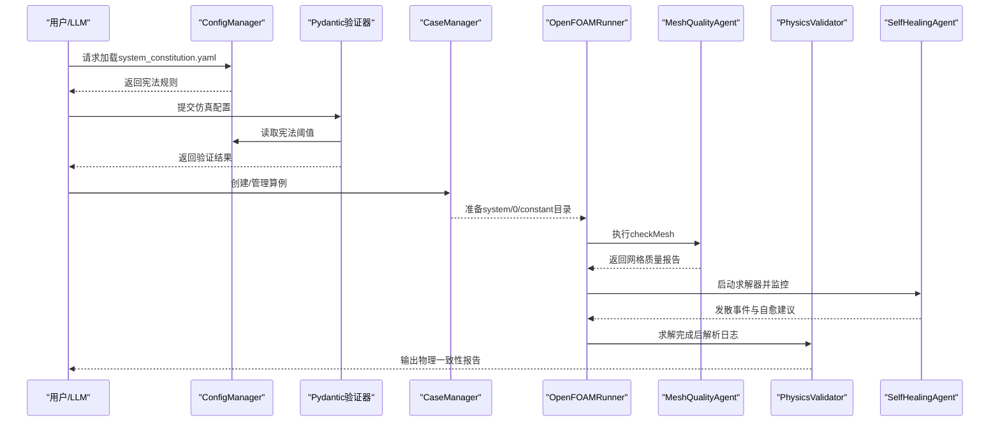
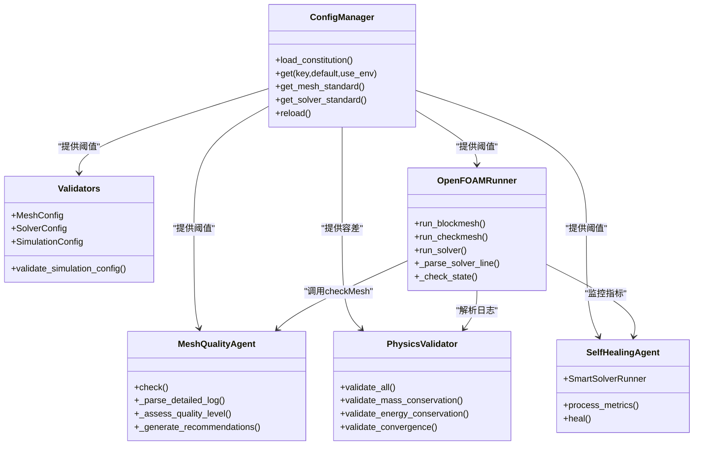

# 项目宪法系统

<cite>
**本文档引用的文件**
- [system_constitution.yaml](file://openfoam_ai/config/system_constitution.yaml)
- [config_manager.py](file://openfoam_ai/core/config_manager.py)
- [validators.py](file://openfoam_ai/core/validators.py)
- [openfoam_runner.py](file://openfoam_ai/core/openfoam_runner.py)
- [mesh_quality_agent.py](file://openfoam_ai/agents/mesh_quality_agent.py)
- [physics_validation_agent.py](file://openfoam_ai/agents/physics_validation_agent.py)
- [self_healing_agent.py](file://openfoam_ai/agents/self_healing_agent.py)
- [case_manager.py](file://openfoam_ai/core/case_manager.py)
- [.case_info.json](file://demo_cases/demo_case/.case_info.json)
</cite>

## 目录
1. [简介](#简介)
2. [项目结构](#项目结构)
3. [核心组件](#核心组件)
4. [架构总览](#架构总览)
5. [详细组件分析](#详细组件分析)
6. [依赖关系分析](#依赖关系分析)
7. [性能考虑](#性能考虑)
8. [故障排除指南](#故障排除指南)
9. [结论](#结论)
10. [附录](#附录)

## 简介
本文件为OpenFOAM AI项目“宪法系统”的技术文档，围绕system_constitution.yaml中的核心约束规则展开，系统阐述其设计理念、数学表达、物理意义与工程应用场景，并结合代码实现说明配置优先级、冲突解决与自适应调整机制。文档覆盖以下规则类别：
- Core_Directives：安全准则
- Mesh_Standards：网格质量标准
- Solver_Standards：求解器参数限制
- Physical_Constraints：物理参数范围
- Prohibited_Combinations：配置禁止组合
- Quality_Checks：质量检查流程
- Error_Handling：错误处理策略
- Documentation_Requirements：文档要求

## 项目结构
项目采用模块化设计，宪法规则由配置管理器统一加载与缓存；验证器基于Pydantic进行硬约束校验；运行器负责执行OpenFOAM命令并解析日志；多个Agent分别承担网格质量、物理一致性与自愈控制等职责。

图表来源
- [config_manager.py:16-227](file://openfoam_ai/core/config_manager.py#L16-L227)
- [system_constitution.yaml:1-103](file://openfoam_ai/config/system_constitution.yaml#L1-L103)
- [validators.py:13-441](file://openfoam_ai/core/validators.py#L13-L441)
- [openfoam_runner.py:44-548](file://openfoam_ai/core/openfoam_runner.py#L44-L548)
- [mesh_quality_agent.py:61-547](file://openfoam_ai/agents/mesh_quality_agent.py#L61-L547)
- [physics_validation_agent.py:174-517](file://openfoam_ai/agents/physics_validation_agent.py#L174-L517)
- [self_healing_agent.py:58-642](file://openfoam_ai/agents/self_healing_agent.py#L58-L642)
- [case_manager.py:27-639](file://openfoam_ai/core/case_manager.py#L27-L639)

章节来源
- [config_manager.py:16-227](file://openfoam_ai/core/config_manager.py#L16-L227)
- [system_constitution.yaml:1-103](file://openfoam_ai/config/system_constitution.yaml#L1-L103)

## 核心组件
- 配置管理器：集中加载、缓存与合并宪法规则，支持环境变量覆盖与默认值回退。
- Pydantic验证器：在配置生成阶段进行硬约束校验，确保物理与数值稳定性。
- OpenFOAM运行器：封装命令执行、日志解析与状态监控，集成宪法阈值。
- 网格质量Agent：基于checkMesh结果进行质量评估与自动修复建议。
- 物理一致性Agent：后处理阶段验证质量/能量守恒、收敛性与边界兼容性。
- 自愈Agent：实时监控求解稳定性，按发散类型自动调整参数并重启。

章节来源
- [config_manager.py:16-227](file://openfoam_ai/core/config_manager.py#L16-L227)
- [validators.py:13-441](file://openfoam_ai/core/validators.py#L13-L441)
- [openfoam_runner.py:44-548](file://openfoam_ai/core/openfoam_runner.py#L44-L548)
- [mesh_quality_agent.py:61-547](file://openfoam_ai/agents/mesh_quality_agent.py#L61-L547)
- [physics_validation_agent.py:174-517](file://openfoam_ai/agents/physics_validation_agent.py#L174-L517)
- [self_healing_agent.py:58-642](file://openfoam_ai/agents/self_healing_agent.py#L58-L642)

## 架构总览
宪法系统贯穿“配置生成—网格检查—求解执行—后处理验证—自愈修复”全流程，形成闭环的质量保障体系。

图表来源
- [config_manager.py:94-218](file://openfoam_ai/core/config_manager.py#L94-L218)
- [validators.py:389-441](file://openfoam_ai/core/validators.py#L389-L441)
- [case_manager.py:51-261](file://openfoam_ai/core/case_manager.py#L51-L261)
- [openfoam_runner.py:77-198](file://openfoam_ai/core/openfoam_runner.py#L77-L198)
- [mesh_quality_agent.py:111-177](file://openfoam_ai/agents/mesh_quality_agent.py#L111-L177)
- [physics_validation_agent.py:197-224](file://openfoam_ai/agents/physics_validation_agent.py#L197-L224)
- [self_healing_agent.py:479-615](file://openfoam_ai/agents/self_healing_agent.py#L479-L615)

## 详细组件分析

### Core_Directives（安全准则）
- 设计理念：防止AI生成不切实际或危险的配置，确保工程安全与数值稳定。
- 关键规则与数学/物理意义：
  - 禁止用二维粗网格替代三维真实网格进行最终测试：避免几何简化导致的重大误差。
  - 对流传热需验证能量守恒，进出口热量误差≤0.1%：保证热力学一致性。
  - 参数反演/敏感性分析需收敛至残差1e-6以下：确保结果可信度。
  - 边界层网格需满足所选湍流模型的y+要求：避免壁面建模失真。
  - 瞬态计算需验证时间步长独立性：保证结果与时间离散无关。
  - 网格分辨率不得低于20×20：避免数值噪声与不收敛。
  - 默认输出间隔≥100时间步：保证数据完整性与可追溯性。

工程应用场景：
- 高雷诺数流动、传热问题、瞬态模拟、参数反演等场景下，上述规则构成硬约束，必须在配置阶段即被验证。

章节来源
- [system_constitution.yaml:4-11](file://openfoam_ai/config/system_constitution.yaml#L4-L11)

### Mesh_Standards（网格质量标准）
- 数学表达与物理意义：
  - 最小网格数：2D≥400单元（20×20）、3D≥8000单元（20×20×20），确保分辨率足够。
  - 最大长宽比≤100，最大非正交性≤70°，保证数值稳定性与收敛性。
  - 每方向最小网格数≥20，避免局部畸变。
  - y+目标区间：壁面函数30–300，解析边界层0–5，确保壁面捕捉精度。
  - 边界层增长率≤1.2，避免过度拉伸。
- 工程应用场景：
  - 管道、绕流、传热等场景的网格生成与优化。

章节来源
- [system_constitution.yaml:13-21](file://openfoam_ai/config/system_constitution.yaml#L13-L21)
- [validators.py:51-87](file://openfoam_ai/core/validators.py#L51-L87)
- [mesh_quality_agent.py:72-82](file://openfoam_ai/agents/mesh_quality_agent.py#L72-L82)

### Solver_Standards（求解器参数限制）
- 数学表达与物理意义：
  - 最小收敛残差≤1e-6，确保稳态/瞬态解的收敛精度。
  - 显式格式最大库朗数≤0.5，隐式格式≤5.0，避免数值发散。
  - 松弛因子范围[0.1, 0.9]，默认写入间隔≥100。
  - 发散阈值1.0，通用库朗数限制1.0。
- 工程应用场景：
  - 不同求解器（icoFoam、simpleFoam、pimpleFoam等）的参数设置与稳定性控制。

章节来源
- [system_constitution.yaml:23-31](file://openfoam_ai/config/system_constitution.yaml#L23-L31)
- [validators.py:120-155](file://openfoam_ai/core/validators.py#L120-L155)
- [openfoam_runner.py:70-75](file://openfoam_ai/core/openfoam_runner.py#L70-L75)

### Physical_Constraints（物理参数范围）
- 数学表达与物理意义：
  - 雷诺数范围[0.1, 1e8]，普朗特数范围[0.001, 1e5]，保证物理模型适用性。
  - 运动粘度范围[1e-7, 1e-2]（水–高粘度油），密度范围[0.1, 20000]（气体–液态金属）。
- 工程应用场景：
  - 多相流、传热、燃烧等场景的物性参数设置与模型选择。

章节来源
- [system_constitution.yaml:38-52](file://openfoam_ai/config/system_constitution.yaml#L38-L52)
- [validators.py:248-263](file://openfoam_ai/core/validators.py#L248-L263)

### Prohibited_Combinations（配置禁止组合）
- 规则示例与冲突类型：
  - icoFoam与compressible：不兼容，需更换求解器。
  - simpleFoam与steady_state：仅适用于稳态，瞬态需用pimpleFoam等。
  - laminar与Re>2300（管道）：高雷诺数必须使用湍流模型。
- 工程应用场景：
  - 避免求解器与物理模型/边界条件的不一致，减少无效计算。

章节来源
- [system_constitution.yaml:53-64](file://openfoam_ai/config/system_constitution.yaml#L53-L64)
- [validators.py:214-230](file://openfoam_ai/core/validators.py#L214-L230)

### Quality_Checks（质量检查流程）
- 预运行检查：网格质量（checkMesh）、边界条件完整性、物理参数合理性、CFL条件检查。
- 运行中检查：库朗数监控、残差收敛监控、连续性误差监控。
- 后运行检查：质量守恒验证、能量守恒验证（传热）、力平衡验证（如适用）、结果合理性检查。
- 工程应用场景：
  - 三阶段闭环质量控制，贯穿整个仿真生命周期。

章节来源
- [system_constitution.yaml:66-82](file://openfoam_ai/config/system_constitution.yaml#L66-L82)
- [openfoam_runner.py:303-345](file://openfoam_ai/core/openfoam_runner.py#L303-L345)
- [physics_validation_agent.py:197-224](file://openfoam_ai/agents/physics_validation_agent.py#L197-L224)

### Error_Handling（错误处理策略）
- mesh_quality_fail：尝试自动修复（最多3次），如非正交性问题可添加nNonOrthogonalCorrectors。
- divergence_detected：减小时间步长（50%），并从最新时间步重启。
- convergence_stall：调整松弛因子或细化网格。
- 工程应用场景：
  - 自动化稳定性控制，降低人工干预成本。

章节来源
- [system_constitution.yaml:84-97](file://openfoam_ai/config/system_constitution.yaml#L84-L97)
- [mesh_quality_agent.py:351-365](file://openfoam_ai/agents/mesh_quality_agent.py#L351-L365)
- [self_healing_agent.py:290-300](file://openfoam_ai/agents/self_healing_agent.py#L290-L300)

### Documentation_Requirements（文档要求）
- 每个算例必须包含README说明设置，所有边界条件需解释，关键结果截图保存，收敛历史记录。
- 工程应用场景：
  - 规范化工程交付与知识沉淀。

章节来源
- [system_constitution.yaml:98-102](file://openfoam_ai/config/system_constitution.yaml#L98-L102)

## 依赖关系分析

图表来源
- [config_manager.py:94-218](file://openfoam_ai/core/config_manager.py#L94-L218)
- [validators.py:179-275](file://openfoam_ai/core/validators.py#L179-L275)
- [openfoam_runner.py:44-209](file://openfoam_ai/core/openfoam_runner.py#L44-L209)
- [mesh_quality_agent.py:61-177](file://openfoam_ai/agents/mesh_quality_agent.py#L61-L177)
- [physics_validation_agent.py:174-478](file://openfoam_ai/agents/physics_validation_agent.py#L174-L478)
- [self_healing_agent.py:58-477](file://openfoam_ai/agents/self_healing_agent.py#L58-L477)

## 性能考虑
- 阈值缓存：ConfigManager对宪法规则进行缓存，避免重复I/O。
- 日志解析：OpenFOAMRunner与PhysicsValidator采用增量解析，降低内存占用。
- 自愈限制：最大尝试次数与策略组合，防止无限重启。
- 网格修复：优先非侵入式修复（如增加非正交修正器），减少重划网格成本。

## 故障排除指南
- 网格质量失败：
  - 现象：checkMesh失败或质量等级为POOR/CRITICAL。
  - 处理：自动尝试添加nNonOrthogonalCorrectors；若失败，建议人工优化网格。
- 发散/停滞：
  - 现象：库朗数超限、残差爆炸或停滞。
  - 处理：自动减小时间步长、松弛因子或增加非正交修正器；必要时重启从latestTime。
- 收敛不达：
  - 现象：残差未降至1e-6。
  - 处理：调整求解器参数、细化网格或切换算法。

章节来源
- [mesh_quality_agent.py:111-177](file://openfoam_ai/agents/mesh_quality_agent.py#L111-L177)
- [self_healing_agent.py:277-441](file://openfoam_ai/agents/self_healing_agent.py#L277-L441)
- [openfoam_runner.py:389-409](file://openfoam_ai/core/openfoam_runner.py#L389-L409)

## 结论
system_constitution.yaml定义了OpenFOAM AI项目的“硬约束”，通过配置管理、Pydantic验证、OpenFOAM执行与后处理验证、自愈控制等环节形成闭环质量保障。该体系既保证工程安全与数值稳定，又具备自动化与可扩展性，适合在复杂工程场景中推广使用。

## 附录

### 配置优先级与冲突解决机制
- 环境变量优先：ConfigManager在读取配置时优先检查环境变量，随后读取宪法文件，最后回退到内置默认值。
- 禁止组合优先：在SimulationConfig中进行禁止组合检查，一旦匹配立即拒绝。
- 阈值来源：OpenFOAMRunner与Agent从宪法加载阈值，确保全局一致。

章节来源
- [config_manager.py:136-181](file://openfoam_ai/core/config_manager.py#L136-L181)
- [validators.py:214-230](file://openfoam_ai/core/validators.py#L214-L230)
- [openfoam_runner.py:70-75](file://openfoam_ai/core/openfoam_runner.py#L70-L75)

### 实际工程案例与最佳实践
- 案例：方腔驱动流（demo_cases/cavity_demo/.case_info.json）
  - 算例状态：init，物理类型：incompressible。
  - 建议：使用≥20×20网格，设置合理的边界条件与物性参数，遵循Core_Directives与Mesh_Standards。
- 最佳实践：
  - 在配置阶段即进行Pydantic验证，避免进入求解阶段后才发现问题。
  - 预运行阶段执行checkMesh，确保网格质量达标。
  - 运行中持续监控库朗数与残差，及时自愈。
  - 后处理阶段验证质量/能量守恒，形成闭环。

章节来源
- [.case_info.json:1-9](file://demo_cases/demo_case/.case_info.json#L1-L9)
- [case_manager.py:210-261](file://openfoam_ai/core/case_manager.py#L210-L261)