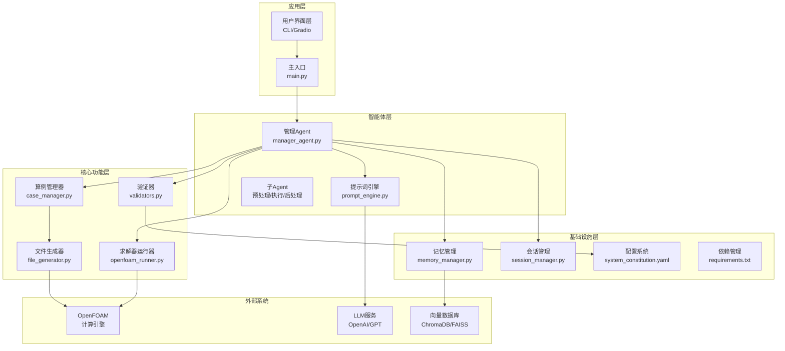
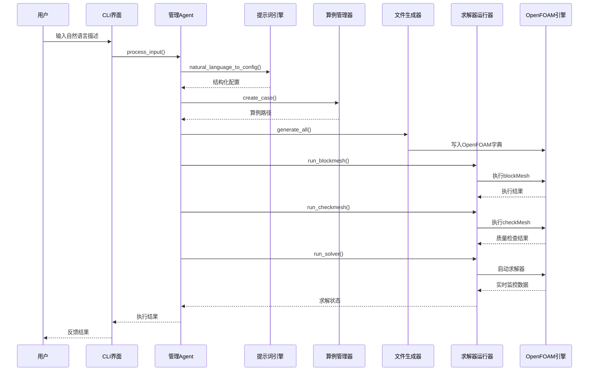
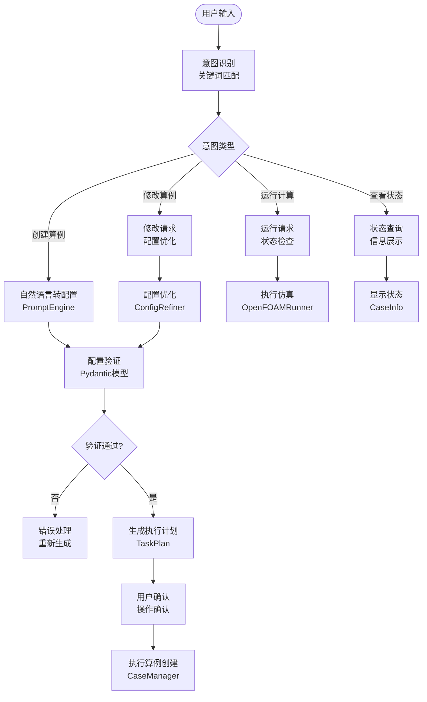
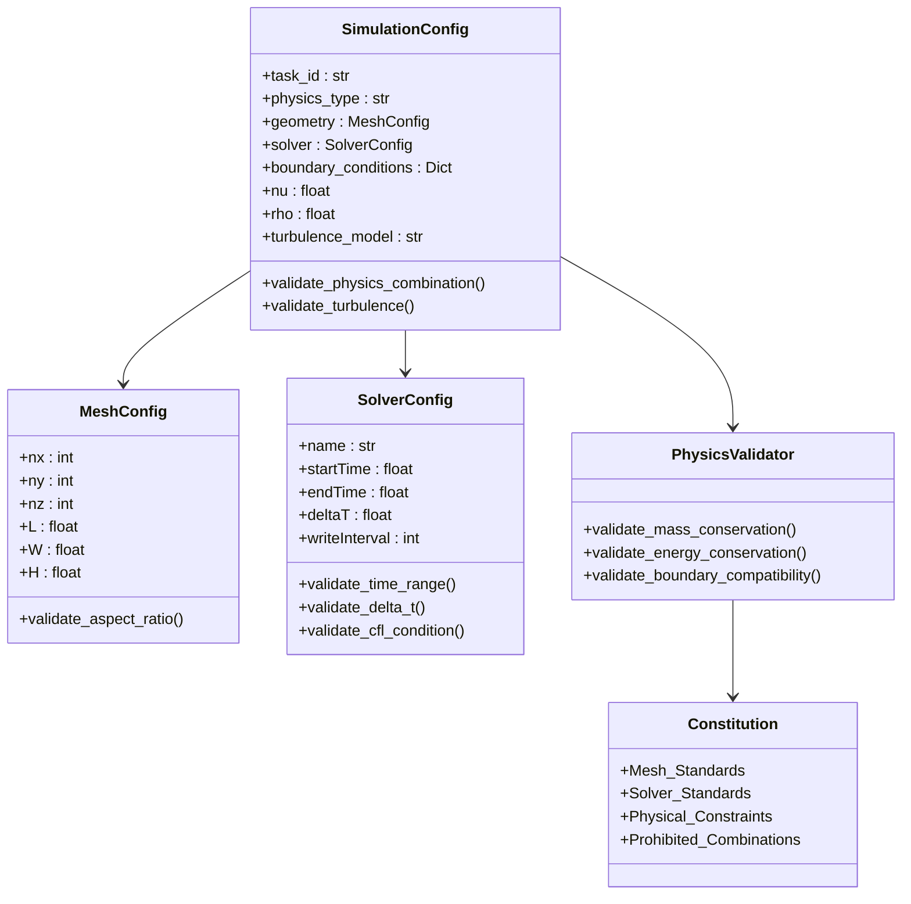
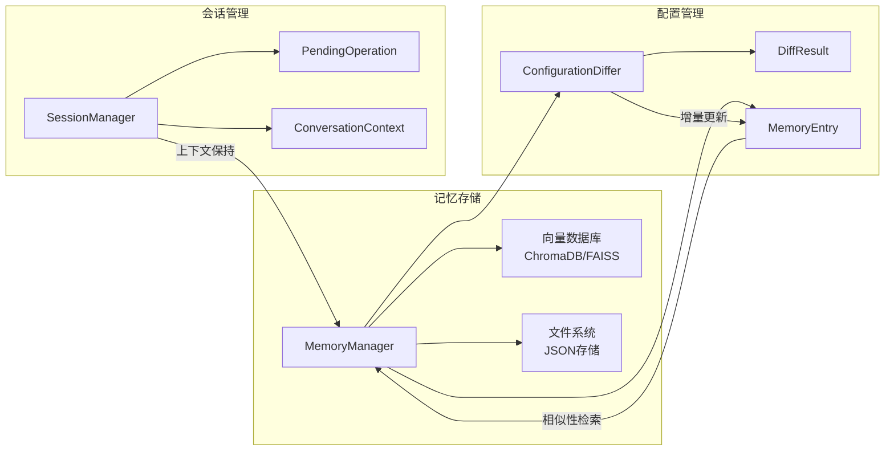
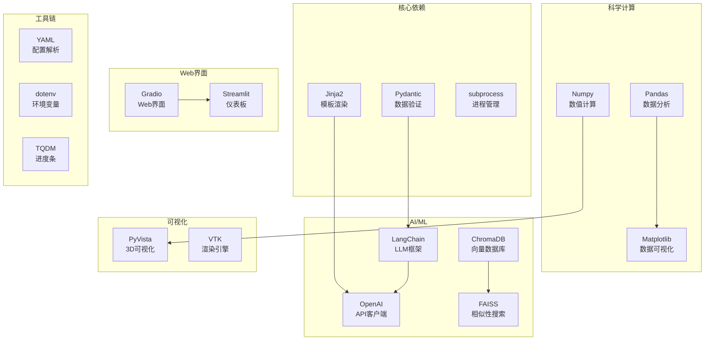

# 项目概述

<cite>
**本文档引用的文件**
- [openfoam_ai/README.md](file://openfoam_ai/README.md)
- [openfoam_ai/main.py](file://openfoam_ai/main.py)
- [openfoam_ai/agents/manager_agent.py](file://openfoam_ai/agents/manager_agent.py)
- [openfoam_ai/agents/prompt_engine.py](file://openfoam_ai/agents/prompt_engine.py)
- [openfoam_ai/core/case_manager.py](file://openfoam_ai/core/case_manager.py)
- [openfoam_ai/core/openfoam_runner.py](file://openfoam_ai/core/openfoam_runner.py)
- [openfoam_ai/core/file_generator.py](file://openfoam_ai/core/file_generator.py)
- [openfoam_ai/core/validators.py](file://openfoam_ai/core/validators.py)
- [openfoam_ai/config/system_constitution.yaml](file://openfoam_ai/config/system_constitution.yaml)
- [openfoam_ai/memory/memory_manager.py](file://openfoam_ai/memory/memory_manager.py)
- [openfoam_ai/memory/session_manager.py](file://openfoam_ai/memory/session_manager.py)
- [openfoam_ai/ui/cli_interface.py](file://openfoam_ai/ui/cli_interface.py)
- [openfoam_ai/requirements.txt](file://openfoam_ai/requirements.txt)
</cite>

## 目录
1. [引言](#引言)
2. [项目结构](#项目结构)
3. [核心组件](#核心组件)
4. [架构总览](#架构总览)
5. [详细组件分析](#详细组件分析)
6. [依赖关系分析](#依赖关系分析)
7. [性能考虑](#性能考虑)
8. [故障排除指南](#故障排除指南)
9. [结论](#结论)
10. [附录](#附录)

## 引言

OpenFOAM AI 是一个基于大语言模型的自动化CFD仿真智能体系统，旨在将复杂的CFD仿真过程简化为“像说话一样简单”的自然语言交互体验。该项目的核心愿景是通过AI技术消除传统CFD仿真的技术门槛，让用户只需用自然语言描述工程需求，即可自动完成从几何建模、网格生成、求解器配置、计算执行到结果可视化的全流程。

该项目采用多智能体协作架构，结合严格的物理约束验证机制和宪法规则，确保生成的仿真配置既符合工程实践又具备良好的数值稳定性。通过引入记忆管理和会话跟踪功能，系统能够支持复杂的多轮对话和增量修改，为用户提供接近专业工程师水平的仿真辅助能力。

## 项目结构

项目采用模块化设计，按照功能域进行清晰的层次划分：

**图表来源**
- [openfoam_ai/main.py:1-251](file://openfoam_ai/main.py#L1-L251)
- [openfoam_ai/agents/manager_agent.py:1-458](file://openfoam_ai/agents/manager_agent.py#L1-L458)
- [openfoam_ai/core/case_manager.py:1-639](file://openfoam_ai/core/case_manager.py#L1-L639)

**章节来源**
- [openfoam_ai/README.md:130-150](file://openfoam_ai/README.md#L130-L150)
- [openfoam_ai/main.py:1-251](file://openfoam_ai/main.py#L1-L251)

## 核心组件

### 管理Agent（ManagerAgent）
作为系统的核心协调者，管理Agent负责：
- **意图识别**：解析用户自然语言输入，识别创建、修改、运行、状态查询等意图
- **任务调度**：生成详细的执行计划，协调各子Agent完成任务
- **状态管理**：维护当前算例上下文和会话状态
- **确认机制**：对高风险操作实施用户确认流程

### 提示词引擎（PromptEngine）
负责将自然语言转换为结构化仿真配置：
- **多模式支持**：支持真实LLM API和Mock模式，便于离线开发和测试
- **配置优化**：对LLM生成的配置进行本地优化和修正
- **解释生成**：提供配置的自然语言解释和改进建议

### 算例管理器（CaseManager）
管理OpenFOAM算例的完整生命周期：
- **目录结构**：创建标准的OpenFOAM目录结构（0/, constant/, system/, logs/）
- **模板复制**：支持从模板算例快速创建新算例
- **清理维护**：提供算例清理、删除等维护功能
- **状态跟踪**：记录算例的创建、网格生成、求解等状态

### 求解器运行器（OpenFOAMRunner）
封装OpenFOAM命令执行和监控：
- **命令执行**：封装blockMesh、checkMesh、求解器等命令
- **实时监控**：解析求解器日志，提供实时状态反馈
- **异常处理**：检测发散、停滞等异常状态并提供处理建议

**章节来源**
- [openfoam_ai/agents/manager_agent.py:38-458](file://openfoam_ai/agents/manager_agent.py#L38-L458)
- [openfoam_ai/agents/prompt_engine.py:20-616](file://openfoam_ai/agents/prompt_engine.py#L20-L616)
- [openfoam_ai/core/case_manager.py:27-639](file://openfoam_ai/core/case_manager.py#L27-L639)
- [openfoam_ai/core/openfoam_runner.py:44-548](file://openfoam_ai/core/openfoam_runner.py#L44-L548)

## 架构总览

OpenFOAM AI采用分层的多智能体架构，实现了从自然语言到CFD仿真的完整自动化流程：

**图表来源**
- [openfoam_ai/main.py:37-200](file://openfoam_ai/main.py#L37-L200)
- [openfoam_ai/agents/manager_agent.py:176-338](file://openfoam_ai/agents/manager_agent.py#L176-L338)
- [openfoam_ai/core/openfoam_runner.py:99-198](file://openfoam_ai/core/openfoam_runner.py#L99-L198)

系统的核心创新在于其"宪法约束"机制，通过严格的物理规则和数值稳定性约束，确保AI生成的配置既实用又可靠。宪法规则涵盖了网格质量、求解器选择、物理参数范围等多个维度，形成了完整的质量保障体系。

**章节来源**
- [openfoam_ai/README.md:104-128](file://openfoam_ai/README.md#L104-L128)
- [openfoam_ai/config/system_constitution.yaml:1-103](file://openfoam_ai/config/system_constitution.yaml#L1-L103)

## 详细组件分析

### 自然语言到CFD配置的转换流程

系统通过三层处理实现从自然语言到结构化配置的转换：

**图表来源**
- [openfoam_ai/agents/manager_agent.py:106-140](file://openfoam_ai/agents/manager_agent.py#L106-L140)
- [openfoam_ai/agents/prompt_engine.py:92-126](file://openfoam_ai/agents/prompt_engine.py#L92-L126)

### AI自我约束机制

系统采用多层次的约束验证机制，确保生成配置的合理性和稳定性：

**图表来源**
- [openfoam_ai/core/validators.py:179-275](file://openfoam_ai/core/validators.py#L179-L275)
- [openfoam_ai/config/system_constitution.yaml:13-64](file://openfoam_ai/config/system_constitution.yaml#L13-L64)

### 记忆性建模功能

阶段三引入的记忆管理系统提供了强大的历史配置管理和增量修改能力：

**图表来源**
- [openfoam_ai/memory/memory_manager.py:198-800](file://openfoam_ai/memory/memory_manager.py#L198-L800)
- [openfoam_ai/memory/session_manager.py:171-565](file://openfoam_ai/memory/session_manager.py#L171-L565)

**章节来源**
- [openfoam_ai/agents/manager_agent.py:142-174](file://openfoam_ai/agents/manager_agent.py#L142-L174)
- [openfoam_ai/core/validators.py:1-441](file://openfoam_ai/core/validators.py#L1-L441)
- [openfoam_ai/memory/memory_manager.py:1-804](file://openfoam_ai/memory/memory_manager.py#L1-L804)

## 依赖关系分析

项目采用现代化的Python生态系统，依赖关系清晰且功能明确：

**图表来源**
- [openfoam_ai/requirements.txt:1-40](file://openfoam_ai/requirements.txt#L1-L40)

**章节来源**
- [openfoam_ai/requirements.txt:1-40](file://openfoam_ai/requirements.txt#L1-L40)

## 性能考虑

### 并行计算支持
系统支持OpenFOAM的并行计算模式，通过检测处理器目录自动识别并行作业配置。对于大规模网格计算，系统会自动调整写入策略和监控频率，避免I/O瓶颈。

### 内存管理优化
- **增量更新**：记忆管理系统采用增量存储策略，只保存配置差异而非完整历史
- **向量索引**：使用高效的向量相似性搜索算法，支持大规模配置库的快速检索
- **会话持久化**：智能的会话状态管理，避免重复加载和计算

### 网格质量优化
系统内置网格质量检查机制，包括：
- 非正交性检查（最大70度）
- 偏斜度评估（最大100）
- 长宽比限制（最大100:1）
- 最小网格数要求（2D≥400，3D≥8000）

## 故障排除指南

### 常见问题诊断

**OpenFOAM环境问题**
- **症状**：命令未找到或权限错误
- **原因**：OpenFOAM未正确安装或PATH未配置
- **解决方案**：确保OpenFOAM已安装并添加到系统PATH，或使用Docker容器

**LLM连接问题**
- **症状**：API密钥无效或网络连接超时
- **原因**：API密钥配置错误或网络不稳定
- **解决方案**：检查OPENAI_API_KEY环境变量，或使用Mock模式进行开发

**配置验证失败**
- **症状**：网格分辨率过低或物理参数超出范围
- **原因**：配置不符合宪法约束规则
- **解决方案**：根据错误提示调整网格分辨率或物理参数

**内存管理问题**
- **症状**：向量数据库初始化失败
- **原因**：ChromaDB依赖缺失或磁盘空间不足
- **解决方案**：安装ChromaDB依赖或降级到Mock模式

**章节来源**
- [openfoam_ai/README.md:208-237](file://openfoam_ai/README.md#L208-L237)

## 结论

OpenFOAM AI项目代表了CFD仿真领域的一次重要创新，通过AI技术大幅降低了工程仿真的技术门槛。项目的核心价值体现在以下几个方面：

### 技术创新价值
- **自然语言接口**：实现了从自然语言到CFD配置的直接转换
- **严格约束机制**：通过宪法规则确保配置的物理合理性和数值稳定性
- **多智能体协作**：实现了从配置生成到结果可视化的完整自动化流程
- **记忆性建模**：为复杂工程设计提供了历史配置管理和增量修改能力

### 应用场景
- **工程教育**：为学生和初学者提供直观的CFD学习平台
- **产品设计**：加速流体相关产品的设计迭代过程
- **科研分析**：支持复杂流动现象的参数化研究
- **工业应用**：为工程师提供快速的仿真验证工具

### 发展前景
项目按照阶段化路线图推进，从基础设施建设到高级AI能力，逐步实现从"自动化"到"智能化"的跨越。随着记忆管理和多模态能力的完善，系统将能够支持更加复杂的工程设计和优化任务。

**章节来源**
- [openfoam_ai/README.md:239-261](file://openfoam_ai/README.md#L239-L261)

## 附录

### 版本状态与路线图

**当前版本**：v0.1.0（基础功能版本）

**已完成里程碑**：
- 基础设施搭建和MVP实现
- CaseManager核心功能
- 字典文件生成器
- OpenFOAM命令封装

**未来发展规划**：
- 阶段二：AI自查能力（网格质量自动修复、求解稳定性监控、发散自愈机制）
- 阶段三：记忆性建模（向量数据库、算例历史管理、增量修改）
- 阶段四：多模态与后处理（几何图像解析、自动绘图、结果解释）

### 开发环境配置

**系统要求**：
- Python 3.10+
- OpenFOAM Foundation v11 或 ESI v2312
- 可选：OpenAI API Key

**安装步骤**：
1. 克隆仓库并进入项目目录
2. 安装依赖：`pip install -r requirements.txt`
3. 配置OpenFOAM环境变量
4. 运行主程序：`python main.py`

**章节来源**
- [openfoam_ai/README.md:19-50](file://openfoam_ai/README.md#L19-L50)